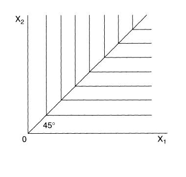
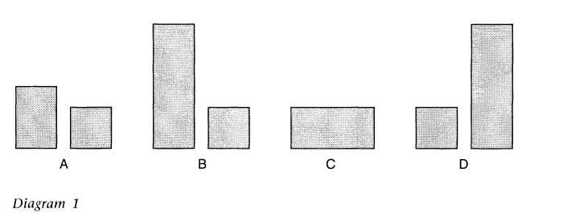
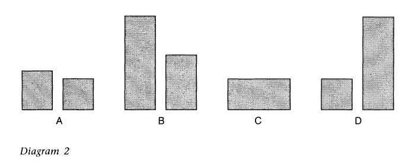
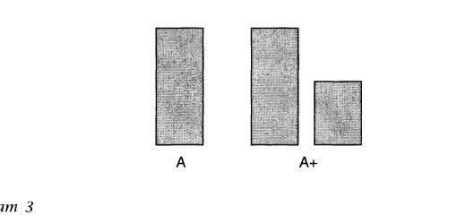
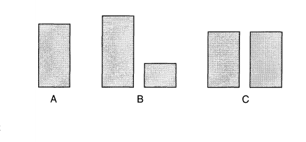
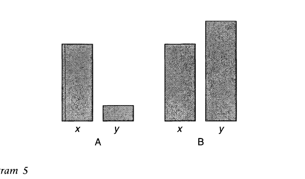
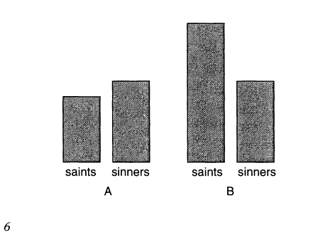
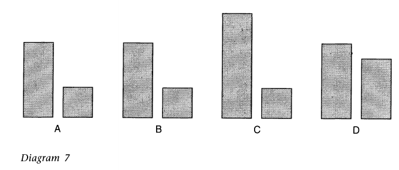

# 《平等的理想》（*The Ideal of Equality*）

编者：马修·克莱顿（Matthew Clayton）

政府学讲师，布鲁内尔大学

与

安德鲁·威廉斯（Andrew Williams）

公共哲学研究员，华威大学

2000 年由 MACMILLAN PRESS LTD 在英国首次出版

Houndmills, Basingstoke, Hampshire RG21 6XS and London

公司及代表遍布世界各地。

本书的书目记录可由大英图书馆查得。

ISBN 0-333-68695-5

2000 年由 ST. MARTIN'S PRESS, INC. 在美国首次出版

Scholarly and Reference Division  
175 Fifth Avenue, New York, N.Y. 10010

ISBN 0-312-23017-6

美国国会图书馆在版编目数据

*The ideal of equality* / edited by Matthew Clayton, Andrew Williams.  
p. cm.  
含参考文献与索引。  
ISBN 0-312-23017-6（精装）  
1. Equality. I. Clayton, Matthew, 1966- II. Williams, Andrew, 1963-

HM821 .133 2000  
305-dc21  
99-049744

选文、编辑内容及第一章 © Matthew Clayton and Andrew Williams 2000  
第二章 © President and Fellows of Harvard College 1974  
第三章 © Department of Philosophy, University of Kansas 1997  
第四章 © The Tanner Lectures on Human Values, University of Utah 1977  
第五章 © Department of Philosophy, University of Kansas 1995  
第六章 © Larry Temkin 1998  
第七章 © Social Philosophy and Policy Foundation 1995  
第八章 © Princeton University Press 1990  
第九章 © Ronald Dworkin 1993

版权所有。未经书面许可，不得以任何形式复制、复印或传播本出版物。

除非获得书面许可，或依照 1988 年《版权、设计与专利法》的规定，或依据由 Copyright Licensing Agency（90 Tottenham Court Road, London W1P OLP）颁发并允许有限复制的任何许可，本出版物的任何段落均不得复制、复印或传播。

任何未经授权而对本出版物实施相关行为者，均可能承担刑事责任及民事损害赔偿责任。

作者已依据 1988 年《版权、设计与专利法》主张其被确认为本书作者的权利。

本书采用适于回收、且原料来自得到全面管理和可持续经营的森林资源的纸张印制。

10 9 8 7 6 5 4 3 2 1  
09 08 07 06 05 04 03 02 01 00

英国 Antony Rowe Ltd（Chippenham, Wiltshire）印刷装订。

# 目录

撰稿人简介　vii  
致谢　viii  
1　平等主义者面临的一些问题　1  
　马修·克莱顿、安德鲁·威廉斯  
2　回应亚历山大与马斯格雷夫（节选）　21  
　约翰·罗尔斯  
3　反对不平等的多种理由　41  
　T. M. 斯坎伦  
4　平等　60  
　托马斯·内格尔  
5　平等还是优先？　81  
　德里克·帕菲特  
6　平等、优先与向下拉平反驳　126  
　拉里·特姆金  
7　不平等的帕累托论证（节选）　162  
　G. A. 科恩  
8　自由主义、分配主观主义与福利机会平等（节选）　182  
　理查德·J. 阿内森  
9　医疗保健分配中的正义　203  
　罗纳德·德沃金  
延伸阅读　223  
索引　226

# 撰稿人简介

理查德·阿内森（Richard Arneson）是加州大学圣迭戈分校哲学教授。

马修·克莱顿（Matthew Clayton）是布鲁内尔大学政府学讲师。

G. A. 科恩（G. A. Cohen）是牛津大学奇切利社会与政治理论讲席教授，并任牛津大学万灵学院院士。

罗纳德·德沃金（Ronald Dworkin）是纽约大学法学教授，并任伦敦大学学院奎因法理学讲席教授。

托马斯·内格尔（Thomas Nagel）是纽约大学哲学与法学教授。

德里克·帕菲特（Derek Parfit）是牛津大学万灵学院高级研究员。

约翰·罗尔斯（John Rawls）是哈佛大学哲学荣休教授。

T. M. 斯坎伦（T. M. Scanlon）是哈佛大学阿尔福德自然宗教、道德哲学与公民政体讲席教授。

拉里·特姆金（Larry Temkin）是罗格斯大学哲学教授。

安德鲁·威廉斯（Andrew Williams）是华威大学公共哲学研究员。

# 致谢

编者谨此感谢下列各方允许在本书中重印相关文章：

John Rawls, “Reply to Alexander and Musgrave”，第 I—III、V—VII 节，最初发表于 *Quarterly Journal of Economics*, 88:4（MIT Press Journals: November, 1974）, pp. 633–43, 646–55。© 1974 by the President and Fellows of Harvard College。经 MIT Press 许可重印。

T. M. Scanlon, “The Diversity of Objections to Inequality” 于 1996 年 2 月 22 日作为林德利讲座在堪萨斯大学发表。© Copyright 1997 by Department of Philosophy, University of Kansas。经作者及堪萨斯大学哲学系许可重印。

Thomas Nagel, “Equality” 于 1977 年作为坦纳人类价值讲座在斯坦福大学发表。经作者及犹他大学的法人机构 Tanner Lectures on Human Values 许可印行。

Derek Parfit, “Equality or Priority?” 于 1991 年 11 月 21 日作为林德利讲座在堪萨斯大学发表。© Copyright 1995 by Department of Philosophy, University of Kansas。经作者及堪萨斯大学哲学系许可重印。

Larry Temkin, “Equality, Priority, and the Levelling Down Objection”。© Larry Temkin, 1998。经作者许可印行。

G. A. Cohen, “The Pareto Argument for Inequality”，第 I—IV 节及结论中的两段，最初发表于 *Social Philosophy and Policy*, 12 (1995), pp. 160–75, 184。© 1995 Social Philosophy and Policy Foundation。经作者及 Cambridge University Press 许可重印。

Richard Arneson, “Liberalism, Distributive Subjectivism, and Equal Opportunity for Welfare”，最初发表于 *Philosophy and Public Affairs*, 19 (1990), pp. 158–64, 174–79, 183–93。© 1990 by Princeton University Press。经作者及 Princeton University Press 许可重印。

Ronald Dworkin, “Justice in the Distribution of Health Care” 于 1993 年 3 月 17 日作为法理学与公共政策麦吉尔讲座在麦吉尔大学法学院发表，最初发表于 *McGill Law Journal*, 38 (1993), pp. 883–98。© Ronald Dworkin 1993。经作者许可重印。

对于上述清单中的任何错误或遗漏，编者谨致歉意。如收到告知，他们将乐于尽早予以纠正。

本书销售所得全部版税均捐赠给 Oxfam。

# 第一章　平等主义者面临的一些问题

马修·克莱顿、安德鲁·威廉斯

## I. 导言

利益与负担应当如何在人与人之间进行分配？这是分配伦理学（distributive ethics）的一个根本问题。平等（equality）的理想，是对这一问题一个由来已久的回答。然而近年来，平等主义理想的性质及其辩护重新成为哲学争论的主题。在这场争论中，有两个问题尤其突出。第一，帕菲特提出了“平等还是优先？”（“Equality or Priority?”）这一问题：[^ch01-001] 关心平等的人，是否应当把缩小境况较好者与境况较差者之间的差距本身视为有价值？还是说，他们应当优先使境况较差者受益，即便这样做会扩大他们与境况较好者之间的差距？第二个问题来自阿马蒂亚·森（Amartya Sen）：“什么的平等？”（“Equality of What?”）[^ch01-002] 如果我们要平等地分配利益与负担，那么为了确定一个人的境况是否比另一个人更差，应当比较人们生活中的哪些维度？平等主义的人际比较（interpersonal comparison）应当依据财富和收入、一组更广泛的资源、人们对自身生活的满意程度、获得或从事某些事物的特定机会，还是其他什么标准？

这两个问题似乎与日常社会经济政策讨论中有关平等的争论相去甚远。此类争论往往围绕某项拟议中的政策变革——从养老金或福利改革，到教育或医疗服务体系的重组——究竟是否有助于实现平等。在某些情况下，我们无需深入探究上述问题，就能从平等主义的观点评估一项政策变革的价值。例如，人们普遍认为，1979 至 1990 年间英国的撒切尔政府阻碍了平等的实现；这一判断无须先回答我们究竟应当关心缩小贫富差距，还是应当把减少最不利者的绝对劣势作为首要关切。如果把实际收入视为衡量优势（advantage）的一项合理指标，那么这两个目标都没有得到推进：1979 至 1990/91 年间，实际收入（已计入家庭情况和住房成本）低于平均水平 40% 的人数从 170 万上升到 770 万，而处于收入最低十分之一人口的实际收入（扣除住房成本后）据估计下降了 14%。[^ch01-003]

然而在另一些情况下，我们可能必须更深入地审视平等理想。以教育正义为例。我们或许认为，为了补偿经济上处境不利的儿童在人生起点上的劣势，平等要求把高于平均水平的教育资源有针对性地投向他们。另一方面，我们也可能认为，尽管某些人已经拥有社会优势，平等仍支持加强对那些更具生产潜力者的教育，因为更加繁荣的经济能够在更大程度上惠及穷人。又或者，在医疗保健（health care）领域，我们可能无法确定：如果一项政策在年轻人的利益与老年人的利益之间偏向前者，那么按照这项政策对稀缺医疗资源实行配给（rationing），究竟是平等所支持的还是所谴责的。面对这些问题上的不确定性，如果平等理想要成为政治变革的一种可信指引，那么我们似乎别无选择，只能直面一个根本问题：应当如何刻画这一理想。

本论文集所讨论的正是这些如今已处于分配伦理学核心位置的问题。其目的在于考察围绕如何刻画平等理想而产生的一些主要争议。当然，有些人否认平等具有任何重要性。另一些人则可能否认，从政治道德的角度看，任何一种分配格局会比另一种更好或更坏。[^ch01-004] 本书作者虽然承认这些反对意见相当严肃，却并不接受它们。他们一致认为分配伦理学是重要的，并且平等在这一领域中确实占有某种位置。不过，他们对于应如何最好地理解平等主义的冲动意见不一。下面的分类绝非穷尽无遗；我们只是借助帕菲特和森提出的问题，来说明其中一些争论。

## II. 帕菲特的问题

“平等还是优先？”这一问题要求我们区分平等主义正义的两种理解。在第一种较严格的意义上，平等主义者（egalitarians）主张，不同人之间利益与负担的不平等分配，本身就是不正义的或道德上不好的。因此，缩小有利者与不利者之间的差距就是一种改善。按照较不严格的理解，平等主义者并不认为境况较好者与境况较差者之间的差距本身具有伦理意义。真正重要的是，在评估社会与经济政策时，应当给予境况较差者的利益更大的权重。严格意义上的平等主义者关心人与他人相比过得如何；他们重视相对剥夺的减少。较不严格的观点则关心人们所享有优势的绝对水平：一个人的境况越差，使她受益在道德上就越紧迫。帕菲特把这一类平等主义者称为非关系型平等主义者（non-relational egalitarians）或优先主义者（prioritarians）。帕菲特论文的一项主要主张是，左翼思想家往往把平等与优先混为一谈，而这种混淆是不幸的，因为这两种理想以不同的基础为依据，具有不同的含义，也会受到不同类型的反驳。[^ch01-005]

为了说明这种差别，我们可以考察罗尔斯的第二正义原则，即：“社会和经济不平等必须满足两个条件：（a）它们应使最不利者获得最大的预期利益〔最大最小规则（maximin），或差别原则（Difference Principle）〕；（b）它们所依附的职位和地位，应当在公平的机会平等（fair equality of opportunity）条件下向所有人开放。”[^ch01-006] 这一原则的第一部分通常被理解为应用于财富与收入分配的优先论（Priority View）。[^ch01-007] 罗尔斯的主张是，在决定税收政策和福利安排的形式时，我们首先应当使财富最少的群体的财富最大化。做到这一点之后，我们应当使其次最不富有群体的财富最大化，如此类推，直到最后才去最大化最富有者的前景。简言之，即使我们能够增加较少财富者的财富幅度，小于我们能够增加较富有者财富的幅度，也应当始终优先增加前者的财富。按照这种理解，差别原则要求允许经济上的不平等（inequality），因为高于平均水平的财富前景可能会鼓励生产能力较强者更加努力工作，从而创造更多能够重新分配给最不利者的财富。因此，差别原则对最不利者的关切，可能会把我们引向与严格平等主义者不同的方向。

罗尔斯关于社会与经济正义原则的第二部分涉及公平的机会平等。这里表达的是一个人们熟悉的观念：如果人生前景——包括教育和职业成就，以及财富和收入的享有——之间的差异是由社会背景差异造成的，那么这种差异在相应程度上就是不正义的。由此可见，正义支持缩小出生于贫困背景者与出生于较为优越背景者之间的人生前景差距。这一理想在严格意义上是平等主义的。[^ch01-008] 因而，罗尔斯的正义观同时包含平等主义与优先主义的关切。只要对不平等奖励的竞争能够确保每个人都有平等机会取得相对有利的地位，那些使最不利者受益的不平等就是可以允许的。

## III. 平等

有时，严格平等的实现只是成功追求另一目标的副产品。例如，在某些情况下，选择平等分配恰好也会最大化最不利者的前景。因此，即使一个人并不把平等本身视为有价值，他仍然可能偏好平等分配。然而，严格意义上的平等主义者对平等的偏好并非只是偶然重合的结果。他们认为，平等是一种我们应当努力实现的重要价值。不过，他们仍可能以不同方式评价平等。因而，为了评估他们的主张，有必要区分平等可能具有价值的不同方式。

为此，作出两项区分很有帮助。[^ch01-009] 第一，平等可能因为其效果而具有工具性价值，也可能由于效果之外的理由而具有内在价值。例如，工具性平等主义者（instrumental egalitarians）可能以实现平等为目标，是为了保障最不利者的自尊（self-respect），或减少某些形式的社会对立。内在价值平等主义者（intrinsic egalitarians）对平等的承诺则较少依赖于这些偶然效果。要理解后一种观点，还需要第二项区分。派生型平等主义者（derivative egalitarians）把平等视为某个更广泛理想的构成要素，因而赋予它价值。斯坎伦等人就阐述过这一观点。[^ch01-010] 他主张，一种有吸引力的社会合作理想包含这样一个条件：所有人都是平等者，这一点必须成为公共知识。不同于工具性平等主义者和派生型平等主义者，非派生型平等主义者（non-derivative egalitarians）把平等的实现本身视为具有终极价值。例如，他们可能认为，即使一些人并不知道自己相对于他人处于不利地位，只要这种较差境况本可避免，这种状态仍然令人遗憾。特姆金为这一观点辩护，不过他也承认，其他善——例如使人受益——同样具有终极价值；因此，为了判断从所有因素综合考虑什么才是最佳状态，必须把平等之善同这些善加以权衡。

这些关于平等价值的不同理解会遭遇不同类型的批评。有些人怀疑平等是否具有工具性或派生性好处；但在政治上影响最为广泛、在哲学上也许最为有趣的反平等主义论证，是针对非派生型平等主义者的“向下拉平反驳”（Levelling Down Objection）。[^ch01-011] 既然这些平等主义者认为，缩小境况较好者与境况较差者之间的差距本身就有价值，那么他们就必须承认：即使境况较差者完全得不到好处，使境况较好者变差在某种意义上仍然是有价值的。很多人认为这违反直觉：如果从一种状态转向另一种状态，对任何人都没有好处，而且让某些人变得更糟，那么这种转变怎么可能在任何意义上更好？特姆金的论文主要就是澄清并反驳这一异议。他认为，平等理想在很多方面类似于另外一些得到普遍接受的理想，例如按照人们的应得程度（deservingness）来惩罚他们。这些理想的价值并不必然建立在其运用会使某个人受益这一点上，因此，即便平等理想同样不具备这一特征，我们也无须为此担忧。如果特姆金是对的，那么平等的批评者就只能在两者之间择一：要么放弃以向下拉平反驳来反对平等，要么放弃他们通常还持有的其他若干信念。

## IV. 优先

平等理想往往吸引那些关心境况不佳者困境的人。如果这些人同时接受向下拉平反驳，他们可能会采取一种非关系型方式来理解平等理想，以容纳这种关切，从而转向优先主义（prioritarianism）。由于优先考虑境况较差者的利益，并不是把减少不平等本身视为有价值，而只是把它视为改善境况较差者水平的副产品或手段，所以优先主义能够避开向下拉平反驳。

对优先论的辩护与罗尔斯、内格尔和斯坎伦所阐述的各种契约主义（contractualism）形式联系在一起。罗尔斯的作为公平的正义（justice as fairness）观诉诸这样一种思想：社会正义原则，是人们会在一个假设性情境中同意的原则；这一情境就是原初状态（Original Position），其中个人被剥夺了那些可能损害其协议公平性的信息。在这一位置中，个人并不知道自己占据社会中任何特定位置的概率，同时负有义务，只能同意那些自己能够遵守的原则，并且还必须尊重对其选择施加的其他一些约束。[^ch01-012] 罗尔斯认为，被置于这种情形中的理性自利者会采用最大最小规则；这一规则偏好那些优先使最不利者受益的社会安排，而不会采用功利主义（utilitarianism）——后者寻求最大化各个人所享有利益的总和。

当然，罗尔斯的观点受到了广泛批评。有些批评者认为，即使罗尔斯把正义理论化为他所描述的那种假设性选择是正确的，最大最小规则作为理性选择原则仍然有缺陷。有人主张，他的假设性选择情境至多支持一种受到某种社会最低标准（social minimum）约束的功利主义。[^ch01-013] 另一些人则怀疑罗尔斯对原初状态中个人可获得信息所施加的一些限制。例如，内格尔质疑，正义是否要求人们在完全不知道自己享有不同优势水平之概率的情况下选择原则。[^ch01-014]

尽管存在这些批评——而且部分正是由于这些批评——罗尔斯的观点推动了各种替代性的契约主义版本。对内格尔而言，原初状态之所以具有吸引力，是因为它试图确保我们设身处地站到每一个人的位置上，并评估社会安排是否可以为每一个人所接受。他认为，这自然导向这样一种理想：寻求能够获得自由且一致同意的原则；或者，用斯坎伦的表述，寻求任何人都无法合理拒绝的原则。这又导向了对优先主义思路的另一种辩护。如果我们重视每个人对正义原则的认可，那么这些原则首先就必须关注境况最差者的命运，因为他们在社会安排的运行之下境况最差；在其他条件相同的情况下，他们的申诉也最强：你的境况越差，你提出正当申诉的根据就越强，因而使你受益在道德上就越紧迫。[^ch01-015]

出于这一理由，内格尔主张应当优先考虑境况较差者的利益。不过，他关于一致认可的理想并不是毫无保留的优先主义。他认为，一个人的不利程度固然是决定其申诉强度的重要因素，但还存在一个可能与之竞争的因素：与可行安排集合中的另一种安排相比，这个人在现行安排下损失了多少。正因为如此，他主张，一致同意的理想有时可能支持给予本已境况较好者更大的利益，而不是给予境况较差者较小的利益。因此，与罗尔斯的差别原则不同，内格尔的观点并不给境况较差者以绝对优先地位。如果内格尔是对的，那么我们还需要进一步研究如何量化决定个人申诉强度的不同因素各自的权重。

为优先主义正义辩护的第三种方式诉诸平等与效率两项理想。大体而言，这一论证建立在两点之上：一是平等具有初步的吸引力；二是引入某些不平等可能构成帕累托占优（Pareto superior），也就是说，使一些人变得更好而没有任何人变得更坏。之所以会出现后一种情况，是因为为不同职业设置不平等的经济回报，可以作为一种激励（incentive），促使生产能力较强者选择对社会更有益的工作，或更加努力地工作。这些激励的后果对每个人都有利：生产能力较强者获得高于平均水平的收入，而生产能力较弱者则从前者创造的更多利益中获益。此外，如果偏离平等的做法受到差别原则的约束，那么任何不平等都必须最大化境况最差者的优势；因此，境况较好者与境况较差者之间的差距，将小于其他那些同样帕累托占优、但不受这一约束的偏离平等方案。于是，罗尔斯断言，差别原则会选出最接近平等的帕累托有效率分配。[^ch01-016]

以帕累托式平等主义为优先主义正义辩护的论证面临若干问题。例如，有人指出，把平等与帕累托效率（Pareto efficiency）结合起来的不同方式——取决于这两种理想中哪一种具有优先地位，或者是否有任何一种具有优先地位——会产生不同结果。因此，如果不作进一步说明，这一观点就是不确定的。[^ch01-017] 此外，科恩并不反对这一理想本身，但他认为，一种广为接受的看法——即帕累托式平等主义支持向生产能力较强者提供会造成不平等的激励性报酬——并不成立。[^ch01-018] 如果科恩的论证成功，那么在实践中，究竟选择平等还是优先，实际利害可能远没有通常想象的那么大。

## V. 森的问题

在构造彼此竞争的分配正义（distributive justice）观点时，平等主义者与优先主义者面临一些共同任务。其中讨论最广泛的一项，是明确一种适用于分配正义问题的人际比较标准。这类标准规定了在何种条件下一些人的境况比另一些人更差。平等主义者借此确定是否存在不平等，优先主义者则借此识别哪些人的主张在道德上最为紧迫。由于经典论文“Equality of What?”的作者是森，我们将如何刻画这一相关标准的问题称为“森的问题”。[^ch01-019]

要为森的问题辩护一个恰当的答案，需要处理许多事项。举其中一个问题为例。假设两个人拥有获得同样物品的机会，但其中一人由于自己能够控制的因素而最终得到较少物品。那么，在询问是否存在不平等，或者现在是否应当优先使某一个人受益时，我们的比较标准应当关注实际实现的结果，还是只关注获得这些物品的机会？一些平等主义者支持后一种立场。他们强调，因为他们只反对非自愿的不平等，所以其观点能够避开保守主义者熟悉的批评，即平等主义（egalitarianism）无视个人责任（personal responsibility）。例如，这种观点能够区分非自愿失业者的主张与主动选择不工作者的主张。不过，避开这一批评也要付出代价。

设想谨慎的卡尔（Cautious Carl）和冒险的丹（Daring Dan）原本都能过上同样安全的生活，但丹参加某项高风险运动而瘫痪，而且没有为这种风险购买保险。看来，只关注获得机会的平等主义并不要求卡尔为丹的医疗保健或行动补贴提供资金。然而很多人认为，即使灾难是个人自己招致的，正义——而不只是慈善——也至少要求进行某种公共资助的再分配。如果他们承认平等并不是唯一重要的分配原则，那么可以诉诸某种非平等主义的关切——或许以充足原则（sufficiency principle）表达——来为这种信念辩护。然而，如果他们希望在平等主义的基础上为之辩护，那么在人际比较中似乎就不能只关注获得机会。

不过，在围绕森的问题的争论中，“获得机会还是实际实现”并不是唯一的重要议题。另一个更加复杂的问题，是一种可信的人际比较标准究竟应当关注哪些善。这里通常把福利（welfare）、资源和可行能力（capability）区分为几种主要方案，当然，把这些要素以不同方式结合起来的混合观点也很常见。[^ch01-020] 理解这些答案以及它们各自困难的一种方式，是从一种有意简化的资源主义（resourcism）人际比较形式入手。[^ch01-021] 考虑如下主张：正义要求财富的平等分配；这里的财富被理解为非个人资源（impersonal resources），例如自然资产，或者人工生产的商品与服务。因此，任何个人都不应当能够获得市场价值高于其他任何人可获得资源的资源。

这种主张可能面临若干问题。其中最明显的也许是它所采用的标准过于狭窄地局限于经济层面。批评者可能会问：平等主义者或优先主义者究竟为什么只应关注财富？正如森本人反复指出的，这一方案似乎存在双重缺陷。第一，它显然并不完整，因为即使两个人中一人存在严重身体残疾，而另一人没有，该方案仍可能把两人视为平等。可是，很多人相信，至少对于某些残疾，即便受其影响者在经济上并不比其他人差，正义仍要求给予补偿。第二，较不明显但同样重要的是，这种简单方案显得惊人地肤浅。毕竟，在个人决策中，我们之所以关心财富，是因为财富能帮助我们改善生活质量。那么，在把财富分配给他人时，我们当然也应当以同样的派生方式看待它。最终，我们真正应关注的，是个人在多大程度上实现了或能够实现他们所关心的东西，或者也许是他们有理由关心的东西。

## VI. 福利

对森的问题的一些相互竞争的回答，可以被理解为试图避开上述一种或两种困难。先看福利主义（welfarism）的人际比较方案，它们关注个人偏好（preference）得到满足的程度。由于把主观满足而不是货币报酬置于核心位置，这类衡量标准似乎避开了“肤浅”这一指责。但它们很快会遇到自身特有的问题。反福利主义者认为，福利完全无关；混合福利主义者则认为，福利同非个人资源一样，只是一种不完整的衡量标准。这里只抽取他们若干论证中的几个：我们首先考察畸变偏好（malformed tastes）、昂贵偏好（expensive tastes）和廉价偏好（cheap tastes）三个问题。

畸变偏好的问题之所以产生，是因为有些人的偏好可能经过潜意识心理过程的调整而适应了自身有限的处境，从而表现出与他人相同的偏好满足水平。[^ch01-022] 然而，仅仅因为这些人表现出相近的满足程度，就认为他们的境况并不比其他人差，似乎相当不公正。因此，任何可信且完整的福利主义衡量标准都需要一套关于真实偏好形成的说明，才能避开有关畸变偏好的担忧。[^ch01-023] 即便这一初步异议可以克服，另外两个问题——昂贵偏好与廉价偏好——仍对福利主义衡量标准构成更加深刻的威胁，即“反福利主义困境”。[^ch01-024]

要理解这一困境的来源，请注意：如果要使实际福利达到平等，就必须向抱有格外高成本抱负的人分配更多资源。很多人认为，这种迎合昂贵偏好的做法并不公平。他们否认，仅仅因为某些人的抱负实现起来成本更高，这些人就有权获得比他人更多的资源。如果这是对的，那么他们就必须拒绝那些以实际福利为中心的平等主义形式。不过，福利主义者可以通过这样一种主张来避开困难：我们之所以不愿补贴昂贵偏好，只有在这些偏好是自愿获得的情况下才是恰当的。当偏好是非自愿获得时，拥有这些偏好的人比他人拥有更少的福利机会，因此有权获得更多资源。

福利主义者把衡量标准从实际实现转向获得机会，能够由此避开昂贵偏好的问题。但是这样做之后，他们又会面对相关的廉价偏好问题。设想有些人只需要比别人更少的资源，就能够拥有同样的福利机会。由于自然或社会运气，他们的偏好虽然并非畸变，却相对容易满足。福利机会衡量标准把这些人视为好运的受益者，因此在其他条件相同的情况下，否认他们有权获得与他人同样多的非个人资源。[^ch01-025] 反福利主义者却认为这种否认是不公平的。他们得出结论：既然福利衡量标准必然要么迎合昂贵偏好者，要么惩罚廉价偏好者，那么福利在人际比较中就根本不应发挥任何作用。

反福利主义困境究竟有多大说服力，仍有争论余地。[^ch01-026] 但即使这一困境不能得出决定性结论，其他人也从不同理由出发主张福利无关，或者提出较温和的结论，即福利并不是人际比较中唯一相关的考虑因素。[^ch01-027] 下面转向后一种批评中最有影响力的版本。

## VII. 可行能力

回想一下这种主张：即便一个残疾人与其他人同样富有，如果完全不考虑她的残疾，仍然是不公平的。有人进一步认为，即使她的福利水平与他人同样高，不考虑这种残疾也仍是不公平的。他们诉诸一种常见信念，即某些残疾本身就构成获得某种给付的理由。正因为如此，如果一种优势衡量标准不把有关其他善的信息纳入考量，它就不可能可信。由此产生的关注点，是森所谓的“个体功能（functioning）与可行能力”；它构成了纯粹福利主义和资源主义人际比较方案的主要竞争者之一。这种观点已有许多拥护者，并在衡量发展中国家的贫困时发挥重要作用。[^ch01-028]

与福利主义方案一样，可行能力衡量标准是对前文针对简单资源主义衡量标准提出的“肤浅”批评的一种自然回应。不过，它们不同于福利主义方案之处在于，它们并不只关注特定个人在意什么，而是采用一种主观性较弱的需要（needs）观。比如，森不仅提到幸福，而且还提到诸如免于疾病、死亡和营养不良，实现自尊，以及参与共同体生活等功能。[^ch01-029] 然而，在批评者看来，可行能力观点也有自身独特的问题。例如，一些批评者认为，如果不诉诸有关个人福祉（well-being）的完善主义（perfectionism）理想，就无法解释为什么某些可行能力具有道德相关性而另一些没有，也无法确定不同可行能力之间的相对重要程度。他们认为，这些理想通过说明不同功能如何影响个人生活质量，为可行能力进路（capability approach）赋予了具体内容。[^ch01-030] 福利主义者往往怀疑任何完善主义理想的有效性，因此可能基于这一理由拒绝可行能力进路。[^ch01-031] 另一些反完善主义（anti-perfectionism）的批评者承认，这些理想或许可以成为个人行为的恰当指引，但仍质疑它们在政治道德中的作用。例如，罗尔斯式的反完善主义者主张，尊重基本公民自由（basic civil liberties）必然伴随着人们对于什么使生活值得过这一问题的深刻分歧；即使是在接受自由民主根本价值的合理个人之间，也会存在这种分歧。在他们看来，一种充分的正义观必须能够赢得这些人的拥护，因此，他们反对那些依赖于无法通过这一检验的完善主义假设的可行能力衡量标准。[^ch01-032]

福利主义与反完善主义的异议提出了道德哲学和政治哲学中长期存在的问题。因此，迄今考察的这些批评很可能仍将继续争论。同样的情况也可能适用于另一个不太熟悉的异议：这一异议最初针对福利主义，但可以推广到可行能力衡量标准。[^ch01-033] 它主张，可行能力衡量标准有时会得出难以接受的结果，因为它忽视了个人对自身残疾的态度。要理解这一异议的反福利主义形式，可以设想有些人怀有强烈的罪疚感，因此其福利水平显著低于他人。然而，因为他们把这种感觉视为对自己过错的恰当反应，所以他们强烈希望保留这种感觉，而不愿它消失。即使一些倾向福利主义的人也承认，如果某个人并不把自己的运气视为“不幸”，那么就相关意义而言，他并不比别人处境更差，也就无权要求补偿。[^ch01-034] 因而，似乎有理由修正福利主义衡量标准，使之能够容纳这种判断。

如果这一理由成立，那么这个异议也可以推广到可行能力衡量标准。毕竟，任何可能被认为与人际比较有关的残疾，都可能受到某些人的欢迎。例如，即使大多数女性会遗憾自己不育，也有一些女性可能会欢迎由此摆脱非自愿受孕的风险。如果某个人欢迎自己的残疾，我们是否应当接受她显然作出的判断，即这并不构成不利？如果回答“不”，我们就允许个人有正当资格针对某些自己完全满意的状况要求补偿，而接受这种结论似乎违反直觉。如果回答“是”，我们可能会倾向于回到一种经过适当修正的福利主义。不过，我们也可能转而回到资源主义，并询问它那些更加复杂的变体是否可接受。回答这一问题的自然起点，是罗尔斯关于社会基本善的衡量标准。

## VIII. 资源

罗尔斯现在承认，在现实条件下，他的社会基本善（social primary goods）清单作为衡量标准并不完整。他提出的解决办法，是以一套关于成为“社会中正常合作成员”所必需的可行能力说明来补充这份清单。[^ch01-035] 遗憾的是，罗尔斯没有明确说明这种资源—可行能力混合方案的细节，因此很难评估。罗尔斯的解决方案似乎也会遭受通常针对充足原则提出的那类异议。一旦跨过相关的可行能力门槛（capability threshold），这一方案就不再提供任何判断；可是它没有给出理由说明，为什么即使跨过这一门槛之后，可行能力方面的不平等就不再具有道德相关性。毕竟，差别原则本身正是以正常合作成员之间赚钱潜力的不平等具有重要性为前提，并试图确保这些差异以有利于每个人的方式发挥作用。那么，为什么个人禀赋的其他差异就不应当同样被视为重要？

在缺乏答案的情况下，也许值得考察其他资源主义方案，其中最重要的例子是德沃金的方案。和罗尔斯一样，德沃金否认有必要在个人禀赋不同的人之间进行福利的人际比较。尽管有这种相似性，两人的观点却存在重要的哲学差别。例如，在德沃金的观点中，关于个人偏好的信息发挥重要作用。因此，任何人都不应偏好另一个人的禀赋而不是自己的禀赋，这一要求是他为非个人资源平等分配进行辩护的基础。经济学家以一种容易造成误解的方式把这项要求称作嫉妒检验（envy test）；它很自然地可以扩展到个人资源（personal resources）存在差异的情形。[^ch01-036] 资源主义者无须诉诸任何以理想为基础的人类需要理论，就可以主张：当某些人偏好别人凭借其身体和心理能力所享有的机会时，个人资源就是不平等的。德沃金借助这一主张解释，为什么在现实条件下，正义要求的不只是财富平等分配。[^ch01-037]

虽然德沃金以类似方式理解非个人资源和个人资源方面的不平等，但他对这两种不平等的回应却不同。在前一种情况下，可以重新分配非个人资源，直到每个人所得份额具有相同的竞争价值。可是，德沃金拒绝那些主张激进地重新分配个人资源的方案，也拒绝把非个人资源一直分配到每个人的总体禀赋——同时包括两类资源——具有相同价值为止。相反，他为一种补偿性再分配辩护，这种再分配模仿公平保险市场的运行：在该市场中，每个人遭受厄运的风险相同。[^ch01-038] 他承认，自己的方案并不能完全满足嫉妒检验。[^ch01-039] 但是，和它的竞争方案一样，德沃金的方案也面临异议。有些批评集中于他对保险市场运行的说明据称存在缺陷。[^ch01-040] 另一些批评则质疑，消除嫉妒是否足以恰当地解释平等主义的目标。

完善主义和福利主义衡量标准的反对者之所以会被嫉妒检验吸引，是因为它使人际比较能够避免诉诸各种理想，同时又不落入反福利主义困境。但是，那些不受此类考虑打动的人，可能看不出这一检验有什么吸引力，或者可能认为它违反直觉。他们或许会主张，嫉妒的存在既不是不平等的必要条件，也不是其充分条件。为说明这一点，考虑两个涉及生殖禀赋差异的案例。假设在许多方面，生育子女的成本都高于使人受孕的成本。在这些方面，女性行使生殖能力的负担要比男性更重。然而，许多女性高度重视亲自生育。她们也许希望相关成本降低，却并不后悔自己生来具有女性的生殖禀赋，而不是男性的替代禀赋。[^ch01-041] 在这种条件下，对不同生殖禀赋的嫉妒似乎并不存在。尽管如此，许多人坚信，为了对女性保持正义，就必须补偿她们在行使生殖能力时不得不承担如此沉重负担的事实。因此，他们认为，嫉妒并不是分配不正义的必要条件。现在再考虑一种较不常见但并非完全脱离现实的情形。设想一名男子遗憾自己不能生育，并希望自己生来具有女性的生殖禀赋。即便如此，除非他能诉诸某种超出自己对另一种禀赋之单纯偏好的理由，很多人仍会否认这里存在任何在道德上相关的不平等。如果他们的判断正确，那么，即使嫉妒没有得到消除，它也不足以构成不正义。

这些案例似乎表明，一个人即使并不偏好他人的资源，也可能比他人具有更强的需要；反过来，一个人即使仍然偏好他人的资源，也可能比他人具有较弱的需要。在这种条件下，消除嫉妒的要求与满足需要的要求便会分道扬镳。要对森的问题给出令人满意的答案，部分取决于确定究竟应当尊重这两种要求中的哪一种——如果确实应当尊重其中任何一种的话。不过，那是另一个场合要处理的任务。[^ch01-042]

# 罗尔斯一章的编者导言

本章中，罗尔斯回应了 S. S. 亚历山大（S. S. Alexander）和 R. A. 马斯格雷夫（R. A. Musgrave）发表于《经济学季刊》（*Quarterly Journal of Economics*）第 88 卷（1974 年）的论文，这两篇论文讨论了他的《正义论》（*A Theory of Justice*）。罗尔斯的回应对他的作为公平的正义观作了简明而全面的陈述，并为他的两项正义原则进行了辩护。他对良序社会（well-ordered society）这一理想的说明——这一理想在他较近出版的《政治自由主义》（*Political Liberalism*）中居于核心位置——显示了其思想的连续性。这篇回应还有一个值得注意之处：马斯格雷夫的论文“最大最小、不确定性与闲暇权衡”（“Maximin, Uncertainty, and the Leisure Tradeoff”）较早提出了这样一种看法，即产生不平等的激励在道德上可能存在问题，并探讨了以能力总额税替代这类激励的可能性。本书 G. A. 科恩一章对激励问题作了更深入的讨论，不过罗尔斯在第 VI 节也针对这类批评提出了一些颇有意思的看法。——编者

# 第二章　回应亚历山大与马斯格雷夫（节选）[^ch02-001]

约翰·罗尔斯

亚历山大和马斯格雷夫的论文围绕《正义论》中提出的观点提出了许多根本性问题，实际数量远远超过我在这篇回应中所能讨论的范围。即便逐点讨论他们的批评是可能的，我也不认为那会是最有用的处理方式。因为我认为，首先有必要阐明一些稍后将会用到的基本事项。因此，我将先勾勒作为公平的正义——以下我将这样称呼这一理论——的主要轮廓，并力图从一个略有不同而且更加鲜明的角度来表述它。在此之后，我将讨论我认为亚历山大和马斯格雷夫提出的几个最重要的异议。

## I. 良序社会的概念

正义理论的目的，是澄清并组织我们关于各种社会形态之正义与不正义的审慎判断（considered judgments）。因此，对这些判断的任何完整说明，都会表达出一种作为其基础的人类社会观，也就是一种关于人、人与人之间的关系，以及社会合作之一般结构与目的的观念。我相信，这类社会观其实并不多；而且它们彼此差异如此显著，以至于在它们之间作选择就是在彼此异质的事物之间作选择：我们无法通过连续改变它们的基本特征，而逐渐从一种过渡到另一种。因此，要构造一种正义理论，我们必须以一种具体但仍然抽象的方式说明它所依据的社会观。作为公平的正义通过把任何社会的某些一般特征结合起来而做到这一点；经过适当反思之后，我们似乎都会希望生活在具有这些特征的社会中，也希望让这样的社会塑造我们的利益和性格。由此形成的就是良序社会的概念：它以一种确定的方式体现这些特征，并指示我们应当如何描述下一节将引入的原初状态。下面我先逐项列举这类社会的特征。[^ch02-002]

首先，良序社会被界定为一种由公共正义观（public conception of justice）有效规制的社会。也就是说，在这样的社会中：

1. 每个人都接受同样的正义原则（同一种正义观），并且知道其他人也接受这些原则。
2. 基本社会制度以及把这些制度安排成一个整体的方式（即社会基本结构〔basic structure of society〕）满足这些原则，而且每个人都有理由相信它们满足这些原则。
3. 公共正义观建立在由普遍接受的探究方法所确立的合理信念之上。

第二，我们假定良序社会的成员都是、并且也把自己看作自由而平等的道德人格（free and equal moral persons）。更具体地说，可以这样描述他们：

4. 每个人都具有、并且也把自己看作具有一种正义感（sense of justice）；其内容由公共正义观的原则界定，而且这种正义感通常是有效的（即按照这种正义观行事的愿望在大多数情况下支配其行为）。
5. 每个人都具有、并且也把自己看作具有一些根本目的和利益（也就是一种关于自身之善的观念）；在设计社会制度时，他们有正当资格以这些目的和利益为根据，向彼此提出要求。
6. 每个人都具有、并且也把自己看作具有这样一种权利：在确定规制其社会基本结构的原则时，获得平等的尊重与考虑。

此外，我们还说，良序社会相对于自身的正义观而言是稳定的。这意味着，如果把社会看作一个持续运作的整体，其成员会在成长过程中获得一种足够强而有效的正义感，通常足以克服社会生活中的诱惑和压力。因此：

7. 基本社会制度会产生一种有效的、支持这些制度的正义感。

既然我们关心的是一种正义理论，我们就把注意力限于这样一些良序社会：它们处于需要某种正义观、并使正义的独特作用具有意义的环境之中。我们假定，自然资源和技术状态使社会合作既可能又必要，并且互利的安排确实是可行的；但这些安排所产生的利益仍不足以满足人们提出的全部要求。因此：

8. 存在适度匮乏（moderate scarcity）的条件。

同时，我们还假定，个人和群体拥有把他们引向不同方向的善观念，并据此彼此提出主张与反主张（见上文第 5 项）。此外，人们还持有彼此对立的基本信念——宗教的、哲学的和道德的信念——而且在许多重要问题上，他们评价证据和论证的方式也不相同。因此：

9. 根本利益与最终目的彼此分歧，并且存在多种相互对立、彼此不相容的基本信念。

至于社会制度的效用，我们假定良序社会的安排是富有生产性的；可以说，它们并不是一个人的（或一个群体的）所得必然就是另一个人的损失那样的零和博弈。因此：

10. 基本制度体系是一种大体自足而且富有生产性的社会合作体系，以实现共同利益。

在这些正义的环境（circumstances of justice，即第 8 至第 10 项）之下，我们就能够勾勒正义的作用与对象。由于良序社会成员的许多根本目的和信念彼此对立，他们不会对合作所产生的较大利益如何分配漠不关心。因此，我们需要一组原则，在那些塑造这种利益分配方式的社会安排之间作出裁决。可以表述为：

11. 正义原则（即公共正义观）的作用，是在社会基本结构中分配权利与义务，并规定制度以何种方式影响利益与负担的总体分配才是适当的。

最后再加上一项：

12. 良序社会的成员把社会基本结构（即基本社会制度以及把这些制度安排为一个整体的方式）视为正义的首要主题，也就是说，正义原则首先适用于它。

因此，社会正义原则是宏观原则，而不一定是微观原则。

以上条件的列举表明，处于正义环境中的良序社会这一概念极为复杂。注意到这些条件彼此配合，也许有助于理解这一点。第 1 至第 7 项说明良序社会的概念：第 1、2、3 项刻画公开性（publicity）；第 4、5、6 项充实自由而平等的道德人格这一观念；第 7 项以稳定性结束这一组条件。第 8、9、10 项刻画正义的环境，它们以适合于正义理论的方式限定相关情形的范围；第 11、12 项则描述正义的作用和对象。

良序社会这一概念，以一种形式化和抽象的方式说明了正义社会的一般结构，颇类似于价格理论中的一般均衡概念描述整个经济中的市场结构。不过，与一般均衡理论的类比必须谨慎使用；否则，它可能使我们误解正义理论的性质。举例来说，良序社会成员之间的关系并不像竞争市场中买者与卖者之间的关系。更贴切的类比，是设想一个沿宗教、族群或文化界线分化的多元社会，其中各种群体和协会终于就一组原则达成共识，用这些原则来治理政治制度并规制社会基本结构。尽管在这一框架上存在公开的一致意见，公民也都认同它，但他们在其他问题上仍有深刻分歧。各群体都有推进自身事业的倾向，因此彼此之间仍有必要保持一定警觉；然而，它们共同的公共正义观以及对这一正义观的肯定，又使它们能够安全地共同生活。因此，与其把良序社会的概念看作竞争经济观念的延伸，不如把它看作宗教宽容观念的延伸。

显然，良序社会概念的价值，以及建立在它之上的推理所具有的力量，取决于这样一个假定：那些看来持有彼此不相容之正义观的人，仍会发现第 1 至第 7 项条件与自己的道德信念相契合，或者至少在经过思考之后会如此。否则，在不同正义原则之间作选择时诉诸这些条件就没有意义。但我们应当承认，这些条件并非道德中立的（无论所谓道德中立究竟意味着什么），当然也绝非无关紧要。那些对良序社会概念毫无认同感、并希望以另一种方式规定基础性社会观的人，不会被作为公平的正义所打动（即使他们承认其论证有效）；当然，唯一的例外是，它也许能够证明自己是一种更好地系统化他们那些正义判断的方法。

## II. 原初状态的作用

原初状态这一观念是这样产生的。考虑如下问题：哪一种正义观最适合良序社会，也就是说，哪一种正义观最符合以上条件？当然，这个问题很含糊。我们可以把问题变得更明确一些：从道德哲学传统中抽取少数几种有代表性的正义观，问其中哪一种与上述条件最为吻合。于是，假定我们只需要在少数几种正义观之间作决定（例如某种直觉主义变体、某种功利主义变体以及若干正义原则）。作为公平的正义认为，最适合良序社会的那个具体正义观，就是在一个假设性情境中会得到一致同意的正义观；在那个情境中，被理解为自由而平等的道德人格的个人彼此处于公平的位置，也就是说，他们被看作这类社会的成员。换一种说法，最适合某一社会的正义观，就是具有该社会特征的人在彼此之间处于公平位置时会采用的正义观。这个假设性情境就是原初状态。达成协议之环境的公平性会传递给被同意的原则，使这些原则也具有公平性；而既然这些原则将作为正义原则发挥作用，“作为公平的正义”这个名称便显得十分自然。

我们假定，在原初状态中，各方掌握自然科学和社会理论所提供的一般信息。这满足第 I 节第 3 项条件。但是，为了把原初状态界定为在被理解为自由而平等的道德人格的个人之间是公平的，我们设想各方被剥夺某些在道德上无关的信息。例如，他们不知道自己在社会中的位置、阶级地位或社会身份，不知道自己在自然天赋与能力分配中的运气，不知道自己更深层的目的和利益，也不知道自己特有的心理构成。为了确保代际之间的公平，我们还必须补充说，他们不知道自己属于哪一代，因此有关自然资源、生产技术水平之类的信息也不允许他们掌握。如果在选择原则时不让任何人因自然偶然性和社会机运而占便宜或吃亏，就必须排除这些知识。由于所有人所处的位置都相同，而各方又不知道怎样制定原则才能有利于自己的特殊处境，所以每个人都会以同样方式推理。没有必要进行具有约束力的表决，任何达成的协议都会是一致的。（因此，处在原初状态中，始终必须与处在现实社会中区别开来。）

原初状态的描述必须满足两个条件：第一，它必须是一个公平的情境；第二，各方必须被理解为良序社会的成员。因此，这一描述包含来自公平观念的要素，例如各方彼此处于对称位置，并且受无知之幕（veil of ignorance）的约束。它也包含从良序社会中人的性质及其相互关系引出的特征：各方把自己看作拥有最终目的和利益，并认为自己有正当资格以这些目的和利益为根据彼此提出要求；他们还认识到，自己正在采用的是一种将作为公共正义观的观念，因此必须部分地依据不同原则的公开性效应来评价它们。他们还必须检验稳定性。只要原初状态描述中的每一个部分都有正当来源，或者只要我们在考虑到某些条件的含义之后准备接受这些条件，一切就都没有问题。

描述原初状态的目的，是把公平观念与良序社会概念所表达的形式条件结合进同一个观念之中，然后用这一观念帮助我们在相互竞争的正义原则之间作选择。前述说明有一个显著特征：我们几乎完全没有具体说明良序社会中正义原则的内容。我们只是把某些相当形式化和抽象的条件结合了起来。一种可能性是，这些条件会毫无歧义地决定一个唯一的正义观。更可能的情况则是，原初状态的约束只会缩小可接受正义观的范围；但如果事实证明，这些约束能够排除某些表面上颇为合理的道德观念，那仍然具有重要意义。

最后，原初状态具有假设性并不会造成任何困难。只要依照规定的约束进行推理，我们就能够模拟自己处在那种情境中。如果我们接受这些约束所表达的价值，从而也接受良序社会概念、公平观念等等所体现的那些形式价值，那么我们就必须接受由此对正义观施加的限制，并拒绝那些被排除的原则。把道德思想中较为形式化、抽象的要素统一起来，再把它们用于一般性较低的问题，正是康德主义理论的一个典型特征。

## III. 第一次成对比较：两项正义原则与效用原则

在原初状态中，有哪些备选的正义观？我们必须避开这样一种一般情形：让各方在所有可能的正义观之间作决定，因为不可能以有用的方式把这一集合规定出来。如果我们想直观地理解刻画原初状态的各种条件结合起来究竟具有怎样的力量，就必须大幅简化问题。因此，我们设想各方只从道德哲学传统中抽取出来的一份很短的正义观清单中作选择。实际上，此时我只讨论一次成对比较。这样做可以使问题变得明确，并让我指出几个后面还会用到的要点。

契约理论的一个目标，是提出一种既优于功利主义、又能为民主社会提供更充分基础的正义说明。因此，让我们设想在以下两者之间作选择：（a）一种由平均效用（average utility）最大化原则（这里按古典意义理解平均效用）所界定的正义观；以及（β）一种由两项原则界定的正义观，这两项原则可以说从表面上就表达了一种民主的正义观念。它们表述如下：

1. 每个人对于与所有人同样的自由体系相容的、最广泛的平等基本自由体系，都拥有平等的权利。
2. 社会和经济不平等必须满足两个条件：（a）它们应使最不利者获得最大的预期利益（最大最小规则）；（b）它们所依附的职位和地位，应当在公平的机会平等条件下向所有人开放。

第一项原则优先于第二项原则；而衡量最不利者所得利益的标准，则是社会基本善的一个指标。粗略地说，我把社会基本善界定为权利、自由与机会、收入与财富，以及自尊的社会基础；这些东西被假定为个人无论还想要什么、无论其最终目的是什么，都会想要的东西。各方将在这一假设之下达成协议。（下文还会回到基本善问题。）我还假定，每个人都具有正常的身体需要，因此特殊医疗保健的问题并不会出现。

上述（a）与（β）两种正义观中究竟哪一种会获得同意，当然取决于我们如何理解原初状态中的人。既然他们代表的是前面所界定的自由的道德人格，他们便把自己看作拥有一些根本目的和利益；如果可能，他们必须保护以这些目的和利益为根据提出的要求。他们之所以有权在社会设计中获得平等的考虑和尊重，部分正是因为这些利益。宗教利益是一个人们熟悉的历史实例；另一个例子是人格完整性的利益（免受心理压迫和人身攻击的自由属于这一类）。在原初状态中，各方不知道这些利益究竟采取何种具体形式。但是，他们确实假定自己拥有这类利益；他们也假定，保护这些利益所必需的基本自由由第一项原则加以保障。这里必须特别注意，基本自由是由一张特定的自由清单来界定的；其中比较突出的包括思想自由与良心自由、人身自由以及政治自由。这些自由有一个核心适用范围，在这一范围内，只能因为它们与其他基本自由发生冲突而对其加以限制和调整。因此，没有任何一种基本自由是绝对的，因为它们彼此之间可能发生冲突；但是，无论这些自由怎样经由调整而形成一个体系，这个体系对于所有人都必须相同。不在清单之列的自由，例如放任主义学说所理解的财产所有权和契约自由，并不是基本自由：第一项原则的优先性并不保护它们。

为了考察上述成对比较，我们首先必须说明如何理解平均效用原则。这里应当按古典意义理解它；按照定义，这种理解允许进行效用的人际比较，至少允许在边际上作出这种评估。效用（utility）应当从社会中个人的立场来衡量（而不是从原初状态的立场来衡量），并且指其利益获得满足的程度。如果这一原则被接受，在社会中就将如此理解和运用它。这样一来，如果长期一贯地应用平均效用原则，它有时也许会导向一个保障基本自由的社会基本结构；但没有任何理由认为，它一般都会产生这样的结果。即使这一标准常常能够保障必要的自由，让我们冒险进入那些它不能做到这一点的情形也毫无意义。相比之下，两项正义原则会保护这些自由；而由于原初状态中的各方对自己的根本利益给予特殊优先地位（他们假定这些利益属于某些一般类型），所以每一方都会更愿意采用这两项原则——至少在它们是唯一备选方案的情况下如此。

还必须把良序社会的其他特殊特征考虑进来。例如，所采用的原则将作为一种公共正义观发挥作用，这意味着我们必须评估公开性的影响。尤其重要的是它对自尊之社会基础的影响；因为一旦缺乏自尊，我们就会觉得自己的目标不值得追求，几乎任何东西都不再具有多少价值。这样看来，把自己理解为自由而平等的道德人格的人，相比于那些只满足平均效用标准的社会制度，更有可能在满足两项正义原则的社会制度中找到对其自尊的支持与确认。因为这类制度通过那些人人都知道它们所满足的原则，公开宣告一种集体意图：所有人都应享有平等的基本自由，而社会和经济不平等则应由最大最小规则来规制。显然，这一推理具有很强的推测性；但它说明了良序社会的公开性条件会引入哪一类考虑。

通过更详细地说明自由人的观念，我们可以进一步加强支持两项原则的论证。粗略地说，各方把自己看作具有一种最高阶利益（highest-order interest）：他们关心自己的其他一切利益——甚至包括根本利益——是如何受到社会制度塑造和规制的。他们并不认为自己必然受制于、或者就等同于在某一特定时刻所拥有的任何一组具体根本利益，尽管他们确实希望拥有推进这些利益的权利（只要这些利益是可允许的）。相反，自由人把自己理解为能够修订和改变最终目的的存在者，并把在这些问题上保存自身自由置于首位。因此，他们不仅拥有原则上可以自由追求或拒绝的最终目的，而且他们最初对这些目的的认同、以及后来持续对这些目的的忠诚，也都必须在自由条件下形成并得到确认。由于两项正义原则保障一种维持这些条件的社会形式，所以它们会得到同意。只有通过这样的协议，各方才能确信，自己作为自由人的最高阶利益获得保障。

最后，我用几句话结束本节对基本善的讨论。如前所述，从原初状态的立场来看，不论各方的最终目的是什么，他们都有理由假定自己想要这些东西。为了使原初状态的描述可信，这一关于动机的假设也必须可信；善的弱理论（thin theory of the good）正是为了支持这个假设。无论如何，一种正义观的一个基本组成部分，就是规定良序社会成员如何运用它的规则。当各方采用一种正义观时，对于这些运用规则的理解必须明确下来。因此，尽管原初状态中人的动机不同于现实社会中个人的动机，对所同意原则的解释却必须相同。

现在，两项原则的一个重要特征，是它们借助某些基本善来评价社会基本结构：权利、自由与机会、收入与财富，以及自尊的社会基础。后一类善是社会基本结构的那些特征，人们有理由预期它们会以重要方式影响个人的自我评价。在最大最小规则（第二项原则的（a）部分）中，利益由这些善的一个指标来衡量。定义一个令人满意的指标当然存在困难，[^ch02-003] 但这里要强调两点：（a）基本善是社会制度以及个人相对于这些制度之处境的某些客观特征，因此，这个指标并不是对总体满足或不满足程度的衡量；（b）比较所有人的社会处境时，都使用同一个基本善指标。人际比较以这个指标为基础；而运用最大最小规则只需要它提供的序数排序即可。在同意两项原则时，各方同时同意，在作出正义判断时，他们将使用这样一种指标。当然，各项善的精确权重几乎不可能在原初状态中确定；可以在稍后的阶段，例如立法阶段，再作确定。[^ch02-004] 初始阶段所能确定的，是对这些权重施加的某些约束；第一项原则的优先性正说明了这一点。

使用基本善这一做法隐含着如下观念。我们把人看作能够根据自身处境控制并调整其欲求和欲望的人，而且在正义原则得到满足的前提下，他们应当为此负责。社会方面则承担这样的责任：维持某些基本自由和机会，并在这一框架内提供公平份额的基本善；至于个人和群体如何据此形成和修订自己的目标与偏好，则留给他们自己。因此，良序社会成员之间存在这样一种理解：作为公民，他们只会就某几类事物提出要求，而且这种要求必须是正义原则所允许的。对于某些目标怀有强烈感情和热切抱负，本身并不会赋予人们要求社会资源或要求公共制度按其愿望设计的权利。这并不意味着，拥有同一基本善指标的人，从一切因素综合考虑会具有同等福祉；因为他们的目标通常不同，而且还有许多其他因素具有相关性。但是，就社会正义的目的而言，这才是适当的比较基础。基本善理论是对需要概念的一种一般化；需要不同于抱负和欲望。因此，我们可以说：作为公民，良序社会成员集体承担这样的责任，即依据一种公开的（一般化）需要尺度彼此正义相待；而作为个人和各种协会的成员，他们则对自己的偏好和所献身的目标承担责任。[…]

## IV. 第二次成对比较：最大最小规则的解释，以及风险厌恶是结果而非假设

乍看之下，人们很容易以为最大最小规则建立在一个关于风险厌恶（risk aversion）的极端而任意的假设之上。我想说明，这是一种误解。为了找到最大最小规则所依据的正义观，我们来考虑第二次成对选择。假设我们在两项正义原则中，以前面界定的平均效用原则替代最大最小规则。由此产生的正义观中，效用标准像最大最小规则一样受到约束，并负责规制社会和经济不平等。

我们可以给最大最小规则一种很自然的解释。第二次成对比较中的两个备选方案都包含平等自由原则和公平的机会平等原则，所以，无论实现哪一种方案，都会存在某种形式的民主。又因为我们处理的是良序社会，在两种情况下相关正义观都会是公开的：公民把自己看作自由而平等的人，愿意遵从社会制度，并承认这些制度是正义的。

但是，假定存在某些社会和经济不平等——无论这些不平等是维持社会安排所必需的，还是作为满足相关正义标准的激励而存在，抑或出于其他原因。个人的人生前景势必会受到其家庭和阶级出身、自然禀赋、成长过程中各种偶然因素，以及一生中其他种种运气事件的显著影响。我们必须追问：生活在民主制度下的自由而平等的道德人格，究竟能够依据什么原则，允许自己的相互关系受到社会机运和自然抽签（natural lottery）的影响？既然个人既不应得自己在天赋分配中的位置，也不应得自己在社会中的起点，那么应得（desert）并不能构成答案。然而，自由而平等的公民希望由某种原则来规制偶然因素所产生的影响——只要确实存在一种合理的原则。

按照最大最小规则，自然能力的分配在某些方面被看作一种共同资产。如果自然能力的分配真是一个可以选择的问题，那么能力的平等分配看上去也许更符合自由而平等的道德人格之间的平等；但这并不构成消除自然差异的理由，更不构成毁掉异常卓越才能的理由。恰恰相反，自然差异被视为一种实现互利的机会，尤其因为不同能力通常互为补充，并且构成社会联结的基础。制度可以利用完整范围的能力，但条件是：由此产生的不平等不得超过为较不幸运者带来相应利益所必需的程度，而且平等民主自由的体系不能因此受到不利影响。社会阶级之间的不平等也受同一约束。于是，乍看起来，自然禀赋的分配以及影响人生预期的社会偶然因素，似乎会威胁自由而平等的道德人格之间的关系。但是，只要满足最大最小规则，这种关系仍然能够得到保存：任何人都不能因为自然偶然性和社会偶然因素而获益，除非这种获益以有利于所有人的方式发生（回想一下，我们假定不平等确实存在），尤其要有利于最不利者。[^ch02-005]

我认为，这表明最大最小规则至少具有一种自然的解释。如果各方受到这样一项原则的推动，即任何人都不应因为某些并非其应得、而且具有深远持久影响的偶然因素——例如阶级出身和自然能力——而获益，除非这种获益同时帮助其他人，那么他们就会采用最大最小规则来规制不平等。对于一个已经认可两项正义原则其他部分的社会来说，这一点似乎尤其合适：它会把社会基本结构中已经隐含的民主观念，扩展到对这些不平等的规制。此外，我认为，说最大最小规则完全不给效率任何权重是不正确的。它要求不平等承担一种功能性贡献，而且由于它适用于互利的社会安排，所以效率确实获得了一定权重。当只有两个相关阶级时，这一点表现得尤其清楚：最大最小规则会选择最接近平等的那个（帕累托）有效率点。因此，至少在这种情形下，我们还可以把它理解为严格平等与平均利益最大化（以基本善衡量）之间一个自然的焦点。[^ch02-006]

在《正义论》中，我确实提到过对最大最小规则的第一种解释，以及它同民主观念之间的联系；但我不愿把对某些道德观念的接受直接归于原初状态中的人，尽管我承认这样做也不是不可以。相反，我的论证是：界定原初状态的那些条件，本身就会要求任何被理解为自由而平等的道德人格的合理个人，在我们讨论过的两次成对比较中承认包含最大最小规则在内的两项正义原则。如前所见，只要这些条件具有独立的哲学辩护，或者只要经过反思之后我们认为它们的含义足够有说服力，这样的论证就是令人满意的。正是在这里，亚历山大和马斯格雷夫都提出异议的风险厌恶问题出现了。不过，我并没有简单假定各方具有某种奇特或特殊的风险厌恶；那样做的确根本算不上论证。[^ch02-007] 相反，我主张，当我们把原初状态各种特征的合力考虑在内时，它们会使合理的人作出一种仿佛高度厌恶风险的选择。或者换一种说法：给定可供选择的方案清单，保守的决定是唯一明智的决定。因此，正如亚历山大所说，这种选择确实是被强加的；但它不是被任意强加的，而是由一组较弱而更基础的原初状态条件共同强加的，每一个条件都有其适当的思想来源或辩护。

更具体地说，我曾指出，无知之幕是完全的，这意味着它施加以下三个条件：（a）各方不了解自己的欲望和最终目的（善的弱理论中支持基本善说明的那些内容除外），因而也不了解自己在社会中的选择函数；（b）他们不知道、当然也无法列举自己可能处于哪些社会环境，也不知道自己的社会可能掌握哪些技术；（c）即使他们能够列举这些可能性，他们也没有根据依赖其中某一种概率分布而不是另一种，而且无充分理由原则（principle of insufficient reason）也不是绕过这一限制的可靠办法。如果我们接受无知之幕背后的形式道德约束（例如公平观念和康德式解释），就必须同时接受这些约束所导向的选择。[^ch02-008]

我的主张是，在我所考察的少数几次成对选择中，两项正义原则都必定会获得同意。我的论证充其量是直观的，尽管找到一个形式证明也并非不可能。阿罗（Arrow）和赫维茨（Hurwicz）最近已经证明，如果把完全无知理解为：对于具有相似结果的社会状态，允许删去相应的列；那么，再加上对选择函数的其他一些合理限制，决策就会由一种对有序对的排序所决定，这些有序对由结果相似的各类状态之代表的最大结果和最小结果组成。于是，选择只取决于各种状态的最大值、最小值以及两者之间的差距。[^ch02-009] 当然，阿罗和赫维茨假定了比原初状态所允许的更多信息，因为原初状态中的各方甚至无法估计最大结果和最小结果。也许原初状态对于信息施加的更强约束，会迫使决策仅取决于极小值——这里的极小值应当以某种适当的一般意义来界定，而最大最小规则就是这种情况的一个实例。

即使这类形式证明具有启发性，我们仍应谨慎看待它们。我们必须检查其前提是否可靠，是否确实表达了应当刻画原初状态的条件。我在这里提到形式证明的可能性，只是为了反驳这样一种批评：认为我只不过把某种特殊甚至极端的风险态度直接设定为原初状态描述的一部分。任何这样的态度都是其他假设的结果。此外，目前对于概率的意义和解释存在如此多的分歧，以至于依赖完全无知条件的论证，也许最好只是用来支持下面即将讨论的承诺的压力（strains of commitment）论证。

## V. 契约条件与承诺的压力

来自承诺压力的论证，在作为公平的正义中具有重要地位，而契约（协议）概念对于这一论证不可或缺。亚历山大怀疑契约概念究竟有什么作用；他认为，我们只需要选择概念。我想说明为什么这个假定不正确。

首先，契约概念至少在作为公平的正义的三个地方发挥作用。第一，它提醒我们——尽管其他概念也可能做到这一点——自由而平等的人彼此把自己看作有权向对方提出要求，这种人与人之间的区分具有重要意义。个人不是“容器式的人”（container-persons），不是仅仅用来安置不同满足水平的位置。因此，古典功利主义把不同个人的满足合并计算的做法，一开始就值得怀疑。

第二，契约观念引入公开性条件，而这些条件会产生广泛而复杂的影响。事实上，这正是契约理论最有特色的方面之一。如前所述，这些条件要求各方根据各种正义观的公开性效应来评价它们，其中尤为重要的是对自尊之社会基础所产生的后果。

第三，契约概念——也就是契约条件（contract condition）——还对原初状态中的各方施加了进一步约束。人们之所以可能认为这一概念没有增加任何约束，也许是出于如下考虑：原初状态中的协议必须一致通过，但每个人又都被置于这样的位置，使所有人都愿意采用同一组原则。那么，既然没有分歧需要谈判，为什么还需要协议呢？答案是：在没有具有约束力的表决的情况下达成一致协议，并不等于每个人分别作出同一选择，或者形成同一意图。由于他们正在作出的是一种承诺，这一事实本身也会以同样方式影响每个人的思考，从而使最终达成的协议不同于每个人在别的情况下本来会作出的选择。正因为契约条件从一开始就支配各方的反思，所以他们最后都愿意承认同一原则这一事实，才会造成契约条件似乎多余的错觉。

一般而言，可以经由协议同意的事情集合，包含在能够被理性选择的事情集合之内，并且比后者更小。我们可以决定冒一次险，同时完全打算一旦结果不利，就尽一切可能挽回自己的处境。但是，如果我们订立了一项协议，就必须接受结果；因此，要善意作出承诺，我们不仅必须打算履行它，而且还必须有理由相信自己能够履行它。由此可见，契约条件是一项意义重大的额外约束。

在原初状态中引入契约概念，理由就在于它与良序社会的那些特征相对应。例如，这些特征要求每个人都接受、并且知道其他人也接受同样的正义原则（第 I 节第 1 项）；因此，无论在社会中处于何种位置，这类社会的所有公民都认为其安排符合自己能够接受的正义观。任何人都不应把自己的处境看作屈辱或有损人格，也不应被置于这样一种环境中：他们无法不对此心怀怨恨，却又只能出于怯懦和害怕报复而顺从（第 I 节第 7 项）。接受或履行已经同意的原则，意味着愿意把它们作为公共正义观加以运用，并且在自己的思想和行为中肯定其含义。良序社会的这些以及其他方面，都通过契约条件被纳入原初状态的描述。

因此，契约概念导向承诺压力论证。[^ch02-010] 其思想如下：既然每个人都必须善意作出承诺，而不只是分别作出相同选择，那么，只要某个人有理由怀疑自己无法承受某一原则得到一贯贯彻时产生的后果，他就不能同意这项原则。这一限制会以相同方式影响每个人的思考；尤其是因为他们必须始终记住，这项承诺是最终的，会永久约束自己及其后代，并且会产生一个适用于社会基本结构的公共正义观，等等。于是，考虑任意两种正义观：如果在某些可能的环境下，第一种正义观允许或要求出现某些个人无法接受的社会位置，而第二种正义观在一切环境下都会产生所有人都能够履行其要求的安排，那么各方就必须同意第二种正义观。我曾论证，鉴于保障基本自由这一最高阶利益以及其他考虑，在两项正义原则与平均效用原则的成对较量中，前者必须得到承认。两项正义原则始终为所有人保障可接受的条件，而效用标准却未必如此。在第二次成对比较中，以效用原则替代最大最小规则之后，这项检验就没有那么明确了；不过我相信，一旦我们加入建立在公开性、稳定性等等之上的更精细考虑，这项检验仍然具有力量。[^ch02-011]

我们应当注意，这一论证包含两个假设。第一，各方怎么知道，自己的社会所面对的环境不会使清单上所有可供比较的正义观都无法保证人人可以接受的社会位置？对正义环境的规定——特别是适度匮乏与合作的生产性，即第 I 节第 8、10 项——正是为了保证：至少只要清单中包含两项正义原则，就确实会有某种正义观能够确保所有人都可以履行的社会位置。因此，正义的环境在一定程度上发挥着存在性假设的作用。

第二，我们凭什么认为不同的人会觉得相同的社会位置是可接受的，从而以相似方式评价社会基本结构？如果并非如此，那么对于一个人来说被排除的正义观，对另一个人就未必被排除，于是最大最小解也就无法确定。此时，我们要使用基本善指标：为了理论目的，这一指标充当一个共同标准。如果任何一个人会认为处境最差者的位置是可接受的，那么所有人都会认为它可接受；更不用说，所有人都会认为其他位置可接受。在这方面，基本善指标类似于一种共同的选择函数。当然，这并不意味着人们拥有相同的欲望和最终目的；事实上，我们假定这些欲望和目的多样而且彼此冲突。不过，如前所述，只要公民的偏好和目标属于可允许范围，并且与稳定所必需的有效正义感相容，社会并不对它们负责。

关于这一论证再作两点简短说明。显然，它排除了某一种随机化：只要存在哪怕极小的机会，使我们最终无法履行某项原则，就不能接受这项原则。这里，完全无知的含义开始发挥作用，因为它要求原初状态中的人考虑最坏的可能情形，并把这些情形当作真实可能性。即使承担巨大风险本来可能是理性的，契约条件也提出了更强要求：只要某项风险的任何一个可能结果是各方无法善意同意接受的，他们就必须拒绝承担这项风险。

最后，应当按照如下方式评估承诺的压力。给定某一种正义观，我们必须判断，是否存在某些环境，使这一正义观的实现会导致任何不可接受的社会位置。我们并不考察这样一种承诺压力：一些人必须从不正义社会中自己占据的有利位置，转到这个正义社会中较不有利的位置（无论绝对意义、相对意义，还是两者兼而有之），由此产生的压力与这里的问题无关。相反，我们要问的是：在我们正在检验的这个社会持续运行的条件下，会产生什么压力。也就是说，我们必须试图评估，相应的良序社会能否在可以说是稳定均衡的状态下得到所有人的遵守，以及不同正义观在这一点上哪一种更好、哪一种更差。把承诺压力检验用于从不正义社会假想转型而来的案例，是无关的。[^ch02-012]

## VI. 马斯格雷夫论闲暇权衡：最大最小规则并非只是次优

遗憾的是，篇幅只允许我对马斯格雷夫的论文作几点评论。由于前面的讨论已经回应了他在论文第一部分提出的问题，我将只讨论第二部分有关闲暇权衡的问题。

问题是这样的：我曾在别处指出，如果社会对自然禀赋征收总额税（lump-sum tax），并要求禀赋较优者缴纳更高的税，那么最大最小规则就会符合卡尔·马克思（Karl Marx）所援引的那条准则：“各尽所能，按需分配。”[^ch02-013] 这样一来，收入与财富的不平等就能够大幅缩小，甚至可能被消除。马克思似乎认为，只有当正义的环境已经被超越时，这条准则才适用；因为它属于一种充分发展的社会主义社会，在那里，劳动本身已经成为生活的第一需要（*das erste Lebensbedürfnis*），适度匮乏的限制也不复存在。因此，在某种意义上，它不是一条正义准则，而是一条适用于超越正义之社会的准则。

但是，我认为马斯格雷夫把它看作严格意义上的正义准则；而针对自然能力（即潜在挣钱能力）征收总额税这一观念，至少在理论上说明了它如何能够在正义环境中得到运用。每个人都承认，这样一种方案在实践中会遇到巨大的困难：能力也许根本无法测量，而且个人会有强烈动机隐藏自己的才能。我曾提到另一个困难，即它会干涉自由。尽管我当时没有说明，我的意思是，它可能干涉前面所界定的基本自由。例如，通过税收来影响闲暇与收入之间的权衡，本身并不构成对自由的干涉；只有当它侵害基本自由时才构成这种干涉。不过，要判断这会在什么时候发生，我们还需要对基本自由作出更完整的说明。

因此，从理论立场来看，我并不一开始就反对马斯格雷夫的方案。尽管闲暇这一概念在我看来仍需要澄清，但正如马斯格雷夫所主张的，也许确实有充分理由把闲暇纳入基本善，从而纳入基本善指标；而且这样做也可能与基本自由相容。闲暇是否应当列入基本善，取决于我们能否对基本善形成更好的理解，以及能否可行地把闲暇计算在内。我只想补充一点：基本善指标并不像马斯格雷夫的讨论有时似乎暗示的那样，是一种福利衡量指标；不过前面已经指出这一点，无须进一步评论。

尽管如此，我怀疑，对自然能力征收总额税的观念所面对的困难，并不只是实践性的。事实上，即便仅仅为了理论上的总额税目的，自然能力是否以一种能够被测量的形式存在，似乎也十分可疑。假如能力是一台装在头脑里的计算机，具有可测量而固定的容量，而且具有明确且不变的社会用途，情况就不会如此。但是，以智力为例，它几乎不可能是某一种这样的固定先天能力。智力必然具有数量不定的许多维度，并受到不同社会条件的塑造和培育；即使把它看作一种潜在能力而不是已经实现的能力，它也必然会以我们尚不了解的复杂方式发生显著变化。而影响这些能力的因素中，还包括那些直接关系到能力训练与承认的社会态度和社会制度。因此，潜在挣钱能力并不是一种独立于社会形态以及个人生命历程中特定偶然因素而存在的东西，总额税的观念也就无法直接适用于它。上述困难已经相当严重；如果进一步追问，应当在生命中的哪个时点评估这种税，情况就更加糟糕。不过，我认为，这些问题都不会影响对最大最小规则的解释：无论人们的自然禀赋是什么，无论社会环境对这些禀赋施加了什么影响，我们仍然可以说，任何人都不能从这些偶然因素中获益，除非这种获益以有利于所有人的方式发生。

当然，我们不能由此得出结论，说一切朝马斯格雷夫方案方向发展的税收形式都被排除了。其他可能性也许是可行的。但至少某种程度的不平等大概仍会存在。我只想补充，如果以上评论正确，而总额税版本的最大最小规则在理论上并不适用，那么把前面界定的最大最小规则仅仅看作一条次优的正义准则，在我看来就是误导性的。相反，马克思很可能是对的：他所援引的那条准则预设了一个超越正义的社会；而且即使已经存在正义制度，要把这条准则付诸实行，所需要的也可能远远超过任何可行的税制。

# 第三章　反对不平等的多种理由

T. M. 斯坎伦

我认为，平等是一个重要的政治目标。也就是说，几乎每个社会都带有某些形式的不平等，而消除这些不平等乃是头等重要的政治目标。然而，当我问自己，为什么我认为消除这些不平等如此重要时，我发现自己赞成平等的理由其实相当多样，而且其中大多数都可以追溯到平等本身之外的其他根本价值。事实证明，在我认为我们周围许多形式的不平等都应当消除这一判断中，把平等本身看作一种根本道德价值的观念所起的作用，出人意料地有限。

当我说平等观念在这里的思考中所起的作用出人意料地小，我心中所指的是一种实质平等（substantive equality）的观念——也就是说，人们的生活或命运在某种实质意义上应当相等，这在道德上是重要的：例如收入相等，或者总体福利相等。它不同于一种仅仅形式意义上的平等考虑（equal consideration）观念，例如这样一项原则：每个人具有可比性的主张都应得到同等尊重，并被赋予同等权重。这是一项重要原则。它得到普遍接受，代表着一种重要的道德进步，也为道德论证提供了一个富有成效——甚至不可或缺——的出发点。然而，这项原则若单独存在，就过于抽象，难以在实质平等的方向上发挥多大力量。正如托马斯·内格尔和阿马蒂亚·森都指出的那样，[^ch03-001] 即便像罗伯特·诺齐克（Robert Nozick）这样的权利理论家——通常不会被归入平等主义者之列——也可以接受这项原则，因为他主张每个人的权利都应得到同等尊重。我的假设是，单纯的平等考虑观念，只有通过我将逐一列举的其他更具体价值，才会把我们引向具有实质平等主义性质的结论；而这些价值中的大多数，本身并不具有根本的平等主义性质。

我这样说，并不是要攻击平等，或把它“揭穿”为一种虚假的理想。我的目的毋宁说是澄清和辩护：说是澄清，是因为我相信，只有看清那些熟悉的平等论证实际上建立在多种不同的考量之上，我们才能更好地理解这些论证；说是辩护，是因为我认为，当我们看到许多不同的考量都指向这个方向时，追求特定形式平等的理由反而得到了加强。平等的反对者最有说服力的时候，往往正是他们能够把平等描绘成一个特别抽象的目标——要求现实符合某种特定模式——并声称人们给这种目标附加了特殊道德价值的时候。[^ch03-002]

我将首先区分这样一些在我看来构成我们反对各种形式不平等之基础的根本道德理由。随后，我会说明这些观念如何以不同方式出现在罗尔斯关于分配正义的观点中，以此来加以阐释。最后，我将回来更详细地考察其中一种价值——也就是看起来最为纯粹地体现平等主义的那一种。下面就让我开始列举：为什么我们会认为，追求平等是一个如此有吸引力的政治目标。

## I

在某些情况下，我们赞成消除不平等，根本上出于一种人道主义关切（humanitarian concern）——例如减轻苦难的关切。如果有些人生活在极其恶劣的条件下，而另一些人却过得非常优裕，那么，只要把资源从状况较好者转移给状况较差者不会造成其他不良后果，这种转移就是可取的，因为它能够在不制造同等严重的新困苦的情况下减轻苦难。

这里发挥作用的冲动，并不具有根本的平等主义性质。缩小或消除贫富差距本身并没有被赋予内在重要性；这种差距之所以重要，只是因为它提供了一个机会——一种能够减轻某些人的苦难、同时又不使其他人遭受类似命运的办法。因而，朝着更大平等迈进的这项理由有多强，取决于状况较差者的主张有多紧迫，而不是取决于他们与更幸运的邻人之间的差距究竟有多大。[^ch03-003]

在描述这第一项理由时，我用了“减轻苦难”这个说法，以便把它表述为最有力量的形式。不过，即使在一些不宜使用“苦难”这个词的情形中，只要那些“状况较差者”仍然生活在我们认为存在严重缺陷的条件下，这项理由仍然会发挥作用。然而，如果我们设想富人和“穷人”的境况都大幅改善，同时他们之间的差距保持不变（甚至扩大），这项理由的力量就会逐渐消退。即便在这种改善了的状态中，我们也许仍会认为，更富者与更穷者之间的差异应当缩小或消除。但我们如此判断的理由，将不再是我现在讨论的人道主义关切，而会是某种不同的理由，也许是一种更真正具有平等主义性质的理由。

反对这些差异的一种可能理由，是认为把人当作低人一等者对待，或者使他们感觉自己低人一等，本身就是一种恶。例如，赋予等级特权、或者要求人们作出恭顺表示的社会惯例，就可以据此受到反对。同样应受反对的，还有普遍存在的优越观念（例如种族优越观），即使这些观念并没有通过经济优势或特殊社会特权表现出来，也没有被用来为这些优势和特权辩护。物质福祉方面的巨大差异也可以基于同样的理由受到反对：如果一部分人所享有的生活方式成为整个社会的规范，那么，生活水平远低于他们的人就会因为自己不得不以那种方式生活而感到自卑和羞耻。

这项反对理由的平等主义性质，体现在它专门给出了消除相关差异的理由，而不只是要求以某种更一般的方式改善状况较差者的处境。当差异纯粹是地位差异时，这一点显而易见。但即使低人一等的基础是物质福祉上的差异，避免污名化（stigmatization）的目标原则上也可以给出这样一种理由：即使状况较好者所拥有的利益无法转移给状况较差者，也应取消这些利益（或者希望这些利益从未被创造出来）。如果单纯取消这些利益看上去是错误的（甚至是反常的），那么这一判断所反映的是：为了物质利益，我们愿意牺牲这里所说的平等目标。这个目标——一个所有人都彼此把对方视为平等者的社会理想——在激进平等主义思想中所发挥的作用，比当代许多平等讨论中占据主导地位的分配正义观念更为重要。不过，这一理想也许显得过于乌托邦，而如何理解它本身也存在一些有趣的困难。在考察过赞成平等的其他理由之后，我会在本讲后面回到这些问题。

消除不平等的第三项理由是：不平等会使一些人获得一种不可接受的程度的支配力，从而能够控制他人的生活。最明显的例子是经济权力。那些拥有远多于其他人的资源者，不仅享有更多闲暇和更高消费水平，而且往往还能够决定生产什么、提供哪些种类的就业、一个城镇或州的环境是什么样，以及在那里能够过怎样的生活。此外，经济优势还可以转化为巨大的政治权力——例如近期有关竞选资金的法律试图加以遏制的那种权力。

这个例子把我们带到追求平等的第四项理由。这项理由与刚刚谈到的理由有所重叠，但应当单独列出。某些形式的平等，是某些过程保持公平的必要前提，因此，使这些过程变得公平或维持其公平性的目标，可以给我们一个反对这类不平等的理由，至少当它们十分严重时如此。例如，在刚才的例子中，我们本来也可以不谈不可接受程度的政治权力（从而诉诸政治自由的价值），而改为谈维护政治过程的公平。这两种论证在这个特定例子中彼此重叠，但它们事实上是不同的。当起点不平等破坏一个过程的公平性时，处于不利地位者未必因此受到支配，因为这个过程可能并不赋予任何权力，而只是赋予荣誉，或提供一种更愉快、更有回报的生活机会。然而，不公平仍然存在，而且可以采取多种形式：有些人可能被直接排除在竞争之外；或者，培训和资源方面的不平等等背景条件，也可能使竞争本身变得不公平。因此，机会平等（equality of opportunity）的观念——我们熟悉的“公平赛跑”或“平整的竞技场”之类比喻所表达的观念——为反对不平等的第四项理由提供了一个熟悉的例子：当不平等破坏重要制度的公平性时，它们就是可反对的。

正如人们通常把“机会平等”与结果平等（equality of results）对举所表明的那样，这种观念一般只被看作具有较弱的平等主义性质，因为它可以与巨大的不平等相容，只要这些不平等源于一个公平过程，而且不会破坏后续竞争的公平性。不过，正如我接下来要论证的那样，公平程序的观念也可以给出另一类坚持结果平等的理由。（这就是我反对不平等的第五项理由。）

假设某个群体的成员，对某种利益具有同等的主张，例如对他们共同努力所创造的财富具有同等的主张。如果某种分配程序本来就应当对这些主张作出回应，那么，（在没有特殊理由的情况下）如果它给予其中一些人比另一些人更高水平的利益，它就是不公平的。这以一种示意性的形式给出了一个论证，使我们获得了在某一利益维度上赞成平等的初步理由。这个论证的出发点包括一种公平观念，也包括关于相关人员对这种利益究竟拥有哪些主张、以及某个特定程序具有什么功能的实质性前提。要得出一个具体的平等主义结论，我们必须补充这些相关前提；而结论有多大力量，将取决于这些前提究竟有多可信。例如，我们可以从这样一种观念出发：其他条件相同时，所有个人对福利都具有同等主张。这听起来像是一项相当强的主张，但它也可能其实很弱：关键在于，有多少事情并不“其他条件相同”。对这项观念作进一步具体说明时，一个自然的第一步，是明确指出：相关差异中的一类，就是人们所作选择之间的差异。由此我们得到这样一项原则：除了由个人自己的自由选择造成的福利差异之外，人们所享有的福利水平应当相等。[^ch03-004] 我在表述这项原则时没有加入“其他条件相同”的限定语，但我仍然假定，它只是诸多道德观念中的一个，为了其他价值，有时可能不得不牺牲它，或者将它与其他价值权衡。

当我们开始具体说明上面提到的另一个前提时，也就是当我们开始追问：哪些行动可以被看作一个本应对这些同等主张作出回应的“程序”的一部分时，这些其他价值就进入了讨论。例如，若声称我们所有行动都具有这一功能（或者都必须被理解为以这一目标为宗旨的“程序”的一部分），显然并不很可信。一般说来，我们似乎甚至没有一项初步义务，要去促进所有人的福利相等。一个更可信的主张是：国家，或者用罗尔斯的话说，“社会基本制度”，应当以这种方式来理解，也就是说，它们是一种以回应所有成员对福利的（同等）主张为其功能的制度（这里说的同等，是指排除由个人选择造成的差异之后的同等）。这可以称作国家的“父母式”观念。我之所以选用这个词，是因为在我看来，这种观念所引出的不公平主张，与一个孩子因为兄弟姐妹得到了某种好处而抗议说“这不公平！”非常相似。两者的相似之处在于，这两种主张都建立在这样一个观念之上：被提出要求的行动者，对于所有相关各方的福利负有同等的促进义务。

从上述表述大概已经可以看出，我自己并不认为这种国家观念完全有说服力。如果我们不是仅仅把公民视为受益者，而是把他们视为参与者，就可以得到一种更可信的观念，从而也得到一种更可信的平等论证。例如，可以说，一个社会的基本制度应被视为一种生产某些利益的合作事业；公民作为这一过程中的自由而平等的参与者，对于他们共同生产的利益（至少在初步意义上）具有同等的主张。（值得强调的是，这一前提并不会导出人们在所有方面都应当相等的结论，而只会导出他们在这些由社会生产的利益中所占份额应当相等。因此，它为某种形式的资源平等（equality of resources）提供了一个可信的基础。）

这种对结果平等的主张并非无可争议。例如，有人可能坚持认为，只要社会制度被理解为一种旨在互利的合作事业，那么参与者对其产出的主张就不应当彼此相等，而应当与他们的贡献成比例。不过，我在这里的任务并不是为我刚才勾勒的论证提供完整辩护，而只是把它辨识出来，作为平等主义的若干来源之一。

总结起来，我已经指出了追求更大平等的五项理由。消除不平等可能是为了：

1. 减轻苦难或严重匮乏；
2. 防止具有污名化作用的地位差异；
3. 避免不可接受的权力或支配形式；
4. 维护程序公平（procedural fairness）所要求的起点平等。

此外：

5. 程序公平有时也支持结果平等的主张。

这些理由中，至少第（1）和第（3）项建立在一些强有力的道德观念之上，而这些观念并不从根本上属于平等主义。相比之下，第（2）项背后的观念显然更具平等主义性质；但尽管它们无疑十分重要，其道德力量似乎仍不及第（1）项所体现的人道主义理想。第（4）项只具有较弱的平等主义性质，因为支持它的程序公平观念，可以与某些种类的巨大不平等相容，只要这些不平等不破坏持续运作的过程之公平性。这样，第（5）和第（2）项就成了最清楚体现平等主义的理由。第（5）类理由至少和第（2）项诉诸的理由一样有力，不过，这类理由有多种形式，其强度也不相同。它们共有的观念并不是“所有男人和女人生而平等”，而是：如果某个群体的所有成员对于以某种方式获得利益都具有初步的同等主张，那么，一个公平地分配这些利益的程序，在没有特殊正当理由的情况下，就必须产生平等的利益结果。我想，每个人都会同意这个条件命题为真；但它之所以毫无争议，是因为其前件中已经装入了大量内容。第（5）项的平等主义推动力来自这样一个主张：这个前件在相当重要的一系列情形中确实为真——例如，许多合作事业的参与者对于所生产的利益确实具有初步的同等主张；尤其是，当我们讨论一个社会的基本制度时，也是如此。

我是否还遗漏了其他赞成平等的理由？最主要的可能性，是一种直截了当的实质平等道德理想，即这样一种观念：如果一个社会中的人们同样过得好（按照某种恰当的尺度判断），那么，仅仅因为这一点，这个社会在道德上就更好。这当然是一种可以理解、甚至颇具吸引力的观念。但它实际上在我们的道德思考中起了多大作用？我认为，上述第（1）至第（5）项理由并不是从这个观念中派生出来的。它们要具体得多，而且具有独立的道德力量。一旦我们认识到这些理由彼此不同，刚才所说的实质理想还剩下多大力量？我的感觉是，它也许具有与其他一些社会理想并列的、富有吸引力的社会理想地位；但它缺少平等观念在通常政治论证中似乎具有的那种特殊道德紧迫性，而我认为，这种紧迫力量来自我已经列出的其他理由。

## II

为了说明这五项追求平等的理由，我现在想考察它们在罗尔斯的正义理论中如何发挥作用，并如何解释其观点中的许多平等主义内容。乍看之下，罗尔斯的差别原则要求我们最大化最不利者的预期，似乎诉诸了我提到的第一项理由：一种关心最不利者命运的人道主义关切。例如，为使用最大最小规则进行辩护的论证，似乎诉诸了这种关切的第一人称版本，因为它依赖这样一种观念：某些结果是“一个人几乎无法接受的”，而且在原初状态的环境下，理性的人首先会关心避免这些结果，相比之下，其他收益就显得相对无足轻重。[^ch03-005] 和上文所说的人道主义平等论证一样，如果最不利者可能处于的位置越来越可以忍受，而他们与状况较好者之间的距离保持不变，那么，这项支持差别原则的理由就会逐渐减弱。

但是，差别原则的论证并不主要是“人道主义”的。也就是说，它主要不是建立在对最不利者的同情之上。罗尔斯的核心观念，毋宁说在于他强调把社会基本结构看作一种公平的合作体系，并把正义问题理解为：这种合作所产生的利益应当如何分享。这样一来，对差别原则的支持就建立在上述第（4）和第（5）项理由上：一方面，作为程序公平的前提，需要起点平等；另一方面，把平等结果作为一种公平分配方式，本身具有吸引力。先看后一种理由。支持差别原则的这个论证可以分两步。第一步是：把合作成果在参与生产这些成果的人之间平均分配，初步看来是一种公平办法。第二步则是：只要偏离平等的安排使每个人都变得更好，就没有人能够合理地反对这种偏离，但前提是：（a）那些附带更高报酬的职位“在公平的机会平等条件下向所有人开放”；以及（b）这些不平等不会使某些社会成员遭受一种不可接受的污名化，被看作低人一等者。

附带条件（a）包含了上面所说的第四项观念，即为了保证程序公平，必须维持充分程度的起点平等。至少，如果按照罗尔斯显然的意图，把“公平的机会平等”理解为不只是没有法律限制和歧视性做法，那么它就包含了这一观念。[^ch03-006] 这一观念——必须维持至少近似的起点平等——在这里仅以附带条件的形式出现，作为对允许何种不平等的限制，也作为回应可能反对意见的方式；但我们不应因此忽视它在支持差别原则的正面论证中所发挥的核心作用。其核心地位可以从这样一点看出来：罗尔斯反对其分配正义观的其他替代方案时，其中一项主要反对意见正是以这一观念为基础。[^ch03-007] 例如，他反对那种被他称为自然自由体系（system of natural liberty）的自由放任正义观，因为这个体系长期运行以后可能产生巨大的家庭财富差异，结果使出生于社会不同位置的个人，在教育机会、进入经济生活的机会，以及利用他们实际拥有的那些机会的倾向方面，都产生极大差异。支持罗尔斯两项原则的一个重要理由就在于：满足这两项原则的制度不会受到这种反对；更一般地说，这些原则能够保障一种纯粹程序正义（pure procedural justice）体系所必需的背景条件。

与这项论证并列、并对它形成补充的，还有这样一种观念：自然自由体系之所以应被拒绝，是因为它允许人的生活前景由一些“从道德观点看是任意的”（arbitrary from a moral point of view）因素——例如幸运的家庭环境——来决定。这可以被理解为对我刚才概括的反对意见的一种重述：这个体系之所以不可接受，是因为它允许生活前景由“任意”条件下的竞争决定，而不是由“背景公平”（background fairness）条件下的竞争决定。但它也可以被看作诉诸第（5）类不公平：自然自由体系是不公平的，因为那些对“出生偶然性”高度敏感的结果，并没有回应“自由而平等的社会合作成员”所具有的同等主张。

由于分配给一代成员的份额，在很大程度上决定了下一代人的起点，这两类考量（起点平等与分配份额平等）往往会合流。当关注点是：作为一项合作计划中自由而平等的成员，个人所生产的东西应当如何公平分享时，第（5）项显得尤为核心；而当关注点是：对于出生在某些社会位置、其生产性生活尚在前方的个人，什么才算公平时，第（4）项就发挥作用。罗尔斯在不同地方显然都诉诸了这两类理由。它们彼此互补，但在论辩力量上可能有所不同。

如我上面所说，认为公平要求平等分配份额这一观念之所以有力量，依赖一个先行主张：作为合作计划的参与者，相关个人对于他们的合作成果具有同等主张。这是一个富有吸引力的道德观念，但若把它作为支持某一特定正义观论证的出发点，却具有争议。相比之下，诉诸第（4）项理由，首先建立在一个更广泛得到认同的观念上：如果获得某些持有物的过程是不公平的，那么这些持有物的正当性就会受到削弱。在这种情况下，争议集中于公平的条件：必须提供怎样的初始条件，一个过程的结果才可以被认为是不容抱怨的？关于这个问题当然存在广泛分歧，[^ch03-008] 但这里也可能更有进行内部论证的空间（例如，争论如何最好地从各方共享的例子中外推，等等）。[^ch03-009]

现在让我们回到“污名化”观念。在我对罗尔斯差别原则的重新表述中，我把它加入为一个附带条件：如果经济不平等使某些人遭受一种不可接受的、把他们视为低人一等者的污名化，那么这种不平等就是不正义的。当然，罗尔斯并没有通过一个单独的附带条件来处理这个问题。相反，在他衡量最不利者的境况是否得到改善时，“自尊的社会基础”被包含为一个组成部分。因此，至少从形式上说，他的表述允许这样一种可能：在福祉的这一维度上的损失，可以由其他优势加以补偿。我并不认为，这种表述上的差别在实践中会造成很大差异，不过我暂且把这个问题搁置不论。[^ch03-010] 对眼下的讨论而言，重要的是，罗尔斯认为，他的正义观有一个重要特征：与功利主义或“自然自由体系”等替代性正义观相比，它能为个人自尊提供更稳固的保护。他强调，这种保护不仅来自差别原则，也来自他的第一原则；第一原则要求通过赋予所有公民平等的公民和政治权利及自由，来保障他们的平等地位。

这项原则所要求的平等，从表面看相当形式化：它要求所有公民拥有最广泛的平等基本自由体系。说它是形式化的，是因为它只处理法律和宪法所规定的内容。但罗尔斯还主张，差别原则的一个重要优点在于，它通过保证近乎平等的经济份额，确保这些权利和自由具有“公平价值”。因此，这里的观念是：差别原则具有足够强的平等主义性质，足以保证政治过程的公平（这是第（4）项的一个实例），并从而防止某些人对另一些人行使不可接受程度的权力（第（3）项）。

对罗尔斯的这段简短讨论可以这样总结：他为两项正义原则、尤其是第二项原则提出的论证，直接或间接诉诸了上面列出的至少四种平等根据，也就是第（2）至第（5）项，而且也许还诉诸了第（1）项。不过，第（4）项，或者第（4）与第（5）项的结合，似乎发挥着最核心的作用。这种对公民作为公平程序参与者之主张的强调，有助于解释为什么差别原则关注的是个人所分得的“社会基本善”（即他们合作的成果），而不是他们总体福利水平。

## III

我在第一节中提出的第二项反对不平等的理由，建立在这样一个观念上：“把人当作低人一等者对待，或者使他们感觉自己低人一等，是一种恶。”现在我想至少初步考察一下，要更准确地确定这项反对究竟应当如何理解，会遇到哪些困难。我最初表述这项反对时谨慎地保持了双重含义。它包含两部分：第一部分暗示，可反对的是某种对待方式（被当作低人一等者对待，或者没有被“当作平等者对待”）；第二部分则暗示，这种恶是一种体验上的恶（被弄得感觉自己低人一等）。关于这种“体验”成分应当如何理解，以及它必须以何种方式与作为基础的对待形式相联系，才能产生这里所说的反对意见，都还需要进一步说明。

这里涉及的体验上的恶，可以用若干种不同方式来描述——事实上，我们可能想到的是几种不同类型的体验。让我区分两个大类。第一种、更为“个人主义”的描述，强调的是对个人自我价值感（self-worth）的损害：例如，由于相信自己的生活、能力或成就缺乏价值，或者远不如他人有价值，而产生的自卑感，甚至羞耻感。[^ch03-011] 第二类则强调对人与人之间纽带的损害：人们的物质境况、成就以及这些成就在社会上被赋予的重要性之间存在巨大差异，由此可能造成一种博爱（fraternity）的丧失。不同于第一类，这种损失由状况较好者和状况较差者共同承受；而且在两者中，它也许更充分地体现了平等主义。关于这两类体验上的恶，还可以作大量更细致的描述，但我在这里不准备继续追究。相反，我将关注这些恶相对于其他反对不平等理由的独立性，以及避免它们所具有的特殊困难。下面我将集中讨论刚刚区分的两类恶中的第一类，不过我认为同样的要点也适用于第二类恶。

当然，一个人完全可能仅仅由于心理原因，而产生这类令人不快的意识状态（例如低人一等感和无价值感），而这些心理原因与其社会中的实际事实毫无关系。这会是一种不幸，但并不能成为反对社会制度的根据。只有当制度使人产生这些令人不快的感觉时，才会产生对制度的反对。让我考察制度可能通过三种方式做到这一点。

第一，制度可能通过剥夺某些人（但不是另一些人）的基本权利来做到这一点：例如剥夺他们在公共空间自由行动的权利、参与政治的权利，或者竞争社会中其他受重视职位的权利。受到这种对待的人当然没有被“当作平等者”对待。但在这种情况下，主要的反对理由针对的是这些对待本身，而不是它们在体验上造成的后果。因此，我把这种情况搁置不论。

第二，即使某些制度在其他方面并不不正义，它们仍可能以某种方式对待一些人，而这种方式只能被理解为有意表达这样一种看法：这些人低人一等。例如，可以在他们的名字上附加某些特别具有贬损意味的头衔，或者要求他们在公共场合遇见其他群体成员时必须表示恭顺。这些地位标记显然是可反对的；而我们反对它们的理由，取决于这样一个事实：遭受这些对待的人完全可以合理地感到羞耻和受辱。

不过，同样的反对也适用于另一类制度安排：这些安排虽然并不以表达某些人的低下地位为目的，却实际造成了这样一种效果，即大多数通情达理的公民会因此产生低人一等的感觉。这是我的第三种情况。最明显的例子是经济制度造成如此巨大的财富和收入差距，以至于一些人因为不得不以一种远低于社会中大多数人所认为的最低可接受水平的方式生活，而体验到羞耻和屈辱。也有一些非经济的例子，例如这样一个社会：几乎每个人都把某些形式的成就看得极其重要，而这些成就很多人能够达到，却并非人人都能达到；在这样的社会里，不能以这些方式取得“成功”，会被视为一种巨大不幸。这些观念意味着，那些成就未达到标准的人，在重要意义上是低人一等的。在这一点上，这种情况与我的第二种情况相似；但这些实践本身的目的，并不是像上一种情况那样，专门把某些人标记成低人一等者。这只不过是人们承认某些东西属于有价值的成就和好运时产生的副作用。尽管这两种情况可能有所不同，我在这里不准备过多强调这种差别，而是假定我刚才区分的第二和第三种情况都会产生一种反对不平等的理由，也就是我前面所说的“具有污名化作用的地位差异”。本讲余下部分将集中考察，这些反对是否能够、以及如何能够得到回应或避免。

先看一个熟悉的、可反对之不平等的例子：我们社会中的种族与性别歧视现象。许多年来，女性和非裔美国人一直被排除在那些最受社会承认和重视的成就机会之外，包括政治领导职位、拥有经济权力和高地位的职位，以及承认人在学术、思想乃至许多艺术领域中成就的职位。与我刚才考察的三种情况中的第一种一样，这种排斥本身就是一种不公平：分配这些职位及其相关报酬的过程是不公平的，因为女性和黑人没有获得参与竞争的机会。但这种不公平并不是其中唯一的恶，也不是我想集中讨论的那一种恶。仅仅因为一个人的种族或性别而剥夺其重要机会，既不公平，也会造成伤害。但使这种做法格外具有伤害性的一个因素是，种族和性别通常还被当作缺乏实质资格的标志：当人们存在这样一种（也许没有明说的）假设——因为你不是白人男性，所以你较少有能力以社会认为特别重要和有价值的那些方式为社会及其文化作出贡献——污名化就叠加在不公平之上。

现在假设，这一情形中所有作为基础的不公平都被消除了，每个人都有机会在“同等条件”下竞争。再假定令人向往的职位数量保持不变，争夺这些职位的人数也没有减少，那么，一些人（假设这个群体在种族和性别上是多样的）仍会得不到这些回报。他们不会因为从竞争一开始就被排除在外而失去资格，但在一个重要意义上，他们仍会由于与过去女性和黑人被拒绝时相同的理由而得不到这些回报：人们会判断他们缺少相关的能力和成就。我这里假定，这种功绩制的差别待遇并不不公平：（1）它并非建立在毫无根据的能力差异假设上，而是建立在真实并得到证明的差异上；（2）它并非没有必要，而是服务于重要的社会目标。尽管如此，正如托马斯·内格尔指出的那样，[^ch03-012] 由此造成的地位和待遇差异仍然令人遗憾，因为它们仍属于可反对的不平等。这里所涉及的恶，正是我们一直在讨论的那一种：尽管这种功绩制（meritocracy）并不不公平，却可以预期会剥夺一些人稳固的自我价值感——即对自身价值的感觉，以及相信自己的生活和成就是值得的那种信念。

正如我所说，被剥夺形成自我价值感的重要基础，正是我们熟悉的那些歧视形式背后的一种重要之恶。在我们设想的情形中，这些歧视形式已经被消除，但相关的体验之恶仍可能存在，而且在两个方面甚至可能变得更严重。第一，低人一等不再是偏见的产物，而是由公平竞争的结果所确立。第二，如果这种公平的功绩制，是通过一个克服歧视的过程才达到的，那么，这段历史很可能会突出相关报酬与成就的价值，同时贬低没有这些东西的生活之价值。为了鼓动受压迫者起来抗争，并在其他人中唤起同情和负罪感，人们自然会不仅强调歧视的不公平，也强调相关机会、成就和承认形式的重要性，并突出拥有这些东西的生活与缺少这些东西的生活相比具有多么大的价值。这样做的效果，是谴责歧视受害者过去不得不过的生活，从而也谴责在歧视被克服之后仍有其他人将继续过的生活。克服歧视也许意味着公平方面取得进步，但我现在讨论的这种特定不平等的可反对后果，却未必会随之减少，甚至可能增加。

我并不是在主张一种宿命论命题，认为既然不平等无法消除、只能被转移到别处，人们就应当“安守自己的位置”。我完全赞成消除歧视、减少不平等。我在这里的目的，是理解不平等所包含的各种恶具有怎样的多样性。一种谴责我正在描述的这种恶的平等主义，也许会显得无可救药地乌托邦，因为产生这种恶的那些区分似乎永远无法避免。试图消除这些区分，可能不仅在经济效率和一种文化所产出成果的质量上付出不可接受的代价，也可能以个人自我实现为代价。个人自然且合理地希望发展自己的才能，并运用这些发展出来的能力。既然才能的分布并不均匀，这种愿望的一个结果就是：某些人不可避免地会以特定方式从其他人中凸显出来，从而产生我一直在讨论的问题。让-雅克·卢梭（Jean-Jacques Rousseau）可以被理解为暗示，这是一种不可避免、甚至带有悲剧性的冲突。[^ch03-013] 不过，即使我们对彻底消除这种冲突不抱多少希望，至少仍可以设想一些减轻它的办法。

某些人的成就和所得回报会在多大程度上削弱其他人的自我价值感基础，取决于某些特定能力和成就在多大程度上被看作具有压倒性的首要重要性。即使职位和报酬体系是一种高度分化的功绩制，只要该体系承认和奖励的那些成就，被看作衡量自我价值感时不如良好的道德品格、作为公民的尽责，以及对家人和朋友福祉的投入重要，那么，没有在这一体系中取得成功的人，其自尊也未必会受到破坏。一个给予这些品质以应有价值的社会，也许能够享有奖励成就所带来的益处，而不必承受我在这里所谴责的后果。[^ch03-014]

第二种策略是多样化。如果社会中存在许多不同形式的成就与区分，而没有任何一种或少数几种区分垄断“人生成功”这一社会上重要的衡量标准，那么，对人们自我价值感的威胁就会得到缓解。罗尔斯和迈克尔·沃尔泽（Michael Walzer）都以不同形式提出过这一解决办法。沃尔泽主张，[^ch03-015] 如果存在许多种不平等，而每一种都局限在自己的“领域”中，那么它们就会在一定程度上相互抵消，由此产生的影响也会变得可以接受——甚至是恰当且可欲的。另一方面，罗尔斯谈到把社会划分为他所谓的“非比较群体（noncomparing groups）”：

> 在一个良序社会中，存在着多种不同的结社，每一种结社都有自己稳定的内部生活；这种多元性往往会降低人们前景差异的可见性，或者至少降低这种差异令人痛苦地显现出来的程度。因为我们往往会把自己的境况，同那些与我们属于同一群体或相似群体的人比较，或者同那些处在我们认为与自身抱负相关的位置上的人比较。社会中的各种结社往往会把社会划分成如此众多的非比较群体，以至于这些划分之间的差异不会吸引那种足以扰乱境况较差者生活的注意。[^ch03-016]

如果把这些提议理解为对不平等的一般性回应，它们每一个都可能显得不能令人满意；但如果更有限地把它们看作仅仅回应我目前讨论的不平等侧面，那么它们就有很多可取之处。例如，沃尔泽把“复合平等（complex equality）”主张为解决不平等问题的一般方案。他认为，只要每一种善都依据适合它自身的理由进行分配，而且没有任何一种善被允许“支配”其他善——例如财富不能被用来购买权力、名望、医疗保健等等——那么财富、权力、名望以及其他善方面的不平等就是可以接受的。此外，他还把这一观点同另一项主张结合起来，即否认存在所有社会都必须满足的一般正义标准。这两种学说——他的“领域”学说和他的相对主义命题——都受到了广泛批评。但如果我们仅仅把复合平等看作一种缓解如下冲突的方式，它就更有吸引力：一方面要保护自我价值感，另一方面又必须承认人在能力和成就方面存在差异。下面这个主张相当可信：处理这个问题的最好办法，不是试图把差异降到最低，而是培育一种健康的、多样化的区分结构，并设法确保没有任何一种（或少数几种）区分能够通过被确立为“真正重要”的区分形式，而去“支配”其他区分。

同样，罗尔斯的非比较群体观念也可能受到批评，因为它似乎只是通过把不可接受的不平等隐藏起来，让它们显得可以接受。但罗尔斯的假设是，相关不平等本来就已经符合正义原则：它们按照差别原则所要求的方式得到正当化，而且公平的机会平等条件也被假定已经实现。我们可以这样表述这里的要点：人们应得的不只是具体善品分配上的公平；他们还应得到一种对维持其自我价值感的关切（用罗尔斯的话说，就是维持其自尊），而正如我上面所论证的那样，这在一个重要意义上涉及其体验具有怎样的性质。一个人是否会合理地感到自我价值感受损，不仅取决于他知道哪些不平等确实存在，也取决于这些不平等在其生活中以何种方式发挥作用。因此，就这项关切而言，采用非比较群体这种安排完全可能是恰当的。

我前面曾提出，本节一直讨论的这项特殊平等主义关切——具有污名化作用的地位差异问题——既是反对不平等之强烈动机的一个来源，也是一个比我所列举的大多数其他来源更为纯粹地体现平等主义的来源。至于它在动机上的力量，我认为并无疑问。维护个人自尊感之基础、反对威胁这些基础之事物的本能，是当今世界上一股强大力量；我认为，它不仅支持争取更大平等的斗争，也支持某些形式的民族主义、本土主义、宗教原教旨主义以及种族和宗教偏执。例如，人们常说，许多白人男性把种族平等和性别平等学说看成对其社会地位感与自我价值感的威胁。

我们必须主张的是：无论这些反应多么真实，它们都不是合理的，因此不能支持我一直在讨论的那一类反对意见。在另一些情况下，自尊感的丧失即使是合理的，也可能是应得的，因而同样不能构成可反对之事。[^ch03-017] 因此，我们应当主张的是：一个平等制度，应当能够充分保护其成员，使他们免受那种既合理、又并非他们应得的自尊感丧失。

最后总结：减轻苦难、避免具有污名化作用的地位差异、防止一些人支配另一些人，以及维护程序公平的条件，都是基本而重要的道德价值。在平等考虑原则的框架内，这些价值为消除各种不平等提供了有力理由。合在一起，它们至少解释了平等在我们的政治思考中为何具有很大一部分重要性。它们也许解释了这种重要性的全部，也可能还需要一种进一步的实质平等道德观念发挥重要作用。但这个观念究竟是什么，仍然并不清楚。

# 第四章　平等

托马斯·内格尔

## I

若不预先假定结论，就很难为平等的内在社会价值作出论证。平等在一定程度上可以凭借效用、自由等其他价值来辩护。但最困难的一些问题，恰恰是在平等与这些价值发生冲突时出现的。

当代政治争论承认四种平等：政治平等（political equality）、法律平等（legal equality）、社会平等（social equality）和经济平等（economic equality）。前三种都不能用形式条件来界定。给每个成年人一票，并赋予其担任公职的权利，并不能保证政治平等。给予每个人接受陪审团审判的权利、就损害提起诉讼的权利，以及获得律师帮助的权利，也不能保证法律平等。取消头衔和阻碍阶级流动的正式壁垒，也不会自动产生社会平等。政治权力、法律保护、社会尊重和自尊方面巨大的实质不平等，都可以与这些形式条件并存。众所周知，各种真正的平等都对经济因素十分敏感。形式制度也许能够保证每个人都拥有最低限度的社会地位，但财富和收入上的巨大差异，会在这一最低限度之上造成巨大的区分——而且这些区分还可能被继承。

因此，经济平等问题不能同其他几种平等分离开来，而这使问题更加复杂，因为其他几种平等的价值可能属于非常不同的类型。用一种略显悖论的说法，它们的价值未必严格说来是平等主义的。它可能取决于某些权利，例如在法律面前受到公平对待的权利；这些权利必须得到不偏不倚的保护，而没有一定程度的实质平等，这种保护就不可能实现。权利在一种扩展意义上是平等主义的，因为每个人都应当拥有它们；但这并不是一个分配正义问题。个体权利得到平等保护，通常被认为是一种独立于效用以及优势分配之平等的价值。稍后我会评论这些价值之间的关系；眼下先假定它们彼此有别。这意味着：如果我们以保护政治、法律和社会平等之必要性为理由来为经济平等辩护，那么这种辩护未必是在为平等本身辩护——也就是为普遍利益占有上的平等辩护。然而，后者本身又是一个极其重要的道德观念。若这一观念成立，它就会给我们提供一个独立理由，把经济平等本身视为一种善而加以支持。即使——这是不可能的假设——巨大的经济不平等并不会威胁政治、法律和社会平等，它们也只会少一些可反对之处；其中仍然可能存在某种错误。

除去那些依赖经济平等与其他类型平等之关系的论证之外，至少还有一个非平等主义的、工具性的经济平等论证，它诉诸的是效用。边际效用递减原则（principle of diminishing marginal utility）指出，对于许多善来说，一定的额外增量对于已经拥有相当数量这种善的人，其价值要小于对于拥有较少的人。[^ch04-001] 因此，如果这种善的总量和接受者人数保持不变，那么，对它进行平等分配的总效用总会高于较不平等的分配。

不过，这一点必须与某些成本权衡。第一，减少不平等的努力也可能通过影响工作和投资的激励，减少可供分配的善的总量。例如，累进所得税与边际效用递减共同作用，会使购买那些服务需求最高者的劳动变得更加昂贵。超过某个程度之后，追求平等可能会牺牲总体效用，甚至牺牲社会中每个人的福利。

第二，促进平等可能需要使用令人反感的手段。即便只是为了实现适度平等，也有必要限制经济自由，其中包括遗赠财产的自由。更大的平等可能只有借助更一般性的强制手段才能实现，极端情况下甚至包括由公共行政机构而不是私人契约来分配工作。这些成本之所以可能不可接受，不仅是出于功利主义理由，也因为它们侵犯了个体权利。反对以平等为目标的人可能会主张：如果一种不平等的利益分配，是由彼此不侵犯权利的人通过自由互动和协议所造成的，那么只要结果没有让处境最差者陷入极端困苦，就没有什么可反对的。

## II

因此，关于平等的工具价值和工具性负价值，有许多话可说；它的内在价值问题并不是孤立出现的。然而，对这个问题的回答决定了哪些工具性成本是可以接受的。如果平等本身就是善，那么，为了实现它，承受一定程度的低效率和自由损失也许是值得的。

为平等的内在价值辩护，有两类论证：共同体主义论证（communitarian argument）和个人主义论证（individualistic argument）。按照共同体主义论证，平等对于作为整体的社会而言是一种善。它是社会成员之间形成恰当关系的条件，也是使他们形成健康的博爱态度、愿望和同情的条件。这一观点依据一种社会理想和个人理想来分析平等的价值。个人主义观点则不同，它把平等辩护为一项正确的分配原则——也就是在不同个人彼此冲突的需要和利益之间作出安排的正确方式，而这些利益具体是什么，在相当程度上并不重要。它并不预设某些特定愿望本身值得追求，也不预设某些特定的人际关系值得追求。相反，它赞成人类善品分配上的平等，不论这些善品究竟是什么，也不论它们是否必然包括共同体和博爱之善。

尽管共同体主义论证很有影响，我在这里将只探究个人主义论证，因为我认为这类论证更有可能成功。它将为我认为可信的那种自由主义平等主义（liberal egalitarianism）提供道德基础。我自己并没有这样一个论证。这篇文章所讨论的是：这样的论证必须采取什么形式，它应当从哪里出发，又必须克服什么困难。

对平等的偏好，充其量只是社会选择理论（theory of social choice）——也就是涉及多数人的选择理论——中的一个组成部分。为它辩护，并不要求我们拒绝那些可能与平等发生冲突的其他价值。然而，如果某种社会选择理论使另一些价值占据支配地位，它就会排除平等主义。平等主义过去或许主要反对贵族主义理论，但在今天的理论争论中，它所面对的是两种非贵族主义价值的拥护者：效用和个体权利。我将考察这场争论，以看看能否证明平等具有一种价值，使它可以在一定程度上抵抗这两种价值，而不取代它们。

尽管我关心的是这种原则最一般的基础，我还是会先讨论一个更专门化的平等主义观点，也就是约翰·罗尔斯的立场。[^ch04-002] 这一立场专门适用于基本社会制度的设计，而不是直接适用于分配选择，也许无法推广到其他情形。但它是这一领域发展得最充分的自由主义平等主义观点，而且关于平等的大量争论都围绕它展开。因此，我一开始会用罗尔斯的立场来表述平等、效用和权利之间的对立。稍后我会说明，我自己的平等主义观点与他的观点有何不同。

罗尔斯的理论，比起其他利益分配上的平等，更重视政治自由和个人自由得到平等保护。不过，在后一个方面，它也具有强烈的平等主义性质。在基本自由的平等已经得到保障之后，他关于一般善品的分配原则是：只有当不平等有利于社会中处境最差的群体时（例如通过提高生产率和就业），这种不平等才是正当的。

所谓差别原则，并不是用来直接决定分配，而只是用来评价经济和社会制度，而这些制度反过来又会影响善品的分配。任何人的处境得到改善都被视为一件好事，但改善处境较差者的价值，要优先于改善处境较好者的价值。这一点在很大程度上不取决于所涉及改善量的相对大小，也不取决于人数的相对多少。因此，如果必须在以下两种方案之间选择：让一千名穷人稍微好过一些，或者让两千名中产阶级成员好过许多，那么前一种选择应当优先。还应补充的是，为此目的衡量人们的福利时，要看的是其整体人生前景，而不只是他们当下的富裕程度。

这是一项非常强的平等主义原则，尽管它还不是我们能够设想的最激进原则。它是在改善本身的一般价值之上，再加上一项让处境最差者优先的条件而形成的。一个更加平等主义的立场会认为，有些不平等即使确实使处境最差者获益，也仍然是坏的；因此，只要不平等被缩小得足够多，一个每个人都更差的状态也可能更可取。只要这一论证仍然是个人主义的，这种立场之所以可能有吸引力，就只能出于经济平等与社会平等之间联系所产生的理由。[^ch04-003]

稍后我会讨论罗尔斯为这一观点提出的论证，并补充一些论证。但在此之前，我先谈谈它天然反对、也必须加以抵御的另外两种立场。这两种立场都不赋予平等以任何内在价值，却承认其他一些价值；而追求或保护这些价值，可能要求接受相当程度的不平等。正如我已经说过的，这些价值就是效用和个体权利。

从功利主义观点看，仅仅因为处境最差者得到的利益会更大，就为了较小的利益而放弃较大的利益，或者为了较少人的利益而放弃较多人的利益，是没有道理的。善的东西越多越好，坏的东西越少越好，不论它们如何分配。

按照个体权利理论，仅仅为了防止分配上的不平等发展起来，就干涉人们保有或遗赠其劳动所得的自由，是错误的。为了防止严重的恶，限制个人自由也许是可以接受的，但不平等并不是这样的恶。如果不平等并非产生于一人对另一人实施的不义，那么它本身就没有错误。假如防止这种不平等的唯一办法，是缩减个人从事不侵犯他人权利之自由行动的权利，那么这种不平等就必须被接受。

这两类理论都指出了追求分配平等所付出的成本，并否认平等拥有某种足以压倒这些成本的独立价值。更具体地说，它们认为，追求平等会要求把某些人的权利或利益不正当地牺牲给另一些人较不重要的利益。这两类理论彼此之间也存在根本冲突。它们同平等主义一起，构成了三种根本不同的观点，分别回答如何解决不同个人之间的利益冲突。

## III

这三种立场之间的争论究竟具有什么性质？问题所涉及的单位是一个个独立的人，是一个个独立的人生。每个人都有要求得到考虑的主张。在某种意义上，这些主张彼此分立，正是问题的核心。问题在于：（a）处境最差者是否拥有优先主张；或者，（b）执行这一主张是否会忽略那些并非处境最差者的更大主张——如果采取一个较不平等主义的政策，他们会得到显著更多的利益；又或者，（c）这样做是否会侵犯其他人对于自由以及其权利得到保护的主张。

这看起来像是在争论平等的价值。但它也可以被理解为：争论的是应当如何平等地对待人，而不是是否应当平等地对待人。这三种观点都预设了人与人之间的道德平等（moral equality），只是对它有不同解释。它们都同意，在足够抽象的层面上，所有人的道德主张都是相同的；分歧只在于这些主张究竟是什么。[^ch04-004]

权利的捍卫者把这些主张定位于：人在不受他人直接干涉的情况下从事某些行为的自由。功利主义者则把它们定位于这样一项要求：在用以判断哪些事态最好、哪些行动或政策正确的效用计算中，每个人的利益都必须被完整计入。平等主义者则认为，它们存在于每个人对于现实或可能优势的同等主张之中。即使大多数社会理论并不完全落在这三类中的某一类，而只是赋予其中一种道德平等解释以首要地位、赋予其他解释以次要地位，这个问题仍然十分尖锐。

这三种对道德平等的解释，都试图在某些根本方面给予每个人的观点同等权重。这甚至可以说是开明伦理的一项标志，尽管有些并不共享这一点的理论仍然算得上伦理理论。如果我们能够把关于分配平等的各种对立观点，看作对于这项道德平等基本要求应当如何恰当解释的分歧，那么我们就得到一个共同的参照点，可以据此衡量相互对立的立场。这样一来，我们应当能够比较它们各自正当化论证的质量，而不只是登记它们彼此不相容这个事实。

给予每个人的观点同等权重究竟意味着什么，取决于在这一观点中什么东西在道德上是根本的——也就是我们每个人身上究竟有什么必须得到同等权重。它还取决于这些权重如何组合。而这两个方面的答案彼此依存。下面让我们从这个角度逐一考察这几种立场。

## IV

功利主义的道德平等，是一种多数规则：每个人的利益都计算一次，但有些人的利益可能被另一些人的利益压倒。真正决定结果的，并不是人数上的多数，而是按照强度适当加权之后的利益多数。人与人之所以平等，是因为每个人都得到一张“选票”，而这张票的权重与他的利益大小成比例。尽管这意味着少数人的利益有时能够压倒多数人的利益，但其基本观念仍然是多数主义的（majoritarian），因为每个人都获得同样的（可变）权重，而结果由最大的总和决定。

在最简单的版本中，一个人的所有利益或偏好都会被计算，并根据它们对这个人的重要性获得相对权重。但人们也提出了各种修正意见。对功利主义的一项疑虑是，它会正面计算恶的欲望得到满足的价值，例如施虐性的或偏执的欲望。约翰·斯图亚特·密尔（John Stuart Mill）区分了较高和较低的快乐，并给予前者优先地位。（那么，痛苦是否也可能存在相应的区分？）近来，斯坎伦主张，任何分配原则——无论是功利主义的还是平等主义的——为了避免不可接受的后果，都必须采用某种区别于纯粹主观偏好的、关于利益、需要或紧迫性的客观标准。即使目标是使某种利益在所有人中的总量最大化，也有必要为这种数量选择一个能够公平适用于每个人的统一尺度；而纯粹偏好并不是一个好的尺度。某个人愿意为了给自己的神建造一座纪念碑而放弃体面的饮食，并不意味着他要求别人帮助自己完成这一工程的主张，与他要求别人帮助自己获得足够食物的主张具有同样的分量——即使我们假定别人因此必须作出的牺牲完全相同。[^ch04-005]

即便引入一种客观标准，道德上相关的利益范围仍然可以相当广，而且会因人而异。作为道德主张者的个人，仍然差不多是“完整的人”。但另一方面，原则上任何人的主张都可能被他人的主张完全压倒。最终结果中，某个特定个人的主张甚至可能几乎完全没有得到满足，尽管在得出这个结果的多数主义计算中，这些主张确实已经被计算进去。

功利主义对个人的道德主张采取一种宽泛的看法，并以聚合方式（aggregatively）把它们组合起来。它首先把这样得出的价值用于评价整体结果或事态，然后才由此派生出对行动的评价。一个人应当做的是：促进这样一种结果——从一个把所有个人利益组合起来的观点看，它显得最好。功利主义的道德平等就在于，让每个人的利益以相同方式参与决定：总体而言，什么才是最好的。

## V

权利无论在结构还是内容上，都与此大不相同。它们既不是多数主义的，也不是以任何其他方式进行聚合，而且它们并不提供对整体结果的评价。相反，它们直接决定行动是否可以接受。在这种观念下，人与人之间的道德平等，是每个人都拥有一个同等主张：要求别人不要以某些特定方式干涉自己。每个人在某些确定方面，都必须受到每一个其他人的平等对待。

从某种意义上说，这些主张根本没有被组合起来。它们必须分别得到尊重。任何人能够做什么，都受制于一个限制：不能侵犯任何其他人的权利。由于每个人观点中被指定的这一方面，本身就单独设定了限制，因此这里存在一种一致同意要求（unanimity requirement）。

权利可以是绝对的；或者，也可能在通过凌驾于权利之上所能防止的伤害达到某个显著门槛时，允许这样做。但无论如何定义，只要某项权利适用，就必须在每一个个案中得到尊重。权利给每个人一种有限的否决权，使他能够对别人可以如何对待自己加以限制。

这种一致同意条件（unanimity condition），只可能适用于限制一人可以对另一人做什么的权利。在这个意义上，不可能存在“拥有某种东西”的权利——例如获得医疗照护的权利、拥有体面生活水平的权利，甚至生命权。人们有时也会这样使用“权利”的语言，用来表示某些人类善品具有特别重要的地位。但我认为，这类主张真正的道德基础，是更紧迫的个人需要优先于较不紧迫的个人需要，而这本质上是一项平等主义原则。为了保持概念区分，我只会把“权利”这个词用于这样一种主张：它赋予其持有人某种否决权，因此，如果每个人都拥有这项权利，那么在这个方面，行动就必须满足一种所有人都可接受的条件。照这个意义，不可能存在字面上的生命权，因为有些情形下，任何可能采取的行动都会导致某个人死亡；如果每个人都有活下去的权利，那么在这些情形中，任何行动都将是不允许的。[^ch04-006]

我这里讨论的这类权利之所以能够避开这个问题，是因为它们以行动者为中心（agent-centered）。例如，不被杀害的权利，并不是要求每个人都去做一切必要之事以确保你不被杀害；它只是你不应被杀害的权利，并且与他人不杀害你的义务相对应。

这种伦理并不要求把权利侵犯的数量降到最低。若作此要求，就只是把权利侵犯当作评价结果时特别严重的一类恶。相反，权利直接限制行动：即便某个人通过自己直接侵犯少数人的权利，可以间接减少权利侵犯的总数，他仍被禁止这样做。对于这种以行动者为中心的限制，很难作出解释。作为一种解释，我们可以说，它们体现的道德不可侵犯性程度，高于那种要求我们去做任何能够把权利侵犯降到最低之事的原则。因为如果后一种原则才是标准，那么侵犯权利就不会总是错误的。“即使为了防止另外几起谋杀，也不应当谋杀某人”这一权利所包含的道德主张，要强于仅仅把谋杀视为一种重大恶的主张；前一种主张禁止某些后一种主张会允许的谋杀。即便后一种主张有可能帮助一个人防止更多谋杀，这一点仍然成立。但这还远远不能解释以行动者为中心的权利。一个严肃的说明，不仅必须考察受到保护的利益，而且还要考察行动者同那个他被限制不得以某些方式对待的人之间的关系——哪怕这样做可以实现非常值得追求的目的。关注“一个人正在对谁做什么”，而不是只关注“发生了什么”，是伦理学的一个重要原始来源，但我们对此理解得还很不充分。

既然已经看到，权利首先给出的是对行动而非结果的评价，我们也就可以看到，它们对个人道德主张的界定比功利主义更狭窄，而且组合这些主张的方式也不同。功利主义者建构一个非个人观点（impersonal point of view），把所有个人的观点组合起来，得出效用判断，而这些判断随后又应当指导每个人的行动。对权利的捍卫者而言，每个人不可侵犯的那些方面，对任何其他人可以如何对待他构成一个直接且独立的限制。不存在一种把所有观点结合为一体、从而为每个人产生共同目标的组合；相反，我们每个人都必须把自己的行动限制在某个范围内，在某些方面，这个范围不能让任何其他人无法接受。一般而言，由于不侵犯任何权利而仍然允许去做的事情，其范围相当大。

因此，权利道德往往是一种有限的、甚至最低限度的道德。它让人类生活的很大一部分不受道德限制或道德要求支配。这就是为什么，如果不附加其他内容，它会很自然地导向有限政府的政治理论；在极端情况下，则导向自由至上主义（libertarianism）的最小国家理论。若要为政府采取广泛行动、促进公共福利的各个方面作辩护，就需要一套丰富得多的道德要求。[^ch04-007]

这种有限道德还有一个后果：争论双方的人数并不重要。在一个完全要求一致同意的道德体系中，唯一重要的数字就是“一”。如果道德可接受性意味着：从每个人的观点出发，某个行动在某一特定方面都是可接受的，那么即使在其他方面，某种行动路线对参与其中的大多数人而言明显更可接受、但并非对所有人都如此，也不会因此产生进一步的道德要求。[^ch04-008]

因此，权利观的道德平等在于：给每个人划定同样一个利益领域，而在这一领域内，任何其他人都不得直接干涉他。

## VI

颇为奇怪的是，与另外两种较不平等主义的理论相比，平等主义所依据的道德平等观反而更为模糊。它对每个人观点的理解，比权利理论丰富得多。在这一点上，它更接近功利主义。从形式上看，它也类似于功利主义，因为它首先用于评价结果，而不是行动。但它并不以多数主义方法来组合所有观点。相反，它在各种需要之间建立一个优先次序，把最紧迫的需要置于优先地位，而不考虑人数。在这一点上，它又更接近权利理论。

这里究竟运用了什么样的道德平等观？换言之，赋予每个人的同等道德主张究竟是什么，而这些主张又如何组合？每个人的主张都有复杂形式：它差不多包括其全部需要和利益，但这些需要和利益按相对的紧迫性或重要性排列。这既决定哪些需要和利益应当先得到满足，也决定它们应当先于还是后于别人的利益得到满足。这里诉诸的是某种接近一致同意的条件。一项安排必须首先从每个人最基本主张的观点看都可接受，然后再从每个人次一级基本主张的观点看都可接受，如此等等。与权利理论不同，个人主张并不限于规定别人可以如何对待自己的某些特定限制。它们涉及可能发生在一个人身上的一切；而按照适当的优先次序，它们所包括的内容远远多于免受最基本不幸的保护。这意味着，优先次序并不能解决所有冲突，因为即使在最基本的层面上也可能存在利益冲突，因此不可能达到一致同意。我们只能尽量接近它。

发展这一观念时，一个问题是如何定义优先次序：在解释每个人的主张时，究竟应当使用一个统一、客观的紧迫性标准，还是应当按照这个人自己对其利益相对重要性的判断来排序。除了客观性问题之外，还有尺度问题。因为道德平等是人与人之间的平等，所以被排序的个人利益不能只是转瞬即逝的偏好、欲望和体验。它们必须是从整体上看一个人的人生所包含的各个方面：健康、营养、自由、工作、教育、自尊、情感、快乐。平等主义社会政策的制定，要求在这些方面之间作出某种选择；而结果会因为我们把物质优势置于优先地位，还是把个人自由与自我实现置于优先地位，而大不相同。

不过，先把这些问题放到一边。一个平等主义优先体系的本质特征在于：它把改善处境较差者福利的行动，看作比改善处境较好者福利的行动更紧迫。为了判断谁处境较差、谁处境较好以及差多少，前面那些问题当然都必须得到回答；但一个体系之所以是平等主义的，就在于它给予那些整体人生前景使其处在最底层之人的主张以优先地位，而不考虑人数或总体效用。在这类观点的最简单版本中，任何主张更紧迫的个人，都优先于任何主张较不紧迫的个人。平等主义的道德平等就在于：在决定什么在总体上最好时，考虑每个人的利益，并使所有人的利益都服从同一套按紧迫性排序的优先体系。

## VII

显然，我们正在讨论的这三种道德平等观极其不同。它们以不同方式界定每个人的同等道德主张，也以不同方式从这些主张的集合中推出实践结论。它们似乎彼此根本对立，而且很难看出我们应当如何在它们之间作出选择。

我的看法是，我们并不需要作出这种单一选择。一个可信的社会道德，应当同时受到这三者的影响。功利主义者或者相信权利具有支配地位的人，当然不会承认这一点。但要为自由主义平等主义辩护，并不需要证明道德平等不可能被解释成能够导出权利或功利主义的形式。我们只需要证明，一种平等主义的解释同样是可接受的。最终结果取决于这些彼此不同的价值如何结合。

尽管我的观点与罗尔斯略有不同，我还是会先考察他的论证，以说明为什么在我看来还需要另一种说明。[^ch04-009] 他为自己的立场提出两类论证。一类是直觉性的，属于普通道德推理的领域；另一类是理论性的，依赖于罗尔斯用来展开其社会契约版本的那个构造，也就是他所谓的原初状态。我将先讨论第一类论证中的两个突出例子，然后再简要考察这个理论构造。

罗尔斯反复强调的一点是：那些影响福利的自然与社会偶然性（natural and social contingencies）——天赋、早期环境、阶级背景——本身都不是应得的。因此，由它们产生的利益差异在道德上是任意的。[^ch04-010] 只有当另一种安排会让最不幸运者的处境更糟时，这些差异才得到正当化。在这种情况下，每个人都从不平等中获益，因此，一些人得到额外利益，可以被正当化为实现这一共同受益的手段。一个较不平等主义的分配原则，无论建立在权利还是效用上，都会允许社会与自然偶然性造成某些不平等；而这些不平等既不能因为每个人都从中受益而得到正当化，也不能因为得到更多的人应得更多而得到正当化。

另一点专门针对功利主义。罗尔斯认为，功利主义把一种适合单一个人的决策方法，应用到社会选择问题——也就是涉及许多个体利益的问题——上。[^ch04-011] 单一个人可以接受某些不利，以换取更大的利益。但当一个人承受不利、另一个人得到利益时，就不存在这种补偿。

在我看来，这两个论证都不是决定性的。第一个论证预设了不平等需要被正当化，也就是说，它预设了对允许不平等存在的一种反对推定。只有在这一前提下，才会得出结论说：除非另有正当理由，那些非应得的不平等就在一种令人反感的意义上是道德上任意的。如果所谓任意，只是说不存在支持或反对它们的理由，那么它们根本不需要正当化，而避免它们这一目标也不会给我们任何侵犯别人权利的理由。不管怎样，功利主义者确实能够为其体系允许的不平等提出一种正当化：优势的总和，比没有这种不平等时更大。但即使一种不平等只有在使每个人都受益时才能被接受，这也不必推出像差别原则那么强的结论。从平等出发，可以有不止一种偏离方式都在某种程度上让每个人获益；要在这些方案中偏好最有利于处境最差者的那个方案，还必须加入一项特定的平等主义假设。

第二个论证建立在对功利主义的一种诊断上，而德里克·帕菲特近来已经对这种诊断提出挑战。[^ch04-012] 但即使诊断是正确的，它也没有提供一个支持平等的论证，因为它并没有说明：为什么这种求和方法不能用来处理许多个体的体验。它当然不能仅仅通过把适用于单一个人的方法推广到社会情形来得到正当化；但它本身具有足够的初步吸引力，因此只有一个更好的替代方案才能把它排除。它说的无非是：善的东西更多比更少好，坏的东西更少比更多好。一个人完全可能接受这个结论，却并不是因为他把个人选择原则推广到了社会情形。我们没有特别的理由预先认为，个人情形与社会情形中的原则一定相同，也没有特别的理由认为它们一定不同。

在功利主义中，同一人内部的补偿本身没有特殊意义。只有在一个更一般的背景下——也就是我们通常拒绝对善与恶进行不受限制的求和，而同一人内部补偿构成这一拒绝的一个例外——它才会获得特殊意义。这个一般背景必须独立地得到正当化。单就其自身而言，同一人内部补偿的可能性既不支持也不削弱平等主义理论。它所蕴含的只是：如果接受一项平等主义理论，那么这项理论应当应用于不同人生之间，而不是应用于同一个人生内部。它给了我们一个理由，把一个个完整的人生，而不是一段段个人体验，作为任何分配原则所适用的单位。但这个作用同样可以服务于反平等主义观点，也可以服务于平等主义观点。这恰好把罗尔斯的论证反了过来：不应把某种特殊分配原则应用于单个人生内部，因为那样做等于把适用于社会的选择原则推广到个人。只要满足这一条件，同一人内部补偿在各种分配原则之间就是中性的。

下面让我简要考察罗尔斯的契约论论证。尽管他强调自己的理论讨论的是社会制度的道德性，但我认为其中关于平等的一般观念可以有更广泛的适用范围。原初状态，也就是他的社会契约版本，是一个人为构造的一致同意条件；它赋予每个人一个示意性的观点，这个观点抽去人与人之间的差异，却保留人类利益的主要类别。个人被要求在这样一种假设下选择评价社会制度的原则：他可能成为任何人；但他不能进一步假定，自己成为社会中任何一个人的机会都相等，也不能假定自己处于某种处境的概率与处在该处境中的人数成比例。

由此产生的选择，会凸显那些通常为人们共同接受的优先次序，并在不考虑涉及人数的情况下，把按照这些优先次序排列的利益组合起来。以这些优先次序为基础一致选出的原则，给予每个人同样的主张：他的最紧迫需要应当先于任何其他人的较不紧迫需要得到满足。优先权给予那些从整个人生来看具有更紧迫需要的个人，而不是给予由更多个人共同具有的需要。

围绕原初状态中的不确定与无知条件，人们一直争论：在这些条件下，理性选择是否会像罗尔斯所说的那样，甚至是否还可能作出任何理性选择。但还有一个更先行的问题：为什么在这些条件下理性地同意的内容，就决定了什么是正确的？

让我们更具体地把这个问题集中到原初状态中那些造成平等主义结果的特征上。这样的特征有两个。第一，选择必须一致通过，因此，每个人都必须被剥夺有关自己善观念以及自己社会地位的全部信息。第二，各方不允许按照这样一种方式选择：仿佛他们成为社会中任何一个人的机会都相等。因为按照罗尔斯的看法，在完全没有概率信息的情况下，依据“不充分理由原则”（Principle of Insufficient Reason）任意指定一组概率，并不理性。原初状态的构造，是减去信息，而不加入人为的替代物。这直接导致最大最小规则的选择策略，进而导向这样一些原则：一般性地偏向处境最差者，并在基本自由方面要求更加严格的平等。

假定罗尔斯关于在这些条件下什么才是理性选择的判断是正确的。我们接下来仍然必须问：为什么在无知条件下作出的一致选择，而且不假定自己成为社会中每个人的机会相等，就能够正确表达道德的约束？其他构造同样可以声称自己把所有人都当作道德上的平等者。为什么偏偏这种“无知条件下的一致同意”才是正确条件？这些条件确保人数不起作用[^ch04-013]，而紧迫性起作用；但这恰好就是争议所在。要解决这个问题，需要一种更根本的论证。

## VIII

核心问题是：当我们对结果作价值判断、并把不同人的观点结合起来时，是否应当引入某种一致同意要求。这是平等主义理论与功利主义理论之间的争议；两者都关注结果。权利理论则与两者都不同，因为尽管它也采用某种一致同意条件，但这个条件针对的是行动的可接受性，而不是结果的可接受性。因此，当我为一种把一致同意运用于结果评价的道德平等解释辩护时，我也就是在否认：功利主义或权利理论中的任何一种，或者二者合在一起，已经穷尽了伦理真理。

正如我已经说过的，接受平等主义价值并不意味着彻底排除其他价值。平等主义者可以赋予效用独立的权重，而自由主义平等主义者通常也承认某些权利的重要性；这些权利限制了追求平等和其他目标时可以使用的手段。[^ch04-014] 我相信权利确实存在，而且道德中这种以行动者为中心的方面非常重要。承认个体权利，就是在权衡他人对于“我可以做什么”的主张时，接受某种必须让所有人都可接受的要求。但一个完全以权利为基础的理论，会遗漏太多在道德上相关的东西，即使它所包括的利益属于最基本的那些利益。一个完全不给整体结果的价值任何权重的道德观点，不可能是正确的。[^ch04-015]

因此，让我回到结果评价中的一致同意问题。这样的标准，其本质是在道德评价中分别纳入每一个人的观点，以求得到一种在重要意义上对每一个参与者或受影响者都可以接受的结果。如果存在利益冲突，就不可能有任何结果对所有人都完全可以接受。但我们可以从每一个观点分别评价每一种结果，寻找这样一个方案：对于那个最难接受它的人来说，它也是最不难接受的。换言之，任何其他替代方案，对于某个人来说都会比这个方案对于任何人更加不可接受。在这个意义上，从每个人的观点分别来看，被选择的方案是“最不可接受程度最低”的方案。如果总是按这个意义选择最不可接受程度最低的方案，就会得出一种激进平等主义政策：不论人数多少，都给予处境最差者绝对优先。

这种“对每个个人都可接受”的理想，与聚合理想（aggregative ideal）根本对立。后者把所有个人的观点结合起来，构造一个不同于其中任何单个人观点的特殊道德观点，也就是一个合成的观点（conglomerate viewpoint）。功利主义就是通过把各个人的利益加总起来做到这一点。分别考察的方法和合成方法，都完整而平等地把每个人计算在内。它们之间的差别在于，后一种方法越出了每个个人的观点，转向一个比任何个人观点都更全面的观点——尽管它仍然建立在这些个人观点之上；前一种方法则更贴近所考察的各个个人本身的观点。

平等之所以具有吸引力，正是因为这种“对每个个人都可接受”的理想在起作用。即使在只涉及少数人的例子中，我们也能够看出它如何运作。假设我有两个孩子，一个正常而且相当快乐，另一个则患有一种痛苦的残疾。分别称他们为第一个孩子和第二个孩子。我正准备换工作。假设我必须在两种选择之间作决定：要么搬到一座生活成本高昂的城市，在那里第二个孩子能够接受特殊医疗和教育，但全家的生活水平会降低，而且居住环境对第一个孩子来说不愉快也不安全；要么搬到一个宜人的半乡村郊区，在那里，对运动和自然特别感兴趣的第一个孩子可以过一种自由而舒适的生活。不论采取哪种观点，这都是一个困难选择。为了让这个例子检验平等的价值，我还要假定它具有如下特征：第一个孩子因搬到郊区而获得的好处，大大超过第二个孩子因搬到城市而获得的好处。毕竟，第二个孩子也会承受家庭生活水平降低以及环境不佳的代价；教育和治疗的收益并不会让他变得快乐，只会使他少一些痛苦。对第一个孩子来说，选择则是在快乐生活与不愉快生活之间。此外，我们还假定，如果作出有利于其中一个孩子的选择，就没有办法对另一个孩子的损失给予有意义的补偿。家庭资源已经十分紧张，而两个孩子也都没有其他可以放弃、并转化为对另一个孩子具有显著价值的东西。

如果选择搬到城市，这会是一个平等主义决定。帮助第二个孩子更紧迫，即便我们能够给予他的利益，小于我们能够给予第一个孩子的利益。这种紧迫性未必是决定性的。它可能被其他考量压倒，因为平等并不是唯一的价值。但它确实是一个因素，而且取决于第二个孩子处境更差这一点。改善他的处境，比同等程度、甚至稍大一些地改善第一个孩子的处境更重要。

现在假设这个家庭又有了第三个孩子，也是一个快乐而健康的孩子，而我仍然面对同一个不可分割善品的分配选择。帮助第二个孩子更为紧迫这一点仍然存在。我认为，增加第三个孩子，并不会从根本上改变这一因素。帮助第二个孩子之所以更紧迫，其程度仍然和只有两个孩子时一样。[^ch04-016]

衡量紧迫性的核心，在于对各个个人的处境作成对比较（pairwise comparison）。最简单的办法，是把任何针对处境较差者的改善，都视为比任何针对处境较好者的改善更紧迫；但这并不特别可信。更合理的做法是：与较低位置上的极小改善相比，给予尺度上略高一些位置的大幅改善更高的紧迫性。即使作出这样的修正，我们仍然可以说，这项原则是在选择“从每个观点看最不可接受程度最低”的方案。这种方法可以推广到涉及大量人口的社会选择问题。只要人数本身不起作用，它仍然是一种一致同意标准，只不过由一种恰当的紧迫性尺度来界定。这样一来，为平等辩护的问题，就转化为：为什么应当追求对每一个相关个人都可接受的结果。

不过，在转入这一问题之前，我先说明，为什么我认为即使这个问题得到解决，它也无法为一种正确的平等主义理论提供完整基础。在我看来，任何可信理论都不可能完全排除人数的相关性。有些紧迫性差异也许大到这样一种程度：无论人数怎么变化，优先次序都不会改变。但如果我们面对的选择是，一方面防止一些极端贫穷、处境匮乏的人遭受严重困苦，另一方面防止那些处境好一些、但仍在为基本生存挣扎的人遭受程度较轻却依然重大的困苦，那么我很难相信人数完全不重要，也很难相信无论后者人数多出多少，紧迫性的优先权都总是属于处境更差的前者。有人也许会说，这只不过是一个平等被效用压倒的例子。但如果平等主义意义上的紧迫性本身就以这种方式对人数敏感，那么似乎任何形式的一致同意标准都无法解释这一观点的基础。而我也看不出有什么替代性的基础可供使用。

## IX

对于一种更不妥协、在结构上更接近罗尔斯的观点，我们需要解释：为什么通过对个人作成对比较，找出对每个个人而言最不可接受程度最低的方案，会是裁决彼此竞争利益的一种好方法。要怎样才能证明这种组合个人主张的方法是正当的？我认为，回答这个问题的唯一办法，是再问一个问题：道德的来源是什么？他人的利益如何在我们的道德推理中对我们形成约束？这种约束是否蕴含着一种关于这些利益应当如何结合考虑的方式？

对于顾及他人的道德理由（other-regarding moral reasons）从何而来，我有一个观点，它提示了一种回答。这个观点与我在《利他主义的可能性》（*The Possibility of Altruism*）中所辩护的观点相差不大，[^ch04-017] 我在这里只作简要概述。我认为，道德推理的一般形式，是把自己置于别人的处境中。这样做会使我们接受一种针对他人的非个人关切（impersonal concern）；它与我们对自己的非个人关切相对应，而后一种关切是必要的，因为我们必须避免自己从个人立场与非个人立场——也就是从自己人生内部和外部——看待自身时的态度出现根本的不协调。二者之间仍然保留着相当大的差异，因为涉及我们自己和自己人生的个人关切仍然存在：它们并不会被对应的非个人关切取代或吸收。[^ch04-018]（我们通常也会以个人方式关心那些与自己关系密切之人的利益。）但除此之外，我们还会形成一套平行的非个人关切，分别对应其他所有个人的利益，由此产生道德理由。它的强弱、广狭，将取决于这样一种非个人关切的强弱、广狭：在一致性压力之下，我们不得不对自己持有的那种关切。从某种意义上说，这项要求就是“爱人如己”；但你只需要像你从外部、以公平而超然的眼光看待自己时爱自己那样去爱你的邻人。

这个过程分别适用于每一个个人，产生一组分别对应各个人生的关切。一个人的客观利益，与他自己主观感受到的利益或愿望之间可能存在差距；但除此之外，他的主张作为这个个人的主张，会原样进入非个人的理由领域。它们不会与这个人脱离，然后同其他所有主张一起被倒进某个大容器里。伦理中的非个人关切，是对自己以及对所有其他个人分别作为个人的非个人关切。它源于这样一种必然的一般化：我们把对自己人生和利益的非个人关切推广开来；而这种一般化保留了原初关切的个人主义形式。

正因为如此，由此产生的非个人关切是碎片化的：它包含对每一个人的分别关切，而且这种关切的实现方式，是分别、逐一地从每个人的观点看世界，而不是从一个单一的综合观点看世界。在想象中，我们必须把自己分裂成世界上的所有人，而不是把自己变成所有这些人的一个合成体。

在我看来，这使成对比较成为处理彼此冲突主张的自然方法。在某些情形中，由此选择出的政策也许会追求满足总量最大化，而不是让满足程度平等；但这只会发生在所有个人都有平等机会受益的情形，或者至少他们的受益机会并没有明显不平等。[^ch04-019] 在最根本的层面上，要同时从许多彼此分立的观点作出选择，就应当保持这些观点各自完整，并给予最紧迫的个人主张以优先地位。

正如我已经说过的，平等只是一种价值，而这也只是一种选择方法。我们能够理解一个激进平等主义体系，就像我们能够理解一个激进权利体系一样，但我并不认为其中任何一种是正确的。效用是一种正当的价值，而它所依赖的多数主义观点或合成观点，也是我们同时考虑许多不同个人彼此冲突利益时一种可以允许的方式。不过，用分别从每个观点进行评价来解释平等主义价值，至少让我们朝着理解迈进了一步；而如果这种解释没有推出这些价值具有绝对性，那也未必是一个缺点。

# 第五章　平等还是优先？[^ch05-001]

德里克·帕菲特

在《平等》一文中，内格尔设想自己有两个孩子，一个健康而快乐，另一个则承受着一种痛苦残疾的折磨。他可以搬到城市去，第二个孩子在那里能够接受特殊治疗；也可以搬到郊区去，第一个孩子在那里会生活得很好。内格尔写道：

> 无论采取何种观点，这都是一个困难的选择。为了把它变成一项检验平等价值的案例，我希望假定这一情形具有如下特征：第一个孩子因搬到郊区而获得的好处，显著大于第二个孩子因搬到城市而获得的好处。

随后他评论道：

> 如果选择搬到城市，这将是一个平等主义的决定。帮助第二个孩子更为紧迫，即使我们能给予他的利益，小于我们能给予第一个孩子的利益。这种紧迫性未必具有决定性。它可能被其他考虑压倒，因为平等并不是唯一的价值。但它确实是一个因素，而且取决于第二个孩子处境更差这一点。[^ch05-002]

我在这篇讲演中的目的，就是讨论这种平等主义推理。

内格尔的决定取决于两个事实的相对重要性：他能够给予一个孩子更大的利益，但另一个孩子的处境更差。

这类案例数不胜数。在这些案例中，当我们在两种行动或政策之间作出选择时，一个相关事实是由此产生的利益会有多大。对功利主义者而言，这就是全部重要之处。在他们看来，我们应当始终追求最大的利益总和。但对平等主义者而言，受益者的处境如何也很重要。为了得到更好的分配，我们有时应当选择较小的利益总和。

怎样才能使一种分配变得更好？有人说：应当追求不同个人之间的平等。另一些人则说：应当给予处境较差者以优先地位。正如我们将看到的，这是两种不同的观念。

我们应当接受这些观念吗？平等重要吗？如果重要，它在何时、为什么重要？如果我们应当给予处境较差者某种优先，这种优先又应当是什么样的？

这些问题很困难，但它们的主题在某种意义上很简单。我们只需要考虑不同的可能事态或结果，其中每一种都涉及同一组人。我们设想自己知道，在这些结果中，这些人的处境会怎样。然后我们询问：某一个结果是否更好，或者是否是我们应当促成的结果。我们可以把这一主题称为分配伦理学。

有些作者拒绝这一主题。例如，诺齐克主张，我们不应当询问什么才是最好的分配，因为这个问题错误地假定存在某种有待分配的东西。诺齐克认为，大多数善并不是可以拿来分配或再分配的东西。[^ch05-003] 它们是某些特定个人已经拥有资格或特殊主张的善。要判断正义要求什么，我们不能只看抽象的分配模式，也就是在不同结果中，不同人的处境如何。我们必须知道这些人的历史，知道每一种情形是如何产生的。另一些人也围绕功绩或应得提出类似主张。这些作者认为，要做到正义，我们就必须给予每个人其应得之物，而每个人应得什么，完全取决于他们之间的差异以及他们做过什么。和前面一样，在道德上具有决定性的，是这些其他事实。

我们在这里可以把这些反对意见放在一边。我们可以假定，在我们所考虑的案例中，人们之间没有这类差异。没有人比任何其他人更应得较好的处境；也没有人拥有某种资格或特殊主张。既然确实存在一些这样的案例，我们就有一个可以讨论的主题。如果能够得出结论，我们随后可以再考虑这些结论的适用范围有多广。和罗尔斯等人一样，我相信，在最根本的层面上，大多数案例都属于这一类。但这可以以后再论证。[^ch05-004]

在两种结果中的一种里，人们可能以许多方式比别人处境更差。他们可能更贫穷、更不快乐、拥有更少的机会、健康状况更差，或者寿命更短。尽管这些案例之间的差别常常很重要，我将讨论的却是一些适用于所有这些情形的一般性主张。

为了提出我的问题，我们只需要两个假定。第一，一些人可以在道德上相关的意义上比另一些人处境更差。第二，这些差异可以有程度上的区分。为了描述我设想的案例，我会使用数字。例如，内格尔的选择可以表示如下：

|  | 第一个孩子 | 第二个孩子 |
|---|---:|---:|
| 搬到城市 | 20 | 10 |
| 搬到郊区 | 25 | 9 |

这种数字会误导性地造成精确的印象。我认为，即使在原则上，不同个人的处境好坏之间也不可能存在精确的差值。我使用这些数字只是为了表明：在这两种结果之间作选择，对内格尔的第一个孩子会产生大得多的影响；但在两种结果中，第二个孩子的处境都会差得多。

关于这些数字，有一点很重要。无论获得额外一个单位的人原先处境怎样，每一个额外单位都大致代表同等大小的利益。如果某个人从99上升到100，他获得的利益，与另一个人从9上升到10时获得的利益一样大。没有这个假定，我们的某些问题就无法成立。例如，我们将无法询问：如果某项利益给予的是处境较差者，它是否会更重要。想想内格尔的主张：在他的案例中，帮助残疾孩子更为紧迫。内格尔要求我们假定，与健康孩子相比，残疾孩子获得的利益更小。正如他指出的，如果没有这个假定，他的例子就无法检验平等的价值。内格尔的结论之所以是平等主义的，正因为他认为较小的利益反而更重要。

如果每一个额外单位都要代表同等大小的利益，而与接受者原先处境无关，那么这些单位就不能被理解为同等数量的资源。同样数量的资源增加，通常会给处境较差者带来更大的利益。但这些利益不必按照狭义的功利主义方式来理解，即只涉及幸福、痛苦的减轻或欲望的满足。它们还可以包括健康状况的改善、寿命的延长、教育的改善，或其他实质性善。[^ch05-005]

## I

平等主义者相信什么？显而易见的回答是：他们相信平等。按照这个定义，我们大多数人都是平等主义者，因为我们大多数人都相信某种平等。我们相信政治平等，或法律面前的平等；或者我们相信每个人都有平等的权利，或每个人的利益都应得到平等权重。[^ch05-006]

尽管这些类型的平等极其重要，它们却不是我的主题。我所关心的是人们在处境好坏方面是否平等。要成为我这里意义上的平等主义者，我们必须相信的是这种平等。

我们相信平等，主要有两种方式。我们可能相信不平等是坏的。按照这种观点，当我们应当追求平等时，是因为这样做会使结果更好。我们可以把持这种观点的人称作目的论平等主义者（Teleological Egalitarians），简称目的论式平等主义者（Telic Egalitarians）。我们的观点也可能是义务论的（Deontological），简称义务论式的（Deontic）。我们可能认为应当追求平等，并不是为了使结果更好，而是出于某种其他道德理由。例如，我们可能认为人们有权得到平等份额。（当然，我们也可能同时持有这两类信念。我们可能认为应当追求平等，既因为这样做会使结果更好，也因为还有其他理由。但这种观点无需单独讨论；分别讨论它的各个组成部分就足够了。）[^ch05-007]

我们可以先考察目的论式平等主义者。他们接受：

> **平等原则（Principle of Equality）：**如果一些人的处境比另一些人差，这本身就是坏的。[^ch05-008]

如果完整表述这一原则，我们还需要评估各种不同不平等模式的相对坏处。不过这里可以忽略这些复杂问题。[^ch05-009]

再假设某个共同体中的人可能处于以下两种状态之一：（1）所有人都同样处境良好，或者（2）所有人都同样处境糟糕。平等原则并没有告诉我们（2）更糟。这一原则讨论的是不平等的坏处；虽然如果每个人都同样变得更糟，显然结果会更差，但我们这样判断的理由不可能是平等主义的。

为了解释为什么（2）更糟，我们可以诉诸：

> **效用原则（Principle of Utility）：**如果人们处境更好，这本身就是更好的。

当人们平均而言处境更好，或者会得到更大的净利益总和时，为简便起见，我们可以说存在更多效用。（但正如我已经说过的，这些利益不必按照狭义的功利主义方式来理解。）

如果我们只关心平等，我们就是纯粹平等主义者（Pure Egalitarians）。如果我们只关心效用，我们就是纯粹功利主义者（Pure Utilitarians），也就是通常简称的功利主义者。但我们大多数人接受一种多元观点，也就是诉诸不止一项原则或价值的观点。按照我所谓的多元平等主义观点（Pluralist Egalitarian View），我们相信，更多平等会使结果更好，更多效用也会使结果更好。在判断两种结果中哪一种更好时，我们会同时赋予这两种价值以权重。

这两种价值可能发生冲突。两种结果中的一种，可能由于具有更多不平等而在一个方面更差，却又由于具有更多效用或更大的利益总和而在另一个方面更好。我们于是必须判断，这两个事实哪一个更重要。例如，考虑以下可能的事态：

1. 所有人都是150；
2. 一半人是199，一半人是200；
3. 一半人是101，一半人是200。

对纯粹平等主义者而言，（1）是这三种结果中最好的，因为其中的不平等少于（2）和（3）。对功利主义者而言，（1）是这三种结果中最差的，因为其中的效用少于（2）和（3）。（从（1）变为（3）时，获得利益的那一半人得到的利益，会略大于遭受损失的那一半人所受的损失。）对大多数多元平等主义者而言，（1）既不是最好的，也不是最差的结果。综合一切因素来看，（1）会比（2）更差，因为它在效用方面差得多，而在平等方面只好一点点。同理，综合一切因素来看，（1）会比（3）更好，因为它在平等方面好得多，而在效用方面只差一点点。

在许多案例中，多元观点更难运用。比较：

1. 所有人都是150；

与：

4. 一半人是N，一半人是200。

如果我们是多元平等主义者，N取哪些值时，我们会相信（1）比（4）更差？在某些数值范围内——例如120到150之间——我们可能很难回答这个问题。而这还是一个异常简单的案例。不平等模式可能远比这更难评估。

这类案例表明，如果我们同时赋予平等与效用以权重，我们便没有一种原则化的方法来评估它们的相对重要性。要为某个具体决定辩护，我们只能声称它看起来是正确的。（因此罗尔斯把这种观点称为直觉主义的。）

我已经说过，对目的论式平等主义者而言，不平等是坏的。在我看来，这正是这种观点的核心。不过我仍会沿用熟悉的说法，即按照这种观点，平等具有价值。要反过来说“不平等具有负价值”，未免过于咬文嚼字。

接下来我们应当区分两种价值。如果我们声称平等具有价值，我们可能只是说它会产生好的效果。平等有许多种好效果，不平等也有许多种坏效果。例如，如果人们彼此不平等，就可能产生冲突或嫉妒，或者使一些人受另一些人支配。如果我们因为关心这些效果而珍视平等，我们相信的是平等具有工具价值：它作为手段是好的。但我关心的是另一种观念。对真正的平等主义者而言，平等具有内在价值。正如内格尔所说，它“本身就是好的”。

正如我们将看到的，这一区分在理论上很重要，而且会造成实践上的差异。如果我们认为不平等除了产生坏效果之外，本身也是坏的，我们就会认为它更糟。而且，即使不平等没有任何坏效果，我们仍会认为它是坏的。

内格尔有时模糊了这一区分。他提到两类“支持平等内在价值”的论证，[^ch05-010] 但这两类论证似乎都不配得到这样的描述。

第一类论证是个人主义的，因为它诉诸对个人来说什么是好或坏。内格尔的例子是：当存在不平等时，它会削弱处境较差者的自尊。但这里被声称为坏的，并不是不平等本身，而只是它的一种效果。要判断这种效果是坏的，我们也不必是平等主义者。另一些效果，我们可能只是因为自己的福祉观在某种意义上是平等主义的，才会认为它们是坏的。例如，即使奴颜婢膝或过度恭顺并不会挫败人们的欲望，也不会影响他们所体验到的福祉，我们仍可能认为这样的状态对人是坏的。但这样的观点虽然在某种意义上是平等主义的，却同样没有声称平等具有内在价值。和前面一样，它只是声称不平等会产生坏效果。

内格尔的第二类论证是共同体主义的。按照这类论证，他写道：

> 对作为一个整体的社会来说，平等是一种善。它是社会成员之间形成正确关系的条件，也是使他们形成健康的博爱态度、愿望和同情的条件。

如果这要算是一类不同的论证，它就必须声称，这样的关系不仅对人有好处，而且本身具有内在价值。但即便如此，这仍不是说平等具有内在价值。被声称为好的仍然不是平等本身，而只是它的某些效果。[^ch05-011]

可以用下面的例子来说明这一差别。考虑我所谓的分裂世界（Divided World）。假定世界人口被分成两半，这两半人并不知道彼此存在。或许大西洋还没有被跨越。再考虑以下两种可能事态：

1. 一半人是100，一半人是200；
2. 所有人都是145。

在这两种事态中，（1）在一个方面优于（2），因为人们平均而言处境更好。但我们也可能相信，综合一切因素来看，（1）比（2）更差。我们怎样解释这种看法？

如果我们是目的论式平等主义者，我们会这样解释：虽然在（1）中人们平均而言处境更好是件好事，但一些人的处境比另一些人差则是件坏事。这种不平等的坏处在道德上压过了额外利益。

提出这种主张时，我们不能诉诸不平等的效果。由于世界人口的两半彼此完全没有联系，（1）中的不平等不会给处境较差的群体带来任何坏效果。（2）中的平等也不会在两组人之间产生可欲的博爱关系。如果我们要声称（1）因为其中的不平等而更差，就必须声称这种不平等本身是坏的。

假设我们决定，在这个例子中（1）并不比（2）更差。这是否表明，在我们看来，不平等本身并不是坏的？

这取决于我们如何回答另一个问题。平等主义观点的适用范围应当是什么？理想情况下，哪些人应当处境同样良好？

最简单的答案是：所有曾经生活过的人。而在目的论观点下，这似乎也是最自然的答案。如果一些人的处境比另一些人差本身就是坏的，那么这些人生活在何地、何时为什么会重要？按照这种观点，即使彼此无关的共同体中的人，或者生活在不同世纪的人，处境并不平等，这本身也是坏的。因此，如果印加农民或石器时代的狩猎采集者处境比现在的我们更差，那也是坏的。

我们可能拒绝这种观点。我们可能相信，如果两组人彼此完全没有关系，他们处境不平等并没有任何坏处。这也许就是为什么在我的例子里，我们否认（1）比（2）更差。

如果这是我们的反应，我们还能不能相信：当不平等存在于彼此有关联的群体之间时，它本身就是坏的？这似乎不太可能。为什么我们只在这些案例中反对不平等？如果这些群体彼此并不知道对方存在，为什么会有所不同？显而易见的回答是，在这种情况下，不平等不可能产生它通常具有的坏效果。声称“不平等本身是坏的，但仅当它存在于彼此有关联的群体之间时如此”在逻辑上是连贯的。然而，尽管连贯，这一观点并不可信，因为它会涉及一种奇怪的巧合。

更可信的主张也许是：不平等本身是坏的，但仅当它存在于同一个共同体内部时如此。然而，这会提示我们的真实观点其实是：这种不平等构成社会不正义。这样一来，我们可能就是义务论式平等主义者。

## II

现在让我们考察第二类观点。义务论式平等主义者（deontic egalitarians）相信，尽管我们有时应当追求平等，但并不是因为这样会使结果更好，而总是出于某种其他理由。按照这种观点，人们处境同样良好本身并不是好事，人们处境不平等本身也不是坏事。

这类观点通常诉诸关于正义的主张。更准确地说，它诉诸比较性正义（comparative justice）的主张。在这种比较意义上，人是否受到不正义对待，取决于他们是否受到不同于其他人的对待。因此，在分配资源时，如果一些人没有得到他们应得的份额，这可能是不公平的。公平可能要求，如果这样的善给予了一些人，就应当给予所有人。

还有另一种正义，它关心的是按照人们所应得的来对待他们。这种正义是非比较性正义（non-comparative justice）。在这种意义上，人是否受到不正义对待，只取决于关于他们自身的事实。其他人是否受到不同对待与此无关。因此，如果我们没有按任何人所应得的方式对待他们，这种待遇在非比较意义上就是不正义的。但如果我们以同样不正义的方式对待所有人，就不存在比较性不正义。[^ch05-012]

有时很难区分这两种正义，而且两者之间的关系也提出了一些困难问题。[^ch05-013] 这里有一点值得提到。非比较性正义也可能要求我们产生平等。也许，如果每个人都同样值得某种待遇，我们就应当让每个人处境同样良好。但这种平等只不过是给予人们其应得之物的结果。只有比较性正义才把平等本身作为我们的目标。

当我说，在我的例子中，没有人比别人更应得较好的处境时，我并不是说每个人同样值得某种东西。我的意思是，在这些案例中，我们所考虑的利益并不是任何人所应得的。因此，我们只需关心比较性正义。

这里还有另一个相关区分。在某些案例中，正义完全是程序性的（procedural）。它只要求我们以某种方式行动。例如，当某种善无法分割时，我们可能必须举行公平抽签，让每个人都拥有同等机会获得这种善。在另一些案例中，正义部分是实质性的。此时正义也可能要求某种程序，但除此之外还存在一项独立标准，规定结果应当是什么。例如，有人可能主张每个人应当得到平等份额。

还有一种中间情形。正义可能要求某种结果，但这只是因为这种结果能够避免程序上的缺陷。其中一种缺陷是偏私。假设我们必须分配某些公共所有的善。如果这些善很容易分割，而我们却给不同的人不等份额，其他人就完全有理由怀疑我们。这可能涉及偏袒或不正当歧视。[^ch05-014] 因而我们可能认为，为避免这些缺陷，就应当平等分配这些善。同一结论也可以通过略有不同的方式得出。我们可能认为，在这种案例中，平等是一种默认要求：如果要证明给予一些人比另一些人更多是正当的，我们就需要某种道德理由。

这种观点与出于实质性理由要求平等的观点有何区别？其中一个差别是这样的。假设我们显然已经努力做到平等分配，但程序无可责备地失败了。如果我们追求平等只是为了避免偏私或歧视的污点，就没有理由再去纠正结果。[^ch05-015]

现在我们可以重新描述我区分的两类平等主义者。按照目的论观点，不平等是坏的；按照义务论观点，不平等是不正义的。

有人可能反驳说，如果不平等是不正义的，那么正因为它是不正义的，它也是坏的。但这并不会破坏我们用这种方式作出的区分。按照义务论观点，不正义是一种特殊的坏，它必然涉及错误行为。当我们声称不平等是不正义的时，我们真正反对的并不是不平等本身。严格说来，不正义、因而也是坏的，并不是那个事态，而是产生这个事态的方式。

有一类案例最清楚地区分了这两种观点。这就是某种不平等无法避免的案例。对义务论式平等主义者而言，如果什么都做不了，就不存在不正义。用罗尔斯的话说，如果某种处境“无法改变……正义问题就不会出现”。[^ch05-016]

例如，考虑我们的自然禀赋不平等。有些人生来比另一些人更有才能、更健康，或者在其他方面更幸运。如果我们是义务论式平等主义者，就不会相信这种不平等本身是坏的。我们可以同意，如果能够分配才能，那么不平等地分配它们就是不正义或不公平的。但除了这些不平等会产生坏效果的情况之外，我们不会认为由基因随机组合造成的差异有什么值得遗憾之处。

许多目的论式平等主义者持不同看法。他们相信，即使这种不平等不可避免，它本身仍然是坏的。[^ch05-017]

## III

这里值得进一步展开罗尔斯的一些评论。正如我已经说过的，罗尔斯假定不正义在本质上涉及错误行为。当他讨论我们继承的才能不平等时，他写道：

> 自然分配本身既非正义也非不正义……这些只是自然事实。正义与不正义之处，在于制度如何处理这些事实。

这似乎意味着一种纯粹义务论的观点。但罗尔斯接着写道：

> 贵族社会和种姓社会之所以不正义，是因为……这些社会的基本结构把自然中存在的任意性纳入其中。但是，人们没有必要听任这些偶然性摆布。[^ch05-018]

这里使用“听任”这个词，似乎预设自然不平等是坏的。而罗尔斯在别处还写道，在由他的原则治理的社会里，我们不必再“把某些人天生禀赋优于另一些人视为一种不幸”。这些评论提示，罗尔斯部分地是一个目的论式平等主义者。我认为，对自然不平等的反对，是他理论的一项基础，也是推动其理论发展的力量之一。如果罗尔斯否认这种不平等是不正义的，也许只是因为他希望保留不正义与错误行为之间的分析联系。考虑到他的理论实质，这或许只是一个术语上的决定。

罗尔斯反对自然不平等，与其说是因为它坏，不如说是因为它在道德上任意。这一反对意见，正如罗尔斯所暗示的，可以在一条自然的思路中反复应用到几个不同节点。

我们可以从外部善开始。在某些情形中，我们享有一些资源，而这些资源能够获得或被发现，丝毫不是我们的功劳。这些资源就这样出现了，仿佛从天而降的甘露。如果这种甘露不均等地落到不同的人手里，就会产生不平等。让我们把这类情形称为意外获益情形（windfall cases）。

在这类情形中，不平等完全源于自然馈赠的差异。这样的差异在最清楚的意义上是道德上任意的。如果有些人得到的比另一些人少，那纯粹是他们运气不好。由于这种不平等具有任意的原因，我们可能得出结论说它是坏的；或者，我们可能得出结论说，应当通过重新分配资源来纠正这种不平等。

接下来考虑一些我们并非完全被动的案例。我们会做某些工作，要么用于发现资源，要么把资源加工成可使用的形式。我们播种，勘探和采矿，或者出海捕鱼；我们耕种土地，制造商品。

假设我们所有人都同样努力，而且技能相同。在这类案例中，人的投入是一样的。但我们之间仍可能存在不平等，因为自然投入有所不同。这些差异可能来自矿产资源、气候、土地或海洋的丰饶程度。由于这些变化，有些人很快就会比另一些人处境好得多。这些就是生产性运气（productive luck）的案例。[^ch05-019]

其中一些案例与纯粹的意外获益几乎没有区别。也许我们只需摇一摇树，或者走到果实落下的地方。所有这些案例看上去都可能在相关意义上相似。既然我们都同样努力、技能也相同，那么不平等再次来自自然馈赠的差异，而我们认为这种差异在道德上是任意的。另一个因素——相同的人类投入——能使这一事实变得无关紧要吗？它能使由此产生的不平等正当化吗？我们可能认为不能，并认为这种不平等同样要求重新分配。

现在考虑第三类不平等。在这些案例中，无论外部资源还是人们付出的努力都没有差异。不平等完全来自人的先天天赋差异。这些就是遗传运气（genetic luck）的案例。[^ch05-020]

我们可能认为，这种遗传差异在相关意义上与自然馈赠的差异类似。正如罗尔斯所说，它们不是应得的。我们的先天天赋是内在资源；和甘露一样，它们只是落到了我们身上。

在一些案例中，人们仅仅因为拥有某些自然禀赋就得到更高回报。这就像纯粹的意外获益。但在大多数案例中，人们发展并使用了与生俱来的才能。我们必须再次询问：这种努力的注入，是否抵消了遗传运气的任意性？它能否使由此产生的不平等正当化？

这也许是整个争论中最重要的问题。许多人回答“能”。但像罗尔斯和内格尔一样，我们也可以回答“不能”。我们可能得出结论，这些不平等同样应当得到纠正。

再考虑第四类案例。自然投入相同，我们也拥有同等才能，但由于人们努力程度不同而产生了不平等。这些是努力差异（differential effort）的案例。

这里必须注意一个复杂之处。在两种没有争议的情形中，当人们更努力工作时，有时的确应当得到更多报酬。他们可能工作得更久，或者工作得更加辛苦。在这些案例中，加班费或艰苦津贴可能只是补偿，并不会造成真正的不平等。这不是我这里所想的情况。我想的是那些喜欢努力工作、并因此变得比别人好得多的人。

在诉诸自然抽签任意性的人当中，许多人会在这里停下来。在他们看来，努力上的差别使这种不平等得到正当化。但我们可以继续追问。努力差异包含两个因素：作出努力的能力，以及决定去努力。我们可能认为，第一个因素不过是另一种先天天赋，它不能使不平等正当化。

这样只剩下由选择造成的不平等。对大多数平等主义者而言，这种不平等不是问题。这就是为什么有些作者主张的并不是福祉平等，而是福利机会平等。[^ch05-021] 不过，我们中有些人仍可能继续追问。我们可能认为，即使一些人处境比另一些人差，只是因为他们不喜欢努力工作，或者出于某些其他原因作出了使自己处境更差的选择，这种情况仍然是坏的。这些似乎只是另外几种坏运气。

我刚才勾勒的这条思路提出了许多问题。这里只作三点简短评论。

第一，对有些人来说，这套推理可能像是一种归谬。如果他们认为最后一步荒谬，就可能因此拒绝前面几步。但这太快了，因为我们可能有理由在更早的地方停下来。

第二，我们应当更清楚地说明这种推理究竟能够证明什么。它诉诸这样一种主张：某些不平等具有道德上任意的原因。这种主张也许能够证明这些不平等没有得到正当化。但它未必能证明这些不平等是不正当的、因而应当被纠正。这是两个完全不同的结论。

如果这种不平等没有得到正当化，那么处境较好者就没有积极主张，可以要求保有他们的优势或现在控制的资源。但这个结论只是清理了场地。它意味着，如果存在某个支持再分配的道德理由，处境较好者就没有任何原则上的反对意见。要进一步声称确实存在这样的理由，而且这种再分配的目的应当是实现平等，还需要另一个论证。[^ch05-022]

可以这样说明两者的差异。功利主义者也会主张，如果某种资源分配有一个任意的自然原因，它就没有得到正当化。既然如此，他们会说，再分配就没有可反对之处。但在他们看来，最好的分配是使利益总和最大化的分配。这样的分配不会在道德上是任意的，但它未必是平等分配。

第三，罗尔斯把功利主义者看作自己的主要对手。在理论层面，他也许是对的。但我一直讨论的这些问题，在实践上更重要。如果自然给了我们中的一些人更多资源，我们是否有保有这些资源及其带来财富的道德主张？如果我们碰巧天生具有更高才能，并因此生产更多，我们是否有权要求更高回报？在实践意义上，罗尔斯的主要对手是那些对这些问题回答“有”的人。平等主义者和功利主义者都回答“没有”。双方都同意，这些不平等没有得到正当化。在这场分歧中，罗尔斯、密尔与西季威克站在同一边。

## IV

我已经区分了两类平等主义观点。按照目的论观点，我们相信不平等本身是坏的，或者不公平的。按照义务论观点，我们对平等的关切只涉及我们应当做什么。

为什么这个区分重要？它具有理论含义。正如稍后将看到的，这两种观点可以用不同方式辩护，也可以受到不同方式的攻击。它们还具有实践含义，下面先提其中一些。

每种观点都有许多版本。义务论观点尤其如此，它实际上是一组观点。目的论观点与义务论观点在实践中可能重合。也许，每当第一种观点声称某种不平等是坏的时，第二种观点都会声称，只要可能，我们就应当阻止它。但如果考察现实中实际提出、并被认为可信的这些观点的不同版本，我们会发现它们经常发生冲突。

目的论观点很可能具有更宽的适用范围。正如我已经说过的，如果我们认为一些人处境比另一些人差本身就是坏的，我们也许会认为，无论这些人是谁，这都是坏的。他们住在哪里——是在同一个共同体还是不同共同体——似乎并不重要。我们也可能认为，一些人究竟在哪个方面处境更差并不重要：是收入较少、健康较差，还是在其他方面更不幸。任何不平等，只要不是应得的、也不是选择的结果，我们都可能认为是坏的。第三，这种不平等究竟怎样产生，似乎也无关紧要。这正是“内在的坏”这一观念本身所蕴含的。如果某种事态本身是坏的，那么它如何产生就不相关。

如果我们是义务论式平等主义者，我们的观点可能完全不具备这些特征。

义务论观点有很多版本，其中很大一类大体上属于契约论（contractarianism）。这类观点通常诉诸互惠或互利观念。按照其中一些观点，当善由合作生产，而且没有任何人拥有特殊主张时，所有贡献者都应当得到平等份额。这里存在两个限制。第一，被分享的只是合作的成果。其他善，例如来自自然的善，不在讨论之列。第二，分配只覆盖生产这些善的人。那些无法作出贡献的人，例如残疾人、儿童或未来世代，没有相应主张。[^ch05-023]

这类观点的另一些版本限制较少。它们可能覆盖同一共同体的所有成员和各种类型的善，但仍然排除共同体外的人。那些外部的人可能处境差得多，这一点并不相关。

按照这类观点，如果不同共同体的人之间存在不平等，这未必是任何人需要关心的问题。由于最大的不平等恰恰存在于全球层面，这一限制具有极其重大的意义。（可以用下面的方式说明这一点：如果平等主义者只反对特定共同体内部的不平等，那么在全球尺度上，他们的观点要求的再分配可能少于功利主义观点。）

接下来考虑因果问题。目的论观点天然适用于所有案例。按照这种观点，只要我们能够做到，就始终有理由阻止或减少不平等。

如果我们是义务论式平等主义者，也可能这么想，但可能性较小。既然我们的观点并不讨论结果的好坏，它也许只覆盖由行动导致的不平等，或者只覆盖那些有意制造的不平等。它还可能告诉我们，只需关心我们自己造成的不平等。

这里有一个例子。在一种高度受限的意义上，高蒂尔是义务论式平等主义者。他写道：“如果存在一个自然资产的分配者……我们可以合理地认为，在可能范围内，各人的份额应当相等。”[^ch05-024] 但如果资产是由自然分配的，高蒂尔就不反对不平等。他看不到任何理由去撤销自然抽签的后果。

按照这种观点，当我们对某项分配负有责任时，就应当平等分配。但如果我们并不对这种分配负有责任，不平等就不是不正义的。在这类案例中，道德上没有任何不妥。我们没有理由通过再分配来消除这种不平等。

这种立场能够成立吗？假设我们正准备分配一些资源。我们同意应当给每个人平等份额。忽然一阵风把这些资源从我们手里卷走，并且不平等地分配给了不同的人。此时我们就没有理由重新分配了吗？

这里的关键在于，我们为什么认为自己应当平等分配。先假设我们关心的是程序正义（procedural justice）。我们相信应当平等分配，因为只有这样才能避免偏私。或者我们相信平等是一种默认状态：当我们无法证明不平等分配是正当的时候，就应以平等为目标。面对自然不平等时，这两种信念都不适用。自然不会歧视；她也不是一个必须为自己行为提供理由的行动者。按照这种观点，如果由我们来分配，我们应当平等分配。但我们没有理由认为自己必须去分配。如果分配者是自然，就不存在偏私，也没有什么需要被撤销。

接下来假设，我们关心的是实质正义。我们的目标并不仅仅是避免程序缺陷，因为我们另有一项关于结果应当如何的独立标准。按照这种观点，我们可能相信，只要可能，就应当进行干预，以产生正确结果。但和前面一样，这种信念未必是这种观点的一部分。与程序正义的情形类似，我们可能只相信：**如果**由我们分配，就应当平等分配。当不平等自然产生时，我们的观点也许根本不适用。

目的论观点则不同。按照它，这种不平等本身就是坏的或不公正的。由此我们就有理由重新分配。论证责任发生了转移。如果有人反对再分配，就必须提供相反的理由。

值得提到其中一些理由。有人会声称，即便我们本来应当平等分配，一旦自然分配已经发生，再进行干预就是错误的。这类主张似乎假定“自然的就是正确的”，或者现状拥有某种特权——如今这些假定都很难辩护。但人们还有其他方式为这类主张辩护。例如，他们可以诉诸行动与不作为之间的差别、消极义务与积极义务之间的差别，或某种类似区分。[^ch05-025]

在某些案例中，这种观点很可信。假设某个自然过程威胁着许多人的生命。如果我们干预，并把杀死一个人作为拯救许多人的手段，我们就能救下他们。许多人相信，即便许多人死亡会是比一个人死亡更坏的结果，我们也不应当以这种方式干预。我们应当允许这个自然过程造成两个结果中更差的那个。

我们能把这种观点应用于不平等吗？如果某个自然过程以不平等的方式分配资源，我们能否同样声称，虽然这种不平等使结果更坏，我们却不应当干预？这似乎不那么可信。在杀人案例中，我们的反对可以诉诸该行动的特殊特征、我们与被杀者的关系、她不受伤害的权利，或者她的死亡被用作手段这一事实。但当我们纠正自然分配时，似乎不存在任何这样的特征。如果风把更多甘露吹到某些人的怀里，而我们承认作为一种结果，这样更差，那么似乎没有理由设置一种反对再分配的限制。如果我们拿走并重新分配这些人的额外甘露，使每个人得到平等份额，我们既没有伤害这些人，也没有把他们当作手段使用。

接下来有人可能声称，一旦自然分配已经发生，人们就取得了某种资格。在纯粹的意外获益情形中，这种主张似乎很牵强。甘露落到你身上这一事实并不能使它成为你的。但类似主张十分常见。例如，有人可能说，你对甘露落下的土地提出了有效的占有主张，因此甘露就是你的。或者有人可能说，一旦你与甘露发生互动——也就是把你的劳动与它混合——它就成为你的。

如果这类主张是在某种既有制度安排或协议之内提出的，它们也许有一定力量。但我们这里讨论的是一个更根本的问题：我们的制度或协议应当是什么样？如果作为这个问题的答案，这类主张不能令人信服，我们就可能得出结论，在纯粹的意外获益案例中，我们应当进行再分配。这样一来，在生产性运气的案例中就更难为这类主张辩护。如果我们在这里拒绝这些主张，那么在遗传运气的案例中，再往下沿着整个序列，为它们辩护就会越来越困难。

对持义务论观点的人来说，甚至根本没有必要提出这些主张。按照这类观点，既然自然不平等本身不是坏的，就不存在支持再分配的论证；因此也不需要反对再分配的论证。对保守派而言，这是一种更有力的立场。

## V

现在让我们考察对目的论观点的两项反驳。

按照这种观点最宽泛的版本，任何不平等都是坏的。例如，一些人有视力而另一些人失明，就是坏的。因此，如果我们能够做到，就有理由从一些有视力者那里各取一只眼睛，移植给盲人。这似乎是一个可怕的结论。

如果平等主义者想避免这一结论，他们也许会声称，自己的观点只适用于资源上的不平等。但正如诺齐克所说，这种限制可能很难解释。如果自然不平等本身就是坏的，为什么有视力者与盲人之间的不平等却不是坏的？

我们是否应当被这个结论吓倒？为了排除一些无关的复杂因素，让我们把例子“纯化”。假设发生了某种遗传变化，从此人们总是以双胞胎的形式出生，而其中一个总是失明。再假设，作为一项普遍政策，每次出生后都会进行手术，把有视力的那个双胞胎的一只眼睛移植给其失明的兄弟姐妹。由于新生儿无法表示同意，这将是一种强制性再分配。但我倾向于认为，这样的政策是正当的。

我们中有些人也许不同意。我们可能相信，人有权保有自己出生时拥有的器官。但这种信念并不能成为拒绝目的论观点的理由。平等主义者可以同意国家不应当重新分配器官。既然他们并不认为平等是唯一的价值，就可以认为在这个例子中，其他原则具有更大权重。他们所相信的只是：如果我们每个人都有一只眼睛，那么与一半人有两只眼睛、另一半人完全失明相比，这在某一个方面会更好。这个信念远非骇人听闻，而显然是真的。如果我们每个人都有一只眼睛，那么对于那些否则会失明的人来说，情况会好得多。[^ch05-026]

第二项反驳更为严重。如果不平等是坏的，那么无论这种不平等以何种方式消失，它的消失都必定在某一方面是一种改善。假设处境较好者遭受某种不幸，以至于变得和其他所有人一样糟。既然这些事件会消除不平等，按照目的论观点，它们就必定在某一方面值得欢迎，即使它们对一些人更糟、对任何人都没有好处。许多人认为这一含义极其荒谬。我把它称为向下拉平反驳（Levelling Down Objection）。[^ch05-027]

先考虑那些为自然禀赋不平等感到遗憾的平等主义者。按照他们的观点，如果我们把有视力者的眼睛摘除，不是移植给盲人，而只是把有视力者也变成盲人，那么这在某一个方面会更好。即使这对盲人没有任何好处，它仍会在某一个方面更好。我们可能认为这完全无法相信。如果平等主义者认为坏的只是资源不平等，他们就能避开这种形式的反驳。但他们必须承认，按照自己的观点，如果在某场自然灾害中，处境较好者失去了全部额外资源，而且这一损失没有使任何人受益，那么这在某一个方面会更好。这个结论似乎几乎同样难以置信。

值得重申的是，要用向下拉平反驳批评平等主义者，仅仅声称通过向下拉平来实现平等是错误的，还不够。正如我们已经看到的，由于目的论式平等主义者是多元论者，他们完全可以接受这个主张。我们的反驳必须是：如果我们通过向下拉平实现平等，我们所做的事情没有任何好处；而且，如果某场自然灾害使每个人都同样处境糟糕，那并不在任何意义上是好消息。这些主张确实与目的论式平等主义观点相冲突，即使是其多元版本也是如此。

我还会回到向下拉平反驳。眼下需要注意的是，按照义务论观点，我们能够避开这种反驳的所有形式。如果我们是义务论式平等主义者，就不相信不平等本身是坏的，因此也不必承认：如果通过向下拉平消除了不平等，这在某一个方面会更好。我们可以相信，只有当、而且正因为我们消除不平等的方式会使处境较差者受益时，我们才有理由消除不平等。或者，我们可能相信，当一些人并非由于自身过错或选择而比另一些人处境更差时，他们拥有一种特殊主张，要求自己的处境被提升到他人的水平；但他们没有任何主张要求把别人拉低到自己的水平。

## VI

因此，目的论观点和义务论观点之间存在若干差异。虽然两者可能重合，它们很可能具有不同的适用范围和不同的含义。正如我们刚才看到的，它们也可以受到不同方式的挑战。因此，如果我们是平等主义者，就很重要的一点是弄清自己持有的是哪一种观点。

如果向下拉平反驳给我们留下了深刻印象，我们也许会受到义务论观点吸引。但如果放弃目的论观点，我们可能会发现，自己的一些信念更难得到正当化。例如，如果不平等本身不是坏的，我们也许会更难解释为什么应当重新分配资源。

我们还必须放弃一些信念。再次考虑分裂世界，其中有两种可能状态：

1. 一半人是100，一半人是200；
2. 所有人都是145。

在结果（1）中存在不平等。但由于两组人彼此不知道对方存在，这种不平等并不是被有意制造或维持的。既然这种不平等不涉及错误行为，就不存在不正义。按照义务论观点，事情到这里就结束了。按照这种观点，我们不能声称（1）比（2）更差。如果我们相信（1）比（2）更差，而且原因正是其中的不平等，就必须接受平等主义观点的目的论形式。我们必须声称（1）中的不平等本身是坏的。

不过，我们也可以给出另一种解释。我们可以不去相信平等，而是特别关心那些处境较差者。这就可能成为我们偏好（2）的理由。

现在让我们考察这一替代观点。

## VII

在讨论他设想的案例时，内格尔写道：

> 如果选择搬到城市，这将是一个平等主义的决定。帮助第二个孩子更为紧迫……这种紧迫性未必具有决定性。它可能被其他考虑压倒，因为平等并不是唯一的价值。但它确实是一个因素，而且取决于第二个孩子处境更差这一点。改善他的处境，比同等程度、甚至稍大一些地改善第一个孩子的处境更重要。[^ch05-028]

这段话包含了平等具有价值这一观念。但它把另一个观念放在更加突出的位置。内格尔相信，帮助处境更差的孩子更为重要。这一观念可能把我们引向一种相当不同的观点。

先考虑那些处境很糟的人：遭受痛苦的人、赤贫的人，或者基本需要没有得到满足的人。人们广泛主张，我们应当优先帮助这类人。即使功利主义者也会这么说，因为如果人们处境很糟，他们往往更容易从帮助中受益。

我所关心的是另一种观点。按照这种观点，即使这些人更难得到帮助，帮助他们仍然更加紧迫。功利主义者声称，当且仅当我们能够给这些人更多帮助时，应当给予他们优先，而且正是因为我们能够帮助他们更多；这种观点则声称，即使我们能够给他们的帮助更少，也应当给予他们优先。正是这一点使它成为一种独特的观点。

有些人只把这一观点应用于“处境良好者”和“处境糟糕者”两个群体。[^ch05-029] 但我将考察一个更一般的版本，它可以适用于所有人。按照我所谓的：

> **优先论：**给予人的利益，在接受者处境越差时，道德上越重要。

对功利主义者而言，每一项利益的道德重要性，只取决于这项利益有多大。对优先主义者而言，它还取决于得到这项利益的人原先处境如何。无论谁得到同等利益，我们都不应给予同等权重。给予处境较差者的利益应当获得更大权重。[^ch05-030]

和多元平等主义观点一样，这种观点用罗尔斯的话说是直觉主义的。它没有告诉我们应当给予处境较差者多大的优先。在这种观点下，给予处境较差者的利益，可能在道德上被给予处境较好者的足够大利益所压倒。至于多大的利益才足够，我们只能运用自己的判断。

和对平等的信念一样，优先论也可以采取目的论形式或义务论形式。它可以是关于哪些结果更好的观点，也可以只是关于我们应当做什么的观点。不过在我大部分讨论中，这个差别并不重要。

## VIII

现在让我们更仔细地考察这一观点。我们应当优先考虑谁？这里有三种答案：

1. 从整个人生来看处境更差的人；
2. 在当下处境更差的人；
3. 具有道德上更加紧迫之需要的人。

（1）和（2）经常分离。两个人中的一个现在可能处境更差，即使她过去一直、未来也将会比另一个人处境好得多。

相比之下，（2）和（3）通常重合。如果两个人中的一个有更紧迫的需要，她往往也会在当下处境更差。但按照某些关于需要紧迫性的观点，这并不总是真的。比较残疾的A与较不幸运但身体健全的B。尽管A的其他优势使她整体而言处境更好，人们仍可能声称，A对轮椅的需要，比B的任何需要都更紧迫。[^ch05-031]

在（1）与（2）之间作选择，就是在内格尔所谓的“分配原则的单位”之间作选择，也就是选择这些原则应当作用于什么项目。[^ch05-032] 内格尔把这种单位理解为“单个的人、单个人生”。他还写道，“一个体系之所以是平等主义的，在于它给予那些整体人生前景使其处于底层之人的主张以优先地位。”罗尔斯和许多其他人持相同观点。

如果相关单位是完整人生，那么“优先帮助处境较差者”与“优先满足更加紧迫的需要”之间的差异就会扩大。

内格尔有时更倾向于后一种主张。因此他说，平等主义观点“在需要之间建立一种优先次序，并给予最紧迫的需要以优先”。他还写道：

> 一项安排首先必须从每个人最基本主张的观点来看都可接受，然后从每个人次一级基本主张的观点来看都可接受，如此等等……这些原则给予每个人同样的主张：他的最紧迫需要应当先于任何其他人的较不紧迫需要得到满足。[^ch05-033]

这意味着，我们应当给予需要而不是给予人以优先。一个整体而言处境更好之人的更紧迫需要，应当优先于一个处境更差之人的较不紧迫需要。

内格尔似乎忽略了这一含义。因此他也写道：“优先给予那些从整个人生来看具有更紧迫需要的个人。”[^ch05-034] 这一主张混淆了我刚刚作出的区分。X现在的需要可能比Y更紧迫，即使在其一生的大部分时间里，X过去一直、未来也将会比Y处境好得多。如果我们应当优先满足更紧迫的需要，就应当帮助X。如果我们应当优先帮助从整个人生来看处境更差的人，就应当帮助Y。

我们应当给出哪一种答案？假设我们可以支持两个项目中的一个。第一个项目会为一种偶尔折磨富人的痛苦疾病提供治疗。第二个项目会使同样人数的穷人受益，例如补贴体育场地或海滨度假。哪一个项目应当得到优先？

要使这个案例与我们的讨论相关，必须假定，即使没有治疗，富人总体上仍会处境更好；还必须假定，我们的决定对他们造成的差别更小，也就是说，只会给他们较小的利益。因此，我们可以假定，这种治疗只能轻微缓解该疾病造成的痛苦。由于两组人的利益都具有享乐性质，我们可以通过诉诸人们的偏好来粗略估计这些利益。假定所有相关的人都会宁愿得到一次海滨度假或一座新的体育场地，也不愿仅仅得到这种程度的痛苦缓解。

再假设我们相信，即使在这种案例中，减轻痛苦也应当得到优先。并且假设我们对其他紧迫需要——例如由残疾造成的需要——也持类似观点。这样，我们就会得到一种完全不是平等主义的观点。我们认为，给予相关意义上处境更好的人较小利益，反而更加重要。

我并不认为这种观点荒谬。但由于它差异太大，这里将不予讨论。我将假定，按照优先论，我们应当优先的不是满足特殊需要，而是让处境较差的人受益。我还会假定，在我的例子中，“当下处境更差者”与“从整个人生来看处境更差者”之间没有差异。

## IX

优先论与平等主义之间是什么关系？

按照优先论，让处境较差的人受益在道德上更重要。但这个主张本身并不能界定一种不同的观点，因为所有平等主义者也都会作出这种主张。如果我们相信应当追求平等，就会认为让处境较差者受益更加重要。这类利益会减少不平等。如果我们正是因为这一点才给予这种利益优先地位，我们就不是在持我这里所定义的优先论。按照优先论，我们并不相信平等本身。我们给予处境较差者优先，并不是因为这样会减少不平等，而是出于其他理由。正是这一点使优先论成为一种独特观点。

和前面一样，我们也可以持一种混合观点。我们可以给予处境较差者优先，一部分原因是这样会减少不平等，另一部分原因则来自其他考虑。但这种观点无需单独讨论。只需考察优先论的纯粹版本即可。

优先论与平等主义观点究竟有何不同？

一个差别纯粹是结构性的。正如我们已经看到的，平等不可能可信地成为我们唯一的价值。如果我们是平等主义者，就必须持某种更复杂的观点。因此，在多元观点的目的论形式中，“不平等是坏的”这一信念，要与“利益是好的”这一信念结合起来。相比之下，优先论可以被当作一种完整的道德观点。它本身就包含利益是好的这一观念，只是进一步主张：接受者处境越差，利益就越重要。平等原则可能需要与效用原则相结合，优先论却可以取代效用原则。我们可以把它视为唯一需要的原则。

主要差别可以这样引入。我已经说过，按照优先论，我们并不相信平等。这并不是说，我们不认为一些人处境更差是坏事。当然，我们认为这是坏事。但坏的并不是这些人**比另一些人**处境更差，而是他们比自己本来可能达到的处境更差。

再看优先论的核心主张：给予处境较差者的利益更重要。同样的歧义也可能使人误入歧途。按照这种观点，如果我的处境比你差，给予我的利益就更重要。这是因为我的处境比你差吗？在一种意义上，是的。但这与我和你之间的关系毫无关系。

下面这个类比也许会有所帮助。处在较高海拔的人呼吸更困难。这是因为他们比别人“更高”吗？在一种意义上，是的。但即使没有任何其他人处在较低海拔，他们也会同样呼吸困难。同样，按照优先论，给予处境较差者的利益更重要，但这只是因为这些人处在一个较低的绝对水平。是否存在其他处境更好的人，与此无关。即使没有任何其他处境更好的人，给予他们的利益仍会同样重要。

因此，主要差别是这样的：平等主义者关心相对关系，关心每个人的水平与其他人的水平相比如何。按照优先论，我们只关心人的绝对水平。[^ch05-035]

这是一个根本性的结构差别。正因为有这个差别，两类观点会以若干方式产生不同含义。

一个例子涉及适用范围。正如我所说，目的论式平等主义者可能赋予自己的观点很宽的范围。他们可能相信，即使不平等存在于彼此没有任何联系的人之间，它也是坏的。但这可能显得可疑。如果在某个遥远国度、完全不为我所知的地方，有另一些人比我处境更好，为什么这会是坏事？

按照优先论，没有这种疑问的理由。优先论天然具有普遍范围，而且无论其目的论形式还是义务论形式都是如此。如果两个人中的一个处境更差，因此给予这个人的利益更为重要，那么这两个人是否属于同一个共同体、是否知道彼此存在都无关紧要。帮助这个人之所以更加紧迫，并不取决于她与另一个人的关系，而只取决于她较低的绝对水平。

鉴于两类观点存在上述结构差异，它们还会以其他方式产生不同含义。我无法在这里讨论这些问题。但我已经描述了一类两种观点分歧最深的案例：也就是引出向下拉平反驳的案例。平等主义者之所以面对这一反驳，是因为他们相信不平等本身是坏的。如果我们接受优先论，就能避开这一反驳。一个人的处境越差，我们就越关心他。但正如刚才看到的，是否另有一些处境更好的人，并不会改变我们的关切。按照这种观点，如果不平等对人没有坏处，它就根本不重要。如果处境较好者遭遇某种不幸，从而变得和其他任何人一样糟，我们不会认为这在任何意义上是一种改善。

## X

我已经解释了这样一种意义：按照优先论，我们并不相信平等。虽然我们给予让处境较差者受益以优先，但这并不是因为这种利益会减少不平等。

有人可能反驳说，按照优先论，我们常常会以平等为目标。但这还不足以使我们成为平等主义者。同样，功利主义者也常常以平等为目标，因为不平等会产生坏效果。但功利主义者并不是平等主义者，因为他们只把平等看作一种手段。

这个类比值得继续推进。功利主义有一个重要理由支持资源平等，而不是福祉平等。这个理由诉诸边际效用递减，也就是说，如果资源给予处境较好者，这些资源带来的利益会更小。因此功利主义者主张，只要把资源转移给处境较差者，我们就会产生更大的利益，从而使结果更好。

在优先论的目的论版本中，我们诉诸一个类似的主张。我们相信，如果利益给予处境较好者，这些利益在道德上就不那么重要。正如资源具有边际效用递减一样，效用也具有边际道德重要性递减。

鉴于这两个主张相似，我们可以得到第二个同样相似的平等论证：这一次支持的不是资源平等，而是福祉上的平等。按照这一论证，只要把资源转移给处境较差者，由此产生的利益不仅本身会更大，而且在道德尺度上也会更重要。因此，结果会以两种方式变得更好。

正如内格尔所说，支持资源平等的功利主义论证是一种“非平等主义的工具性论证”。它把这种平等视为好的，不是因为它本身好，而只是因为它增加由此产生的利益。类似的主张也适用于优先论。在这里，平等同样只是因为它增加这些利益的道德价值才是好的。[^ch05-036]

不过，两者存在两个差别。第一，边际效用递减并不是一条普遍法则。在某些案例中，如果资源给予处境较好者，反而会给他们带来更大利益。[^ch05-037] 功利主义者在这种情况下会认为，应当把资源转移给这些人。这样会增加不平等。

相比之下，道德善的边际递减规律则非常稳固。作为一项道德主张，它始终成立。按照优先论，给予处境较差者的利益总是更重要。因此，这一支持平等的论证有更牢固的基础。但这并不改变它的性质。和功利主义论证一样，它仍然只把平等当作一种手段。

第二个差别更加深刻。由于边际效用递减是一项经验概括，功利主义支持平等的论证在某种意义上是偶然的。只是碰巧，当人们处境更好时，资源会给他们带来更小利益。

按照优先论，则不存在这种偶然性。并不是碰巧在人们处境更差时，给他们的利益就更重要。按照这一观点，这些利益之所以更重要，**正因为**这些人处境更差。这是一个关于这些利益如何分配的事实，而不是关于利益大小的事实。优先论告诉我们给予这类利益优先，因此它具有内置的平等偏向，用内格尔的话说，是一种“内置的平等倾向”。

按照我一开始采用的定义，优先论并不是平等主义的。按照这种观点，虽然我们应当给予处境较差者优先，但不是因为这样会减少不平等。我们并不相信不平等本身是坏的或不正义的。但既然这种观点带有一种内置的平等偏向，在第二种、更宽松的意义上，它也可以被称作平等主义的。我们可以说，如果持这种观点，我们就是非关系型平等主义者（non-relational egalitarians）。

## XI

尽管平等与优先是不同观念，人们却经常忽略这一区分，并由此造成不幸的结果。

值得说明一下，为什么这一区分会被忽略。第一，尤其在较早几个世纪，平等主义者所从事的斗争往往根本不会提出这一区分。他们要求的是法律平等或政治平等，或者攻击任意的特权与地位差异。这些并不是我们这一区分所适用的那类善。而且，恰恰在这些领域，对平等的要求最为可信。

第二，当平等主义者考虑其他种类的善时，他们往往假定，如果实现平等，这要么会增加这些善的总量，要么至少不会减少它。如果他们用功利主义方式理解利益，就可能假定重新分配资源会增加由此产生的利益。如果他们关心的只是资源，则可能把资源看作一个固定总量，不会因再分配而改变。在这两类情形中，平等与优先都不会发生冲突。

第三，即使向平等迈进可能减少利益总量，平等主义者也经常假定，这种改变至少会给处境较差者带来某些利益。在这类案例中，平等与优先不可能发生深刻冲突。平等主义者忽略了那些只有通过向下拉平才能实现平等的案例。

下面我将提到近期若干平等主义观点的表述。对其中一些观点来说，虽然它们被表述成关于平等的观点，这一点却只是表面的。它们可以重新表述为关于优先的观点，而且这样会更加可信。但另一些观点本质上就是关于平等的，不能以这种方式重新表述。

我们可以先问，内格尔持有的是哪一种观点。在他评论诺齐克著作的文章中，内格尔似乎把平等和优先混在了一起。他写道：

> 要为平等本身是一种善作辩护，就必须论证说：改善福祉尺度上处于较低位置之人的境况，应当优先于对尺度上处于较高位置之人作出更大的改善。[^ch05-038]

在《平等》一文中，内格尔确实作了这样的论证。而在声称帮助处境较差的孩子更紧迫之后，他又写道：

> 这种紧迫性未必具有决定性。它可能被其他考虑压倒，因为平等并不是唯一的价值。[^ch05-039]

这似乎表示，如果问“为什么帮助这个孩子更紧迫？”，内格尔会回答：“因为这会减少两个孩子之间的不平等。”但我怀疑这是否真是内格尔的观点。即使残疾孩子并没有一个处境更好的兄弟姐妹，帮助他是否仍会同样紧迫？我猜按照内格尔的观点，答案是肯定的。因此，内格尔就是这样一位作者：他有时使用平等的语言，实际上诉诸的却是优先论。[^ch05-040]

再看德沃金的一段话：

> 真正不平等的资源分配最终的恶，也许就在于：一些人有理由感到遗憾，仅仅因为他们被剥夺了其他人曾拥有的机会，无法把自己的人生塑造成某种有价值的东西。[^ch05-041]

为什么德沃金要写“其他人曾拥有的机会”？这似乎意味着，如果没有任何人拥有这样的机会，就不存在任何恶。这个说法看来是错的。真正的恶似乎在于，这些人被剥夺了**本来可以拥有的**机会。支持平等分配的论证并不是要给人们平等的机会去使自己的人生有价值，因为这种平等也可以通过向下拉平实现。真正的论证是：不平等分配只给予一部分人良好机会，而同样的资源如果被分享，则能把这样的机会给予所有人。[^ch05-042]

现在转向“按需要分配”的观念。有些作者认为，当这一观念推动我们行动时，我们的目标是实现平等。拉斐尔写道：

> 如果需要更大的人比需要较小的人得到更多，那么意图达到的结果，就是使他们每个人都拥有（或者至少接近）相同的满足水平；自然的不平等由此得到纠正。[^ch05-043]

另一些作者也提出类似主张。例如，在讨论给予病人或残疾人额外资源以满足其需要时，诺曼写道：“其根本观念是平等。目标是尽可能让每个人都拥有同样有价值的人生。”[^ch05-044] 和前面一样，如果这真是目标，那么通过向下拉平也同样能够实现它。这不可能是诺曼真正的意思。他可以删掉“同样”一词来避开这一含义，只说：“目标是尽可能让每个人都拥有有价值的人生。”这样修改之后，诺曼就不能再声称根本观念是平等。但我认为，这反而会加强他的论证。按需要分配，更自然地应当被解释为优先论的一种形式。[^ch05-045]

不过，有些观念无法这样重新解释。例如，科恩提出，“对平等主义的正确理解”是，它“旨在消除非自愿劣势”。[^ch05-046] 他所谓的劣势，是比较性的劣势：即处境比别人更差。这是一种本质上具有关系性的观念。只有平等才能消除这种劣势。科恩的观点无法用优先的语言重新表达。再回想这样一种观点：如果一些人天生比另一些人能力更强或更健康，或者由于资源的自然分配存在差异，一些人因此比另一些人处境更差，那么这种情况本身就是坏的或不公平的。这一观点本质上讨论的就是不平等。类似例子还有很多。例如，阿克写道：

> 对一个整体社会而言，正义应当被理解为该社会每一个成员的利益与负担总体水平的完全平等。

阿克声称，各种分配正义格言都可以理解为以“在最大可能程度上恢复完全平等的状态”为目标。[^ch05-047]

有时有人声称，虽然平等主义者似乎承诺平等具有内在价值，但事实并非如此，没有任何平等主义者会相信存在向下拉平的理由。[^ch05-048] 然而，这虽然对某些平等主义者成立，却并不适用于所有人。例如，阿克写道：

> 那么，一个突然交上好运的人怎么办，也许他的好运完全来自自己的努力？是否应当给这个人施加额外负担……以恢复平等并维护正义？……为什么为了恢复平等，对他施加任何一种额外负担，都不能是正义的呢？答案是，严格说来，这样做会是正义的……[^ch05-049]

阿克承认，按照他的观点，通过给这个人施加负担来向下拉平，会是正义的。他只是认为，在这里，正义的要求会被压倒，就像效率或幸福的要求也可能被压倒一样。向下拉平在某一个方面会是好的，或者至少是我们拥有道德理由去做的事情。同样，特姆金写道：

> 就我而言，我相信不平等是坏的。但我真的认为，一个只有部分人失明的世界，在某个方面会比一个所有人都失明的世界更差吗？是的。这是否意味着我认为，如果我们把所有人都弄瞎，世界会更好？不是。平等并不是唯一重要的东西。[^ch05-050]

另有若干作者也提出类似主张。[^ch05-051]

## XII

既然一些作者丝毫不受向下拉平反驳影响，我们现在就重新考察这一反驳究竟主张什么。它诉诸这样的案例：如果某种不平等被消除，这会使一些人处境更差，却不会使任何人处境更好。正如我已经说过的，这些案例揭示了两类观点之间最深刻的分歧。

按照优先论，我们只有在不平等对人有坏处时才反对它。如果消除不平等不会使任何人受益，我们不会认为这种消除具有任何好处。目的论式平等主义者则不同意。按照他们的观点，不平等本身就是坏的。这意味着，无论不平等是否对人有坏处，它都是坏的。

我刚才的说法假定，不平等本身并不会使人处境变坏。这个假定成立吗？如果我们的处境比别人更差，这个事实本身对我们来说是不是坏的？

当然，不平等可能产生坏效果。例如，如果我的处境比别人差，这可能让我受他们支配，使我嫉妒，或损害我的自尊。但这些效果在这里并不相关。我们所关心的只是这样一个裸事实：我的处境比别人更差。为了把这个事实孤立出来，我们可以假定，我根本不知道这些人存在，他们的存在也不会对我造成其他任何影响。在这种案例中，即使不平等没有任何效果，我仍然比这些人处境更差。这对我来说是坏的吗？

这个问题很容易被误解。当然，在一种意义上，我比这些人处境更差对我是不利的。如果我并不比他们差，因为我的处境与他们现实中的处境一样好，那对我会更好。若情况如此，我的确会处境更好。但这不是相关的比较。显然，**我自己没有那么好**对我是坏的。但**他们有那么好**对我是坏的吗？

换一种说法可能更有帮助。我们不应当问：“我比其他人处境更差，对我来说是坏的吗？”这个问法会让人以为，相关的替代状态是我自己变得更好。我们真正应当问的是：“在我不知道的情况下，还有一些人比我处境更好，这对我来说是坏的吗？如果没有这些人，对我会不会更好？如果这些人从来没有存在过，或者他们和我一样处境糟糕，对我会不会更好？”

答案取决于我们关于什么符合、什么违背个人利益的理论，而这里存在几种理论。但我只想声称，在这些理论所有可信的版本中，答案都是“不会”。不平等这个裸事实本身，并不会对处境较差者造成坏处。这类不平等可能天然不公平。当然，如果这些人自己处境更好，对他们会更好。但如果在完全不影响他们的情况下，另一些人也同样处境糟糕，这对他们并不会更好。[^ch05-052]

现在可以回到我此前的主张。对目的论式平等主义者而言，不平等本身就是坏的。如果如此，即使它对人没有坏处，它也一定是坏的。对这些平等主义者而言，即使不平等对任何人都不是坏事，它仍然是坏的。

这也许已经足以成为拒绝这种观点的理由。我们可能认为，如果某件事对任何人都不是坏事，它就不可能是坏的。但在评估这一反驳之前，我们必须区分这种观点的两个版本。考虑以下两个结果：

1. 所有人都处于某个水平；
2. 一些人处于这个水平，另一些人处境更好。

在结果（1）中，每个人处境同样良好。在结果（2）中，一些人处境更好。（2）里存在不平等，但这个结果并不会使任何人处境更差。对目的论式平等主义者而言，（2）中的不平等是坏的。这能否使（2）综合而言成为比（1）更差的结果？

有些平等主义者回答“能”。他们并不认为不平等总会使结果综合而言更差。在他们看来，只要利益总和增加得足够多，就可能在道德上压倒平等的损失。但不平等是一种很大的恶。即使某个结果对每个人都更好，不平等仍可能使这个结果变得更差。我把持这种观点的人称为强平等主义者（Strong Egalitarians）。

另一些人持不同观点。既然他们相信不平等是坏的，他们同意结果（2）在某一个方面更差。但他们并不认为它综合而言、更不认为它在考虑一切因素之后更差。从（1）转向（2）时，一些人会变得更好。对这些平等主义者而言，平等的损失会被这些人得到的利益在道德上压倒。因此，在他们看来，（2）综合而言比（1）更好。我把持这种观点的人称为温和平等主义者（Moderates）。

这一版本的平等主义经常被忽略或轻率排除。人们通常提出针对强平等主义的标准反驳：诉诸这样一些案例，在其中转向不平等不会使任何人处境变坏。随后他们要么忽略温和观点，要么把它当作不值得考虑。他们假定，如果我们声称，不平等的坏处总会被额外利益压倒，那么这种观点必定是微不足道的。[^ch05-053]

我认为这是错误的。如果我们认为，无论平等损失多大，都可以被无论多小的效用增加压倒，那么我们的观点的确会微不足道。但温和平等主义者并不是这么说。他们只声称，在**这一类案例**中，也就是更大的不平等不会使任何人处境更差的案例中，不平等的坏处事实上会被额外利益压倒。这个主张可以拆成一对主张。一个是关于平等与效用相对重要性的观点。另一个一直被忽略，则是关于这类案例结构的主张。如果更大的不平等以一种不使任何人处境变差的方式出现，这种不平等就必定来自某些人得到的利益。而除非这些利益本身也很大，不平等就不可能出现巨大增加。这些收益和损失会大体同步变化。

在最简单的案例中，这一点显而易见。考虑：

1. 所有人都是100；
2. 一半人是100，一半人是101；
3. 一半人是100，一半人是110；
4. 一半人是100，一半人是200。

从（1）转向（2）时，效用增加很小，平等的损失也很小。从（1）转向（3）时，平等损失更大，但效用增加也更大。随着我们沿列表向下，两者都会稳定增长。在更复杂的案例中，这一点仍然成立。如果两个结果中的一个包含更多不平等，却不会让任何人更糟，那么处境较好者必定有所获益。只有当处境较好者获益很多时，不平等才可能大幅增加。但这时效用也会增加很多。[^ch05-054]

既然这些收益和损失大体同步变化，温和平等主义者就有空间持一种实质性的立场。他们声称，在所有这类案例中，效用的增加都会压倒平等的损失。这与另一个主张完全相容：在其他类型的案例中，情况未必如此。温和平等主义者可以声称，有些效用增加，即使很大，也不能压倒某些平等损失。例如，考虑：

1. 所有人都是100；
4. 一半人是100，一半人是200；
5. 一半人是70，一半人是200。

温和平等主义者认为，与（1）相比，（4）更好。但他们可能声称（5）更差。这并不是一个微不足道的主张。从（1）变为（5）时，处境较差者会受到损失，而处境较好者得到的收益则是这一损失的三倍还多。与（1）相比，（5）包含很大的效用增加。但对这些温和平等主义者而言，这个增加仍不足以压倒平等的损失。在这里，他们会为了更平等的分配而选择较小的利益总和。正因为如此，尽管是“温和”的，他们仍是真正的平等主义者。

现在回到向下拉平反驳。强平等主义者相信，在某些案例中，转向不平等即使不会使任何人更差，仍会使结果变得更差。这似乎令人难以置信。我们可能声称，如果两个结果中的一个不会使任何人更差，它就不可能更差。要挑战强平等主义者，只需为这个主张辩护即可。

要挑战温和平等主义者，这个主张可能还不够。温和平等主义者相信，如果包含更多不平等的结果不会使任何人更差，它就不会是一个更差的结果。但他们的主张只是说，它综合而言或考虑一切因素之后不会更差。他们必须承认，按照自己的观点，这个结果仍会在某一个方面更差。依他们之见，不平等即使对任何人都没有坏处，也仍然是坏的。要拒绝他们的观点，我们必须声称，就连这一点也不可能是真的。

在剩余篇幅里，我只能对这一分歧作几条简短评论。人们广泛假定，如果一种结果对任何人都不是更差的，它就不可能在任何方面更差。我们可以把这称为个人影响主张（Person-Affecting Claim）。

可以诉诸某种关于道德或道德推理本质的观点来为这一主张辩护。例如，有些人作如下论证。我们不难理解一个结果为什么可能**对某些特定的人**更差。但一个结果怎么可能只是“更差”——句号，不加任何限定——似乎令人困惑。“更差”这种非个人用法究竟是什么意思？有人认为，这种“更差”的用法可以通过“对某人更差”这个概念加以解释或构造。还有其他思路也可能导向个人影响主张，例如某种契约主义的道德推理观。[^ch05-055]

平等主义者可以通过捍卫另一种元伦理学观点来回应。或者，他们也可以主张，个人影响主张具有不可接受的含义，因为它与我们的一些信念冲突得太厉害。

特姆金采用第二种回应。他认为，个人影响主张与我们的许多理想不相容。[^ch05-056]

在我看来，特姆金最好的例子，是他诉诸所谓“比例正义”（proportional justice）。他问：如果“最邪恶的杀人狂比最善良的圣人过得更好”，难道这不是坏的吗？但这件事也许对这些人中的任何一个都不是坏事。

圣人过得比杀人犯差，也许是坏的。但这里的比较因素与我们正在争论的问题过于接近，也就是不平等是否本身为坏。因此我们应当忘掉圣人，只问：杀人犯过得那么好是不是坏的？如果他们过得更差，是否会更好？

如果这能给予杀人犯他们应得的惩罚，我们可能认为更好。注意，这并不是只说他们**应当**受到惩罚。我们可能认为，如果他们没有受到惩罚——也许因为根本抓不到他们——这件事本身就是坏的。这里的坏处未必涉及任何进一步的错误行为。即使他们受惩罚不会给任何人带来好处——也许正如伊曼努尔·康德（Immanuel Kant）的例子中那样，我们的共同体马上就要解散——我们也仍可能认为这是坏的。

如果接受这种报应主义观点，我们就必须拒绝个人影响主张。我们相信，如果人们没有按照其应得程度受到惩罚，这将是坏的，即使这对任何人都不是坏事。如果这一点是真的，那么不平等的坏处也可能具有同样性质。

即使像我一样拒绝报应主义观点，这个类比仍可能有用。考虑这样一个主张：如果希特勒在别人并不知道的情况下因为自己所做的事情而受苦，那会更好。如果我们拒绝这个主张，理由会是什么？仅仅说“这怎么可能更好？这对他并不会更好”，是否已经足够？这个回答在我们看来可能不充分。我们也许拒绝报应主义，并不是因为它对任何人都没有好处，而是因为我们不相信报应主义似乎要求的那种自由意志。或许我们相信，要由于自己的行为而应当受苦，我们就必须以某种似乎毫无意义的方式，对形成自己的性格本身负有责任。

如果我们正是出于这个理由拒绝报应主义，那么这个类比仍会以一种有些奇怪的方式反对个人影响主张。我们认为，在一种意义上，即使报应对任何人都没有好处，它本来也可以是好的。或者更准确地说，使这种好处变得不可能的，并不是个人影响主张为真，而是所要求的那种自由意志不连贯。我们可以设想，自己后来相信这种自由并非不连贯。这样一来我们也许会同意，不能仅仅因为报应对任何人都没有好处，就拒绝它。如果这个反驳在那里不够充分，为什么作为针对平等主义的反驳，它却足够充分？

要充分评估个人影响主张，我们必须讨论元伦理学，或者道德与道德推理的本质。既然这里无法这么做，我只表达一个看法。[^ch05-057] 我认为，个人影响主张的力量弱于向下拉平反驳，也不能用来加强后者。

## XIII

现在总结我的主张。

我首先讨论了一种观点：如果一些人并非由于自身过错或选择而比另一些人处境更差，这本身就是坏的或不公平的。这种目的论式平等主义观点可能显得非常可信。但它面对向下拉平反驳。在我看来，这一反驳很有力量，但并不是决定性的。

假设我们起初是目的论式平等主义者，后来却被这个反驳说服。假设我们无法相信：如果以一种对某些人有坏处、而对任何人都没有好处的方式消除不平等，这种变化会在任何方面是好的。如果还想挽救原来观点的一些东西，我们就有两个选择。

我们可以成为义务论式平等主义者。我们可以相信，虽然有时应当以平等为目标，但不是因为这样会使结果更好。这样一来，我们必须以其他方式解释自己的观点，而所得出的观点可能具有较窄的适用范围。例如，它可能只适用于某些种类的善，如合作生产的善；也可能只适用于某些人之间的不平等，如同一共同体成员之间的不平等。

我们还可能不得不放弃一些信念。再次考虑分裂世界：

1. 一半人是100，一半人是200；
2. 所有人都是145。

按照义务论观点，我们不能声称，如果事态从（1）变为（2），结果会更好。我们的观点只涉及人应当做什么，并不比较不同事态。

另一个选择是转向优先论。这样，我们就能保留自己关于分裂世界的看法。从（1）变为（2）时，处境较好者失去的，的确会大于处境较差者得到的。这就是为什么按照功利主义标准，（2）比（1）更差。但按照优先论，虽然处境较好者失去得更多，处境较差者得到的收益却具有更大权重。给予处境较差者的利益，更能使结果变得更好。我们可以声称，正因为如此，（1）才比（2）更差。

优先论经常与对平等的信念得出相同结论。但正如我已经指出的，它们是两种完全不同的观点。我们可以用不同方式攻击或捍卫它们。目的论观点与义务论观点之间也是如此。因此，在努力判断自己究竟相信什么时，第一步就是作出这些区分。分类工作虽然并不令人兴奋，却必须完成。在我们对各种替代观点有更清楚的认识之前，就不可能指望判断哪种观点是真的，或者哪一种是最好的观点。

## 附录：罗尔斯的观点

我所作的这些区分应当怎样应用于罗尔斯的理论？

罗尔斯的差别原则似乎是优先论的一个极端版本：它给予让处境更差者受益以绝对优先。不过，这里有三个限定。我们应当：（1）只把差别原则应用于社会基本结构；（2）只与罗尔斯其他要求平等自由与机会平等的原则结合起来运用；（3）不把这一原则应用于个人，而只应用于处境最差群体的代表性成员。

罗尔斯没有直接说“应当使处境最差群体的状况尽可能好”，而是以一种不那么直接的方式表述自己的观点。他提出若干主张，说明不平等在什么情况下是不正义的。按照他的观点，某种不平等模式是否不正义，取决于它对处境最差群体造成什么影响。而这些影响是什么，又取决于有哪些替代方案可能存在。让我们这样规定：当没有这种不平等时，处境最差群体本来可以处境更好，我们就说不平等**伤害**了这个群体；当在每一种不存在这种不平等的可能替代方案中，这个群体都会处境更差，我们就说不平等**使**这个群体**受益**。

罗尔斯经常主张：

> **（A）如果不平等使处境最差群体受益，它就不是不正义的。**

平等主义者也可能接受这个主张。他们可以说：“即使在这种案例中，不平等仍是坏的。但它并非不正义。综合一切因素来看，这种不平等之所以得到正当化，是因为它使处境最差者受益。”他们还可以补充说，这种不平等在某种意义上天然不公平。这样，它就属于布赖恩·巴里（Brian Barry）所谓的可辩护的不公平（justified unfairness）。

罗尔斯的论证并没有表示，这种不平等本身是坏的。他似乎是在优先论的精神下接受主张（A）。按照差别原则，既然我们应当给予处境最差群体绝对优先，那么如果不平等使这个群体受益，它就直接是道德上所要求的。这里不需要进行任何道德权衡，也不存在某种必须被压倒的内在坏处。

罗尔斯也同样经常主张：

> **（B）如果不平等伤害处境最差群体，它就是不正义的。**

平等主义者也可能提出这个主张。但同样，它完全可以由优先论的绝对版本来解释。按照这种观点，如果本来可以让处境最差群体变得更好，那就应当这么做。不正义之处在于，人们没有给予这些人所要求的优先。

我已经指出，罗尔斯的观点可以被理解为优先论的一个版本。什么能够证明它不能被这样理解？

罗尔斯对另一个问题的回答也许能够做到这一点。按照他的观点，如果不平等使处境最差群体受益，它就不是不正义的；如果不平等伤害这个群体，它就是不正义的。那么，如果不平等既不使这个群体受益，也不伤害这个群体呢？此时它会是不正义的吗？

假设在某个案例中，只有以下两种可能方案：

1. 每个人都处于某个水平；
2. 一些人处于这个水平，另一些人处境更好。

如果我们选择（2），就会产生不平等，而且这不会让处境最差的人受益。但是，没有办法把处境较好者的收益拿来让两个群体共同分享。由于某种原因，这些利益不可转移。既然如此，虽然（2）中的不平等不会使处境最差群体受益，它也不会使他们处境更差。

在这种案例中，按照优先论，我们必须偏好（2）。给予处境较好者的利益毫无疑问是好的。它们增加不平等这一事实，对我们来说根本无关紧要。但如果我们是平等主义者，就可能反对（2）。我们可能声称（2）中的不平等是坏的，或者是不正义的。

罗尔斯会同意吗？如果会，这就表明他持有的不是优先论的一个版本。

显然，按照罗尔斯的观点，如果不平等使处境最差群体受益，它就不是不正义的。他的意思是否是“当且仅当”？如果不平等没有使这个群体受益，它是否就是不正义的？

答案看起来也许是肯定的。罗尔斯的第二原则只是说：“社会与经济不平等应当安排成……使最不利者得到最大利益。”这一表述与两种答案都相容。但他的“一般观念”说：“所有社会基本善……都应当平等分配，除非一种不平等的分配……有利于最不利者。”同样，罗尔斯还写道：“因此，不正义就是那些并非有利于所有人的不平等。”他经常提出这样的主张。[^ch05-058] 这似乎表明他接受：

> **（C）除非不平等使处境最差群体受益，否则它就是不正义的。**

不过，罗尔斯也许并不打算接受（C）。在提出这些主张时，他可能假定，不同群体的水平是他所谓的“紧密联动的”（close-knit）。也就是说，一个群体水平的任何变化，都会改变其他群体的水平。[^ch05-059] 当不同水平彼此紧密联动时，如果不平等没有使处境最差群体受益，它就必定伤害这个群体。在这种情况下，（C）与下面的主张重合：

> **（D）只有当不平等伤害处境最差群体时，它才是不正义的。**

在我前面引用的那些段落中，这也许就是罗尔斯的全部意思。

在《正义论》的一个小节中，罗尔斯直接讨论了我的问题。他考虑这样一个案例，其中有两个替代结果：

1. 两个人都处于某个水平；
2. 一个人处于这个水平，另一个人处境更好。

按照罗尔斯的差别原则，我们应当选择哪一个结果？

罗尔斯给出了三个答案。他写道，差别原则“是一种强烈平等主义的观念，意思是，除非存在一种能使两个人都处境更好的分配……否则应当偏好平等分配”（第76页）。按照这个第一个答案，结果（2）比结果（1）更差。这段话确实使罗尔斯承诺了主张（C）的一个版本。它告诉我们，除非不平等使处境最差者受益，否则就应避免不平等。

罗尔斯的第二个答案蕴含在他用来说明这个案例的无差异图中（图5.1）：[^ch05-060]

这张图表明，（2）与（1）同样好。在图上，（1）会是45度对角线上的某一点，（2）则在穿过该点的水平线上。既然这是一张无差异图，这条线上的所有点都同样好。正如罗尔斯写道：“不管任何一个人的处境改善多少，除非另一个人也有所改善，从差别原则的观点看就不存在收益。”从这一原则的观点看没有收益；但正如无差异图所表明的，也没有损失。然而在同一节稍后，罗尔斯又写道：“差别原则与效率原则相容”（第79页）。这意味着（2）比（1）更好。与（1）相比，（2）使某个人处境更好，而且没有使任何人处境更差。

考虑到罗尔斯作出的其他假定以及他运用这些原则的方式，这一不一致在实践中没有造成损害。但为了理论上的目的，仍值得询问：这三个答案中，哪一个才真正代表罗尔斯的观点？如果他接受第一或第二个答案，就不能持有优先论的一个版本。这将影响我们能够如何支持或反对他的观点。

我相信，第三个答案虽然在他的文本中得到的直接支持较少，却才是罗尔斯真正的观点。他会接受的不是（C），而是（D）。按照他的观点，只有当不平等恶化处境较差者的位置时，它才是不正义的。这正是差别原则的词典序版本（Lexical version）所蕴含的。按照这个原则，如果我们无法使其他群体处境更好，那么只要能够做到，就应当使处境最好的群体变得更好。换言之，我们应当增加不平等，即使这并不会让任何处境较差者受益。

更重要的是，罗尔斯的主要论证会把我们引向这一观点。从原初状态的观点看，如果给予处境较好者利益并不会恶化处境较差者的位置，我们显然会赞成这么做。毕竟，就我们所知，我们自己可能就是那些处境较好者。按照罗尔斯的假定，如果我们碰巧处在这个位置，就不会仅仅为了在自己不处在这个位置时限制别人的收益，而限制我们自己的收益。罗尔斯在描述原初状态中各方的动机时写道：“他们也不试图获得相对于彼此的优势……他们努力争取尽可能高的绝对分数。他们并不希望自己的对手取得高分或低分，也不寻求最大化或最小化自己的成功与他人成功之间的差距。”（第144页）

正如这些最后的评论所表明的，罗尔斯的观点不仅仅与优先论相容。鉴于他的主要论证，其内容必定就是优先论的一个版本，因为它必须关心绝对水平，而不是相对水平。按照差别原则，我们应当使处境最差群体尽可能处境良好。这样做究竟会减少还是增加不平等，完全无关紧要。这意味着，按照我的定义，罗尔斯至多是一个非关系型平等主义者。

然而，罗尔斯的观点又并不仅仅是优先论的一个版本。如果只是这样，它就会极端到难以置信。如果我们并不是平等主义者，也不关心一些人是否比另一些人处境更差，就很难理解为什么应当给予使处境更差的人受益以**绝对**优先。即使像罗尔斯那样，这个观点只适用于社会基本结构，而且只适用于处境最差群体的代表性成员，它似乎仍然太极端了。如果我们不关心相对水平，为什么给予处境最差者代表人物的最小利益，竟应当具有比给予其他代表人物大得多的利益无限更大的权重？

我认为，要解释罗尔斯观点的这一特征，就应当重新引入平等的道德重要性。正如我已经指出的，对自然不平等的反对，是罗尔斯理论的基础之一。而罗尔斯本人也声称，在正义理论中，平等分配是自然的第一步，并且提供了一个基准，我们最终的原则必须相对于这个基准得到辩护。

正如巴里指出的，这提示了另一种为罗尔斯差别原则辩护的方式。[^ch05-061] 首先，我们诉诸自然抽签的任意性来论证平等。然后，我们允许偏离平等，但条件是这种偏离不会让处境最差者处境更差。这就解释了为什么用罗尔斯的话说，处境最差者拥有“否决权”，因而给予他们的利益应当具有绝对优先。

# 第六章　平等、优先与向下拉平反驳[^ch06-001]

拉里·特姆金

## I. 导言

本文旨在澄清平等主义中的若干问题。其中包括平等与优先之间的关系，以及我们究竟应当成为非工具性平等主义者（non-instrumental egalitarian），还是“仅仅”成为工具性平等主义者（instrumental egalitarian）。不过，本文的主要目标，是处理向下拉平反驳，更准确地说，是处理我认为构成向下拉平反驳基础的那个关键前提或观点。

向下拉平反驳或许是最流行、也最有力的反平等主义论证；它不仅构成大多数非平等主义者思考的基础，也影响着许多自认为是平等主义者的人。我主张，向下拉平反驳的核心是一种个人影响观点，我称之为“口号”（the Slogan）。“口号”极具吸引力，但我将论证，我们有理由怀疑“口号”本身以及诉诸“口号”的那些论证。因此，“口号”和向下拉平反驳都可以被抵抗。如果我是对的，那么向下拉平反驳并不像许多人以为的那样，是一种毁灭性的反驳。相应地，我们也不必因为向下拉平反驳而拒绝或大幅修正平等主义。

本文分为十三节。在第二节，我提出并讨论一种经常与平等主义混为一谈的观点，即优先主义。我将论证，优先主义所关心的并不是平等本身，因此它作为非工具性平等主义的一个版本并不可信——尽管它作为工具性平等主义的一个版本是可信的。在第三节，我把向下拉平反驳作为针对非工具性平等主义的一项有力反驳加以提出。我指出，有些人可能会被优先主义吸引，因为优先主义规避了向下拉平反驳，于是显得像是最可辩护的平等主义立场。最重要的是，我主张，向下拉平反驳的大部分力量来自一种个人影响观点，也就是我所谓的“口号”。在第四至第十节，我提出并评估“口号”。我先说明“口号”具有多么广泛的吸引力，并举出许多它被隐含诉诸的案例。接着，我指出，若要支持那些人们借助“口号”得出的强结论，就必须如何理解“口号”。随后我说明，德里克·帕菲特的非同一性问题对“口号”提出了挑战，而比例正义原则对它的挑战更为严重。更一般地说，我指出，任何非个人的道德原则——比例正义原则只是其中一个特别有吸引力的例子——都会与“口号”这样的个人影响立场发生冲突。最后，我指出，“口号”主张个人自利层面的善理论与结果层面的善理论之间存在某种联系，并考察是否有任何可信的善理论支持这种联系。通过考察心理状态理论、欲望满足理论和客观清单理论，我将表明，没有一种可信的善理论支持那些诉诸“口号”的论证和结论。在第十一节，我回应约翰·布鲁姆（John Broome）针对我关于比例正义的核心例子所提出的反驳。在第十二节，我介绍英格马尔·佩尔松（Ingmar Persson）的一项论证。该论证认为，优先主义和非工具性平等主义都表达了非个人观点，因此二者在向下拉平反驳那种个人影响精神面前有着共同的敌人。如果这点成立，那么就不应当因为向下拉平反驳而放弃非工具性平等主义、转而拥抱优先主义。最后，在第十三节，我讨论自己是否真的愿意拒绝向下拉平反驳，并接受非工具性平等主义的含义。我的回答是：愿意。不过，本文的任何论证都不依赖于这个回答。

## II. 优先主义、工具性平等主义与非工具性平等主义

许多自认为是平等主义者的人持有大致如下的观点。他们希望每个人都尽可能过得好，但他们尤其关心处境较差者。[^ch06-002] 这种观点倾向于支持在处境较好者与处境较差者之间进行再分配，即便这种再分配伴随着效用损失。自然，处境较好者承受多大的效用损失，才足以由处境较差者较小的收益来补偿，将取决于我们赋予对处境较差者之关切多大的额外权重或优先。无论如何，按照这种观点，一个人的处境越差，他在我们的道德考量中获得的优先就越大。这里只是对该观点作了一个粗略表述，但对我的目的已经足够。关键在于：虽然这种观点对处境较差者有特殊关切，但它的最终目标仍然是让每个人都尽可能过得好。

由于人道主义者希望改善处境较差者的命运（他们首要关心的是减轻痛苦），我曾把这种观点称为“扩展的人道主义”。德里克·帕菲特把这类观点称作优先论（Priority View），以突出它把优先给予处境较差者这一事实。[^ch06-003] 为了简便起见，我将不甚优雅地把这种观点称为优先主义。

作为平等主义的一种版本，优先主义面临许多问题。例如，它无法解释这样一种广泛持有的看法：如果把处境最好的群体降低到次好群体的水平，一个情形的平等程度显然会毫无疑问地得到改善。它也无法解释另一种同样广泛持有的看法：如果一个人口中各群体的水平按比例提高，不平等会恶化而不是改善。例如，许多人会认为，一些人处在2000、一另些人处在1000的情形，综合考虑要好于一些人处在20、另一些人处在10的情形；然而，从平等主义角度看，很难否认前一种情形的不平等更严重——那里处境较好者与较差者之间相差1000——而后一种情形只相差10。此外，优先主义也无法令人信服地解释，为什么某些平等主义者会因为自己相对于他人过得更好而感到内疚或羞愧。毕竟，按照优先主义，一个人有理由遗憾处境较差者过得不好，也有理由遗憾自己或社会没有为改善他们的命运做得更多；但他对于自身状况唯一应当感到遗憾的，却只应是自己没有过得更好，而不应是自己过得很好、而别人过得更差。

最后，请看图1。柱子的高度代表人们过得多好，柱子的宽度代表各群体的人数。

*图1*

按照优先主义，没有理由偏好A而不是B。事实上，甚至不会有理由——任何理由——偏好C而不是D。

作为一种平等主义立场，优先主义的问题很清楚：它并不关心平等。平等描述的是人与人之间的一种关系，而这种关系本质上是比较性的。人们相对于彼此而言或多或少地平等。优先主义关心人们过得如何，却不关心他们相对于彼此过得如何。

由于许多优先主义者把自己看作平等主义者，区分工具性平等主义与非工具性平等主义也许会有所帮助。按照工具性平等主义，平等具有外在价值，也就是说，当平等能够促进某种其他有价值的理想时，它才有价值。按照非工具性平等主义，平等具有内在价值，也就是说，除了它促进其他理想的程度以外，平等本身就有价值。

非工具性平等主义者关心平等。更具体地说，按照我的观点，他们关心那些并非应得、也并非自愿造成的不平等；由于这类不平等是不公平的，他们认为这种不平等是坏的，或者说是可反对的。因此，非工具性平等主义者认为：如果某些人并非由于自身过错或选择，而比另一些人处境更差，那么这种状态在某种程度上就是坏的或可反对的，因为它不公平。重要的是，非工具性平等主义者无需相信平等是唯一重要的东西，甚至无需相信平等是最重要的理想。但他们相信，平等与其他理想一样，是一种具有独立道德价值的理想。

总结一下。优先主义经常与平等主义混为一谈，这是不幸的。正如我们已经看到的，优先主义表达了对处境较差者的特殊关切或优先，却不关心处境较差者相对于他人过得如何。因此，只要为了哪怕稍稍改善处境较差者而有必要，优先主义就允许不平等大幅增加。事实上，正如我们所见，只要处境最好者的巨大收益不以损害处境较差者为代价——这里还要计入后者处境所应得到的额外优先——优先主义就认可处境最好者的水平大幅上升。当然，给予处境较差者优先通常会促进平等，因为它会支持许多从处境较好者向处境较差者的转移，也会支持把利益给予处境较差者，而不是把同样的利益给予处境较好者。因此，优先主义作为一种工具性平等主义立场是相当可信的。不过，在这一点上，优先主义与功利主义并无太大不同；功利主义为了增加效用，也经常支持从处境较好者向处境较差者转移，或者优先使处境较差者而不是处境较好者受益。然而，无论优先主义还是功利主义，都无法令人信服地充当非工具性平等主义立场。它们都不珍视平等本身。

## III. 优先主义、向下拉平反驳与“口号”

作为非工具性平等主义的一种版本，优先主义从一开始就行不通。不过，我想我能够理解，为什么许多自认为是平等主义者的人仍会被它吸引。人们被优先主义吸引，并不一定因为它表达了平等主义者事实上关心什么，而是因为它似乎表达了一个人应当关心什么。除了直接表达对处境较差者的强烈关切外，经过反思的平等主义者似乎还会被迫走向优先主义，也就是说，优先主义似乎是我们能够可信地接受的、最接近平等主义的一种立场。这个观点的要点不是说优先主义是非工具性平等主义的一个可信版本，而是说非工具性平等主义本身并不可信。因此，如果一个人通常支持从处境较好者向处境较差者转移——正如自认为是平等主义者的人通常会做的那样——那么他就应当成为优先主义者，而不是非工具性平等主义者。

许多人之所以被上述观点吸引，是因为向下拉平反驳。图2有助于说明这一反驳。

*图2*

假设我们可以把A变成B。许多人很难相信，会有任何理由不这样做。在B中，每个人都比他们在A中处境更好。事实上，B中处境较差者甚至比A中处境较好者过得还要好。没错，B中的不平等比A更大。但那又怎样？这难道不恰好说明，我们不应当赋予平等本身以权重吗？毕竟，有人会问，如果没有任何人因为B中的不平等而处境更差，那么这种不平等怎么可能是坏的？

或者考虑C与D，并设想D是一个一半人失明的世界，而C是一个所有人都失明的世界。我们总可以通过弄瞎有视力者的眼睛，把D变成C。然而，许多人不仅无法理解这种做法会在哪怕一个方面改善情形，而且觉得这种看法令人憎恶。在他们看来，C比D更平等这一点，完全没有给我们任何理由把D变成C；只有一个冷酷的厌世者，或者一个被最低劣的嫉妒所驱动的人，才可能作出相反判断。毕竟，他们会问，如果没有任何人因为C的平等程度更高而过得更好，那么这种更大的平等怎么可能使C在任何方面变得更好？[^ch06-004][^ch06-005]

现在很清楚，为什么上述考量被称作“向下拉平反驳”。非工具性平等主义赋予平等本身以价值。因此，非工具性平等主义会支持通过“向下拉平”相关群体，把B变成A、把D变成C。但这种转变不会使任何人受益，连处境较差者也不会受益。事实上，从B变成A还会严重损害处境较差者。在这类案例中，许多人认为，当然根本没有任何理由支持追求更大的平等。更大的平等只有在它使处境较差者受益时才是可欲的，而不能靠把处境较好者拉低来实现！因此，向下拉平反驳得出结论说：平等只有外在价值，而没有内在价值；非工具性平等主义应当被拒绝。

这类考量具有极强的力量，我相信它们构成了大多数非平等主义者思考的基础。相应地，我们也能看到，向下拉平反驳如何会把一个关心处境较差者、并在再分配能够（充分）使处境较差者受益时支持再分配的人，从非工具性平等主义推向优先主义。[^ch06-006]

我相信，优先主义本身是一种可信的立场。因此，我相信我们确实有理由成为优先主义者。我也相信，上述考量极有吸引力。但归根结底，它们并不具有决定性。它们并不能迫使非工具性平等主义者放弃自己的观点而转向优先主义。如果一个人决定接受优先主义、放弃非工具性平等主义，也应当出于上述考量之外的理由。

向下拉平反驳的核心，是我称之为“口号”的一种立场：

> **“口号”：**如果不存在任何一个人对其而言某种情形更糟（或更好），那么这种情形就不可能比另一种情形更糟（或更好）。

德里克·帕菲特把这种立场称为个人影响主张（Person-Affecting Claim）。[^ch06-007] 个人影响主张表达的是这样一种观点：评价结果时，应当完全依据结果中的有感知能力者受到了怎样的有利或不利影响。一项变化使某个结果变得更好，是因为有感知能力者受到了正面影响（获得利益）；使某个结果变得更差，是因为有感知能力者受到了负面影响（遭受损害）。把这里的立场称为“口号”有几个好处，所以本文将继续这样称呼它。不过，正如稍后会看到的，认识并强调这种立场的个人影响精神非常重要。

我相信，正是“口号”赋予了向下拉平反驳大部分强烈的修辞力量。事实上，如果拒绝“口号”，那么似乎就很难找到有原则的理由，去拒绝非工具性平等主义者那个（温和的？）主张：并非应得的不平等是不公平的，不公平是坏的，因此像图2中的B和D这类结果，至少在一个方面要比A和C更差。但是，“口号”可以而且应当受到挑战。接下来的七节，我将提出这样的挑战。为此，按照“口号”自己的条件来解释和批评它，将既有用又富有启发性。特别是，我希望在一个远比它仅仅被用于反对非工具性平等主义更广的语境中，评估“口号”及其含义。这将使我们更清楚地看到“口号”的缺陷，也使我们能够避开一种指责：即我们只是为了挽救非工具性平等主义，才攻击“口号”或对“口号”预设结论。当然，在本文中，我对“口号”的主要兴趣仍然在于它对优先主义、非工具性平等主义以及向下拉平反驳的含义。但正如我们将看到的，我认为“口号”具有影响深远的含义，不论一个人如何看待非工具性平等主义，这些含义都应当受到质疑。

现在，让我们直接考察“口号”本身。

## IV. 隐含诉诸“口号”的案例

和另外一些口号一样——例如“每个人都应得到平等的考虑与尊重”——“口号”获得了广泛接受。它构成哲学和经济学中许多论证的基础，而诉诸它的人分布在非常不同的理论立场上。此外，大多数人相信，“口号”表达了一项深刻而重要的真理。于是，它常常像一把强力的现代奥卡姆剃刀，被用来切割、塑造或削减道德价值的领域。

遗憾的是，“口号”几乎总是以既隐含又修辞性的方式被诉诸。也许人们把它看作一种终极道德原则——能够为其他主张提供正当化，却不需要、甚至也不可能再得到正当化。更有可能的是，人们觉得“口号”显然得无需明确承认或辩护。“毕竟，”有人会反问，“如果没有任何一个人因此而过得更糟，一个情形怎么可能比另一个更糟？”

我认为，“口号”应当被拒绝，而且无论如何，它并不能支持人们以为它能够支持的大多数具体立场。我也认为，认真反思“口号”会要求我们比以往更清楚地区分不同的善理论。在为这些主张辩护之前，让我先举出一些例子，说明除向下拉平反驳以外，“口号”似乎还被隐含地诉诸于哪些场合。

（1）如果不可能在不使任何其他人处境变差的情况下改善某个人的处境，那么一个情形就是帕累托最优的（Pareto optimal）。经济学家认为，非帕累托最优的情形是无效率的。事实上，许多人认为，只要我们可以使一些人处境变好而不使任何其他人处境变差，那么不这样做就是非理性的，也是错误的。这种立场的大部分力量都来自“口号”。毕竟，如果一个非帕累托最优的情形可能比一个（更）帕累托最优的情形更好，尽管不存在任何一个人对其而言前者更好，那么不把前者变成后者就未必是不理性的或错误的。

（2）“口号”也解释了，为什么有些人觉得罗尔斯的差别原则比平等主义更可信，而另一些人又觉得差别原则过于平等主义而难以接受。当差别原则允许处境较好者获得巨大收益，以换取处境较差者得到微小收益时，人们经常诉诸“口号”为之辩护。同样，差别原则也会借助“口号”受到批评，因为它没有允许处境较好者获得那些并不伴随处境较差者收益的好处。[^ch06-008]

（3）诺齐克的威尔特·张伯伦例（Wilt Chamberlain example）本意在说明自由会打乱既有分配模式，但这个例子的大部分力量似乎来自“口号”。因此，诺齐克写道：

> 这些人每个人都选择把自己二十五美分的钱给张伯伦。他们原本可以把钱花在看电影或买糖果上……还有任何其他人能以正义为理由抱怨吗？……有人把某物转让给威尔特·张伯伦之后，第三方仍然拥有他们的合法份额；他们的份额并没有改变。[^ch06-009]

同样，这里的含义似乎是：如果这次交换没有使任何人处境变差，它就不可能是坏的。[^ch06-010]

（4）洛克的取得理论认为，人们对于任何尚未被占有、且自己将劳动混入其中的东西都享有财产权，“至少在为其他人留下足够多且同样好的东西时”如此。[^ch06-011] 诺齐克在谈到这一立场时写道：“关键之处在于，对无主物的占有是否恶化了其他人的处境。”[^ch06-012] 这里的含义似乎也是：只要没有任何人因为取得该财产而处境变差，那么这种取得就不可能是坏的。

（5）考虑图3。

*图3*

在讨论这样一幅图时，德里克·帕菲特写道：

> 让我们比较A与A+。唯一的区别在于，A+多出了一组人，他们的生活值得过，而且他们不会影响任何其他人……似乎[很难]……相信A+比A更差。这意味着，如果那额外的一组人从来没有存在过，情况反而会更好。如果他们的生活值得过，而且他们也不会影响任何其他人，那么这些人活着为什么是一件坏事？[^ch06-013]

在这里，“口号”似乎也支持帕菲特的立场，因为问题是：“如果没有任何一个人对其而言A+比A更差，那么A+怎么可能比A更差？”[^ch06-014]

（6）在“权利、目标与公平”一文中，T. M. 斯坎伦指出：“权利……必须以某种方式得到正当化，而除了诉诸承认权利能够促进和保护的人类利益之外，还能诉诸什么呢？这似乎是古典功利主义者无可争辩的洞见。”[^ch06-015] 许多人把斯坎伦的观点进一步扩展，用它来反对“尊重权利本身具有内在价值”这一主张。他们的论点是：既然一套权利体系的全部意义就是（必须是？）促进并保护人类利益，或者有感知能力者的利益，那么在尊重某些表面上的权利并不能促进或保护任何人的利益时，我们就没有理由尊重这些权利。类似地，许多人主张，如果侵犯某些表面上的权利会使一些人受益而不会伤害任何人，那么这种侵犯本身就没有什么内在的坏处。这些主张的大部分力量都来自“口号”：按照“口号”，只要不存在任何一个人对其而言前者更糟（或更好），那么一个权利被侵犯（或被尊重）的情形就不可能比权利没有被侵犯（或没有被尊重）的情形更糟（或更好）。

（7）最后，我们可以注意到，针对规则功利主义、德性理论和义务论理论的标准反驳，经常与上面针对平等以及权利理论的反驳相平行。也就是说，人们会构造这样的案例：如果一个人只是去做或不去做（a）遵守规则、（b）按德性行动，或（c）按照这些理论的要求履行自己的义务，那么就会出现“没有人受益而有些人受损”，或者“有些人受益而没有人受损”的结果。[^ch06-016] 同样，这些反驳的大部分力量似乎也依赖于“口号”的吸引力。

这些仅仅是除向下拉平反驳以外，隐含涉及“口号”的部分立场；这份清单绝不穷尽。正如我们将看到的，对于任何诉诸“口号”的论证，我们都应保持警惕。因此，对于自己认为可信的那些立场，我们必须寻找其他的正当化理由。

## V. 如何解释“口号”

“口号”具有歧义。在本文中，我把“口号”理解为以下主张的简称：

> 如果不存在任何一个人对其而言某种情形在任何方面更糟（或更好），那么这种情形就不可能在任何方面比另一种情形更糟（或更好）。

这种解释把“口号”的全部力量清楚地呈现出来。它并不只是说，如果不存在任何一个人对其而言一种情形更糟，那么这种情形就绝不会比另一种情形更糟——仿佛这只是在某些方面如此，而“综合一切因素”来看却可能并非如此。更确切地说，它声称：如果不存在任何一个人对其而言一个情形更糟，那么这个情形就不可能比另一个更糟——仿佛根本不存在任何一个方面可以使它更糟，因此也不存在某些案例中正面因素是否会压倒负面因素的问题。

正是这种强立场，解释了为什么人们能够如此自信地以修辞方式诉诸“口号”。当然，也可以对“口号”作更弱的解释，但那样的解释不那么有意思，而且无法支持人们实际借助“口号”得出的许多结论。尤其是，当非平等主义者坚持认为，在一个一半人有视力、一半人失明的世界里，我们完全没有任何理由弄瞎有视力者时，他实际上依赖的正是类似上述的强立场，以排除非工具性平等主义。这里的主张并不只是说，综合一切因素来看，所有人都失明的世界比一半人失明的世界更差，仿佛所有人失明的世界中平等的价值，只是被弄瞎有视力者所产生的更大负价值压倒。真正的主张是：既然弄瞎有视力者在任何方面都不会使任何人处境更好——按照假定，它既不会使有视力者更好，也不会使失明者更好——那么这个情形在任何方面都没有变得更好。更不用说，所有人都失明的情形中更大的平等，并没有使这个情形在任何意义上更好。

*图4*

因此，平等没有内在价值，而非工具性平等主义必须被拒绝。

## VI. 挑战“口号”，第一部分：非同一性问题

“口号”具有极强的力量和吸引力。尽管如此，我们必须拒绝它，或者限制它的适用范围。为说明这一点，请看德里克·帕菲特非同一性问题的一个变体，图4对此作了说明。[^ch06-017]

让A代表正在考虑两项政策的一代人。按照“活在今天”政策，他们立刻生育孩子，并为当前用途耗尽自然资源。这样会产生B；父母自己会过得更好，但他们的孩子会过得较差。按照“照顾明天”政策，他们推迟几年再生孩子，并节约资源。这样会产生C；他们自己会比现在略差一些，但他们生下的孩子会和他们过得一样好。

大多数人都相信，应当采用“照顾明天”政策。但如果接受“口号”，就无法解释这个判断。这是由帕菲特所辩护的两个可信立场共同推出的：（P）C中出生的孩子会不同于B中出生的孩子（因为受孕时间更晚，他们会来自不同的精子和卵子，或者，有些人也许认为相关的是，他们会由年龄更大、更有智慧的父母养育，等等）；以及（Q）一个人不可能伤害一个永远不会存在的人，也不可能做出违背其利益的事情；更具体地说，不去使某个人受孕，并不会伤害她。给定P与Q，“活在今天”政策不会使任何人处境变差：不会使父母处境变差，因为他们在B中比在A或C中都过得更好；不会使B中的孩子处境变差，因为如果采用“照顾明天”政策，他们根本不会存在；也不会使C中的孩子处境变差，因为如果采用“活在今天”政策，他们现在并不存在，而且永远不会存在。另一方面，如果采用“照顾明天”政策，确实会有人受到不利影响，也就是父母。因此，按照“口号”，既然不存在任何一个人对其而言“活在今天”政策更糟，那么“活在今天”政策就不可能比“照顾明天”政策更糟。但这显然是错误的。“活在今天”政策确实比“照顾明天”政策更糟。[^ch06-018] 因而，“口号”必须被拒绝，或者限制其适用范围。

许多人觉得非同一性问题令人困惑。至少在一开始，大多数人都试图拆解它。有些人质疑假设P，有些人质疑Q。我不会讨论这些观点；它们显然是错误的。

更可信的一种反应是，有些人认为帕菲特的论证并没有实质性地削弱“口号”。他们声称，我们从帕菲特那里学到的只是：“口号”在某个有限而特殊的案例范围内不适用——特别是，它不适用于我们的选择会决定究竟哪些人存在的那一小类案例。有趣的是，帕菲特本人也许助长了这种理解：第一，他把非同一性问题放在一章关于未来世代的讨论中；第二，他强调“这个问题之所以产生，是因为更遥远未来中的人的身份极容易受到影响”，因此，“在不同的结果中，会出生的是不同的人”。[^ch06-019]

## VII. 挑战“口号”，第二部分：圣徒、罪人和比例正义

除了那些我们的决定会决定谁将存在的案例之外，“口号”在所有其他案例中都可以接受吗？我认为不是。请看图5，以及这样一种比例正义观：行得好与过得好之间应当存在某种比例。

*图5*

让A和B代表两种不同的来世，其中x柱表示圣徒的生活质量，y柱表示罪人的生活质量。再假定，根据比例正义和这两个群体在人世间的生活，A准确反映了他们“应当”过得怎样。显然，按照比例正义，A会比B更好。

这不可信吗？许多人——包括亚里士多德、康德和W. D. 罗斯（W. D. Ross）——都不这么认为。然而，按照“口号”，不仅B会比A更好，而且B根本没有任何方面比A更糟。

大多数人很难接受这一点。他们会认为，如果最邪恶的大屠杀凶手过得比最仁善的圣徒还要好，那么这种状态在道德上有某种坏处，即便并不存在任何一个人对其而言这种状态更糟。[^ch06-020]

这些考量表明，除非一个人愿意彻底拒绝比例正义，并放弃“B至少在某个方面比A更糟”这一判断，否则他就必须拒绝“口号”。对于“如果没有任何一个人对其而言一个情形更糟，那么这个情形怎么可能比另一个更糟？”这个问题，我们可以回答：“如果它在比例正义方面更糟，它就可以更糟。”这表达的是这样一种观点：一个结果对人更好还是更坏并不是唯一重要的事情；比例正义也重要。

走到这里，我们有几个选择。第一，可以简单地拒绝比例正义这一理想，以保留“口号”。第二，可以接受比例正义具有内在价值或客观价值，而且这种价值超出了它对人来说是好是坏的程度，并据此拒绝“口号”。第三，可以进一步限制“口号”，声称除非我们的决定决定谁将存在，或者除非涉及比例正义，否则“口号”都适用。第四，也可以继续坚持认为，不正义总是会对某个人来说是坏的，而且这种坏处独立于人们在其他方面过得更好还是更坏，由此保留“口号”。

我支持第二种选择。比例正义原则最自然、也最可信的解释，是把它理解为一种非个人原则。它依据人们应得什么来评价结果，而不是仅仅依据人们是否在不考虑应得的情况下受到有利或不利影响。因此，比例正义原则与“口号”这样的个人影响立场发生冲突，并不令人意外。更一般地说，只要承认有些东西具有内在的或客观的价值——或者换一种说法，具有“非派生的”或“终极的”价值——而这种价值超出了它们以有利或不利方式影响有感知能力者的程度，我们就在评价结果时为非个人原则划出了一个位置。而且，重要的是，一旦接受非个人原则的道德重要性，我们就等于拒绝了“口号”那种具有支配性的个人影响观点。

在继续之前，我还要补充一点：如果我们选择上面的第三或第四条道路，就不能再以修辞方式诉诸“口号”来摧毁任何特定理想。第三种选择如果要避免显得专断，就必须得到辩护。我们必须说明，其他与“口号”冲突的理想为什么不构成“口号”的进一步例外；而显然，我们不能在证明这一点时再诉诸“口号”，否则就只是对那些道德意义正处在争议中的理想预设结论。同样，第四种选择保住“口号”的代价，是拔掉它的牙齿。尤其是，那些其理想遭到“口号”攻击的人，总可以坚持说，该理想客观上对人是好的。例如，平等主义者完全可以坚持：和不正义一样，不平等对某个人来说总是坏的，而且这种坏处独立于人们在其他方面处境好坏如何。[^ch06-021] 此外，即便“口号”的捍卫者能够可信地反驳这类主张，这也仍然不能授权他们用修辞方式诉诸“口号”来反对任何特定理想。正如已经指出的，这样的诉诸预设了“口号”本身是正确的，而事实上，“口号”完全可能应当被拒绝，或者应当进一步受到限制。

## VIII. 挑战“口号”，第三部分：心理状态理论

“口号”最自然的理解，是把它看作一项关于什么因素与某个情形是否良好相关的主张。相应地，如果要充分评估“口号”以及诉诸它的论证，就必须考察是否有任何可信的善理论支持它们。我在别处已经尝试过这项工作，[^ch06-022] 这里不再重复。不过，我想简要说明关于三种曾被提出作为善理论的候选方案所得出的若干结果：心理状态理论（Mental State Theory）、欲望满足理论（Desire-Fulfillment Theory）和客观清单理论（Objective List Theory）。

我先从古典功利主义者的心理状态理论（MST）谈起。按照这一理论，只有意识状态本身具有内在的价值或负价值；其他一切东西之所以有价值或负价值，仅仅取决于它们在多大程度上促进正面或负面的意识状态。

我认为，MST体现了古典功利主义者的一项重要洞见。事实上，可以说，大多数事物之所以有价值或负价值，只是因为它们对意识状态产生了影响。不过，MST进一步声称只有意识状态才具有内在价值，这就走得太远了。这样的立场会瓦解几乎所有理想。具体说，按照这种观点，正义、平等、自由、自主、德性、义务、权利等等，本身都没有任何内在价值。只有在这些因素能够促进正面意识状态时，它们才有价值；若它们促进负面意识状态，就具有负价值。

大多数人都同意，作为一种完整的善理论，MST存在严重缺陷。但人们对于MST究竟错在何处，意见会很不一致。这个分歧的来源很容易被忽略，却十分重要。为了说明它，我们可以区分两类善理论：关于自利的善理论与关于结果的善理论。前者告诉我们什么对某个人来说是好或坏的，后者告诉我们什么使一个结果成为好或坏的。遗憾的是，两者之间的准确关系并不明显；而没有认真区分它们，既造成了许多混乱，也可能是“口号”之所以有吸引力的一个来源。

有些拒绝MST的人，反对的是把它作为一种关于结果的理论，却并不反对把它作为一种关于自利的理论。他们认为，只有当某件事影响了一个人的意识状态时，它才可能对这个人是好或坏的；但他们否认，只有意识状态本身才具有内在的好坏。例如，比例正义的支持者可以同意：罪人过得比圣徒更好未必对任何人来说更坏，却仍然坚持这种情形可能就是坏的，因为比例正义的价值并不完全来自它对人有益。另一方面，另一些拒绝MST的人之所以把它作为结果理论加以反对，是因为他们认为它作为一种自利理论本身就不充分。例如，有些人相信，自由对人的好处不只在于它影响意识状态。因此，他们可能会认为，一个意识状态水平更高、但自由更少的世界，比一个意识状态水平较低、却自由更多的世界更差；而理由恰恰是，他们认为人在后一个世界里其实过得更好。当然，一个人完全可以同时出于这两种理由拒绝MST。

MST最初被提出时，是作为一种完整的善理论。古典功利主义者相信，对于个人和结果而言，只有意识状态的质量与善相关，所以他们看不出有什么必要采用不同的善理论。遗憾的是，许多人不知不觉地沿着这条道路继续前行，假定同一种理论足以处理自利、结果以及完整的善理论。因此，一旦确信MST作为完整善理论并不可信，许多人就直接把它抛弃了，却没有追问它究竟错在哪里。这很可惜，因为我认为，经过反思，有些人会相信：MST虽然不是一种充分的结果理论，却可能是一种充分的自利理论。也就是说，古典功利主义者的一项伟大洞见，可能不仅在于大多数东西只有当它们促进正面的心理状态时才是好的，而且还在于进一步指出：除非某物积极影响了一个人的意识状态质量，否则它对这个人来说——也就是从她的自利角度说——并不是好的。

以上区分不仅具有一般重要性，而且直接关系到我们的中心问题。按照“口号”，如果不存在任何一个人对其而言一个情形在哪怕一个方面更糟，那么这个情形也不可能在哪怕一个方面比另一个更糟。这意味着，一个人的结果理论必须直接取决于——或许在某种意义上随附于——他的自利理论。然而，很显然，如果我们把MST接受为一种自利理论，却拒绝把它接受为一种结果理论，就等于否认这种关系。更具体地说，这等于坚持认为，除了那些与什么对人有利相关的因素之外，还可能有其他因素与结果本身的好坏相关。因此，在这种观点下，我们必须拒绝“口号”以及诉诸它的论证。

有趣的是，一旦我们区分关于自利的理论和关于结果的理论，也许反而会疑惑：为什么“口号”一开始会显得可信。毕竟，人的生活质量当然会在结果的好坏中发挥重要作用——也许甚至是最重要的作用——但为什么正确的结果理论必须像“口号”要求的那样，依赖于正确的自利理论呢？

不过，如果有人认为MST作为自利理论也失败了，他仍可能相信，正确的结果理论会采用MST的某种替代方案，而这种替代方案能够支持“口号”。下面让我们看看，欲望满足理论是否会得到这一结果。

## IX. 挑战“口号”，第四部分：欲望满足理论

欲望满足理论（DFT）认为，一件事对某个人来说是好还是坏，当且仅当它促进或妨碍了她的欲望得到满足；粗略地说，满足一个行动者欲望的价值，最终来源于她的欲望本身。因此，在这种观点下，在一定限度内，行动者本人是她自身善的最终裁判者。她所欲求的东西对她来说就是好的；更重要的是，正是她欲求这个东西这一事实，使它成为对她有益的东西。

关于DFT存在一个很有争议的问题：DFT究竟应当是限制性的（Restricted），只赋予一个行动者那些关乎自身的欲望以权重——也就是关乎她自己过得如何以及她的生活如何发展的欲望；还是应当是非限制性的（Unrestricted），同时也赋予她那些关乎他人的欲望以权重——也就是关乎别人过得如何、别人的生活如何发展的欲望，以及她对于世界本身可能具有的各种欲望。一般来说，任何与一个人最深层的计划和承诺密切相连的欲望，在这里相关的意义上都会被算作关乎自身的欲望。不过，一个具体欲望是不是关乎自身，并不只是欲望强度的问题。人们可能对别人有强烈欲望——例如希望总统品行高尚——也可能对自己只有很弱的欲望——例如希望自己的饭菜可口。

限制性DFT与非限制性DFT之间的争论之所以重要，有两个理由。第一，它的根源可能部分在于没有区分：一个理论作为自利理论或结果理论是否可信，与它作为完整善理论是否可信。第二，对这场争论加以反思，会提示我们DFT并不支持“口号”。

考虑两个案例。案例一由帕菲特提出。他写道：

> 假设我遇到一个陌生人，他患有一种被认为致命的疾病。我的同情被激发起来，我强烈希望这个陌生人得到治愈。很久以后，在我早已忘记我们见过面时，这个陌生人被治好了。按照非限制性欲望满足理论，这件事对我是好的，并使我的生活变得更好。这并不可信。我们应当拒绝这种理论。[^ch06-023]

案例二可以这样提出：

> 假设Jean有一个强烈的关乎他人的欲望，希望某些坟墓得到妥善照料。再假设Liz可以同样轻松地满足这个强烈欲望，或者满足Jean一个弱得多的关乎自身的欲望，即得到一些防晒油。假定Liz没有义务去满足后者，那么大多数人都会同意，在其他条件相同的情况下，如果她准备满足这两个欲望中的一个，那么满足那个强烈欲望会更好。

反思案例一，许多人会被吸引到这样一个结论：限制性DFT比非限制性DFT更可信。反思案例二，许多人又会被吸引到相反的结论。两个立场各自都有一点真理，但其中真理的确切性质很容易、也太经常被忽视。

案例一说明，非限制性DFT作为一种自利理论并不可信。案例二说明，限制性DFT作为一种结果理论并不可信。因此，案例一和案例二合在一起提示：无论限制性DFT还是非限制性DFT，作为完整的善理论都并不可信。但这并不意味着两者都应当被直接抛弃。仍然可能是：限制性DFT作为自利理论是可信的，非限制性DFT作为结果理论是可信的，而不能简单地说其中一个总体上比另一个更可信。

非限制性DFT会把某些东西算作好或坏，尽管我们并不认为这些东西对任何人来说是好或坏。这说明，我们要么必须拒绝非限制性DFT——哪怕只是把它作为一种结果理论——要么就必须拒绝“口号”。同样，限制性DFT没有把某些我们认为对人有益的因素算作对人有益。这说明，我们要么必须拒绝限制性DFT——哪怕只是把它作为一种自利理论——要么就必须拒绝“口号”。因此，一旦我们看清两种观点各自的长处和弱点，就会发现，无论限制性还是非限制性DFT，都无法可信地支持“口号”。

我已经主张，无论限制性还是非限制性DFT，都不能支持“口号”。下面我还要进一步指出：即使某个版本的DFT最终既被证明为真、又能够支持“口号”，它仍然不能支持那些众多诉诸“口号”的论证。

按照任何可信的DFT版本，我们都会想要把这样一种满足算作对某个人有益：她那些与自己最深层的计划和承诺密切相连的欲望得到满足。于是，按照DFT，我们就有充分理由去追求自由、正义、平等、自主等等。毕竟，这些东西确实属于（某些）人的最深层欲望。

再看第四节中的诺齐克威尔特·张伯伦例。按照DFT，也许确实可以说，如果不存在任何一个人因为张伯伦得到一百万美元而处境变差，那么张伯伦得到这笔钱就不可能是坏的；但这里的“如果”条件事实上并不会满足。只要有些人把促进平等视为自己最深层的计划和承诺之一，那么由于相关欲望遭到违背，就会存在某些人对其而言这里的情形更糟。因此，按照DFT，“口号”并不能支持诺齐克提出的那类立场。类似的评论也适用于第四节提到的每一个立场。如果我们想找到一个既支持“口号”、又支持那些诉诸“口号”的论证的立场，就必须到别处寻找。

## X. 挑战“口号”，第五部分：客观清单理论

接下来谈客观清单理论（OLT）。作为一种自利理论，OLT认为，有些东西对人来说是好或坏的，独立于他们的意识状态质量或欲望是否得到满足。类似地，作为一种结果理论，OLT认为，有些东西本身就是好或坏的——也就是说，它们会使一个结果变好或变坏——而不取决于人的意识状态质量或欲望是否得到满足。

我先讨论作为结果理论的OLT。更具体地说，我想指出，一旦转向OLT作为结果理论，我们似乎就没有多少理由继续执着于“口号”。

一旦承认，有些东西独立于人的欲望或意识状态而具有内在价值，那么客观价值的完整范围在性质、内容以及与有感知能力者的关系上究竟包括什么，看起来就是一个开放问题。诚然，我们的本性与道德价值的边界之间大概会存在某种根本联系，但为什么这种联系必须是“受益”关系——无论对我们自己还是对别人？为什么客观善的边界不能超出什么对某个人有益——例如，不仅关注我们过一种审慎意义上的好生活的能力，也关注我们过一种道德上好生活的能力？

当然，关于结果的客观清单会包含许多在我们的自利理论中也被视为善的因素。不过，看起来仍有相当大的空间，使我们关于结果的客观清单包含某些因素——比如特定的道德理想——而这些理想的实现并不必然对任何人有益。

重要的是，我们也许可以通过采用一种关于自利的客观清单理论，并把人们所承诺的那些道德理想纳入清单，从而保住“口号”。具体地说，如果我们的客观清单理论足够宽泛，那么在任何一个结果在某方面比另一个更好或更差的案例中，也都会存在某个人对其而言该结果在某方面更好或更差。不过，正如第七节所指出的，这样做保住“口号”的代价，是拔掉它的牙齿。尤其是，什么因素或理想应当出现在正确的自利客观清单上，显然仍然是一个开放问题——鉴于目前关于这些问题的论证状态，也必然如此——那么我们就不能诉诸“口号”去推翻任何具体立场。毕竟，这样做只不过是在“这些立场是否属于正确的自利客观清单理论”这个问题上预设结论。因此，即使给定一种足够宽泛的自利客观清单理论，“口号”能够得到辩护，它仍然不能直接支持任何一个人们曾经借助它得出的具体结论。

当然，也有人可能简单地坚持：“口号”必定是正确的，所以任何对任何人都没有内在好处的理想都必须被拒绝。但这样做很可能是错误的，而且肯定缺乏根据。这种断言恰恰预设了最需要讨论的问题。它没有提高道德论证的水平，反而在讨论最需要开始的地方把争论截断了。总之，在我们通过实质性论证确定正确客观清单的性质和基础之前，任何仅凭修辞性诉诸“口号”而建立起来的论证都应当被拒绝。

我已经讨论了心理状态理论、欲望满足理论和客观清单理论。我们的考察表明，一旦区分关于自利的理论和关于结果的理论，我们就有理由怀疑“口号”以及诉诸它的论证。相应地，只要向下拉平反驳的目标是证明非工具性平等主义是一种荒谬、必须拒绝的观点，我们就有理由抵抗这一反驳。

## XI. 布鲁姆的反驳及回应

在他那本有趣而重要的著作 *Weighing Goods* 中，约翰·布鲁姆提出并捍卫了如下立场：

> **个人福祉原则（principle of personal good）：**（a）如果两个方案对每个人来说都同样好，那么两个方案就同样好；（b）如果一个方案对每个人来说都至少与另一个方案一样好，并且对某个人来说明确更好，那么这个方案就是更好的。[^ch06-024]

个人福祉原则与“口号”相似，而布鲁姆也正确地认识到，我针对“口号”的论证同样会挑战个人福祉原则。因此，不出所料，布鲁姆考察并拒绝了我针对“口号”的核心论证。下面让我们看看他的回应是否充分。

布鲁姆针对的是我在第七节提出的圣徒与罪人例。他重新描述这个例子说：“圣徒起初比罪人处境更好，但随后罪人的处境改善了，而圣徒的处境保持不变。”[^ch06-025] 接着他写道：“假设最后罪人比圣徒处境更好。特姆金认为，即使这种变化对任何人都不是坏事，它仍然可能是坏的。我同意这种变化可能是坏的。但如果它是坏的，我认为那是因为它对圣徒是坏的。圣徒比罪人更应得到好的处境，所以如果他们反而过得更差，他们就在遭受不正义。遭受不正义对你来说是一件坏事。因此，尽管一开始看起来圣徒并没有变得更差，但他们实际上以一种不那么明显的方式变差了。这种不正义对他们造成的伤害，可能使这项变化综合起来更糟。”[^ch06-026]

我觉得这个回应并不令人信服。下面给出几个理由。第一，假设圣徒幸福地完全不知道罪人的存在。他们在一个天堂，罪人在另一个甚至更好的天堂。或者，假设圣徒并不介意罪人的处境。他们甚至可能因为罪人过得好而感到宽慰和高兴，毫无嫉妒、自怜或懊悔。他们毕竟是圣徒！在这种情况下，我实在很怀疑圣徒是在“遭受”某种不正义，也怀疑不正义伤害了他们，或者他们的生活由于这个世界的不正义而以任何其他有实质内容的方式真正变差了。但这丝毫不会减弱这个世界之不正义的重要性，也不会减弱B在正义方面比A更差的程度。

如果因为不正义是坏的，就假定必定存在某个人对其而言它是坏的，这就是把关于结果的善理论——告诉我们什么使一个结果成为好或坏——与关于自利的善理论——告诉我们什么对个人来说是好或坏——混为一谈。和“口号”一样，布鲁姆的个人福祉原则也是一张普罗克鲁斯忒斯之床，把结果的善强行裁剪到什么对个人有益的框架里。因此，只要某个因素有助于一个结果变得更好，就“必须”先存在某些人，而且该因素对于这些人来说也必须以同样程度是好的。但我看不出有什么理由相信这一点。即便像我一样相信“社会并不是道德关切的恰当对象，社会中的个人才是”，[^ch06-027] 我们仍必须承认，结果或社会并不是个人。此外，对个人的关切也并不止于关心他们过得多好，或者什么对他们来说更好或更坏。相应地，用来判断一个结果是更好还是更坏的相关因素，与用来判断一个个人是处境更好还是更差的因素并不相同。

因此，我否认布鲁姆的主张：如果B中的不正义是坏的，就必定有某个人对其而言这种不正义是坏的，尤其不必然是对圣徒而言坏的。不过，假设我们让步，承认不正义对圣徒确实是坏的。这足以支持我们关于A与B相对优劣的判断吗？

在描述我的例子时，布鲁姆假设，从A变成B时，罪人的处境改善了，而圣徒的处境不变。现在不要作这个假设。具体说，假定随着罪人的处境改善，圣徒的处境也改善；事实上，若不是因为罪人获得不成比例的收益而使圣徒遭受不正义，圣徒在B中本来会比在A中处境更好。于是，设想B准确表示圣徒和罪人的最终水平，而且已经完整计入从A到B时罪人与圣徒状况的改善，也计入由于罪人的收益不成比例而使圣徒遭受不正义，从而造成的圣徒状况恶化。

现在，我们应当怎样评价A和B？按照个人福祉原则，我们必须得出B比A更好的结论，因为按照假定，B现在对圣徒来说至少不比A差，而对罪人来说明确更好。我们应当接受这个结论吗？布鲁姆也许会接受。他可能坚持说，我们既然已经计入不正义对圣徒造成的不利影响，就应当依照个人福祉原则来判断A和B。而且，他还可以相当可信地声称，如果我们此时仍因为正义理由偏好A而不是B，那就会构成对B中不正义的非法重复计算。不过，这些说法很难与另一项观点相协调：B中的圣徒真正遭受了不正义，以至于这种伤害事实上使他们现在比罪人处境更差。如果在B中，圣徒确实比罪人处境更差，那么比例正义的支持者似乎可以、也应当坚持原来的主张：B比A更差。罪人不应当比圣徒过得更好。

因此，我不认为布鲁姆的回应消除了这个例子的锋芒。无论不正义对于那些“遭受”不正义的人本身是不是坏的，比例正义原则似乎都会支持一些与个人福祉原则不相容的判断。当然，布鲁姆可能会主张，我们应当修正甚至抛弃比例正义。

但就我而言，比起比例正义原则，我更容易拒绝个人福祉原则。即使B对一些人更好、对任何人都不更差，B也并不比A更好。一个大屠杀凶手过得比圣徒更好的结果，并不优于一个圣徒和罪人都得到自己应得之物的结果。[^ch06-028]

接下来，考虑圣徒与罪人案例的一个变体，其中没有圣徒，只有罪人。[^ch06-029] 在新A中，罪人得到自己应得的处境。在新B中，罪人甚至比他们假如是圣徒时本应得到的处境还要好。许多人会同意，在一个方面——也就是正义方面——新B比新A更差。既然除了罪人之外没有任何人，如果新B中的不正义必须对某个人来说是坏的，那就只能是对罪人自己坏。这并不可信。我认为新B中的不正义是坏的，但不是因为让罪人永恒地生活在圣徒应有的水平，而不是生活在他们自己低得多的应得水平，对罪人来说是坏事。[^ch06-030]

布鲁姆同意，新B对罪人来说并不比新A更差。但他否认这能够反驳个人福祉原则。原因在于，按照布鲁姆的说法，“在没有圣徒的例子中，没有任何人遭受不正义”。[^ch06-031] 对布鲁姆来说，这里的关键问题是“报应正义（retributive justice）如何运作。如果报应正义根据应得绝对地决定一个人应当过得怎样，那么特姆金就是对的。但我认为，它决定的是一个人相对于其他人应当过得怎样……罪人应当比圣徒处境更差，但报应正义并不绝对地决定每个群体应当过得多好”。[^ch06-032] 在布鲁姆看来，一个由圣徒组成、但由于自然条件而过得很差的世界，也许不是“一个非常好的世界”，但并不不正义。“类似地，”布鲁姆写道，“在一个只有罪人的世界里，如果罪人过得很好，我看不出有什么不正义。”[^ch06-033]

布鲁姆说得对：如果报应正义重要，那么个人福祉原则就要求我们把报应正义理解为相对的，而不是绝对的。不过，我否认我们必须在相对主义理解与绝对主义理解之间二选一。恰恰相反，我相信报应正义既包含一个相对成分，也包含一个绝对成分。下面先从一个支持相对成分的例子来说明。请看图6。

*图6*

在A中，圣徒得到他们“应得”的处境，而罪人得到的远远超过他们应得的。在B中，圣徒和罪人得到的都超过他们应得的，不过，按照圣徒在人世间的生活比罪人好多少，圣徒也相应地比罪人过得更好。如果我们唯一关心的是绝对正义，那么就应当偏好A而不是B。但尽管一些严格的报应主义者可能会把A排在B之前，大多数人不会如此。正如前面已经指出的，大多数报应主义者在综合考虑后，肯定会认为B——一个圣徒按照比例比罪人过得更好的世界——比A——一个大屠杀凶手过得比圣徒还好的世界——更正义。

这类考量支持布鲁姆的主张：报应正义关心“一个人相对于其他人应当过得怎样……罪人应当比圣徒处境更差”。[^ch06-034] 但这些考量并没有说明，报应正义**只**关心相对福祉，而不关心绝对福祉。

要看清报应正义之绝对成分的核心地位，可以考察它在有关惩罚正义的观点中发挥的作用。例如，康德相信，“报复权（jus talionis）……是唯一能够……明确规定正当刑罚的数量和性质的原则”。[^ch06-035] 这个原则正是古老的圣经训诫：以同样方式回报同样行为，“以眼还眼，以牙还牙”；康德声称，它决定了“惩罚的方式和尺度”。[^ch06-036] 对康德来说，惩罚无辜者永远是不正义的。而且，他的观点并不只是谋杀者应当比盗窃者受到更重惩罚、盗窃者应当比诽谤者受到更重惩罚；更确切地说，“如果你诽谤别人，你就是在诽谤自己；如果你偷窃别人，你就是在偷窃自己；……如果你杀害别人，你就是在杀害自己”。[^ch06-037] 因此，对康德而言，惩罚必须与犯罪相配，而且这种相配是绝对的，而不是相对的。

H. J. 麦克洛斯基（H. J. McCloskey）同样认为，惩罚无辜者是不正义的，并坚持说：“惩罚道德性的关键可以在一种报应理论中找到，即恶应当按照应得来分配，邪恶者理应受苦。”[^ch06-038] 此外，对麦克洛斯基而言，正义还要求“惩罚不得过度……受到惩罚的人……必须确实应得他实际受到的那种惩罚”。[^ch06-039] 类似地，W. D. 罗斯主张：“我们确信，把非常严厉的刑罚附加于很轻微的罪行是不正义的……事实上，对违法者施加的伤害，不应比他施加给别人的伤害大得多。理想情况下……不应更大。”[^ch06-040]

“有罪者应受惩罚、无辜者不应受惩罚、惩罚不应过度”这些坚定看法，全都反映了报应正义的绝对成分。按照布鲁姆的观点，只要正派公民按比例比凶恶暴徒过得更好，那么从正义角度看，我们就应当完全不在乎以下三种状态究竟是哪一种：所有人都过着极好的生活；所有人都过着悲惨的生活；或者正派公民过得好而暴徒过得差。我主张，我们并不对这些选择无动于衷，也不应当无动于衷。就正义而言，前两种状态都比第三种更差。只要我们关心报应正义，正派公民就应当过得好，暴徒则应当过得差。[^ch06-041]

我的结论是，报应正义包含一个重要的绝对成分。[^ch06-042] 因而，我们必须在报应正义与个人福祉原则之间作出选择。布鲁姆认为，“[个人福祉]原则在直觉上的吸引力，大于那些[反]例在直觉上的吸引力”。[^ch06-043] 我的直觉恰恰相反。正义与评价结果相关，但这种相关方式并不能完全还原为对个人来说什么是好或坏。其他理想——例如平等——也可能如此。

## XII. 优先主义、平等主义与一个共同敌人

正如前面所指出的，许多支持从处境较好者向处境较差者转移的人，会被优先主义吸引，因为优先主义似乎能够避开向下拉平反驳。不过，英格马尔·佩尔松主张，严格说来，优先主义虽然避开了向下拉平反驳，却与那种自然伴随向下拉平反驳的个人影响精神发生冲突。[^ch06-044] 我还不能完全确定应当怎样理解佩尔松的论证，但它很有意思，而且具有重要含义。我们可以把它重新表述并概括如下。

正如已经看到的，非工具性平等主义与“口号”冲突；“口号”认为，如果不存在任何一个人对其而言一个情形更糟（或更好），那么这个情形就不可能比另一个情形更糟（或更好）。“口号”的一个推论是：

> **口号*（Slogan*）：**如果一个情形比另一个情形更糟（或更好），那么必定存在某一个人，对其而言前一个情形更糟（或更好）。

“口号”和“口号*”都表达个人影响观点。按照这种观点，结果的好坏要依据结果中的人受到有利或不利影响的程度来评价。相应地，“口号”和“口号*”的精神还支持下面这个立场：

> **改善（Improvement）：**一项变化在多大程度上改善某个情形，将直接取决于这个情形中的个人因该变化而（集体地）获益到什么程度（在加总时，伤害计作负收益）；因此，若某个情形因变化而得到的改善大于另一个情形因变化而得到的改善，那么第一个情形中的成员从其变化中集体获得的利益，必须大于第二个情形中的成员从其变化中集体获得的利益。

直观地说，“改善”表达的是一种个人影响观点：变化只在它使结果中的人受益的程度上改善结果——变化对人越有利，对结果的改善就越大。

以上考量提示，被“口号”吸引的人也应当被“口号*”和“改善”吸引，反过来也一样。同样，拒绝“口号”的人也应当拒绝“口号*”和“改善”，反过来也一样。

*图7*

重要的是，大多数优先主义者会拒绝“改善”。当我们可以在“使一个处境较差者受益”与“使一个处境较好者获得完全相同程度的利益”之间选择时，优先主义者会选择使处境较差者受益。此外，大多数优先主义者——我认为他们在这一点上是对的——还会相信：处境较差者获得利益的那个结果，要好于处境较好者获得同样利益的那个结果。因此，请看图7。

假设我们可以让A中处境较好者获得一定利益，从而把A变成C；或者让B中处境较差者获得完全相同大小的利益，从而把B变成D。优先主义者必定认为，我们应当促成D，而不是C。而且，大多数优先主义者会认为D是比C更好的结果。[^ch06-045] 但按照假定，从B变到D时，B中处境较差者获得的利益，并不大于从A变到C时A中处境较好者获得的利益。两个群体获得的利益完全相同。因此，按照“改善”，我们没有任何理由偏好D而不是C。

正如已经指出的，大多数优先主义者会拒绝“改善”。他们与比例正义的支持者以及非工具性平等主义者一样，都承诺于某种非个人原则；这种原则评价结果的方式，不能完全还原为对个人来说什么是好或坏。因此，优先主义者拒绝了“改善”、“口号*”以及“口号”背后那种个人影响推理。相应地，如果只是因为优先主义避免了向下拉平反驳，就认为它远比非工具性平等主义可取，那是错误的。优先主义虽然确实避开了向下拉平反驳，而且它本身也可能是可信的，但大多数优先主义者都拒绝那种自然伴随向下拉平反驳的个人影响精神。这样一来，他们也就承认了这种可能性：一个情形可以在某方面比另一个更糟（或更好），即便不存在任何一个人对其而言它更糟（或更好）。而这种更糟的一个方面，就可能是平等。

以上考量并不直接支持非工具性平等主义。但它们表明，就个人影响直觉而言，非工具性平等主义和优先主义具有相似地位。因此，它们提示——尽管没有证明——无论我们出于什么理由赞成优先主义或非工具性平等主义，如果只是因为向下拉平反驳自然伴随的个人影响精神而偏爱前者、反对后者，那都会是错误的。

## XIII. 总结与结论

许多自认为是平等主义者的人，实际上是优先主义者。我已经论证，把优先主义和平等主义混为一谈是错误的。优先主义作为工具性平等主义的一种版本是可信的，但作为非工具性平等主义的一种版本却不可信。优先主义表达了对处境较差者的特殊关切，这种关切经常会支持从处境较好者向处境较差者转移，但它所关心的并不是平等本身。

许多人相信，只有工具性平等主义才可信。特别是，许多人认为向下拉平反驳令人信服地驳倒了非工具性平等主义。本文对这一信念提出了挑战。向下拉平反驳确实很有吸引力，但它远不是人们通常以为的那种摧毁性、决定性的反驳。我主张，向下拉平反驳的大部分强烈修辞力量来自“口号”。然而，“口号”虽然表达了一种初看起来颇为可信的个人影响观点，却应当被拒绝。“口号”与我们关于非同一性问题的判断冲突，与比例正义原则不相容，而且更一般地说，它排除了在评价结果时赋予任何非个人道德原则以权重。“口号”断言，个人之善与结果之善之间存在某种联系，但任何标准的善理论都不支持这种联系。具体而言，无论心理状态理论、欲望满足理论还是客观清单理论，都无法支持“口号”以及人们借助“口号”得出的那些结论。

最后，我指出，大多数优先主义者事实上接受了一种与“口号”的个人影响精神相冲突的非个人观点。相应地，如果我关于“向下拉平反驳的大部分力量来自‘口号’”这一判断正确，那么优先主义者和非工具性平等主义者都应当发现，向下拉平反驳并没有通常以为的那么有力。

有些人接受我关于“口号”的主张，却仍然认为向下拉平反驳足以摧毁非工具性平等主义。我不理解这种立场。如果在不存在任何一个人对其而言一个情形在任何方面更糟时，这个情形本身也不可能在任何方面更糟，那么向下拉平反驳当然会很有决定性。但如果一个情形即便不对任何人来说更糟，仍然可以在某个方面比另一个情形更糟，那么向下拉平反驳所做的，至多只是指出非工具性平等主义的一个含义，而人们可能觉得这个含义令人不快，也可能不觉得如此。非工具性平等主义者主张，即便不存在任何一个人对其而言平等是好的，平等本身仍有价值。向下拉平反驳的支持者则一再坚决否认这一点。但无论这种否认多么发自内心，反复坚持一个否定也很难构成论证，更不用说构成一项摧毁性的论证。

如果一些人并非因为自身过错而比另一些人处境更差，这难道不是不公平的吗？如果一些人失明，而另一些人没有失明，这难道不是不公平的吗？而不公平难道不是坏的吗？这些以修辞方式提出的问题，表达了非工具性平等主义者的基本主张。一旦像我所论证的那样拒绝“口号”，我们就没有多少理由因为向下拉平反驳而放弃这些主张。

但是，反平等主义者会难以置信地问：我真的认为，一个只有部分人失明的世界，在某个方面要比所有人都失明的世界更差吗？是的。这是否意味着我认为，如果我们弄瞎所有人，情况反而会更好？不是。平等并不是唯一重要的东西，但它确实重要。

向下拉平反驳的支持者被“纯粹”平等那些可怕的含义迷住了。但如果被排他性地追求，平等并不是唯一会产生难以置信、甚至可怕含义的理想。正义、效用、自由，乃至很可能其他每一种理想，也都是如此。想想康德“即便天塌下来也必须实现正义”的观点。如果为了拯救一百万无辜生命，有必要把一个无辜的人错误监禁哪怕五分钟，我们真的会像康德那样认为这样做仍然是错误的吗？或者看看效用原则：如果只要有足够多的人因为我们的行动而让自己的生活获得哪怕最微小的改善，它就会要求我们折磨一个无辜的人。再或者，想想不受约束的行动自由所可能带来的含义：只要一个人不侵犯他人的权利或自由，他就可以按照自己的意愿行动而不受政府干预。这种原则甚至可能允许我们彻底忽视最不幸者，连食物、衣服、住所和医疗保健之类的基本必需品也不例外。这些考量并不能说明，正义、效用与自由都应当被拒绝为道德理想；它们只说明，道德是复杂的。

向下拉平反驳带给我们的主要教训，是我们应当成为道德多元主义者。平等主义者早已认识并接受这项教训。遗憾的是，他们的反对者却并非如此。

# 第七章　不平等的帕累托论证

G. A. 科恩

## I. 导言

有些为不平等辩护、反驳“不平等是不正义的”这一指控的方式，依赖于平等主义者很容易拒斥的前提，例如关于处境不平等者在应得和／或权利资格方面存在差别的说法。不过，约翰·罗尔斯所提出、并由布赖恩·巴里（Brian Barry）[^ch07-001]加以阐发的一种不平等辩护——而他们自己也拒绝平等主义者[^ch07-002]所拒绝的那些前提——却常常连具有平等主义倾向的人也难以抗拒。这种不平等辩护的说服力，促成了那种老派的、毫不妥协的真正平等主义退出当代政治哲学舞台。本文是试图让它重新回归的一项努力的一部分。

在其近著 *Theories of Justice* 中，巴里用了大约十五页，对我所指的罗尔斯式论证作了同情性的重构。他把这一论证分成两个阶段。在第一阶段——巴里称之为“从机会平等到平等”（From Equal Opportunity to Equality）——“罗尔斯确立了平等是唯一在表面上正义（*prima facie* just）的分配基础”。在第二阶段——“从平等到差别原则”（From Equality to the Difference Principle）——则有一个“从平等分配转向受差别原则支配的［不平等］分配的论证”[^ch07-003]；也就是说，转向一种帕累托占优的不平等分配[^ch07-004]，在这种分配中，处在最底层的人，因而所有人，都比最初的平等状态下过得更好。差别原则至少在逻辑上与善的平等分配相容，因为它说：如果且仅当不平等能使最不利者比其他情况下过得更好，这种不平等才得到正当化。该原则本身并没有说明，这一关于不平等可正当化性的条件作为社会事实何时——如果有的话——得到满足。但罗尔斯认为，这个条件一般都会得到满足；他认为，在任何现代社会中，初始生活前景上的“深刻不平等”都是“不可避免的”，而差别原则告诉我们，这种深刻类型的不平等中哪些可以得到正当化。[^ch07-005] 在本文的论证中，我既不挑战差别原则，也不挑战帕累托原则——即帕累托占优的分配总应优先选择这一原则。我的目标是表明，这个两阶段论证并不能证明罗尔斯认为正义的那些不平等确实是正义的。

正如巴里自己承认的，我将称之为“不平等的帕累托论证”（Pareto Argument for Inequality）的这个两阶段论证，并不是罗尔斯为差别原则式不平等提出的正式论证，因为这个论证没有使用原初状态这一装置。巴里还就这一论证与罗尔斯正式的契约式论证之间的关系说了一些有趣的话，而他认为正式论证不如前者好。[^ch07-006] 此外，既然帕累托论证明言是巴里重构出来的，我们或许会怀疑，罗尔斯是否会赞同巴里所陈述的全部细节。但无论这一论证在罗尔斯的著作中被设想承担何种作用，或者实际上承担何种作用，它显然服务于罗尔斯在这里的目标，即使某些不平等与正义相协调；而且许多人和巴里一样，觉得这个论证很有说服力。因此，它值得仔细检视。

在详细考察这个论证之前，我先按照巴里的表述概括它的进程，并勾勒我拒绝它的理由。

这个论证的出发点是机会平等的理想，而其第一阶段本质上包含两个想法。第一个想法是：只有当所有在道德上任意的不平等成因都被排除时，真正的机会平等才得以实现。在这里，照我的理解，如果某种不平等的成因仅仅由于它属于某一种成因，就不能正当化由它导致的不平等，那么这个成因就是“道德上任意的”。（要理解我的意思，可以想想：非罗尔斯主义者会认为，那些与应得或权利资格适当地联系在一起的不平等成因，确实能够正当化它们造成的不平等。）第一阶段的第二个想法是：不存在任何不属于上述意义上“任意”的不平等成因。因此，巴里声称，真正的机会平等“就等同于结果平等”[^ch07-007]，于是结果平等被指定为“表面上正义的”[^ch07-008]。

但是，充分的机会平等，或者等价地说，结果平等，仅仅是表面上正义的；因为虽然没有任何不平等成因本身能够使不平等成为正义的，但不平等仍有可能凭借其后果而成为正义的。这就把我们带到论证的第二阶段：它主张，当且因为不平等产生了一个特殊后果——使每个人都过得更好——时，不平等确实是正义的。当然，这也包括那些改善得最少的人，即新安排中的最不利者；如果说有人有权抱怨不平等，那么正是他们。第二阶段同样有两个想法。第一，当平等是一种帕累托劣于（Pareto-inferior）的状态时，坚持平等是不理性的（为什么任何人，尤其是最不利者，会偏好平等，而不是一种让每个人都过得更好的不平等呢？）。第二，有时——事实上通常——平等确实是帕累托劣于的。

我对这一论证的核心反对意见是：如果始终如一地坚持其第一步的理据，那么第二步就会受到质疑。我要论证的是：凡是相信由于不平等的可能来源在道德上是任意的，所以初始平等在表面上是正义的人，都没有理由相信所建议的帕累托改进（Pareto improvement）会保存正义，即使这种改进由于其他理由而应当被接受。[^ch07-009] 此外，可能的社会世界集合通常还会包含一种帕累托最优的平等分配，它同样帕累托优于初始平等；除非放弃初始平等的理据，否则这种平等分配就必须优先于所建议的不平等分配。正如罗尔斯所说：“很明显……如果以最初的平等安排作为基准，那么存在无限多种人人都能获益的方式。”[^ch07-010] 我的主张是，罗尔斯挑选的那一种帕累托改进，与最初从机会平等走向平等这一步的理据相矛盾。

虽然我赞同帕累托论证的第一部分而敌视第二部分，但要推进目前这项批评，我并不需要接受或拒绝其中任何一部分。因为我的批判性主张是：论证的两部分彼此不一致；像罗尔斯和巴里这样在完成第一步之后再走第二步的人，没有看到第一步的论证究竟在多么深远的意义上是平等主义的。赞同我的批评的人，可以通过拒绝初始平等的论证来回应，而不必像我那样拒绝——至少拒绝——放弃初始平等的论证。[^ch07-011]

还存在一种比我将要批评的论证更简单的不平等论证，我在这里不讨论它。这个更简单的论证很容易与本文聚焦的论证混淆。它是这样的：善的分配必须要么平等，要么不平等。但是，最佳的可行平等分配帕累托劣于某一种可行的不平等分配。因此，总应当优先选择一种不平等分配。在这个不同的论证中，平等与不平等处于对称位置。平等并不是由正义所规定的、具有特权地位的出发点，然后我们才被要求从那里走向不平等。因此，这个更简单的论证没有为“为什么从平等开始”提供任何理由，批评者也就无法把这样的理由反过来用作“不应离开平等”的理由。但罗尔斯说：

> 既然各方把自己看作［自由而平等的道德］人格，那么——显而易见的出发点就是，他们应当假定所有社会基本善，包括收入和财富，都应平等：每个人都应有平等的一份。[^ch07-012]

罗尔斯为从平等开始给出了一个理据；我将论证，下文所阐明的这一理据的详细发展，会削弱随后放弃平等的主张。（那个更简单的论证不可能是罗尔斯的论证，因为它并没有特别要求差别原则式的不平等，而我所谓的帕累托论证则要求如此。事实上，正是那些激发差别原则的考量，反对用不平等分配取代初始平等。）

这个两阶段论证在自由放任的自由至上主义与激进平等主义之间划出一块中间地带。这样的地带也许是站得住脚的，但如果我是对的，就不能用这里这种方式来划定它。我1991年的坦纳讲座[^ch07-013]有一个主题，我在这里继续追究它：罗尔斯所容忍、甚至鼓励的那种不平等，要得到辩护，其实需要诉诸他恰恰想拒绝的那些应得与权利资格观念。因此，如果我是对的，那么政治哲学中的左翼与右翼立场之间应当有更强的两极分化。即使存在一种中间立场，也不能用罗尔斯的方式为它辩护。

## II. 论证的阐释

帕累托论证的第一部分，从自由放任的自由至上主义者所理解的机会平等概念出发：对他们来说，只要任何人的经济或社会上的自我提升不受诸如奴隶制或农奴制下那种法律障碍阻拦，机会就是平等的。在这一观念中，“自然与社会偶然性”[^ch07-014]（出身、养育等等）对机会造成的不平等化影响是被容许的；因此，这一观念并不忠实于它声称要推进的机会平等理想：它“最明显的不正义……在于，它容许分配份额受到这些［即‘自然与社会偶然性’］从道德观点看如此任意的因素的不当影响”。[^ch07-015]

关于这种对自由放任的拒斥，其性质和限度需要补充几句。要证明一个自由放任的支持者背叛了他自己的机会平等原则，他就必须是出于某个特定理由而反对封建性的以及其他身份性障碍，也就是说，恰恰因为这些障碍破坏机会平等，而不是例如因为一个没有身份障碍的社会在功利主义意义上能够产生最优结果（尽管他当然也可以同时相信这一点）。如果他是出于功利主义理由反对封建主义，并且仅仅出于这些理由支持机会平等，那么指控他所支持的机会并非真正平等，就不会击中他，因为他根本无需声称那是真正平等；同样，也不能指控他拿道德上任意的因素来做文章。[^ch07-016] 如果他赞成自由放任，是因为他认为这种社会结构符合自我所有权原则，那么当前论证同样无法触及他：这正是多数当代哲学自由至上主义者的立场。我们这里针对的自由至上主义者不可能是一个特别清晰的思想者，而且从统计上看也很少见；[^ch07-017] 他必须说：自己支持自由放任，是因为相信机会平等；而相信机会平等，则是因为他认为，让人们的发展受到他们完全无需为之负责的限制与优势以不同方式加以妨碍或促进，是不公平的。只有这样，也唯有这样，他才会暴露在上述内在批评之下。

拒绝自由放任之后，罗尔斯和巴里转向一种试图消除社会性上升障碍的机会平等观念。例如，它主张，来自贫困背景的儿童不应接受比特权儿童更差的教育。在这个次阶段，“机会平等”被理解为“排除除遗传禀赋以外的一切［造成不平等的］因素”。[^ch07-018] 但罗尔斯主张，“能力的自然分配”与受不平等社会前景修正后的那种分配一样，从“道德观点来看”都是任意的。[^ch07-019] 因此，我们继续前进，并最终停留在一种真正彻底的机会平等上：在其中，自然优势和社会优势都不会使任何人的福祉与他人的福祉产生差别。[^ch07-020]

巴里说，把机会平等激进地解释成“无非就是所有人拥有平等的成功前景”，“就等同于结果平等”。[^ch07-021] 这可能看起来是一种奇怪的等同，所以让我解释一下我认为巴里的意思。用一个熟悉的形象来说，他的意思是：在一场实施了完美让步制度的赛跑中，每个人同时冲过终点线；结果平等是机会平等的检验标准。

当只有一种善物处于争议中，并且假定每个人对它的欲求相同，这个形象足以表达巴里的意思。更一般地说，在我们正在讨论的安排下，结果中可能出现的差别，并不是由机会或能力上的差别造成，而是由品味或选择的差别造成；正因为如此，也是在这个意义上，这种结果差别不算作不平等。如果你只能够到橙子，而我既能拿到橙子又能拿到苹果，而我拿了两个橙子和两个苹果，你却只能拿到两个橙子，那么我们之间存在一种不平等，你处于不利一方。但如果我们都能够到两种水果，最后我拿橙子而你拿苹果；或者甚至我两种水果拿得都比你多（因为你不像我那样在意水果），那么就不存在相关意义上的分配不平等——除非菜单被刻意设计成迎合我的品味，而这里我假定事实并非如此。在机会不平等没有反映为任何不平等的这种结果中，究竟能否或者是否应当把这种结果简单地称为“平等”，而不是称为“在平等主义理由上得到正当化的不平等”，并不重要。重要的是，这个结果是一种平等主义者会赞同的分配，[^ch07-022] 而且无论它究竟应该叫什么，它在这里都充当罗尔斯／巴里论证结构中的初始阶段。按照巴里的用法，我在这里称之为“平等”。[^ch07-023]

关于我们如何抵达初始平等，说到这里已经足够。现在，让我列出一些罗尔斯为第二步——从平等走向不平等——辩护的文本。然后我将在下面第三节提出一些消除歧义的问题，来询问第一个即平等阶段的性质。

罗尔斯经常说，当且因为基本善[^ch07-024]的不平等构成相对于平等分配的一种帕累托占优替代方案时，这种不平等就得到正当化。例如：

> ……各方从一个确立人人平等自由的原则出发，其中包括机会平等，同时也包括收入与财富的平等分配。但没有理由认为这种承认必须是最终的。如果基本结构中的某些不平等，相比最初平等这一基准能够使每个人都过得更好，那么为什么不允许这些不平等呢？更大程度的平等可能提供的眼前收益[^ch07-025]，可以被视为一种明智的投资，以期获得未来的回报。[^ch07-026]

又说，表达得更为简洁：

> 鉴于接受某些不平等有可能改善每个人的处境，平等地分配所有基本善是不理性的。[^ch07-027]

还有一段话，比其他地方更明确地在虚构的时间顺序中把两个阶段分开：

> 设想……一种假定的初始安排，其中所有社会基本善都被平等分配：每个人拥有相似的权利与义务，收入与财富被平均分享。这个状态为判断改进提供了一个基准。如果财富和组织权力上的某些不平等，相比这一假定的初始状态能够使每个人都过得更好，那么它们就符合一般观念；

而这一一般观念认为：

> 所有社会价值——自由与机会、收入与财富以及自尊的基础——都应当平等分配，除非这些价值中的任何一种或全部采取不平等分配会对每个人都有利。[^ch07-028]

从其他段落可以清楚看出，在以上段落所建议的不平等中，比别人过得更好的是那些拥有更高生产性才能的人。他们比才能较低的同胞得到更多基本善。而正如我已经指出的，罗尔斯要求——甚至要求——平等主义者赞同这个结果，否则就会被视为不理性。

现在，正如我们已经看到的，罗尔斯强调，更高才能是一种好运；这既意味着它对拥有者是一种好处，也意味着他们拥有它纯属幸运。而他们拥有才能仅仅是好运这一事实，被当作一个理由，用来说明他们不应获得进一步的优势，除非条件是这也使那些缺乏初始优势的人受益：既然他们已经处境更好，就不应当比别人拥有更多基本善，除非这样做会使较不幸运者得到比其他情况下更多的基本善。“那些受到自然偏爱的人……只有在改善那些失利者处境的条件下，才能从自己的好运中获益。”[^ch07-029]

请看下面这段很有代表性的话：

> 禀赋较高的人（他们在先天禀赋分配中所占的位置，并不是他们在道德上应得的）受到鼓励去取得进一步的利益——他们已经由于在这一分配中所处的幸运位置而受益——条件是，他们培养自己的先天禀赋，并以有助于禀赋较低者利益的方式运用这些禀赋。[^ch07-030]

那么，罗尔斯所谓“进一步的利益”究竟是什么意思？看起来，禀赋较高者已经拥有的东西之所以算作利益，是因为把他们的禀赋与他人的禀赋进行了比较：关键在于“他们在［禀赋］分配中的幸运位置”。由此可以推断，他们“受到鼓励去取得”的“进一步利益”，意味着进一步的相对优势，也就是说，他们的基本善存量增加得比禀赋较低者更多。这个短语几乎不可能只是指基本善本身（把基本善看作拥有才能之外的另一种利益），因为他们已经拥有一些基本善；如果他们没有，那么按照上述解释并结合其余说法，“进一步的利益”就意味着，除非他们存活下来的条件会使无才能者受益，否则有才能者就应该饿死！有人可能质疑，我竟如此确信自己可以从“进一步的利益”这三个词中挤出这样的含义。但没有人能够怀疑，在所建议的帕累托占优不平等中，有才能者通常拥有比无才能者更多的基本善。罗尔斯说得非常清楚，报酬的不平等尤其是为了对有才能者形成鼓励。

## III. 对论证的质疑

于是，我们从社会基本善上的平等和才能这种（非社会性的基本）善上的不平等出发。我把这一状态称为“D1”；然后我们转向一个帕累托占优的替代状态D2。在D2中，有才能者不仅保留原来的优势，而且还获得更大的社会基本善束这一额外优势。请注意，在离开D1的过程中，才能上的不平等被社会基本善上的不平等进一步加强了，而不是——例如——被后者抵消。我们也许会觉得奇怪，为什么偏偏有才能者最后应当得到更多，因为论证第一部分把我们带到D1时的一项主要坚持就是：他们拥有更高才能这一事实，并不能正当化任何分配上的效果。平等主义者也许会遗憾这种“把［更多］给予那些已经拥有的人”[^ch07-031]，而不是给予那些没有的人。

带着这些想法，我现在开始检视罗尔斯的“不理性论题”，即认为不以某种不平等状态取代D1是不理性的这一论题。

首先要注意的是，基准状态D1在重要方面描述不足。为了全面评估“应当让D1让位于D2”这一建议，我们缺少关于D1的信息；我认为，正是这种描述不足、这种信息缺失，使得从D1滑向D2比本来应该的更加顺畅无阻。D1，也就是“初始平等”，“为判断改进提供了一个基准”。在我们知道罗尔斯没有告诉我们的更多关于D1的内容之前，我们无法说D2是否改进了D1，以及是如何改进的。

在D1中，“所有社会基本善都被平等分配：每个人拥有相似的权利与义务，收入与财富被平均分享”。[^ch07-032] 但这样一来，基准至少在以下几个方面描述不足。第一，由于我们只知道社会基本善，因此并不知道有才能者和无才能者在D1中分别投入多少劳动。[^ch07-033] 我们既不知道他们工作多长时间，也不知道这些劳动有多辛苦。[^ch07-034] 而且，我们也不知道初始的基本善平等，在一个关键维度上究竟是“什么的平等”。以收入和财富为例。我们可以假定，财富持有量在经济价值上应当严格相等（所以这里的意思是，收入和财富各自都平等，而不只是二者某个函数的值平等）。因此，非劳动所得可以直接理解为平等。但是，劳动所得的平等（下文为简便起见简称“收入”）就更有问题。这里说的，是工资率——即每一工作时间单位的收入——相等，从而每周或每年收入可能不同；还是每周或每年收入相等，从而工资率可能不同；抑或还有别的意思？最后，更总体地说，D1中的收入与财富平等被设定在什么水平？为什么不把这个水平设得更高或更低？

我并不知道巴里（或罗尔斯）原本打算如何回答这些显然相关的问题。但重要的并不是作者原本打算怎么回答，而是这些问题是否存在自然的答案，而且这种答案能保留最初那种“应当放弃D1、转向一种善物不平等分配”的说服力。

现在，先把D1中劳动有多辛苦以及收入和财富水平这两个问题放在一边——后面我会回到它们——为了得到一个足够确定、可以思考的对象，我们姑且作如下假设：D1中的收入平等是每小时工资的平等（把D1的工资率记作“W”）；有才能者和无才能者工作相同的小时数，并付出同样程度的努力——这可以被视为“他们的‘义务’相似”这一规定的一种合理的部分解释[^ch07-035]；而且，由于有才能者能力更强，在付出相同努力时，他们生产得比无才能者更多，尽管根据假设，他们并没有因此得到更多。许多人会认为这不公平，但这里必须把能力较强者更高的产出视为源于他们幸运的才能禀赋这一在道德上任意的事实，而这种因素正是初始平等论证要求消除其影响的因素之一。

在关于D1的上述假设下，我们可以推断，在D2中，有才能者和无才能者的工资率都高于W，分别记作Wt和Wu。我们还知道，Wt大于Wu；有才能者在获得Wt时提供的额外生产率——相对于他们在W这一工资率下所提供的生产率——使无才能者能够得到Wu；而在罗尔斯看来，Wu与W之间的差额，是正当化Wt与Wu之间差额所必需的。为了简化，而且也为了加强这里将被反对的不平等的理由，我们再假设，无才能者在D2中的产出并不高于他们在D1中的产出。

当然，这只是填补罗尔斯和巴里留下的一些空白的一种方式。不过，这是一种相当自然的方式，而且无论如何我有信心：在基准如此具体化之后对问题进行反思所得出的结果是稳健的，其他可接受的具体化方式也会产生类似结论。

现在考虑一种逻辑上可能的分配D3。它在实践上可能可行，也可能不可行。在D3中，产出总量与D2相同，但它与D2的不同之处在于，D3中的工资相等，统一工资率记作We，其中We高于W和Wu，却低于Wt（即：Wt > We > Wu > W）。D3帕累托优于D1，但不同于D2——D2与D3彼此帕累托不可比较（Pareto-incomparable）[^ch07-036]——D3保持了平等；无才能者在D3中比在D2中过得更好，有才能者在D3中则比在D2中过得更差，而两类人在D3中都比在D1中过得更好。[^ch07-037] 如果D3可行，而且有才能者愿意在We的工资率下生产与他们在Wt下同样多的产品，那么罗尔斯关于“面对帕累托占优的不平等，坚持平等是不理性的”这一主张就会失去力量，因为此时还存在一种保持平等的帕累托改进，在这种状态中，没有任何人像D2中的某些人那样处境不利。我们可以设想，如果D3确实可行，那么相对于D1新增的产品仍然完全来自有才能者更高的生产率。但是，由于D3中的工资率相等，有才能者并不像在D2中那样，从新增产品中获得相对更多的收益。

## IV. 对论证的拒斥

现在让我们问：有什么能够解释和／或正当化为什么应当用D2而不是D3来取代D1？

首先需要考虑的答案是：与D2不同，D3对有才能者不公平，因为他们在D3中比别人生产得更多，却没有得到更多报酬。但这同样早已是D1中的情形，而由于罗尔斯的平等主义论证，它并不构成对D1的反对。因此，为了保持一致，也不能拿它来反对D3。

第二种答案是，D3在客观上不可行；这里“客观”是指这种不可行并非人的意志所造成。这一答案认为，D3之所以不可行，是因为即使人人都竭尽全力，有才能者在We下也不可能生产出他们在Wt下那么多的产品。但在现实的Wt和We取值下，这几乎不太可能。[^ch07-038] 在某些特殊情况下也许确实如此；那样的话，不平等的帕累托论证就成立，但根据目前的论证，它只在特殊情况下成立。在通常情形中，当D2可行时，只有有才能者不愿意平等分享D2中生产出的更大产品——无论这种不愿是否得到正当化——才可能使D3不可行。

接下来还有一种答案：虽然D3在客观上可行，但有才能者的态度确实把它排除掉了；他们不愿意在We的工资率下像在Wt下那样工作同样长时间和／或付出同样努力。这种情况有三个在这里具有重要差别的子情形，每一种都需要分别评论。我将它们称为“坏的情形”“好的情形”和“标准情形”；之所以这样称最后一种，是因为我认为它最有可能发生。

坏的情形是：如果有才能者的工资率命中注定只能是We，那么他们会很乐意在We下生产与他们在Wt下完全一样多的产品；[^ch07-039] 但当别人只给他们We时，他们出于策略性理由拒绝生产这么多，因为这种拒绝会促使别人向他们提供Wt。不过，这个答案会玷污对D2的推荐。在这里，即使面对有才能者的力量，坚持偏好保持平等的D3可能显得堂吉诃德式，但在罗尔斯所说的意义上，它并不是不理性的。

与坏的情形不同，在好的情形和标准情形中，有才能者都真正偏好并决意在We下比在Wt下生产得更少，因而D3才不可行（尽管它并非客观上不可行）。在好的情形这一变体中，有才能者在D2中的劳动比无才能者更辛苦，而且这种额外辛苦足以正当化Wt与Wu之间的差别。（请注意，要承认这种可能性，我并不需要说明，应当如何判断劳动的辛苦程度，或者什么样的补偿才算足够。）在这种情况下，从平等主义观点看，给每个人支付We是不公平的：在好的情形中，有才能者承担了一项特殊负担，任何合理的平等主义者都会认为这一负担应当得到补偿。于是，举一个与我们眼下面对的问题类型不同的例子：假设人们才能相同，但情境约束使有些人必须比另一些人工作更长时间；其他一切条件（包括人们的效用函数）都相同，而且效用是劳动时间的递减函数。那么，任何头脑清楚的平等主义者都不会赞成所有人得到相同的每周总报酬，至于他是否应当坚持每小时报酬（严格）相等，则取决于案例的进一步特征。

在我们的语境中，“更大的负担正当化更大的补偿性报酬”这一平等主义原则，在好的情形中支持D2而反对D3。当工作特别辛苦或压力特别大时，较高报酬是一种起抵消作用的平衡化因素——如果我们对于事物是否平等持一种合理看法，就应如此判断。因此，因为我们正在考察的是一种据称对不平等的正当化，好的情形或特殊负担情形对我们并不构成问题；一旦诉诸特殊负担，我们得到的不是对“综合考虑之后的不平等”的正当化，而是否认“综合考虑之后存在不平等”。

现在来看我所谓的标准情形——因为在我看来，这才是标准情况。在这里，有才能者的劳动并不特别沉重；恰恰相反，它通常比其他人的工作更惬意。[^ch07-040] 因而，在标准情形中，说高工资是为了补偿有才能者特别艰苦的劳动，是不真实的。于是，假设我们处在标准情形中，尤其是Wt并非为了补偿有才能者的特殊负担而必需，而且更一般地说，也不存在任何基于特殊负担、反对向每个人支付We的理由。那么，虽然有才能者也许会像在坏的情形中那样，成功地坚持“只有得到Wt才愿意比D1中生产更多”，从而使D3不可能实现，但即使对此无可奈何，也很难看出为什么平等主义者就应当把他们的这种做法视为可接受。为了说明自己为什么拒绝认可D2是正义的，平等主义者可以诉诸罗尔斯自己从机会平等走向D1时所使用的那些观念。他可以说，有才能者通过把D3排除出可行集合，违反了这样一种正义观念：

> 它消除自然禀赋的偶然性和社会境况的偶然性，使它们不再成为追求……经济优势时可以使用的筹码。[^ch07-041]

相反，他们所依据的是这样一种正义观念：在相当程度上——当然，并不像自由放任那样严重——它会

> 按照人们的社会运气或他们在自然彩票中的好运，来衡量他们在社会合作的利益与负担中应占的份额。[^ch07-042]

罗尔斯有一次说，造成帕累托改进的不平等，可以通过“设置各种成功诱发更高生产努力的激励”来起作用；另一个段落则表明，这似乎是他所设想的帕累托改进型不平等的主要形式。[^ch07-043] 这意味着，有才能者需要一种扩大不平等的激励，才会比D1中生产更多；正是他们要求得到比无才能者届时能够得到的更多，才把D3排除掉。现在，当有才能者生产更多时，他们得到比D1中的W更高的报酬，这完全是合理的，而在D2中他们的确如此；但他们在D3中得到We时，同样已经得到高于W的报酬。令人惊讶的是，罗尔斯推荐的却是一个高于他人的工资率Wt；有才能者凭借与自身更高才能相联系的谈判权力取得这一工资率，而在构造D1时，这种更高才能本来被说成不能正当化任何更高报酬。如果有才能者当初反对D1中的平等，理由是他们在D1中比别人生产得更多，他们会被告知，他们是在试图利用道德上任意的优势。当他们拒绝D3、转而要求D2时，同样可以对他们说这句话。我们可以问：既然D3帕累托优于D1——至少根据当前假设，即有才能者的劳动并不特别沉重——那么为什么最初的平等不是设定在D3而是在D1？如果我们一开始就从D3出发，那么D2就会显露其真正面目：按照那些把我们带到D1的假设，它是从一种客观上可行的平等状态向后退，是无法得到正当化的。

现在，我们把这样一些情形放在一边，因为它们只会无益地使事情复杂化：有才能者承担某种特殊劳动负担，We对它补偿不足，而Wt又补偿过度。这样，我们就可以为帕累托论证提出如下两难。要么，有才能者在D2中承担了一项特殊负担，而Wt与Wu之间的差额正是对此的补偿；在这种情况下，把从D1到D2的移动描述为产生了一种不平等，是一种目光短浅的说法。[^ch07-044] 要么，Wt并不是补偿任何负担所必需的；在这种情况下，平等主义者没有理由把D2视为可接受，却有充分理由推荐D3。换言之，要么有才能者在D2中得到的额外金钱，综合考虑一切因素——包括劳动负担——并没有使他们过得更好；要么它确实使他们综合考虑后过得更好。在第一种选择下，不存在综合考虑之后得到正当化的不平等，因为综合考虑之后根本不存在不平等；在第二种选择下，也不存在得到正当化的不平等，或者至少，已经存在的这种不平等仍然有待正当化，而很难看出，任何赞同罗尔斯第一步——从机会平等走向平等——的人能够如何正当化它。只有把劳动负担（labour burdens）问题遮蔽起来，才可能让人觉得已经出现了一种“综合考虑之后得到正当化的不平等”。［……］

## V. 结论

我已经主张，帕累托论证的两个部分彼此不一致。第一部分为选择平等作为正义出发点所给出的理由，与第二部分为把离开平等视为正义而给出的理由相矛盾。因为，只有当且因为有才能者不愿让自己的行为适应那个“从平等开始”的理由所要求的正义观念时，离开平等才成为必要。帕累托论证最后的建议，在说明什么是正义时，向不正义作出了让步。

帕累托论证提出了一个两难：你不可能同时拥有（1）平等和（2）帕累托最优。我已经论证，严格地说，帕累托原则并不要求不平等；而不严格地说——即把有才能者的行为视为给定——它所要求的不平等又是不正义的。[^ch07-045]

# 第八章　自由主义、分配主观主义与福利机会平等（节选）

理查德·J. 阿内森[^ch08-000]

分配份额是否应当根据人们的偏好来调整？也就是说，如果满足我的偏好比满足你的偏好更加昂贵，那么，对于一个努力实现分配正义的社会来说，这是否构成一个（尽管也许不是决定性的）好理由，使社会应当给我而不是给你配置更多资源？对这一问题最彻底的“否”建立在这样一种主张之上：从分配正义的观点看，一个人的品味比另一个人的品味更容易得到满足这一事实，本身绝不是把更大一份资源分给其中任何一人的好理由。满足这种偏好不变性要求（taste invariance requirement）的一项原则，可能就是规制个人社会基本善份额的罗尔斯式差别原则。[^ch08-001] 为偏好不变性要求辩护时，人们很容易想到的一些考虑具有实践性质。毫无疑问，要建立能够有效收集并运用那些为按照偏好调整分配份额所需信息的制度，将极其昂贵而困难，甚至也许根本不可能。为了增加自己的分配份额，个人会有动机向这些决定份额的制度提供关于自身偏好的虚假信息。人们不难想象那会变成一场官僚主义噩梦。除了在［最后］一节中作简短讨论之外，本文将忽略这些实践可行性问题。在本文其余部分，我假定：无论我们建立何种制度来实施自己接受的分配正义原则，都可以不付任何成本地获得有关人们偏好的正确而完整的信息。

设想有一个机构，负责以下述方式维护某项分配正义原则。该机构考察每个公民的处境，以确定他们分别持有该原则所特别规定的各种资源，并按照该原则规定为相关的因素，说明他们如何获得这些资源。如果公民的实际持有量偏离该原则的规定，该机构就有权重新分配资源，使实际分配更加接近这一规范。

我要捍卫的主张是：为了从分配正义的观点确定什么应当算作公平份额，衡量一个人的资源所采取的适当尺度，应当是这些资源对这个人本人具有何种重要性的某种函数，而这种重要性又由她本人关于自身福利的观念来加权（也许还应当作出修正，使它符合她在拥有完整信息并进行完全理性审议之后会持有的福利观念）。沿用 T. M. 斯坎伦的说法，我把这一关于公平份额之适当衡量尺度的主张称为分配主观主义（distributive subjectivism）。[^ch08-002] 这里，“分配主观主义”指这样一种立场：对分配正义理论而言，关于非道德价值的正确说明是，一个人之善就在于他的（经修正的）品味与价值得到实现。这是一项关于何为善的主张，而其相关性在于，何为善部分决定了何为公平。至于公平究竟要求最大化善、使善的最低水平最大化、为善提供平等的（或某种其他适当集合的）机会、要求在尽可能高的水平上实现善的平等、按照某种关于应得的观念来调整人们的善之份额，还是要求实施以上政策的某种组合，抑或一种完全不同的政策，这里都完全不作预断。

在本文大部分篇幅中，我通过具体阐发分配主观主义的一个版本来为它辩护，把这一版本与一种把公平部分解释为提供机会的观点结合起来，并说明由此形成的立场能够回应近年来针对分配正义的主观主义进路提出的若干看似强有力的批评。我所讨论的批评包括罗尔斯与罗纳德·德沃金提出的有影响力的反对意见。［……］

罗尔斯和德沃金都反对这样一种分配正义观在原则上的可欲性：按照这种观点，个人的公平资源份额会随着该个人的偏好而变化。他们的批评集中针对这样一个主张：就分配正义而言，衡量任何特定个人资源份额的恰当尺度，是这些资源事实上对该个人福利作出了多大贡献，而福利则被理解为她的偏好得到满足的程度。罗尔斯从宗教宽容的实践作出推广，认为自由主义理论把公民所追求的各种个人善观念看作彼此不可通约；因此，国家在原则上不应试图把公民实现各自善观念的不同程度放到一个共同尺度上排序，再把这些实现程度塑造成某种可欲的总体模式。[^ch08-003] 德沃金也秉持类似精神，把自由主义这一政治学说等同于对这样一种平等观的承诺：它认为“政府在所谓何为善的生活这个问题上必须保持中立”。[^ch08-004] 从德沃金所主张的中立性观点看，即使是那种极其节制的理论——认为善无非就是人们得到自己想要的东西——也会被谴责为不公平地偏袒某一方。按照罗尔斯和德沃金的观点，国家在经济分配问题上的正当职责，是在一个允许每个人形成并追求自己的善观念的环境中，为每个人保障公平的资源份额。公民究竟如何使用这些资源——如果他们使用的话——是他们自己的事情，而不是政府应当关心的事情。［……］

## 偏好

一个人可以因为某物本身而偏好它，也可以把它当作实现进一步目的的手段而偏好它；我关心的是前一种情况。

在“偏好”一词的广义意义上，一个人可能由于某种道德或宗教承诺而偏好 x 而不是 y，或者因为他认为 x 从非个人观点来看最好，尽管对他本人不利。在下文中，我把讨论限定于自利偏好（self-interested preferences），也就是一个人在寻求自身利益时所具有的偏好。在我看来，显而易见的是，综合一切因素来看，一个人完全可能更愿意去做自己相信在道德上被要求做的事，或者做从非个人观点看来在非道德意义上最好的事，同时完全清楚这一行动并不符合自己的利益。当然，在另一些案例中，例如父母代表孩子行动时，我们很难把一个人究竟在多大程度上是为了自己、又在多大程度上是为了别人区分开来。自利偏好的检验标准是：如果一个人把自己对于何者在道德上被要求、何者在道德上属于超义务行为的判断，把自己对他人的利他关切，以及自己从非个人观点对何者在非道德意义上为善的关切都撇在一边，她会偏好什么。[^ch08-005]

我假定，偏好包含三类成分：某种行为倾向、某种感受或欲望，以及关于个人价值的判断。这三种成分在概念上彼此独立，但经常共同出现。通常，当我偏好 x 而不是 y 时，以下三点对我成立：（a）在其他条件相同、且面对 x 与 y 之间的选择时，我倾向于选择 x 而不是 y；（b）当这个问题进入我的意识时，在其他条件相同的情况下，我感觉自己比起 y 更想要 x；（c）我判断 x 对我而言会比 y 更有价值。当一个人的选择行为、感受到的欲望和言语表达的判断完全一致时，我们最有把握说他具有某种偏好。但是，当（a）、（b）与（c）之间发生冲突时，我规定（c）具有优先地位：偏好的判准是一个人真诚地判断什么对自己最好，前提是有行为证据可以用意志薄弱（weakness of will）来解释其一方面的选择行为与感受、和另一方面的评价之间的差异。[^ch08-006] 一个坐在柱顶苦修的禁欲主义者，也许会一阵阵强烈地想从柱子上下来，却完全不认为下来有什么价值。如果他最终下来了，却明显对自己的行为感到后悔或悲伤，我们就可以相信他的说法：他真正偏好的是继续留在柱顶，而不是放弃自己的坚守。

为什么要把这类判断称为偏好？价值判断难道不是关于什么在客观上有价值的个人意见吗？[^ch08-007] 我认为，偏好中这种带有判断性质的成分——它意味着错误是可能的——涉及实际偏好与一个人在经过更加审慎的思考后会具有的偏好之间的差距；实际偏好可能考虑不周。个人价值判断并不声称具有主体间有效性。一个人提出个人价值判断时，并没有提出这样一种主张：如果随着拥有完整信息的合理审议这一理想逐渐得到实现，其他人仍不能逐渐趋向于同意他的判断，那么他就必须收回这个判断。

按照这一说明，充当个人福利衡量尺度的偏好，是假设性地经过理想审议的偏好（hypothetically ideally considered preferences）：也就是，如果这个人能够在掌握全部相关信息的情况下，对自己的偏好进行理想程度的充分审议，同时保持平静、清晰思考并且不犯任何推理错误，他会具有的那些偏好。[^ch08-008]（我们也可以把这些经过理想审议的偏好称为假设性理性偏好（hypothetical rational preferences）。）

把一个人的实际偏好作为其福利衡量尺度，显而易见的困难是，实际偏好可能建立在非理性信念之上。把这类偏好的满足算作福利增加，似乎相当牵强；因为一旦这个人获得了启蒙，她不仅会否认那些偏好，而且即使假定自己始终没有获得启蒙，她也可能否认满足那些偏好曾具有任何价值。但是，把假设性理性偏好作为个人福利衡量尺度这一建议，也有同样明显的困难：这个人也许从未认可这些偏好，而且事实上可能完全不认为它们的满足有任何价值。假定我的假设性理性偏好是香槟，而我直到死都始终坚定地实际偏好痛饮啤酒，那么，即使你设法让我喝到香槟，似乎也不能说你因此改善了我的福利。

进一步澄清假设性理性偏好的观念也许会有帮助。决定我的任何一个实际偏好的满足究竟有多大价值的，是我在理想审议之后会赋予它的评价。从这种获得启蒙的观点来看，根据假定，我会偏好香槟而不是啤酒。但是，从同一观点看，我也可能宁愿怀着未经启蒙的兴致喝啤酒，而不愿在完全不懂得香槟精妙滋味的情况下喝香槟。因此，如果只有这两种选择可用，从获得启蒙的观点看，我可以作出一个次优判断：对我而言，较好的选择是兴致勃勃地喝啤酒。决定我的那些也许尚未启蒙的偏好之价值的，是我获得启蒙之后对它们作出的判断。[^ch08-009]［……］

## 对目的的责任

罗尔斯主张，如果我们期待一个正义的政府根据个人偏好的差异来调整社会利益的个人份额，这就等于把公民仅仅看作“欲望的被动载体”，看作没有能力为自己的目标承担责任的人。相比之下，“基本善的使用中隐含着如下观念：既然我们把人看作能够控制和调节自己的欲求与欲望，那么就让他们为这样做负责（假定正义原则已经得到满足）。”[^ch08-010]

暂且撇开硬决定论的担忧，我们可以注意到，“人应当为自己的偏好负责”这一观念自然会招致如下回应：从经验事实看，超出个人控制能力的社会环境与出生偶然性，会在非常大的程度上塑造个人偏好。社会因素和生物因素显然都会影响偏好的形成；因此，如果只有处于自己控制范围之内的事情才适合由我们负责，那么我们至多只能为自己的偏好承担部分责任。罗尔斯提出的社会与个人之间的责任划分，需要比他实际提供的更多正当化。

我下面采取的路线，可以避开这些经验问题。对于“主观主义说明忽视了个人自愿选择的重要性”这一主张，一种自然的回应是建议：我们不应按照一个人的分配份额事实上对其福利作出了多少贡献来衡量它，而应按照这份资源为提高其福利提供了什么机会来衡量。采用机会标准来分配，能够给那些个人应当对其负责的选择留下恰当决定最终结果的空间；于是，有些福利不平等甚至并不是表面上的不正义，因为这些不平等是由个人自愿选择所产生，而这些选择又发生在一个福利机会已经得到公平分配的初始情形中。（在这一表述里，“机会”一词只是一个代称，指我们决定把哪些影响偏好形成的因素视为个人责任事项。）为了看清根据福利机会标准来阐发公平分配的主观主义观念意味着什么，我采用一个简化假设：公平就等于平等，然后具体阐发福利机会平等原则。

无论这一观点最终具有怎样的形而上学和经验基础，以下常识性主张都是可信的：个人可能因为自己作出、而且只应由自己负责的选择，而最终达到不同的福利水平。原本具有相同预期福利的两个人，可能自愿参加一场纯粹靠运气的赌博，而且押上大量金钱。一个人赢，另一个人输，此后两人的福利预期就变得非常不同。赢家审慎地投资所得，输家则再也没有弥补自己的损失。但是，这种预期福利上的不平等，显然并不为社会通过资源转移来纠正不平等创造任何表面上的理由。如果两个人都能够通过同样努力地最大化自己的福利而达到同样的终身福利水平，但其中一人却选择把自己的一生用于照料病人和临终者、保护具有审美价值的荒野景观，或者投身任何一种从道德上被认为可欲、或从非个人观点看在非道德意义上有价值的事业，并在这一过程中为了自己选择的事业而自愿牺牲个人福利，情况也一样。再考虑罗尔斯的例子：一个人自愿而自由地选择培养一种昂贵偏好，而正因为这一点，他需要比那些节制地不去培养这种偏好的人拥有更多财富，才能维持相同的偏好满足水平。上述例子所提示的规范是：只要适合让最终处境较差者为产生这些不平等的自愿选择或错误行为负责，分配正义就不主张社会进行任何干预来纠正由他们自己的自愿选择或过错造成的不平等。请注意，认为在以上三个例子中都不适合通过资源转移恢复福利平等，并不需要主张那些作出导致不平等之选择的人行为不合理。实践理性并没有命令我们最大化自己的个人福利。这里的判断毋宁是：正义国家的职责在于向每个公民提供公平的机会份额，而不在于保证实现某种特定的结果模式。

机会，是一个人在谋求某种善时获得这种善的可能性。要看清福利机会平等可能意味着什么，第一步是借助道格拉斯·雷（Douglas Rae）提出的一个很有帮助的区分：面向前景的机会平等（prospect-regarding equality of opportunity）与面向手段的机会平等（means-regarding equality of opportunity）。按照雷的说法，前一种机会平等认为，当两个人“获得 X 的概率相同时，他们对 X 拥有平等机会”；后一种则认为，当两个人“拥有获得 X 的相同工具时，他们对 X 拥有平等机会”。[^ch08-011] 这两个版本都不能完全满足我们的目的，即在与平等相容的条件下，为个人选择决定结果划出空间。假设政府采取这样一项政策：通过一个公平的随机程序决定每个公民应当达到什么福利水平，然后安排一切，使每个人恰好达到随机决定的水平。这项政策满足面向前景的福利机会平等标准。但是，这种实现面向前景之机会平等的政策，根本没有给个人自愿选择正当地影响结果留下空间。我的终身福利水平由一场独立于我一生中任何选择的彩票结果固定下来（因此，如果我作出的选择在不受纠正时会影响我的终身福利，政府政策就会采取恰好相反、彼此抵消的措施，最终仍使我达到随机决定的福利水平）。

另一方面，如果诸如你的解题能力和我的强健体魄之类的个人特征不算作工具，那么，即使个人运用既定工具为自己创造福利的能力极为悬殊，面向手段的福利机会平等也可能仍然得到满足。

与上述两种解释都不同，福利机会平等的理想大致是：在其他条件相同的情况下，如果有些人并非由于自己的过错或自愿选择而比另一些人处境更差，那么这在道德上就是错误的。[^ch08-012]

要在若干人之间实现福利机会平等，每个人都必须面对一组选择；从这些选择为偏好满足提供的前景来看，每个人所面对的选择组必须与其他任何人面对的选择组等值。[^ch08-013] 这一计算涉及的偏好，是经过理想审议的次优偏好（在它们不同于首选偏好的地方）。设想两个人成年时都面临各种人生选择，一个人可以选择的每一种行动又都与若干可能结果相联系。在最简单的情形中，设想我们知道：给定行动者选择了某项可能导致某个结果的行动，该结果出现的概率是多少。于是，在作出某一选择、实现某一结果之后，行动者又会面对一组新的选择，再后来是另一组，如此继续下去。我们据此构造一棵决策树，列出一个人可能经历的所有完整人生历程。然后，我们计算每一种可能人生历程的预期偏好满足。在计算时，还要把人们对于自己在每一个决策点所面对的特定选择范围本身所具有的偏好纳入考虑。当所有人面对等值的决策树时，福利机会平等就在他们之间得以实现——也就是，每个人最佳（最审慎）的选择、次佳选择……直到第 n 佳选择所具有的预期价值，都彼此相同。人们所面对的机会，是按照它们提供的福利前景来排序的。

举例来说，假设你我恰好各有两种人生选择：我们都可以成为银行家，也可以成为传教士。无论对你还是对我，这两种选择各自能带来的福利预期完全相同，而且我们对此具有确定知识。如果你成为银行家，而我成为传教士，你获得（假设）较高福利，我获得较低福利；但无论你我各自选择什么，福利机会平等都得到满足。不过，现在假设你的传教士选择中还包括阿拉斯加（没有蚊子）和非洲两个地点，而我所有的传教士选择都意味着要与蚊子打交道；除此之外，你我的传教士选择没有其他相关差异。在这种情况下，福利机会平等被破坏了，因为在我们的次优选择路径上，你拥有无蚊传教士生活这一选择，而我没有。

上面提出的福利机会平等判准还不完整。人们可能像上述例子那样面对等值的选择集合，但对于这些选择的知晓程度不同，在这些选择之间作出合理决定的能力不同，而且坚持贯彻已经作出的选择所需的性格力量也不同。因此还需要附加条件。我们可以把这些条件概括如下：若干人面对实际上等值的选择，当且仅当以下三种情形之一成立：（1）选择本身等值，而且这些人在“驾驭”这些选择的能力上不相上下；（2）选择并不等值，但不等值的方式恰好完全抵消了人们在驾驭选择之能力上的不平等；或者（3）选择本身等值，而人们驾驭选择之能力上的任何不平等，都是由适合让个人本人承担责任的原因造成的。当所有人面对实际上等值的选择集合时，福利机会平等便得到实现。当人们享有福利机会平等时，他们最终达到的位置中任何实际的福利不平等，都来自处于各个人控制之内的因素，因此从分配正义的观点看不构成问题。福利机会平等规范只有在某种软决定论或非决定论为真时，才不同于福利平等（equality of welfare）。如果硬决定论为真，这两种平等解释就归于同一。［……］

## 资源平等与福利平等

德沃金反对福利平等的论证中还包括这样一项建议：我们已经有了一个比福利更好的衡量公平份额的标准，即资源标准。[^ch08-014]

为了说明资源伦理（resource ethic）的直观吸引力，德沃金构造了一个昂贵偏好的例子。他设想一个名叫裘德（Jude）的人，在一个已经实现福利平等的社会中，起初只拥有很少资源。虽然资源贫乏，裘德仍然享有平均水平的福利，因为他的欲求很少，也很容易满足。然后进一步规定，他开始相信，如果自己培养一种观看斗牛的昂贵偏好，生活会更加丰富，于是他真的培养了这一偏好。但是，假设即使给裘德额外分配一些资源，帮助他满足这种新的昂贵偏好，他拥有的资源仍然少于社会可以分配资源的人均平等份额。现在，再设想一个与之完全平行、涉及路易斯（Louis）的案例。路易斯在一个已经实现福利平等的社会中，最初拥有远高于平均水平的资源份额。后来，路易斯也像裘德一样培养出一种新的昂贵偏好，例如观看斗牛。除非再给路易斯更多资源来补偿这一新偏好，否则他的福利水平将低于社会中的其他每个人。如果我们愿意给裘德、却不愿给路易斯满足昂贵偏好所需的钱，那么德沃金声称，唯一可能的理由就是我们已经开始倾向于资源平等的理想。一个人的偏好满足起来昂贵还是廉价，本身并不影响他在正义上有权获得多少私人持有资源作为公平份额。[^ch08-015]

这个例子首先引出了偏好形成方面的担忧。如果我们怀疑裘德最初的偏好以某种方式受到其吝啬的资源持有量扭曲，那么，我们也许会支持他从这些扭曲偏好中获得解放。这一点会把我们对他的反应，与我们对路易斯的反应区分开来；后者最初拥有的资源十分充足。规定路易斯和裘德拥有不同数量的财富，往往还会连带带入其他含义。因此，德沃金也许错了：偏向裘德而不是路易斯的反应，不一定只能通过接受资源平等伦理来解释。

我们可以这样从例子中消除偏好扭曲问题：规定裘德最初的偏好是在一个与路易斯最初偏好形成环境同样有利的环境中形成的。假设最初福利机会平等已经得到满足——路易斯和裘德（一个具有昂贵偏好，一个具有廉价偏好）最初所面对的选择集合，为他们提供完全相同的福利前景。随后裘德获得了一种昂贵偏好；除非他得到补偿，否则这种偏好会使他的福利骤降。应当补偿他吗？从福利机会平等的观点看，答案取决于这种偏好是在大体自愿、还是大体非自愿的方式下获得的。如果这种昂贵偏好是裘德有意选择的，或者，如果他获得这种偏好，是某种自愿选择的行动路线中可以预见的副产品，那么就没有重新分配的理由；因为如此描述的例子中，福利机会平等得到实现，而不是遭到侵犯。偏好的变化只不过是人们规划人生时，在自己选择的若干选项中某些选项所包含的组成部分。如果某项机会平等原则认可了这些选择集合，那么，就这项原则而言，我们应当让个人自愿选择其中任何一项所产生的结果保持不变。反过来，假设裘德是通过一连串自己完全无需为之负责的事件获得这种偏好的。发生了一件无法事先投保的偶然事件：一块陨石碎片砸中裘德的头，他在康复过程中不可预见地改变了自己的偏好。这时，福利机会平等就要求给予补偿。中间情形会更难判断，但关键应当已经清楚：路易斯／裘德这个昂贵偏好主题的各种变体，并没有提供任何超出“偏好是否自愿”这一问题之外的理由，使我们拒绝为正义分配理论采用福利标准来衡量份额。正如我们已经看到的，偏好可以是自愿的这一主张，并不是拒绝一切主观主义观点的理由，反而是接受福利机会平等的理由。

## 为什么要补偿昂贵偏好？

即使撇开“补偿人们自愿培养的昂贵偏好是否适当”这一疑问，许多人仍会觉得：即使一个人对自己的昂贵品味完全不负个人责任，给予这种人更多资源也不可能是公平的。[^ch08-016] 这一反对意见直接挑战了我一直试图捍卫的分配主观主义的根本观念。反对者也许愿意承认，分配正义理论可以合理地建议，对那些承受身体残障——例如没有可用的手臂或腿——的个人给予特殊补偿。对身体残障进行补偿也许完全可以接受，但（反对意见继续说）如果把补偿扩展到那些遭受“偏好残障”（preference handicaps）的人，例如偏爱昂贵香槟而不是廉价啤酒的人，那就是荒谬的。从一个人在道德上不应当为自己具有某些昂贵偏好负责这一事实，当然不能推出社会在道德上有责任保证这些偏好得到满足（或者，在它们受挫时予以补偿）。

说某个人不必为自己的偏好负责，可以有两种含义：（1）她不必为这些偏好的形成负责，尽管她现在也许能够采取措施改变或消除它们；或者（2）她不必为这些偏好的形成负责，而且这些偏好现在已经固定下来，无论她做什么都无法改变。[^ch08-017] 还需要作一个进一步的区分：一个人不必为自己现在具有某种昂贵偏好负责，可能是因为（a）她不必为具有这种偏好负责，也可能是因为（b）她不必为自己所具有的某种偏好现在变得昂贵负责。属于（b）型不负责的例子是：在汽油便宜、而且无法预见油价后来会暴涨的时候，一个人自愿培养出把闲暇时间用于驾车兜风的偏好。

请回想，分配主观主义认为，对分配正义理论而言，衡量一个人的善或资源的适当尺度，是这些资源能够使他达到的福利水平。当然，除非社会——或者代表社会行事的政府——有时有正当权利为个人分配资源，并在人与人之间重新分配资源，以实现人人公平的份额，否则这种衡量尺度根本没有用途。我的讨论预设，沿着这一思路进行某种政府再分配是正当的，因此，“为了正义分配理论的目的，采用什么尺度进行个人资源份额的人际比较才合适”是一个有意义的问题。

衡量不同个人持有的不同资源的一种方式，是使用市场价值——也就是，如果把每个人的善拿去向其他人出售，它们会卖到什么价格。（我们把一个人的偏好称为昂贵或廉价时，所采用的正是这一资源衡量方法。）按照这种观点，如果人们所持有资源的货币价值相等，就应当认为他们拥有相等资源。这种资源份额衡量方式面临的明显反对是：假设史密斯（Smith）和琼斯（Jones）获得的两组资源在货币价值上相等（为简单起见，就假定他们得到相同数量的钱）；史密斯视力正常，没有其他残障，而琼斯视力很差，为纠正这一状况不得不把自己的全部资源用于购买昂贵的眼镜。此时，说他们的资源份额“平等”，直观上似乎完全是虚假的。[^ch08-018] 在这些环境中，琼斯具有一种对正常视力的非自愿昂贵偏好，而真正的平等要求给他额外资源，以补偿矫正视力所需的费用。这里的问题不仅涉及分配平等，也涉及衡量资源份额所应采取的恰当尺度。我们可能认为史密斯比琼斯应得得多，因而分配正义要求史密斯按其更高的应得程度获得更大的资源份额。即便如此，从分配正义的观点衡量他们实际获得之资源的正确尺度，仍然是这些资源在多大程度上使他们能够实现自己的目标。简言之，分配主观主义的理由，就是把这个涉及身体残障的特定例子推广到一切其他昂贵偏好：只要不能合理地认为个人应当为这些偏好承担任何个人责任，就应当同等考虑。

这种推广必然会遭遇抵抗。直观上看，为失明之类的身体残障提供补偿，确实似乎比为偏爱高档香槟而不是廉价啤酒之类的昂贵偏好提供补偿更加合理。在一定程度上，我主张，这一直觉建立在如下事实之上：这类例子容易使人假定，个人可以合理地被认为应当为自己的品味负责，却不应当为自己的残障负责。（如果一个人是在充分知情的情况下故意参加一项经常造成失明伤害的危险运动而变盲，那么，他是否有权因这一残障获得补偿，就会变得可疑。）不过，为了继续推进论证，让我们假定：某个人的身体残障和昂贵品味都完全源于先天状况。除了它们与自愿形成之间具有不同联系之外，对正常视力的昂贵偏好与对高档香槟的昂贵偏好还存在另一项差别：前者更加普遍，因而更可能被更多人理解和赞同。人人都能理解，良好视力对于追求许多不同的人生计划具有极大价值，而这些人生计划又都是我们大家认为值得而合理的。相比之下，对高档香槟的品味更具有个人特异性，在人们看来也更像一种偶然癖好。人需要良好视力，却并不需要一种具有高社会地位的酒精饮料。

有意思的是，刚才提到的有些考虑，从分配主观主义的观点看，确实可以构成为“补偿身体残障、却不补偿昂贵品味”这一公共政策的好理由。这些与分配主观主义相容的考虑，所指向的是任何现实国家机构在收集准确信息时都会面对的巨大困难：它必须了解任一特定个人偏好的性质、相对强度以及长期稳定性的可能程度。（此前本文一直忽略这些因素。）如果人们几乎肯定会终身想要正常视力，而他们的品味却很可能变化，那么，从主观主义观点看，完全可以把一个人的资源组合是否使他接近正常视力看得比它是否使他能够满足一时的品味更重要。同样，如果几乎所有人都想要正常视力，而只有一部分人有奢华品味，那么，与一个人声称自己想要异国饮品相比，我们把一个人声称自己想要正常视力当真时，犯错的概率也更低。在许多具有实践重要性的情境中，社会的代理者为了判断一个特定的人偏好什么，所能做到的最好办法，就是把多数人共有的偏好归给这个人。（设想有一项建议，要在联邦所得税申报表上增加以下问题：“你喜欢啤酒还是香槟？请选择一项。［如果你选择香槟，你本年度的应纳税额将减少 100 美元。］”）

我的主张是：如果我们把个人是否应当为自己的困境负责这一问题抽象掉，也把社会衡量的可行性问题抽象掉，那么，“拥有更昂贵的偏好，使一个人有权获得更大份额的社会资源”这一观念并不反直觉。困难在于，我们很难把注意力集中在正确的问题、以及适当的抽象层次上。考察家庭内部的资源分配也许会有帮助，因为合理的假定是，家庭成员非常了解另一个家庭成员的某个特定偏好在她整个偏好次序中占有什么位置。假设莎莉（Sally）是个孩子，非常想把自己的课余时间用于打棒球，而为了做到这一点，她需要一只棒球手套——价格是 5 美元。她的姐姐朱迪（Judy）同样强烈地想弹钢琴，而为了从事这项活动，她需要一架钢琴——价格是 800 美元。父母分别向两个孩子提供了从事自己所选业余活动所需的手段，每个孩子从父母的赠与中得到的好处大体相同。按照这样描述的例子，两个孩子得到的是平等考虑；仅仅因为其中一个孩子的偏好碰巧满足起来更加昂贵，所以她得到更多资源，这并不显得不公平。（换一种术语来说，两个孩子得到的是同样的资源供给，因为衡量所提供资源的正确标准，是这些资源对各自福利作出的贡献。）

有人也许会怀疑这一例子是否相关，理由是，父母向子女分配资源未必需要服从任何分配正义原则。我认为这种怀疑没有根据，而且很容易设想一些例子，其中父母在家庭成员之间分配稀缺家庭资源的方式明显极不公平。姑且不论这一点，我们也可以找到社会正义的例子，在这些例子中，个人偏好的差异似乎确实能够合理地奠定待遇差异的基础。假设我们知道，有些工人进入钢铁业，并通过培养特定企业和特定行业的技能而使自己的生活依赖于这一行业的繁荣；在当时，他们无法预见后来世界市场条件会导致该行业就业机会发生巨大、突然而永久的收缩。这些工人高度重视稳定就业，而且在选择职业时曾为确保这种稳定性作出审慎决定，现在却面临在自己选择的领域长期失业的前景，并不得不痛苦地转向某个新的职业。问题于是出现：失业这一客观处境究竟对某个特定个人的偏好满足前景产生了多大负面影响，这一点是否应当影响社会在补偿其损失方面欠这个人什么。当然，要根据某个工人的根本人生活目标的全部细节来调整失业救济，实践上完全不可能。但是，假设我们发现了可靠的心理学证据，表明在失业持续时间、收入损失等客观困境因素相同的情况下，40 到 55 岁的中年工人往往会比年轻工人或年长工人因突然而永久的失业遭受大得多的痛苦。从主观主义观点看，这就是制定失业补偿政策、向中年受益人提供额外支持的一个好理由。[^ch08-019]

如果我们把收集信息与衡量假设性理性偏好的实践困难暂且放在一边，还能有什么进一步的好理由，使我们应当区别对待由身体残障造成的非自愿昂贵偏好，和由品味造成的非自愿昂贵偏好？撇开实践问题，主观主义观点坚持应当平等对待两者：对两类昂贵偏好都给予同等程度的补偿。仅仅因为一种偏好在公民中广泛存在，而另一种不那么普遍，显然不能本身就构成偏袒前者的正当理由。同样，一种偏好比另一种得到更广泛的接受和赞同，也不能为社会更愿意弥补前一种偏好满足上的任何不足提供正当化（尽管它当然可能有助于解释这种意愿）。下棋比下跳棋更受公民喜爱这一事实（或者相反），并不是国家应当设法使其中一种消遣的爱好者比另一种爱好者达到更高福利水平的好理由。

由全体公民而不是由偏好的持有者本人来评价一个人的偏好，只有在我们把这种一般评价视为这些偏好客观价值的（也许相当粗糙的）指标时，才可能成为公共政策的一个合理基础。这样一来，要使社会对不同类别昂贵偏好的差别待遇得到正当化，就必须建立在完善主义判断之上。换言之，如果我们能够发现一种可行的完善主义理论，它可以根据一个人的某项根本目标之实现，会对她实现一种客观上有价值的生活作出多大贡献，给任何这样的目标赋予分值，那么，我们就有充分理由对那些被其持有者主观高估的偏好（无论满足起来廉价还是昂贵）进行折扣。我们也许可以这样区分身体残障造成的昂贵偏好与奢华品味造成的昂贵偏好：满足前者对客观上良好的生活作出了重大贡献，而满足后者没有。我们也许会认为，在社交场合陶醉的客观价值，用廉价啤酒和昂贵香槟都可以同样实现；因此，一个人仅仅偏爱高档饮品，本身并不会使社会负有哪怕最轻微的表面义务，去向这种高档饮品爱好者提供满足其特殊欲望的手段。[^ch08-020]

追溯“仅仅具有一种昂贵偏好，完全不能给社会任何理由向这个人配置比他原本有权得到的更多资源”这一直觉的根源，我们便重新回到一个范围极大、而地位尚不确定的项目：构造一套关于有价值的人类生活的完善主义理论，使之适合成为现代自由主义社会中分配正义理论的一部分。我不想先入为主地判断这个项目的前景。它也许最终是可行的。[^ch08-021] 但是，没有争议的是：目前我们还远远没有任何接近于这种可行理论的东西，而且关于自由主义社会道德基础的许多当代思想——例如罗尔斯、德沃金和布鲁斯·阿克曼（Bruce Ackerman）[^ch08-022] 的理论——都自觉地试图避免依赖完善主义学说。因此，“不要补偿昂贵偏好”这一直觉依靠的是一张巨额期票：当代道德理论尚未兑现它，而它最终也可能根本无法兑现。我们相信“单纯的偏好”在分析上可以同真正的人类需要区分开来的确信，也许最终会证明是一种幻觉。

读者也许仍不会被这一论证打动，因为他相信，在完善主义与主观主义之间存在一个概念空间，可以形成一种可行的中间立场，而且这一立场会与自由主义的分配正义理论相容。主观主义观点认为，为了确定公平份额，我们应当按照资源使一个人能够达到的自利偏好满足水平来衡量其资源持有量。完善主义观点则认为，衡量一个人的资源持有量所应采取的正确尺度，是这些资源使这个人能够达到的客观福祉（objective well-being）水平。当然，还存在其他可能立场。比如，可以认为，衡量人们资源份额的正确标准，是社会对于这些资源价值是什么所形成的广泛共识。[^ch08-023] 但是，我们已经质疑过：对于一个不同意这一共识、而对自己资源份额持有特异评价的个人而言，用社会共识来决定什么算作他的公平份额是否合适。上一段提到的那些自由主义理论家，至今并未成功提出一个中间立场，说明为了应用分配正义原则，应当如何衡量资源。

这个衡量问题可以简单地表述。各种各样的善都可能被算作资源，而这些资源的分配应当是公平的（无论我们接受什么样的分配正义原则）。大概而言，一个人拥有某一种资源较多，可以由他拥有另一种资源较少来平衡。但是，一个人的整体资源份额究竟应当如何衡量？如果史密斯有一幢不错的房子、一辆笨重难用的汽车、可以到海滩，并拥有耶鲁大学博士学位；而琼斯有一幢豪宅、一辆捷豹汽车、不能到海滩，而且只有高中学历，那么究竟谁拥有更大的资源份额？阿克曼通过假定分配正义所涉及的是一种同质的“甘露”（manna）——一种通用资源——来抽象掉这一问题。[^ch08-024] 罗尔斯则提出，以社会基本善作为人际比较的基础。社会基本善既可以由社会分配，又具有这样一种性质：无论一个理性的人还想要什么，他总会想要更多而不是更少的这种善。按照罗尔斯的观点，存在若干种这样的社会基本善，因此要确定人们各自拥有的社会基本善份额，就需要构造一个指标；但在他迄今为止的任何著作中，他都没有提出应当如何构造这个指标。在还没有社会基本善指标构造方案的情况下，我们就没有一个罗尔斯式的方案来解决衡量问题。[^ch08-025] 德沃金的情形更加复杂，而我在这里没有篇幅充分讨论他的方案；不过，我想指出并赞同他的若干批评者得出的一个结论：“德沃金试图把福利从分配正义的关切中抛弃、并用资源取代它的尝试失败了。”[^ch08-026]

再举一种寻找可行中间立场的努力：阿马蒂亚·森建议，从分配正义的目的来看，对个人处境进行人际比较时的适当基础，并不是他们拥有多少资源，而是这些资源使他们能够实现的各种功能（functionings）。[^ch08-027] 例如，分配原则所应敏感的，不是一个人可以得到多少食物，而是食物在多大程度上使他能够获得良好营养；不是在这个人身上投入了多少教育，而是这些教育是否使他能够读写和进行算术运算，等等。但是，森的建议——他本人也承认这一点[^ch08-028]——还不足以完成这种人际比较，因为某一批交由个人支配的资源，总会产生数目无限多的、不同类型的功能能力（functioning capabilities）；接着就会出现一个问题：如何把这些彼此分离的功能得分综合为一个总体得分，用来记录这批资源给这个人提供的整体功能能力。除了按照这个人本人对自己各种功能能力的主观评价来构造这样的指标（这会把我们重新带回分配主观主义），或者按照某种完善主义的功能能力评价来构造它（这样一来，我们就再次预设了一种完善主义学说是可行的），我看不出还有其他办法。［……］

# 第九章　医疗保健分配中的正义

罗纳德·德沃金[^ch09-000]

## I

你们也许会觉得很奇怪：我一年有一半时间住在英国，另一半时间住在美国，却跑到加拿大来谈医疗服务分配中的正义。在这两个国家，许多人都把加拿大的医疗保健体制视为一个成功的典范。你们的院长刚才提到我以前在牛津大学大学学院的一位同事，他现在成了我的总统。在他的政府领导下，并在他妻子的督导下，美国如今正在——正如你们所知道的——对医疗保健进行一次大规模的重新审视。美国报刊几乎每天都会刊出有关加拿大方案的文章，而加拿大方案也被广泛提出，作为美国人应当仿效的模式。尽管如此，你们的医疗保健制度已经开始显露压力。人们开始谈论配给（rationing），也有越来越多的人越过南方边界去寻求医疗服务。医生在同各省当局谈判时，也越来越强硬地声称自己的报酬严重偏低。然而，与此同时，这套制度培养出的加拿大医生人数又超过经济学家认为明智的水平。你们同样会面对我今晚将要讨论的问题。当医疗保健不得不——而且我相信一定会——被明确配给时，你们也必须担心医疗保健分配中的正义。

现在有些人，尤其是美国的一些人，说医疗保健其实根本没有必要实行配给。他们承认，医疗支出已经占美国经济中一个令人担忧的比重；他们也承认，即使美国总体上已经花了这么多钱，仍有四千万美国人完全没有保险，或者得不到任何充分的医疗保健，而这是不可容忍的。但他们否认，纠正这些缺陷必然需要某种形式的配给。他们说，医疗保健制度中存在如此巨大的浪费和低效率，只要把这些浪费和低效率消除，就能省下足够的钱，从而保证每个人都得到他所需要的一切医疗治疗。我们知道他们说的是什么。美国医疗保险公司和承保机构在行政管理上的低效率早已声名狼藉。美国医生的收入很高，而且许多人认为高得过头。两年前，美国医生的平均收入超过 160,000 美元——这是平均数。尽管如此，最近一系列研究表明，即便行政效率大幅提高，即便医生收入被限定在某个合理水平，医疗保健配给仍然不可避免，因为医疗费用爆炸式增长的最大原因——不仅在美国，我相信加拿大也是如此——是新技术供应的大规模增加。问题并不是我们如今为从前能以较低价格买到的东西支付了高得多的价格；而是如今有了多得多的东西可以买。

许多政治家和一些医生说，大量新的昂贵技术是“不必要的”“浪费的”或“不适当的”。但如果你仔细看他们到底是什么意思，就会发现，他们指的是那些（常用的说法是）“低产出”的技术，而“低产出”并不等于“零产出”。例如，他们会举出对五十岁以下女性进行大规模乳房 X 线摄影筛查，或者某些医疗机构大量使用磁共振成像的例子。一个在常规筛查或昂贵诊断设备上花费大量金钱的社会，也许并不会比不这样做的社会多挽救许多生命。但它大概还是会多挽救一些生命，而这就意味着，我们不能仅仅诉诸效率这种抽象价值来为节省费用辩护。我们不可能在不决定什么样的医疗服务才算适当、以及为什么适当的情况下，就建议取消“不适当的”医疗服务；而这反过来又取决于我们如何回答这个问题：“一个社会应当提供多少医疗服务？”

这个问题可以有益地拆成两个更具体的问题。第一个是一个共同体的医疗保健总预算问题。花在医疗保健上的钱——我所说的不仅包括急症治疗，也包括预防医学、对慢性病患者或残障者的照护等等——本来可以用于教育，或者用于能够创造更多就业的经济基础设施。那么，总预算中究竟应当有多少用于医疗保健，而不是用于这些显然同样有价值的项目？第二个问题虽然实际上只是第一个问题的一部分，却是分配问题。一旦确定了一个社会总体上应当在医疗保健上花多少钱，它还必须决定谁应当得到这些医疗服务，以及应当根据什么原则分配。当然，为医疗保健成本所困扰的国家，除了这两个正义问题之外，还必须解决许多其他问题。有经济学问题——怎样可靠预测某一种医疗保健计划或制度究竟要花多少钱？有行政管理问题：实施某一特定计划时，什么样的组织方式效率最高？有医学问题：某一特定项目可能会对患病率和死亡率产生什么影响？最重要的是，还有政治问题：一个特定的民主社会实际上愿意接受哪些计划，又愿意为哪些计划付钱？我并不是要贬低这些不同问题的重要性，也不是要否认它们同正义问题之间显而易见的联系。但我将集中讨论后者。再说一遍：就正义而言，一个体面的社会应当在广义医疗服务上花多少钱？就正义而言，这个社会应当如何分配它所花的钱——谁应当得到什么？而在这两个问题背后，还有一个更加明确的哲学问题。回答这些问题时应当采用什么正确标准？我们应当把什么看作医疗保健正义的理想？

## II

我要先描述一个古老而有吸引力的理想，许多人会本能地接受它；我把它称为隔离理想（Insulation Ideal）。它有三个特征。第一个特征认为，正如勒内·笛卡尔所说，医疗保健在一切善中居首：最重要的是生命和健康，其他一切与之相比都只是次要的。隔离理想的第二个组成部分是平等。这个理想假定，即使一个社会在其他方面非常不平等——甚至即使这个社会把平等视为一般政治目标时根本不屑一顾——医疗服务仍应当按照平等主义的方式分配，使任何人都不会仅仅因为无力支付费用而得不到自己所需要的治疗。第三个组成部分（其实是由前两个部分自然推出的）是古老的救援原则（rescue principle）：当一个人的生命本来能够得到挽救，却因为经济上的理由而没有投入必要资源，任由他死去，这是不可容忍的。

这种隔离理想在整个历史上都发挥过强大力量。医院历来都是最典型、最适合由慈善事业支持的机构；宗教从古代起也一直同医院联系在一起。当代政治哲学家——例如我想到的迈克尔·沃尔泽——说，医疗服务的提供构成正义的一个独立领域，而在这个领域中，体面、共同体、团结和平等必须居于支配地位。隔离理想的力量如此强大，以至于人们经常认为，虽然我刚才描述的那些行政、医学、经济和政治问题在智识上十分棘手，但正义问题并不棘手：正义理想在医疗保健上要求什么是清楚的，我们唯一的问题只是自己不愿意真正遵照这一理想行事。我认为，这是一个严重错误。医疗保健危机也包含我们关于何为公正医疗保健制度之观念的危机——也就是，我们应当怎样回答我提出的那些正义问题。我们之所以面临这种智识危机，是因为人们已经清楚看到：尽管隔离理想自古以来广受欢迎，它如今已经不再适用。想一想我提出的第一个问题：一个体面的社会在医疗保健上投入的总开支，相对于其他相互竞争的需要与价值，应当是多少。隔离理想能给出什么建议？它说，一个社会应当尽其所能地在医疗保健上花钱，直到再多花一美元也不再能带来任何健康改善或预期寿命增加为止。当然，从来没有哪个社会真正以这种方式安排自己的事务，就像任何神志正常的个人都不会以让自己的生命尽可能长、尽可能健康为目标来安排整个人生计划一样。不过，在过去几个世纪里，隔离理想的修辞同一个共同体在医学上实际能够做到的事情之间，并没有如此巨大的鸿沟。人们可以口头承认这个理想，并把社会未能达到它的原因归咎于集体道德上的不足。但是如今——当技术不断产生越来越多的方法，让我们可以在医疗服务上花费巨额资金——如果说一个共同体应当把健康在字典序上置于其他一切价值之前，这显然荒谬绝伦。任何真正试图这样做的共同体，也许能让其公民的寿命在边际上更长一点，但那些生活将几乎不再值得过。一旦我们把这个古老理想的建议视为不可置信而加以拒绝，它就再也没有别的话可说。可以说，它没有次优方案，也没有退而求其次的建议层次。它只是沉默下来。

事实上，正因为如此，那些名义上信奉隔离理想的哲学家、理论家和医学专家，都对解决第一个问题感到绝望。讨论一番之后，他们便宣布，总体医疗预算的规模将“由政治决定”；这只是学术化的说法，意思是关于正义的抽象考虑对这部分医疗保健讨论没有多少可贡献之处。我认为这是错的；如果我是对的，那么隔离理想的支配地位，不仅没有对实现医疗保健正义作出积极贡献，反而一直是一个障碍。

现在再看第二个问题，即分配问题。理论家说完政治将决定总体医疗预算之后，很快又会补充说，无论这个预算是多少，正义都要求以公平的方式来花。可是，隔离理想怎样帮助我们界定公平分配？它确实告诉我们一件消极但无疑重要的事：在我们的社会中，一个人得到怎样的医疗治疗，不应当仅仅取决于他的支付能力。它告诉我们，如果配给是必要的，那么配给原则就不应当像今天的美国那样，在很大程度上只是“看钱包”。但是，我们需要更积极的建议。如果配给原则不应当是金钱，那应当是什么？再一次，这个古老理想几乎无话可说。它的平等主义冲动似乎建议，应当按照某种关于疗效和需要的原则来分配医疗服务。因此，信奉这一理想的人会谈论按照成本效益来配给，或者按照某种要求把钱花在“能带来最大善”的地方的原则来配给。

你们许多人都知道，俄勒冈州前些时候设立了一个委员会，试图使这种想法具体化，试图说明按照疗效配给医疗保健究竟意味着什么。困难当然在于，正如那个委员会所发现的，“带来最大善”这个概念——或者用更学术的术语说，最大化福利、效用、福祉、幸福或能力——具有系统性的、多重的歧义。严格说来，这些不同术语并不是心理学概念，也不是医学概念，在我看来也不是经济学概念。它们指的是有争议的伦理概念：主张应当把医疗保健资金用于带来最大的善，意思是说，应当以某种方式分配这些资金，使公民的人生成为更值得经历的人生；而这个目标不可能在没有争议的情况下改写成“使人生更加愉快”“使人们在经济上更有生产力”或者“使人们对社会更有用”。只要你试图更详细地说明，让公民的人生变得更好究竟是什么意思，你就会进入隔离理想原本承诺并希望避免的那一类争议；而试图把这个理想压缩成某种机械到足以由计算机衡量的东西，将是一场彻底的灾难。俄勒冈委员会就发现了这一点。它为与各种疾病相匹配的各种治疗组合设计了成本效益的机械指标，把这些指标输入计算机，又输入大量其他信息，然后看着计算机生成一个成本效益排序——结果，给牙齿装牙冠的社会优先级竟然高于阑尾切除术。计算机实际上是在说：没错，如果你得了阑尾炎而不切除阑尾，你会死；可是，做这个手术要花四五千美元，而如果把这五千美元花在牙科上，牙医可以给许多人的牙齿装上牙冠，避免大量牙痛。当然，这一结果一出来，委员会立刻明白它的算法根本行不通，于是重新调整操作性定义，最后至少得到一个没有那么荒唐的结果。但这个故事说明了我所说的问题究竟是什么性质。

因此，旧的隔离理想既无法回答我们的第二个问题，也无法回答第一个问题。它建议医疗服务应当按照需要来分配，或者按照能带来最大善、能提高总体福利的方式来分配；但这种建议有致命的歧义，而且一旦通过某种功利主义解释把这种歧义消除，它就会显得明显缺乏吸引力。归根结底，我们并没有解决医疗保健中的正义究竟意味着什么的问题；这个哲学问题与我们已经知道自己面对的经济、医学和行政管理问题并列存在，而且它至少可能同那些问题一样棘手。

## III

今晚，我将试图至少以非常粗略的轮廓，构造一种关于医疗保健正义的替代进路。它并不是把医疗保健隔离成正义或活动的一个独立领域；恰恰相反，它把医疗保健纳入同其他善的竞争之中。我将描述一种进路，我认为，它能对我刚才指出的两个重大正义问题提供更多启示。我可以先把核心观念说出来：我们应当努力使关于医疗保健数量和分配的集体性、社会性决定，尽可能接近共同体中的人们在适当条件下逐个为自己作出的决定——也就是说，假如他们从年轻时就展望自己整个一生，努力决定为了不承担其他种类的风险，哪些风险值得承担，他们会作出什么决定。

在某个时候——你们中凡是读过中世纪以后任何政治哲学著作的人都知道——总会开始讲一个想象出来的故事。我的故事比有些故事稍微不那么虚构一些，不过，它仍然要求你们发挥想象力。假设你们的共同体以如下三种方式发展并发生改变。

第一，不可能地假定，它发展成了这样一个社会：经济制度在资源分配上实现了“公平的平等”。我的意思是，政府承认自己不可避免地负有在各种经济制度和税收结构之间作出选择的责任，并选择了一种以平等关切对待社会所有成员的结构。我自己对这在实践中意味着什么有一套看法，而且我曾试图在一系列文章中把它阐明。[^ch09-001] 我说过——这里只作一个非常粗略的概括——当一种经济结构把资源平等地分配给共同体成员，而这种平等是以每个人占有某一特定资源给他人造成的机会成本来衡量的，并且随后原则上让每一个成员自由地运用这些资源来设计一种他本人认为合适的生活时，这种经济结构就以平等关切对待共同体的所有成员。这样的平等观不会使人们在任何特定时点都拥有同样多的钱或物品；更不会意味着每个人都过同样的生活。有些人会投资，有些人会消费；有些人会早早花掉，有些人会为以后储蓄。其结果仍然是平等主义的，因为人们作出的选择回应的是他们自己关于何种生活适合自己的观念。

这些是我对公正经济制度应当是什么样子的看法，但我在这里只把它当作说明。你可能——而且大概确实——对什么样的经济结构才真正以平等关切对待所有人持有不同于我的看法；如果是这样，那么在你看来，为了满足我的第一个条件，这个共同体应当怎样改变，也会不同于我的看法。但这对眼下的思想实验没有关系：我只请你假定，它已经以你认为正义和平等关切所要求的方式发生了改变。

第二，设想你的共同体还发生了另一个变化：凡是大致可以称为关于特定医疗程序的价值、成本和副作用的最先进知识——换言之，一流医生所知道的一切——也都为一般公众普遍掌握。

第三，设想共同体中任何人——包括保险公司——都得不到有关某个特定个人患上某种并非显然已经存在的疾病或障碍之先验概率的任何信息。没有人能够说，自己或别人比一般人更可能或更不可能患上镰状细胞性贫血、糖尿病，或者成为街头暴力的受害者。因此，不会存在例如“年轻黑人与一般人相比有多大概率会死于暴力斗殴”这样的信息。[^ch09-002]

我请你们设想的这些变化都极其大胆。但我认为，它们并没有超出想象所能及的范围，而且我也没有邀请你们设想其他变化。事实上，我要求你们不要设想其他变化：我希望你们假定，尽管发生了这些变化，你们自己的偏好和伦理信念，以及共同体中其他成员的偏好和伦理信念，都保持不变。好。假设你的共同体确实以这三种方式发生了改变，再假设医疗保健完全交给个人的市场决定——交给我们所能设想的尽可能自由的市场。政府不向任何人直接提供医疗治疗，不像加拿大那样向所有人提供，也不像美国那样向部分人提供。医疗保健也不存在任何政府补贴——尤其是，人们支付的医疗保险保费不会像今天的美国那样可以从应税收入中扣除。人们如果选择购买这种保险，就像购买任何其他东西一样：用税后资金支付。

这样的共同体会发展出什么样的医疗保健安排？它的总资源中最终会有多少投入医疗保健？医疗治疗实际上会怎样分配给共同体成员？当然，这很难说；实际上不可能精确回答，不过稍后我会提出一些推测。但在作任何推测之前，我急于先提出两个主张，好说明为什么“这种社会会怎么做”是一个重要问题。第一，无论我刚才描述的社会最终在医疗保健上花费的总预算是多少——这不过是个人支出的总和——这个数额都将是那个社会公正而适当的医疗保健支出。第二，无论医疗保健在那个社会中最终如何分配，这种分配都将是对那个社会而言公正的医疗保健分配。我必须对这两个看起来很强的主张稍作限定，不过需要的限定并不重大，我把它们放到一条注释里。[^ch09-003] 因此，我下面将直接采用刚才所说的简单假定：这个社会就医疗保健安排所做的一切，都不能因正义理由而受到反对，尽管它所做的事情当然可能因为许多其他理由而值得质疑或反对。

如果如此，那么考虑一旦我们的社会按照我描述的方式发生改变，它会形成什么样的医疗保健安排，就确实非常重要。因为正如我将论证的，它通过彼此独立的个人决定所形成的安排，可以指导我们在自己的现实条件下以任何可能的方式改善正义。因此，这种推测是值得的。很可能，想象中的共同体——也就是经过上述改变的我们的共同体——虽然一开始也许由个人分别作出保险决定，但通过这些个人决定，很快就会发展出集体性制度和安排；而且越来越多的人会加入这些集体安排。例如，他们会建立规模很大的合作保险计划，或者规模很大的健康维护组织（health maintenance organizations），由这些组织按照预先约定的合同价格提供约定类别的医疗服务，也可能两者同时存在。随着这类计划规模扩大、效率提高，相对而言，人们为自己安排完全个性化的个人医疗服务将越来越昂贵，于是越来越少的人会这样做。（请记住，在这个社会中，财富分配比我们现在的社会平等得多；虽然那里也有人相对富有，但这些人主要是选择把资源集中用于储蓄的人。）因此，有能力、也愿意放弃集体供给在规模经济和行政管理方面优势的人将很少，而且随着这一过程继续，人数还会进一步减少。这个过程的结果很可能在功能上非常接近加拿大已经形成的那种单一、综合性的医疗保健供给制度。大型保险合作社或健康维护组织可能会通过协商建立一套基本供给方案，对所有人都大致相同。不过，如果如此，共同体大概还会发展出一个次级保险市场：人们可以自由地在这套基本保险方案之外另行购买专门保险。这个次级市场会采取什么形式、规模会有多大，当然取决于我们无法合理预测的因素。但是，即使在一个更加平等主义的社会中，仍会有人有能力、也愿意为优先就诊、选择性美容手术，或者一般集体计划中的基本保障不提供的其他利益作额外安排。（在一个更加平等主义的社会中，其中一些特殊利益的成本很可能低于现在——例如，医生收入大概会较低，因此某些专门服务也可能以较低成本提供。）

我们无须细谈这种次级市场的性质；更重要的是考虑我假定大型合作机构将提供的那种基本、标准化保障方案。这些方案会是什么样？当然，这取决于人们偏好与信念的组合。不过，对于这种方案不会涵盖什么，我们可以比较有把握地作出一些推测。在想象中的共同体里，有些个人保险决定会明显是不理性的：它们将是经济学家也许会称为“支配性错误”（dominant mistakes）的东西；我的意思是，无论未来发生什么，哪怕发生最糟糕的情况，事后看它们仍然会是错误。我要举一两个例子：这些例子很极端，不过，鉴于我刚才对这种错误作出的界定，它们当然必然很极端。

例如，几乎没有人会购买这样一种保险：一旦自己进入持续性植物状态，保险就为他提供维持生命的设备。那会是一种支配性错误：为了获得这种保障而逐年支付的大笔保费，会挤占本来可以用于培训、人生经验、文化、投资或工作机会的资源，而这些资源本来能够改善真正的生活。即使一个人在购买保险几个月后便进入植物状态，事后看他也仍然作出了错误决定，因为他放弃了本来可以改善自己短暂余下的有意识生活的资源，只为购买更长时间的无意识状态。我的第二个建议也许更有争议。我认为，一旦一个人进入阿尔茨海默病晚期或其他不可逆痴呆的晚期阶段，几乎没有人会购买为昂贵医疗干预提供保障的保险，即使这种干预能够延长生命。几乎所有人也都会认为这种决定是一种支配性错误，因为不管后来发生什么，为这种保险支付的保费本来都更应当用于使痴呆发生之前的生活——真正意义上的生活——更加值得过。

下面我要提出一个更进一步、也更有争议的建议。在大多数发达国家，医疗支出的一个很大比例——在美国，这一比例接近医疗保健预算的 40%——花在生命最后六个月的人身上。当然，医生并不总能知道，不管在某个病人身上花多少钱，他是否都会在几个月内死亡。但遗憾的是，在许多情况下，医生能够相当有把握地判断他确实会如此。我相信，如果人们认真比较以下两件事的价值：一方面，购买这样一种保险，使自己能够在大多数接受这种干预的病人所处的状态下，通过英勇式医疗干预再多活四五个月；另一方面，把购买这种保险所需要的保费用在其他地方，从而给更早期的人生增加价值——那么人们会认为，购买这种保险并不是明智投资。这当然不是说，大多数人不想要那额外几个月，无论它们是在什么状态和条件下度过。许多人都希望自己尽可能久地活着，只要仍然有意识、头脑清醒，而且痛苦不要太严重。我的要点毋宁是，如果获得那额外几个月的代价，是他们必须牺牲自己此前那些精力充沛的岁月，他们就不会想要那额外几个月。他们会认为，这笔钱如果更早花在职业培训、教育、投资或者其他能够使整个人生得到更多改善的事情上，比用来换取生命末尾几个月极其有限的生活更值得。这里，我不能像谈持续性植物状态或晚期阿尔茨海默病时那样断言：购买为昂贵程序提供保障、仅仅把生命延长几个月的保险是一种支配性错误。我们可以想象某些情况——例如某人在购买这种保险的第二天便患上致命疾病——在这种情况下，事后看来，购买保险恰好是个好决定。但是我认为，大多数人都会同意，在我们设想的条件下——请记住，没有人知道自己比别人更可能患上任何尚未显现的疾病——这种决定会是一种事前错误。

沿着这条路我们还能走多远？在我们设想的环境中，我们还能多有把握地断定，人们不会购买哪些保险？我不确定，而且无论如何，我现在也没有时间探索更多例子。但我至少还想提出一个问题；正如我早些时候对你们说的，这个问题已经至关重要，而且在未来几十年会变得更加关键。想象中共同体的人，会在多大程度上为获得那些目前已经在用、正在开发、或者尚未出现的超昂贵医疗设备作准备？

我来这里之前刚参加了哈佛医学院的一场会议，会上介绍了技术的新进展。你们还什么都没见识到呢。我已经提到诊断放射学方面的进步，例如昂贵的磁共振成像。那场会议上的很多讨论都涉及分子生物学：例如，有一项很有希望的研究，是利用每个患者自己的遗传材料，为每个患者制造专属的单克隆抗体来治疗癌症，成本高得惊人；还有新的、非常昂贵的血液检测，只能略微——非常略微——提高心脏病诊断的准确性。这些例子虽然方式不同，却都说明了技术如何可能因为成本巨大而被视为“低产出”。毫无疑问，两类技术都能挽救一些生命。但它们的研发和生产成本可能非常高；如果我们考虑一个共同体可以怎样把这些资金用于其他方面，以改善经济、增加就业、提高更多人的生活水平，就会觉得这种成本很惊人。

在想象中的社会里，人们最终自己决定怎样配置资源，那么他们会不会为昂贵和／或带有实验性的技术作保障？充分知情而且认真思考的人，也许会作出如下区分。他们可能愿意付钱，为那些往往在人生较早阶段发生的疾病提供救命技术，尤其是当这些技术成功概率很高时。但是，他们也许不会花钱为高度试验性的技术投保，即使这些技术确实能够挽救一些生命；他们也可能不愿为主要让相对高龄者受益的技术投保。如果我们一生都要付钱，只为确保自己一旦需要时能够获得后一类技术，而这意味着我们必须承受本来不必承受的更高失业风险，或者承受一种在其他方面较不令人满意的人生，那么这可能显得是个糟糕的决定。我不再继续这种推测了。我希望，我已经让你们大致看到：处在我们所设想条件下的人们将不得不作出什么样的选择，以及他们可能会怎样选择。

## IV

你是否反对我的主张：这样的社会通过由这类个人决定所支配的集体制度花费的任何数额，都是公正的；而这样一个社会所形成的医疗保健分配，也同样是公正的？如果你接受一种社会正义观，认为在信息充分、初始资源分配公平的背景下，应当由个人自己为人生的伦理选择承担责任，那么你就不会反对。如果你接受这种公正社会的图景，那么你就会接受我的主张——当然，正如我已经说过的，你可能对什么才算公平的初始资源分配、以及应当怎样补救没有正当理由的不平等，持有不同于我的观念；如果如此，你对我所描述条件的理解也会相应不同。

因此，我将假定你确实同意我的主要主张：无论我们想象中的社会在医疗保健安排上形成什么结果，都不能从正义的理由上加以指责。我早些时候提出，因此，我们至少可以把关于想象共同体中的人会为自己安排什么的那些较少推测性的结论，在自己的共同体中作某种实践和政治上的运用。我们很自然会想到一种做法。几乎所有现有的政府资助或政府监督的医疗计划，以及美国几乎所有被提出作为改革工具的医疗计划，都规定一个必须以合理成本向每个人提供的基本医疗保健方案，并向那些自己无力承担这种合理成本的人免费提供。我们可以利用关于想象社会的推测，帮助确定这个基本方案究竟应当包含什么，以及合理成本究竟应当是多少。

至少在一个方面，这个想象故事可以帮助像美国这样还没有就医疗保健改革的特定制度结构作出决定的国家。正如我说过的，美国有许多人认为，我们应当效仿加拿大，建立一种单一支付方制度（single-payer system），由政府而不是私人保险公司或医疗保健提供者来决定提供什么医疗服务、以什么价格提供。但另一些人认为，美国应当采取所谓“管理式竞争”（managed competition）的方案：由私人保险公司相互竞争，提供政府规定的基本方案，而政府监督它们的表现和保费结构。至少截至今晚，大多数评论者都预测，美国将采用管理式竞争方案；他们说，主要原因是这种方案比单一支付方制度更适合美国的政治文化。不过，我们的想象故事也许能够以下述方式帮助我们在这两类制度之间作选择。除了是否适合政治文化等因素外，决定还可能取决于我们对于“想象共同体中的人会选择什么”这一推测究竟有多大信心。如果我们相当有把握地知道，这些人大致会购买什么——也就是他们最终形成的主导性集体安排会提供什么——那么这就构成一个理由，支持建立像加拿大这样、或者像英国国民医疗服务体系（National Health Service, NHS）这样的单一支付方制度。如果政府可以用这种方式自行提供服务，它就能更有效地保证人们得到政府确信正义要求他们得到的东西。反过来，我们对于想象世界中的人究竟会怎样决定越没有把握，就越有理由采用一种足够灵活的管理式竞争方案，使不同的人能够在各种都满足共同规定标准的方案之间作选择。现实中的人们在这些方案之间作出的选择，会提供一种自我调节机制，使我们更加接近想象世界中的公正分配。

当然，美国最终究竟选择像加拿大这样的单一支付方制度，还是像看起来更有可能的那样，选择包含私人竞争的制度，更可能取决于正义之外的考虑。而且我认为，正义也并不能单独决定这个问题应当倒向哪一边。两类制度都包含这样一个观念：向所有人提供一个基本保险方案（或者一组基本方案）；主要的正义问题集中在这个基本方案或方案组应当包含什么。正如我提出的，这正是最直接回应我一直设想的思想实验的问题。我给出了一些理由，说明某些类型的保险保障或者医疗组织的合同保障，在我们想象的共同体中会很少见；我现在主张，这正是为什么这类保障不应当成为任何美国改革以及加拿大任何制度调整之核心基本方案的一部分。由于这些保障很昂贵，这是一个重要结论。不过，这是一个消极结论；这个思想实验还必须从另一面来做。我几乎不怀疑，想象共同体中的人会坚持要求基本方案包含标准的产前保健，也会坚持包含各种基层医疗服务，包括美国穷人明显缺乏的那些价格相对不高的常规检查和预防接种。按照我一直提出的论证，这些正是任何负责任的医疗保健改革都应当纳入基本方案的必要组成部分。

## V

我一直在探讨，实践中的医疗保健行政管理与改革，能够怎样由我提出的这个思想实验加以指导：设想处在我所描述的那些想象条件中的人，会自掏腰包为自己提供什么样的医疗保健。不过，现在早就该考虑我的整体论证有哪些缺点和陷阱了。一个危险是显而易见的：我关于人们在想象社会中会怎样行动的建议带有推测性；即使其中一些推测显得非常可信，我们也不能简单地通过询问今天现实共同体中的每个人实际怎样行动来检验它们。我们之间的资源分配是不公正的：加拿大在这方面没有美国那么糟，但即使加拿大离经济分配上的理想正义仍然很远。我们显然也并不生活在一个人人都掌握最先进医学信息的社会。恰恰相反，人们缺乏医学知识，经常被列为医疗费用持续增长的一个原因。当然，我们的保险公司确实知道，共同体中某些群体面临的风险高于另一些群体；而保费采用以经验为基础的费率厘定，而不是社区费率厘定这一弊端，一直困扰着使商业医疗保险变得公平的努力。

但这并不意味着，我们关于人在非常不同、也更加公平的条件下会想要什么的推测，就必须永远只是推测。例如，美国平均收入者在工资谈判中对雇员保险方案所作的选择，可以给我们一些指导。研究与公共宣传还可以提供更好的指导。不仅政府，私人机构——例如大型医学院——也可以帮助设计若干示范性的保险方案协议，分别代表不同的保险策略。有些方案会在其他方案拒绝提供大病医疗或者器官移植手术的情形下提供这类保障。还可以为这些方案附上公众如今恰恰缺乏的那类医学信息：由专家对公众承诺采用每一种方案会给患病率和死亡率带来什么预期后果作出某种现实估计，同时给出每种方案的总成本及其相应宏观经济影响的估计。如果这类信息进入公共领域，并在那里受到质疑和讨论，由此形成的讨论至少会在最低限度上告诉我们，人们究竟多么重视什么样的医疗服务；它甚至可能提供非常丰富的信息。想一想民调机构今天都在调查什么样的意见，电视讨论节目和广播电话节目又把什么样的话题当作重点，我们也许会欢迎讨论转向我现在设想的这种方式。

不过，第二个困难至少在概念上可能严重得多。我设想了一个在某些方面属于乌托邦的社会，然后建议我们着手复制那个乌托邦社会的一个特征：它为医疗服务所作的安排。一位经济学家会提醒我，当第一最佳不可实现时，通过局部模仿第一最佳，并不一定就能得到次优方案。事实上，这样做甚至可能比维持现状更糟；而且不难看出，这种可能性怎样威胁到我的论证。比如说，假设我们认定，如果我们的共同体是公正的、并且在其他方面也按照我设想的方式不同，那么几乎每个人都会通过集体保险安排购买一套包含某一组特定利益的标准医疗方案。于是我们又认定，在现实共同体中，必须向所有人提供的基本方案也应当包含这一组利益。结果，一些收入相对较低的人，最终可能不得不用比他们在公正社会中本来愿意支付的更高比例的现实收入，来为医疗服务付钱——既为自己，也通过税收为别人付钱。或者换一种说法，他们留给其他开支的钱，也许比他们在那种公正条件下本来愿意保留的更少。至少在他们看来，这也许根本不像是正义的改善。

我不想淡化这个假设例子所说明的问题。但是，我提出的正义检验可能产生不公正结果这一可能性，本身还不足以构成拒绝这项检验的理由；反对者必须证明，与采用某种其他可以辩护的标准来设计基本保障方案相比，它事实上很可能从正义的角度产生更坏的结果。这不是谁负有举证责任的问题。如果确实如此：只要我们的经济结构公正，每个人都有能力、而且几乎每个人都会购买某一项特定医疗保障，那么这就提供了一个非常强有力、即使并非决定性的理由，说明如果我们今天确保每个人都拥有这项保障，我们的制度结构就会更加接近公正。除非我们拥有某种积极理由，而不是仅仅一种赤裸裸的可能性，认为这一判断是错的，否则我们就应当按照这个强有力的理由行事。

不过，正如我刚才的例子所表明的，我提出的新医疗保健供给与分配模式，将随着共同体的税收制度变得更加公正而变得更加可靠。如果相对低收入的劳动者缴纳的税远远超过其公平份额，因为税制的累进程度不足以达到公平，那么任何依靠再分配税收收入来改善那些几乎完全没有收入者处境的政府项目，都会因此受到损害。它会涉及一种没有正当理由的转移：从处境几乎最差的人转移给处境最差的人。这个思考为如下结论提供了一个有力理由：任何改善社会正义的总体行动，都必须把税制改革置于中心位置。不过，如果这个观点被倒过来使用，那将既讽刺又令人失望：那些反对向最贫穷者进行再分配的人，竟然能够把税制结构中的缺陷当作什么也不做、继续维持自己在现状下特权的理由。

接下来，我们必须考虑一个性质完全不同的问题。这个问题我不能回避，不过恐怕我对它的看法会令你们许多人失望。假设我一直描述为可能发生的一切真的都发生了。假设，在举行了恰当形式的集体咨询之后，在会议、讨论、民调、电子政治以及所有其他方式之后，我们就某一套特定的基本医疗方案达成了意见，集体认为政府应当以某种方式让每个人都能得到这套方案。正如我早先的论证所暗示的，这套基本方案将不会包括某些富人如今能够为自己购买的治疗。我早些时候说过，例如，我提出的检验很可能会排除超昂贵但只有边际增益的诊断技术，也会排除成功可能性并非为零、但非常小的极其昂贵治疗。加拿大和美国现在有些人拥有足够的钱，可以购买基本方案之外的医疗服务。如果肝移植只有极小但仍然真实的机会挽救他们的生命，他们有钱为自己购买肝移植。在英国，英国国民医疗服务体系甚至通常会拒绝向六十五岁的人提供肾透析。因此，这个年龄的人如果无力自费做透析，就会死去。

如果我们在自己显然仍然不完善的社会中采用我所描述的那类制度，却又不采取措施禁止人们购买比基本方案更昂贵的医疗服务，那么有些人将得到更好的医疗服务——有些人将活得更久、更健康——而唯一的原因就是他们有更多钱。在大多数情况下，由于基本经济结构仍然不公正，这意味着他们是因为不公正地拥有更多钱，才得到这些好处。那么，我们是否因此应当采取措施禁止或限制私人医疗市场？这是否应当成为任何值得尊重的改善医疗保健正义运动的一部分？当然，我们实际上不可能彻底取消医疗服务的私人市场：那样最终只会制造“地下透析”。但是，我们是否应当尽可能这样做，以阻止任何人购买比基本方案更好的医疗服务？

我一开始描述的医疗正义的隔离模式，如果认真贯彻，就会坚持说我们应当这样做；我相信，今晚在座的许多人也会同意。按照这种想法，当一些人能够活下来、另一些人却会死去，而唯一差别只是前者有更多钱时，社会团结就遭到破坏。然而，在我看来，这是错误答案。我一直提出的论证精神表明，只要一个人拥有的已经不比在一个总体上公正的社会中本来会拥有的少，他就不能仅仅因为别人拥有某种他没有的东西，而以正义为理由提出抱怨。当然，在我们现在考虑的情形中，基本保障不包括肝移植、而自己又买不起这种手术的人，根据假定，并没有被剥夺在经济正义完美实现时他们本来会得到的东西。

正如我说过的，你们有些人会憎恶这个论证，觉得它不可容忍。不过，请允许我提醒你们，我现在考虑的这种医疗服务上的假设性不平等，在一个重要方面，与我们社会中的其他不平等相比反而相对温和。如果医疗保健按照我们正在考虑的方式实行配给，那么每个人至少会拥有他在公正社会中本来会拥有的医疗服务；而在资源分配的其他大多数领域，这一点都不成立。在教育、就业、文化、娱乐、旅行、人生经验以及其他大量构成我们多数人生命价值的善与机会方面，穷人依然会拥有远远少于我们不仅改革医疗保健、而且更广泛地改革经济和社会生活之后他们本来会拥有的东西。如果我们真的设法成功地向穷人提供了正义所要求的医疗服务，那么，既然我们仍允许富人花钱购买更舒适的住房、或者让自己的孩子接受更好的教育，却不允许他把钱花在更昂贵的医疗服务上，就反而显得乖谬。更好的办法，是对额外医疗服务征收消费税，再把这笔税收用于改善公共教育、改善经济基础设施、削减损害就业前景的公共债务，或者以其他方式使共同体明显变得更加平等主义。

## VI

我不会对这些多少有些散漫的评论作最后总结；相反，我想在结束时把论证扩展开来。我一开始批评了我所谓的隔离模式，而你们也许觉得，在讲演的最后部分，我一直在削弱自己的这一批评。我一直在论证，我们怎样能够只在一个方面使自己的共同体变得更好，而这一目标似乎又同隔离模式一样，假定医疗保健具有特殊地位，是“一切善中居首”。不过，我对医疗服务的特殊关注，在很大程度上只是实践性的。如今，医疗已经成了一个困扰经济阶层中相当高位置的人群的问题——一直深入到经济菱形中部那块宽厚地带，也就是选票集中的地方。一般人——而不只是穷人——都同意，政府应当在医疗保健供给的组织、控制与融资中发挥更大作用。我们可以抓住这个机会，让医疗保健的分配不仅更加有效率，也更加公正。

不过，如果美国确实像加拿大已经做到的那样，在这个方向上取得新的进展，那么其中的教训也许具有更加普遍的政治重要性。首先，它可能教会我们，平等理想一段时间以来所遭受的恶评并不公正。人们常常这样攻击平等：一旦把平等当作一个理想——哪怕只是若干理想之一——就意味着向下拉平，要求所有人过同一种生活。但我一直依赖的平等观恰恰相反：它是动态的，而且对人们关于应当怎样生活的不同信念保持敏感。

最后再提出一个观察：美国医疗保健改革的问题，包括政治上可接受而且公平的医疗保健配给，在意识形态上具有杠杆效应。如果折腾了这么久之后，我们在政治上仍然无法做多少事情来使医疗服务分配更加公正，尽管眼下显然存在这样做的机会，那么一种悲观结论也许就无法抗拒：我们可能会放弃希望，不再相信民主社会能够对更广泛、更一般的社会正义产生任何关切。但是，如果我们这一次确实能在这个紧迫问题上取得实质性的、清楚可见的政治进步，那么我们也许会从这种经验中进一步认识正义本身是什么样子，并且可能发现它合乎我们的口味，从而可以一点一点、循序渐进地在其他领域打同一场仗。因此，你们在这里一直打得很好的这场反对医疗不正义的斗争，以及我们即将在美国投入的同一场斗争，确实至关重要。健康也许并不比其他一切都更重要——但争取医疗保健正义的斗争本身，很可能比其他许多事情都更加重要。

# 注释

## 第一章

[^ch01-001]: D. Parfit, “Equality or Priority?” in this volume. 另见 D. McKerlie, “Equality and Priority”, *Utilitas*, 6 (1994), pp. 25–42。

[^ch01-002]: Sen, “Equality of What?”, in S. McMurrin (ed.), *The Tanner Lectures on Human Values*, I (Salt Lake City: University of Utah Press and Cambridge: Cambridge University Press, 1980); rpr. *Choice, Welfare and Measurement* (Oxford: Blackwell, 1982).

[^ch01-003]: J. Hills et al., *The Future of Welfare: a Guide to the Debate* (York: Joseph Rowntree Foundation, 1993), pp. 34–8。Hills 指出，后一项估计包括自雇者；有人认为，与其他群体相比，自雇者更倾向于少报收入。如果排除这一群体，据估计，收入最低 10% 人口的实际收入下降了 6%。

[^ch01-004]: 例如，参见 R. Nozick, *Anarchy, State, and Utopia* (Oxford: Blackwell, 1974), part 2, esp. pp. 149–50。

[^ch01-005]: Parfit, “Equality or Priority?”, esp. sections VII, IX–XIII。

[^ch01-006]: J. Rawls, “Reply to Alexander and Musgrave”, in this volume, section III。

[^ch01-007]: 关于另一种解释，参见 T. Pogge, *Realizing Rawls* (Ithaca: Cornell University Press, 1989), p. 197。关于罗尔斯的立场与优先论之间关系的进一步讨论，参见本书帕菲特一章的 Appendix。

[^ch01-008]: 参见 *A Theory of Justice* (Cambridge, Mass.: Harvard University Press, 1971), p. 73。不过请注意，罗尔斯在 p. 303 对公平的机会平等所作的最终表述，看起来更接近优先主义。

[^ch01-009]: 这些区分得益于约瑟夫·拉兹（Joseph Raz）。参见其著作 *The Morality of Freedom* (Oxford: Clarendon Press, 1986), p. 177；该书第 9 章对平等的价值有一段极为精彩的讨论。

[^ch01-010]: T. Scanlon, “The Diversity of Objections to Inequality”, in this volume, sections I and III。另见 D. Miller, “Equality and Justice” 以及 R. Norman, “The Social Basis of Equality”，二者均收入 A. Mason (ed.), *Ideals of Equality* (Oxford: Blackwell, 1998)。

[^ch01-011]: 关于这一反驳的表述和讨论，参见 Parfit, “Equality or Priority?”, sections V and XII；以及 L. Temkin, “Equality, Priority, and the Levelling Down Objection”。

[^ch01-012]: 参见 *A Theory of Justice*, ch. 3。

[^ch01-013]: 例如，参见 J. Waldron, “John Rawls and the Social Minimum”, *Journal of Applied Philosophy* 3 (1986), pp. 21–33。所谓“社会最低标准”是一项充足原则，它主张不应允许任何人跌到某个特定的优势门槛以下。有些人认为，充足原则可以替代平等主义原则和优先主义原则。参见 H. Frankfurt, “Equality as a Moral Ideal”, *Ethics*, 98 (1987), pp. 21–43。不过，即使满足充足性确实是政治道德最紧迫的要求之一，也不能由此推出：一旦达到这一要求，正义就已经实现。在相关门槛之上，平等或优先仍可能是重要目标。

[^ch01-014]: T. Nagel, “Equality”, in this volume, section VII；“Rawls on Justice”, reprinted in N. Daniels (ed.) *Reading Rawls* (Stanford: Stanford University Press, 1989), pp. 10–12。

[^ch01-015]: 参见 Nagel, “Equality”, sections VI–IX，以及他的著作 *Equality and Partiality* (New York: Oxford University Press, 1991)；Scanlon, “Contractualism and Utilitarianism”, in A. Sen and B. Williams (eds), *Utilitarianism and Beyond* (Cambridge: Cambridge University Press, 1982)。

[^ch01-016]: Rawls, “Reply to Alexander and Musgrave”, in this volume, section IV。进一步讨论参见 R. Martin, *Rawls and Rights* (Lawrence: University Press of Kansas, 1985), ch. 5。

[^ch01-017]: 关于这一思路的批评，以及认为帕累托式平等主义难以满足正义原则某些最低限度形式要求的异议，参见 A. Williams, “The Revisionist Difference Principle”, *Canadian Journal of Philosophy*, 25 (1995), pp. 257–82。

[^ch01-018]: 参见 G. A. Cohen, “The Pareto Argument for Inequality”, *Social Philosophy and Policy*, 12 (1995), pp. 160–85；本书重印了其删节版。关于科恩对罗尔斯式不平等辩护更一般的批评，参见他的 “Incentives, Inequality, and Community”, in G. Peterson (ed.) *The Tanner Lectures on Human Values*, 13 (Salt Lake City: University of Utah Press, 1992), pp. 262–329；以及 “Where the Action Is: On the Site of Distributive Justice”, *Philosophy and Public Affairs*, 26 (1997), pp. 3–30。

[^ch01-019]: 参见 S. McMurrin (ed.), *The Tanner Lectures on Human Values*, I (Cambridge: Cambridge University Press, 1980)，并重印于 S. Darwall (ed.), *Equal Freedom* (Ann Arbor: University of Michigan Press, 1995)。

[^ch01-020]: 例如，在 “On the Currency of Egalitarian Justice”, *Ethics* 99 (1989), pp. 906–44 中，科恩主张“获得优势的机会”（access to advantage），这一标准结合了上述三种要素。

[^ch01-021]: 很少有资源主义者主张这样一种方案，不过在希勒尔·施泰纳（Hillel Steiner）的左翼自由至上主义把儿童的遗传信息纳入资源共有池之前，他的理论曾经非常接近这种主张。例如，参见 “Three Just Taxes”, in P. Van Parijs (ed.), *Arguing for Basic Income* (London: Verso, 1992)。另一些资源主义者关注财富之外的其他善。例如，罗尔斯最初提出了一份社会基本善清单，其中除了“收入与财富”之外，还包括“基本自由（basic liberties）”、“在多样化机会背景下的迁徙自由与职业自由选择”、“社会基本结构中政治与经济制度的职位或责任所具有的权力与特权”，以及“自尊的社会基础”。参见 *Political Liberalism*, p. 181 (New York: Columbia University Press, 1993)。如下文所述，罗尔斯现在还认为一组“正常”的可行能力具有相关性。德沃金则关注两种资源。正如他所解释的：“个人资源，是影响人们成功实现其计划与方案的身心品质，包括身体与心理健康、力量和才能。非个人资源，是环境中可以被占有和转让的部分，包括土地、原材料、房屋、电视机和计算机，以及各种法律权利与利益。”参见 “Foundations of Liberal Equality”, in G. Petersen (ed.), *The Tanner Lectures on Human Values*, XI (Salt Lake City: Utah University Press, 1989), p. 37，以及 S. Darwall (ed.), *Equal Freedom*, p. 224。

[^ch01-022]: 关于适应性偏好形成（adaptive preference formation）的重要性，参见 J. Elster, “Sour Grapes – Utilitarianism and the Genesis of Wants”, A. Sen and B. Williams (eds) *Utilitarianism and Beyond*。

[^ch01-023]: 请注意，只要资源主义观点依赖偏好信息来识别不平等，同一问题也适用于资源主义。关于德沃金在资源平等理论中使用的“真实性原则”的讨论，参见 “What is Equality? Part IV: The Place of Liberty”, *University of Iowa Law Review* (1987), sec. V.A。

[^ch01-024]: 关于这一困境的系统讨论，参见 R. Dworkin, “What is Equality? Part I: Equality of Welfare”, *Philosophy and Public Affairs* 10 (1981), sec. VIII。

[^ch01-025]: 阿内森的福利机会平等（equal opportunity for welfare）似乎否认这样一种主张：那些起初享有平等福利机会、但后来自愿培养出更加昂贵偏好的廉价偏好者，有权获得额外资源来资助自己的新抱负。科恩关于“获得优势机会的平等”（equality of access to advantage）的衡量标准，由于同时包含资源要素和福利要素，会给予他们比阿内森的衡量标准更多的资源。不过，即使这些人自己并不把其将资源转化为福利的更高能力视为一种好运，它仍然不允许他们获得与其他人一样多的资源。

[^ch01-026]: 进一步讨论参见 R. Arneson, “Liberalism, Distributive Subjectivism, and Equal Opportunity for Welfare”, in this volume, pp. 190–2。

[^ch01-027]: 例如，罗尔斯除了利用昂贵偏好问题外，还以如下需要反对福利主义衡量标准：需要“一个切实可行的人际比较公共基础，它建立在公民社会处境中公开可见的客观特征之上”。斯坎伦则主张：“一个人的偏好强度，如果被理解为独立于关于什么值得偏好的价值判断，就与什么对一个人而言是好的——什么使他或她的生活变得更好——这一观念缺乏充分联系。”分别参见 *Political Liberalism*, p. 181；以及 “The Moral Basis of Interpersonal Comparison”, J. Elster and J. Roemer (eds), *Interpersonal Comparisons of Well-being* (Cambridge: Cambridge University Press, 1991), p. 38。

[^ch01-028]: 参见 M. Nussbaum and J. Glover (eds), *Women, Culture and Development* (Oxford: Clarendon Press, 1995)，以及 United Nations Development Programme, *Human Development Report, 1997* (New York: Oxford University Press, 1997)。

[^ch01-029]: 参见 “Capability and Well-Being”, M. Nussbaum and A. Sen (eds), *The Quality of Life* (Oxford: Clarendon Press, 1993), pp. 36–7。

[^ch01-030]: 关于完善主义作为一种政治道德以及一种福祉观的最复杂表述，参见 J. Raz, *The Morality of Freedom*。

[^ch01-031]: 参见 Arneson, “Equality and Equal Opportunity for Welfare”, *Philosophical Studies* 56 (1989), sec. V。

[^ch01-032]: 不过请注意，有人主张，以理想为基础的可行能力衡量标准可以被构造出来，并满足相关的反完善主义约束。例如，罗尔斯指出，他的基本善（primary goods）清单之所以得到辩护，是借助一套以理想为基础的公民需要说明，而不是仅仅经验性地描述偏好的内容。但在更近期的著作中，他也强调，相关理想是一种关于人的能力与利益的“政治”观念，因此可以得到持有彼此竞争的善观念的个人认可。参见 “Social Unity and Primary Goods” in Sen and Williams (eds) *Utilitarianism and Beyond*，以及 *Political Liberalism*, ch. V。

[^ch01-033]: 参见 Scanlon, “Equality of Resources and Equality of Welfare: a Forced Marriage?”, *Ethics* 97 (1989), pp. 116–17。

[^ch01-034]: 参见 Cohen, “On the Currency of Egalitarian Justice”, sec. V.A。

[^ch01-035]: 参见 *Political Liberalism*, ch. V, sec. 3。在那里，罗尔斯推测：“可以设计出一种足够灵活的指标，使它给出的判断与我们能够构造出的任何政治观念一样正义或公平”；他并补充说：“正如森所敦促的，任何这样的指标都会考虑基本可行能力；其目标将是使公民恢复到其作为社会正常合作成员的恰当地位”（p. 186）。在医疗保健问题上的应用，罗尔斯参见 “Social Unity and Primary Goods”, p. 168，以及 Norman Daniels 关于医疗保健的研究。

[^ch01-036]: 请注意，这一检验与作为一种心理现象的嫉妒关系不大。进一步讨论参见 “What is Equality? Part Two: Equality of Resources”, pp. 285–6，以及 C. Arnesperger 的优秀综述 “Envy-Freeness and Distributive Justice”, *Journal of Economic Surveys*, 8 (1994), pp. 155–86。

[^ch01-037]: 参见 “What is Equality? Part Two: Equality of Resources”, pp. 292–3。

[^ch01-038]: 参见 “What is Equality? Part Two: Equality of Resources”, sec. III，以及本书 “Justice in the Distribution of Health Care”。

[^ch01-039]: 尽管如此，这一方案确实避开了针对强制转移身体器官以及所谓“有才华者的奴役”的异议。关于后一项异议，参见 “What is Equality? Part Two: Equality of Resources”, pp. 311–12。

[^ch01-040]: 例如，参见 J. Roemer, “Equality of Talent”, *Egalitarian Perspectives* (Cambridge: Cambridge University Press, 1994)。关于进一步的异议，以及一种不同于德沃金方案的资源平等主义路径，参见 P. Van Parijs, *Real Freedom for All* (Oxford: Oxford University Press), ch. 3, esp. secs. 3.4–3.5。

[^ch01-041]: 因为承担相关成本本身对于这里讨论的女性并不具有价值，所以她们与前文提到的那些受罪疚感折磨的人不同。

[^ch01-042]: 感谢 J. Burley、P. Casal、K. Watson，以及参加耶鲁大学 Ethics, Politics and Economics Program“Equality and its Critics”研讨会的各位参与者所提供的有益讨论。

## 第二章

[^ch02-001]: 我要感谢 S. S. 亚历山大和 R. A. 马斯格雷夫的论文，也感谢本刊编辑给我回应的机会。我感谢罗伯特·库特（Robert Cooter）提供的建议与评论，它们使我能够作出许多改进；感谢阿里尔·佩克斯（Ariel Pakes）与我讨论本书第 V 节中的论证，我在那里采纳了他关于澄清相关假设的若干建议；还感谢伯顿·德雷本（Burton Dreben）提出的多项修改意见，尤其是对第 I 节的修改。

[^ch02-002]: 从良序社会概念开始展开论述这一做法的好处，是罗纳德·德沃金在 “The Original Position”, *Chicago Law Review*, XL (1973), esp. 519–23 中的讨论给我的启发。

[^ch02-003]: K. J. Arrow (“Some Ordinalist-Utilitarian Notes on Rawls’ Theory of Justice”, *Journal of Philosophy*, LXX (1973), p. 254) 曾指出，我在这里假定不会出现的特殊医疗需要，将会构成一个尤其困难的问题。这个问题需要单独讨论。

[^ch02-004]: 参见 *A Theory of Justice* (Cambridge, Mass.: Harvard University Press, 1971), pp. 198f。到了这一阶段，我们掌握的信息要多得多，因此可以在约束范围内调整指标，使其适应现有社会条件。

[^ch02-005]: 关于以这种方式解释最大最小规则的一项批评，参见 Robert Nozick, “Distributive Justice”, *Philosophy and Public Affairs* (Fall 1973), esp. pp. 107–25。

[^ch02-006]: 参见 E. S. Phelps, “Wage Taxation for Economic Justice”, this Journal, LXXVII (Aug. 1973), 334–7；A. B. Atkinson, “How Progressive Should Income-Tax Be?”, in *Essays in Modern Economics*, M. Parkin, ed. (London: Longmans, 1973), pp. 105–8。不过，我不知道当存在三个或更多相关阶级时，这个焦点能否得到足够清晰的界定，从而支持上文提出的第二种解释。问题在于，我们需要一种平等的衡量标准。如果把最大最小规则本身用作衡量标准，那么这种解释按定义为真；但如果使用一种独立的衡量标准，这种解释当然并不一般成立。感谢帕尔塔·达斯古普塔（Partha Dasgupta）帮助我澄清这一点。

[^ch02-007]: 参见 *A Theory of Justice*, p. 172。

[^ch02-008]: 参见 *A Theory of Justice*, pp. 152–6。关于康德式解释，参见 sec. 40。

[^ch02-009]: 参见 K. J. Arrow and Leonid Hurwicz, “An Optimality Criterion for Decision Making Under Ignorance”, in *Uncertainty and Expectation in Economics*, C. F. Carter and J. L. Ford, eds (Oxford: Basil Blackwell, 1972), pp. 1–11。

[^ch02-010]: 参见 *A Theory of Justice*, pp. 175ff。

[^ch02-011]: 参见我在 “Some Reasons for the Maximin Criterion”, *American Economic Review*, LXIV (May 1974), 143f 中的评论。

[^ch02-012]: 恐怕是因为我自己当时也没有把这一点说明白，才误导了亚历山大。*A Theory of Justice*, p. 176 最后几行是错误的。

[^ch02-013]: 参见我的论文 “Some Reasons for the Maximin Criterion”, p. 145。关于这条准则本身，参见 *Critique of the Gotha Program*, May 1875。马克思心里想到的，很可能是路易·勃朗（Louis Blanc）在其 *Organisation du Travail* 第 9 版（Paris, 1850）中增加的一段话。相关句子写道：“因此，平等不过就是比例；只有当每个人都依照仿佛由上帝亲自在其自身组织中写下的法则，**按照自己的能力生产，并按照自己的需要消费**时，平等才会真正存在。”p. 72。

## 第三章

[^ch03-001]: 见 Thomas Nagel, “Equality” in *Mortal Questions* (Cambridge: Cambridge University Press, 1979) [reprinted in this volume]，以及 Amartya Sen, *Inequality Reexamined* (Cambridge, Mass.: Harvard University Press, 1992), p. 13。

[^ch03-002]: 例如，见 Robert Nozick 在 *Anarchy, State and Utopia* (New York: Basic Books, 1974) 第 7、8 章中的反对意见。我在撰写一篇评论诺齐克这本书的书评时，逐渐形成了本讲的一些基本观念。其中一些观念曾在那篇书评 “Nozick on Rights, Liberty and Property”, *Philosophy & Public Affairs* 6 (1976) 中作过简要陈述。

[^ch03-003]: 德里克·帕菲特在其 1991 年林德利讲座 “Equality or Priority?” [reprinted in this volume] 中提出了这一点。哈里·法兰克福特（Harry Frankfurt）走得更远，主张我们应当用对“充足”的关切取代对平等的关切。他写道：“从道德观点来看，重要的并不是每个人都拥有同样多，而是每个人都拥有足够多。如果每个人都拥有足够多，那么有些人是否比另一些人拥有更多，在道德上就无关紧要。”见 Frankfurt, “Equality as a Moral Ideal”, in *The Importance of What We Care About* (Cambridge University Press, 1988), pp. 134–5。本讲将考察：与法兰克福特最后一句话的说法相反，在我迄今已经指出的理由之外，我们是否还有进一步关心平等的理由。

[^ch03-004]: 见 Richard Arneson, “Equality and Equal Opportunity for Welfare”, *Philosophical Studies* 55 (1989)。

[^ch03-005]: *A Theory of Justice* (Cambridge, Mass.: Harvard University Press, 1971), p. 154。

[^ch03-006]: 罗尔斯的这一意图，在 *A Theory of Justice*，尤其 pp. 83–9 中说得很清楚。人们很自然地只从争夺经济优势和特殊地位职位的竞争角度来理解“机会平等”。然而，要满足上文第（4）项所说的考量，维持政治领域中的竞争公平同样至关重要。罗尔斯显然相信，也认为重要的是：当他的两项原则得到满足时，这一条件（他称之为“政治自由的公平价值”）也会得到满足（见 *A Theory of Justice*, pp. 224–7），但他没有把它明确列为差别原则所允许的不平等必须满足的一项条件。

[^ch03-007]: 见 *A Theory of Justice*, pp. 72–3。

[^ch03-008]: 我在 “The Significance of Choice”, Lecture 2, *The Tanner Lectures in Human Values* VII, S. McMurrin, ed. (Cambridge: Cambridge University Press, 1988) 中为这样一个主张作了辩护：这是理解罗尔斯与诺齐克之间分歧的最佳方式。

[^ch03-009]: 诉诸第（5）项之所以具有更大争议，似乎反映了上文已经提到的一点：第（5）项代表一种更强的平等主义观念，因为第（4）项乍看似乎与结果上的广泛不平等相容。然而，一旦注意到分配给一代成员的利益如何影响下一代人的起点，这种表面差异也许就会消失。罗尔斯版本的第（4）项并不是人们熟悉的那种弱意义上的机会平等；而为了保障起点公平，所要求的平等程度似乎很可能相当之高。不过，这一观察究竟在多大程度上会使第（4）项的平等主义后果变得更严格，恰好就是上文提到的、关于如何解释“公平竞争根据”的分歧所在。

[^ch03-010]: 拉斯·谢弗-兰道（Russ Shafer-Landau）在本讲之后的讨论中指出，罗尔斯把“自尊的社会基础”纳入社会基本善清单（也就是对分配份额的衡量），等于把我的第（2）项整合进第（5）项。这样一来，关注的就不再是一般意义上的“污名化”，而是那些由基本制度负责界定和分配、并作为地位社会指标的事物在分配上的平等。

[^ch03-011]: 见 Rawls, *A Theory of Justice*, p. 440。

[^ch03-012]: 见 “Equal Treatment and Compensatory Discrimination”, *Philosophy and Public Affairs* 2 (1973)，后以 “The Policy of Preference” 为题重印于 *Mortal Questions*。我的思想实验与迈克尔·扬（Michael Young）的著名寓言 *The Rise of the Meritocracy, 1870–2033* (Harmondsworth: Penguin Books, 1963) 也有明显相似之处。

[^ch03-013]: 见其 *First and Second Discourses*。不过，他所关心的似乎更可能是某种可以称作博爱丧失的东西，而不是我这里所说的对个人自尊的一次打击。

[^ch03-014]: 也许有人会反驳说（理查德·德乔治〔Richard De George〕在本讲之后的讨论中指出这一点），既然人们在这些“道德成就”方面也注定不会平等，一个把它们置于首要地位的社会就只不过是另一种形式的功绩制；这种社会在某些方面也许值得赞许，却同样会伤害（甚至更严重地伤害）那些被它判定为失败者的自尊。我想，回答是：如果这些自尊丧失感是应得的，那么它们就不是可反对的。

[^ch03-015]: 见其著作 *Spheres of Justice* (New York: Basic Books, 1983)。

[^ch03-016]: *A Theory of Justice*, pp. 536–7。

[^ch03-017]: 见上文注 13。

## 第四章

[^ch04-001]: 这显然并不适用于那些兴趣差异极大的东西，例如鸟鸣录音或恐怖漫画书。

[^ch04-002]: John Rawls, *A Theory of Justice* (Cambridge, Mass.: Harvard University Press, 1971).

[^ch04-003]: 这里的论证会是：工资差异所刺激的物质生产率提高，尽管改善了最低阶层的福祉，但这种改善只是表面的；因为对其自尊造成的损害，超过了物质收益。甚至那些确实使处境最差者受益的不平等，也可能破坏共同体或博爱这类非分配性价值。见 Christopher Ake, “Justice as Equality”, *Philosophy & Public Affairs*, v, no. 1 (Fall, 1975), 69–89, esp. 76–7。

[^ch04-004]: 这种看待问题的方式，是罗尔斯的一项建议启发我的（personal communication, 31 January 1976）：

    “假设我们区分：平等地对待人，与人们（平等地）享有被当作平等者对待的权利。（这里的人是道德人格。）后者更为根本：假设原初状态在道德人格就原则达成一致时，代表的就是后者；再假设他们会同意某种形式的平等待遇。还需要什么更多的东西呢？”

[^ch04-005]: T. M. Scanlon, “Preference and Urgency”, *Journal of Philosophy*, LXXII, no. 19 (6 November 1975), 659–60.

[^ch04-006]: 也许存在某些任何事情都不可允许的情形——真正的道德困境，在其中任何可能采取的行动路线都是错误的。但这只会由不同道德原则之间的冲突造成，而不会仅仅由一项原则本身的适用造成。见我的 “War and Massacre”, in *Mortal Questions* (Cambridge: Cambridge University Press, 1979)。

[^ch04-007]: 关于道德范围究竟有多广的争议，是伦理理论中最深层的争议之一。许多人认为，功利主义的一个问题在于，它会让伦理吞噬一切，使得任何人在任何时刻都只剩下一个最优选择，或者一小组同样最优的替代方案，是可以允许的。提出这一反对的人，对于伦理边界划定之后究竟应给个人倾向留下多大范围、什么形状的选择空间，彼此意见并不一致。

[^ch04-008]: John Taurek 最近在论文 “Should the Numbers Count?”, *Philosophy & Public Affairs*, VI, no. 4 (Summer, 1977), 293–316 中，基本上为这一立场作了辩护。他认为，如果必须在挽救一个人的生命与挽救另外五个人的生命之间作选择，人并没有义务去救那五个人：救一个或救五个都可以。我认为，他之所以持这个观点，是因为至少存在一个观点，从这个观点看，救五个人并不是更好的选择。Taurek 的确认为，一些道德要求来自特殊权利和义务；但在这种存在根本利益冲突的情形中，不可能定义出普遍可接受的条件，因此选择不受任何道德要求支配。

[^ch04-009]: 我的一些评论在 “Rawls on Justice”, *Philosophical Review*, LXXXIII (1973), 220–33 中有更充分的发展。

[^ch04-010]: Rawls, *Theory of Justice*, pp. 74, 104.

[^ch04-011]: Rawls, *Theory of Justice*, pp. 27, 187.

[^ch04-012]: “Later Selves and Moral Principles”, in *Philosophy & Personal Relations*, ed. A. Montefiore (London: Routledge & Kegan Paul, 1973). 帕菲特提出，功利主义也许表达的不是把彼此分立的个人合并成一个大众人格，而是把时间上延续的个人分解成一系列体验序列。

[^ch04-013]: 由于差别原则适用于社会阶级而不是个人，因此，在处境最差群体或任何其他群体内部的利益冲突，被吸收到一组平均预期之中。这意味着，在某种意义上，人数在一个社会阶级内部确实起作用，因为它会决定哪项政策平均来说最有利于这个阶级。但在决定各阶级主张的紧迫性之优先次序时，人数不起作用。因此，这种社会正义观面临的问题，与一种更细致地针对个人的平等主义所面临的问题相似。

[^ch04-014]: 德沃金在 *Taking Rights Seriously* (Cambridge, Mass.: Harvard University Press, 1977) 中为这种观点作了辩护。

[^ch04-015]: 关于这一点，我在 “Libertarianism without Foundations”, *Yale Law Journal*, LXXXV (1975) 中说得更多；该文是一篇评论 Robert Nozick, *Anarchy, State, and Utopia* (New York: Basic Books, 1974) 的书评。

[^ch04-016]: 请注意，这些想法并不依赖于任何跨时间的个人同一性观念，尽管它们可以利用这样一种观念。要唤起这些想法，只需要在某一时刻区分不同个人即可。只要我们能够区分“两种体验由两个人经历”和“两种体验由同一个人经历”，分配平等的冲动就会出现。跨时间的个人同一性标准，只决定一项分配原则所作用的单位有多大。简言之，这就是我认为帕菲特关于分配正义与个人同一性之关系的论述出了什么问题。

[^ch04-017]: Oxford: Clarendon Press, 1970.

[^ch04-018]: 在这一点上，我现在的观点与《利他主义的可能性》中的观点不同。

[^ch04-019]: 我暂且搁置这样一个问题：机会平等在何种情况下可以被认为足够真实，从而取代实际结果的不平等。也许这只适用于某些种类的结果，以及某些决定机会的方式。

## 第五章

[^ch05-001]: 本文在很大程度上得益于 Brian Barry、David Brink、Jerry Cohen、Ronald Dworkin、James Griffin、Shelly Kagan、Dennis McKerlie、David Miller、Thomas Nagel、Richard Norman、Robert Nozick、Ingmar Persson、Janet Radcliffe Richards、Joseph Raz、Thomas Scanlon 和 Larry Temkin 的思想。

[^ch05-002]: Thomas Nagel, *Mortal Questions* (Cambridge: Cambridge University Press, 1979), pp. 123–4［本书第75–76页］。另见 Nagel, *Equality and Partiality* (New York: Oxford University Press, 1991)。

[^ch05-003]: Robert Nozick, *Anarchy, State, and Utopia* (New York: Basic Books, 1974), pp. 149–50。

[^ch05-004]: 由于行动与不作为在道德上可能有所不同，我们还可以假定，每一种可能结果都会由同一类行动造成。又由于某一结果是否只是维持现状可能造成差别，我们应当假定这里没有任何一种结果属于这种情况。

[^ch05-005]: 关于两种更宽泛的福祉理论，见 Amartya Sen, “Capability and Well-Being”，以及 Thomas Scanlon, “Value, Desire, and the Quality of Life”，二者均载于 Martha Nussbaum and Amartya Sen (eds.), *The Quality of Life* (Oxford: Oxford University Press, 1993)；另见 Amartya Sen, *Inequality Reexamined* (Oxford: Oxford University Press, 1992), ch. 3。

[^ch05-006]: 见 Sen, *Inequality Reexamined*, ch. 1。

[^ch05-007]: 按照这些定义，只要我们在任何一个领域相信应当追求平等，我们就是平等主义者。如果我们只在某个很小的领域持这种信念，通常不会自然地称自己为“平等主义者”。从这个意义上说，我的定义具有误导性。

[^ch05-008]: 我们还可以加上：“而且这并非由于他们自身的过错或选择。”

[^ch05-009]: Larry Temkin, *Inequality* (New York: Oxford University Press, 1993) 对这些问题作了很好的讨论。

[^ch05-010]: Nagel, *Mortal Questions*, op. cit., p. 10。另参 David Miller, “Arguments for Equality,” *Midwest Studies in Philosophy*, vol. VII (Minneapolis: University of Minnesota Press, 1982)。

[^ch05-011]: 还存在其他可能性。正如 Kagan 和 Brink 所提示的，平等也许具有内在价值，不是因为它本身就是一种独立的善，也不是因为它的效果，而是因为它是某种更大善不可缺少的一部分。另参 Miller, “Arguments for Equality,” op. cit.

[^ch05-012]: 另参 Joel Feinberg, “Noncomparative Justice,” *Philosophical Review*, vol. 83 (July 1974)。

[^ch05-013]: 另参 Philip Montague, “Comparative and Non-comparative Justice,” *Philosophical Quarterly*, vol. 30 (April 1980)。

[^ch05-014]: 见 Robert Goodin, “Egalitarianism, Fetishistic and Otherwise,” *Ethics*, vol. 98 (October 1987)，以及 “Epiphenomenal Egalitarianism,” *Social Research*, vol. 52 (Spring 1985)。

[^ch05-015]: 另参 Lawrence Sager and Lewis Kornhauser, “Just Lotteries,” *Social Science Information* (Sage, London, Newbury Park and New Delhi, vol. 27, 1988) 所作的区分。

[^ch05-016]: John Rawls, *A Theory of Justice* (Cambridge, Mass.: Harvard University Press, 1971), p. 291。

[^ch05-017]: 这里出现了一个复杂之处。持第二种观点的人并不只是认为这种不平等是坏的。他们常常谈论自然的不正义。在他们看来，一些人天生能力较弱或健康较差，是不正义或不公平的；同样，如果自然赋予一些人更丰富的资源，也是不公平的。有人主张，在这里谈“不公平”根本没有意义。我认为这种说法是有意义的。但即使按照这种观点，我们所作的区分依然成立。对目的论式平等主义者而言，坏的或不正义的是事态本身；义务论式平等主义者所关心的则只是我们应当做什么。

[^ch05-018]: Rawls, *A Theory of Justice*, op. cit., p. 102。

[^ch05-019]: 其中也包括环境性或情境性的运气。另参 Brian Barry, *Theories of Justice* (London: Harvester, 1989), p. 239。

[^ch05-020]: 有人反对说，我们拥有何种基因不可能是“运气”，因为我们不可能拥有另一套基因。但这里“运气”的用法并不蕴含事情本来可能不同。在这个意义上，只要某件事不是我们自己应负责任的，它就是“运气”。另参 Thomas Nagel, “Moral Luck,” *Mortal Questions* (Cambridge: Cambridge University Press, 1979)。

[^ch05-021]: 另参 G. A. Cohen, “On the Currency of Egalitarian Justice,” *Ethics*, vol. 99, 1989；R. Arneson, “Equality and Equality of Opportunity for Welfare,” *Philosophical Studies*, vol. 56, 1989。

[^ch05-022]: 另参 Nozick, *Anarchy, State, and Utopia*, op. cit., p. 216；Nagel, *Mortal Questions*, op. cit., p. 119［本书第71页］。

[^ch05-023]: 例如见 David Gauthier, *Morals by Agreement* (Oxford: Oxford University Press, 1980), pp. 18, 268。

[^ch05-024]: Gauthier, op. cit., p. 220。

[^ch05-025]: 另参 Nagel, *Equality and Partiality*, op. cit., pp. 99–102；以及 Thomas Pogge 在 *Realizing Rawls* (Ithaca: Cornell University Press, 1989), ch. 1 中对 Nozick 的讨论。

[^ch05-026]: 另参 Nozick, *Anarchy, State, and Utopia*, op. cit., p. 206（不过 Nozick 在这里批评的对象不是平等原则，而是 Rawls 的差别原则）。

[^ch05-027]: 例如 Joseph Raz, *The Morality of Freedom* (Oxford: Oxford University Press, 1986), ch. 9，以及 Larry Temkin, *Inequality*, op. cit., pp. 247–8，都提示了这种反驳。

[^ch05-028]: Nagel, *Mortal Questions*, op. cit., p. 124［本书第75–76页］。

[^ch05-029]: 另参 H. Frankfurt, *The Importance of What We Care About* (Cambridge: Cambridge University Press, 1988), ch. 11；Joseph Raz, *The Morality of Freedom*, op. cit., ch. 9。

[^ch05-030]: 还有若干作者提出了类似观点。例如 Thomas Scanlon, “Nozick on Rights, Liberty, and Property,” *Philosophy & Public Affairs*, vol. 6, no. 1, Fall 1976, pp. 6–10；Joseph Raz, *The Morality of Freedom*, op. cit.；Harry Frankfurt, “Equality as a Moral Ideal,” in *The Importance of What We Care About*, op. cit.；David Wiggins, “Claims of Need,” in *Needs, Values, Truth* (Oxford: Blackwell, 1987)；Dennis McKerlie, “Egalitarianism,” *Dialogue*, vol. 23 (1984)，以及 “Equality and Priority,” *Utilitas*, vol. 6 (1994)。

[^ch05-031]: 另参 Frankfurt, *The Importance of What We Care About*, op. cit., p. 149。

[^ch05-032]: Nagel, *Mortal Questions*, op. cit., p. 111［本书第64页］。我在别处主张，根据我认为正确的个人同一性理论，我们有理由把分配的基本单位理解为处于特定时刻的人；而按照这一观点，我们的分配原则会把我们推向负功利主义（Negative Utilitarianism）。见 *Reasons and Persons* (Oxford: Oxford University Press, 1984), Section 117；以及 “Comments,” *Ethics*, July 1986, pp. 869–72。

[^ch05-033]: Nagel, *Mortal Questions*, op. cit., pp. 117, 121［本书第69、73页］。

[^ch05-034]: 同上，p. 121［本书第73页］。

[^ch05-035]: Raz 很好地说明了这一区别。他写道：“使我们关心各种不平等的，并不是不平等本身，而是由其背后的原则所识别出来的关切。我们关心的是饥饿者的饥饿、匮乏者的需要、病人的痛苦，等等。他们在相关方面比邻人处境更差这一事实确实相关。但它的相关性并不在于不平等构成一种独立的恶，而在于它表明他们更饥饿、需要更迫切、痛苦更深，因此使我们给予他们优先的，是我们对饥饿者、匮乏者和受苦者的关切，而不是我们对平等的关切。”（*The Morality of Freedom*, op. cit., p. 240。）当我们比较给予不同人的利益时，很容易混淆对相对水平与绝对水平的关切。按照优先论，如果两个人中有一个处境更差，给予此人的利益就更重要。正如我所说，它们之所以更重要，是因为这个人处在更低的绝对水平。但当我把它称为“更低”的水平时，我不可避免地是在描述这些水平之间的关系。（这就是为什么我有时会说：人们处境越差，给予他们的利益就越重要。）

[^ch05-036]: 我们还可以更进一步。在某些功利主义论证中，平等确实发挥着不可缺少的因果作用；它确实是一种手段，因为它会产生各种好效果。但在诉诸边际效用递减的论证中，情况未必如此。假定作为功利主义者，只要重新分配资源能够增加利益总和，我们就去重新分配。即使把这一过程推到极限时会产生资源平等，我们也可能根本没有注意到。即便注意到了，我们也可能把平等视为副产品而不是手段。如果我们决定以平等为目标，这可能就像瞄准一个靶子，仅仅为了确保箭矢会经过途中某一点。

[^ch05-037]: 例如见 Amartya Sen, *On Economic Inequality* (Oxford: Oxford University Press, 1973), pp. 15–23。Sen 主张，这一点可能适用于残疾者。对身体残疾者来说这很少成立，但对患有某些精神疾病或障碍的人来说似乎较为可信。如果这些人从每一单位资源中获得的利益较少，功利主义者就必须主张他们应得到更少的资源。按照 Sen 所提出的弱公平公理（Weak Equity Axiom），他们应当得到更多，或者至少不能得到更少。

[^ch05-038]: *Reading Nozick*, edited by Jeffrey Paul (Blackwell, 1981), p. 203。

[^ch05-039]: Nagel, *Mortal Questions*, op. cit., p. 124［本书第75页］。

[^ch05-040]: 类似评论也适用于我在 *Reasons and Persons* (Oxford: Oxford University Press, 1984) 第117节所说的话。Nagel 在后来的 *Equality and Partiality*, op. cit., chs. 7–8 中再次讨论了这些观点之间的选择。

[^ch05-041]: Ronald Dworkin, “What is Equality? Part 1: Equality of Welfare,” *Philosophy & Public Affairs*, vol. 10, no. 3, Summer 1981, p. 219。

[^ch05-042]: 另参 Frankfurt, op. cit., pp. 147–8。当然，如果这些人被剥夺了这种机会，而其他人却拥有这种机会，这可能是不公平的。我并不是说 Dworkin 的主张能够完全用优先来表述。但平等并不是这里唯一的问题，看起来也不是最重要的问题。

[^ch05-043]: D. D. Raphael, *Justice and Liberty* (London: Athlone Press, 1980), p. 10；另参 p. 49。

[^ch05-044]: Richard Norman, *Free and Equal* (Oxford: Oxford University Press), p. 80。

[^ch05-045]: 不过，另见 David Miller, “Social Justice and the Principle of Need,” in Michael Freeman and David Robertson (eds.), *The Frontiers of Political Theory* (Brighton: Harvester Press, 1980) 中精彩的讨论。

[^ch05-046]: Cohen, “On the Currency of Egalitarian Justice,” op. cit., p. 916。

[^ch05-047]: Christopher Ake, “Justice as Equality,” *Philosophy & Public Affairs*, Fall 1975, pp. 71, 77。

[^ch05-048]: 例如见 Robert Young, “Envy and Inequality,” *Journal of Philosophy*, November 1992。（不过，用我下面将引入的术语来说，Young 可能只是主张不存在强平等主义者。）

[^ch05-049]: Ake, “Justice as Equality,” op. cit., p. 73。

[^ch05-050]: Temkin, *Inequality*, p. 282。

[^ch05-051]: 例如见 Amartya Sen, *Inequality Reexamined*, op. cit., pp. 92–3。

[^ch05-052]: 关于一种相反的观点——它还需要进一步讨论——见 John Broome, *Weighing Goods* (Oxford: Blackwell, 1991), ch. 9。

[^ch05-053]: 例如见 Antony Flew, *The Politics of Procrustes* (Buffalo, NY: Prometheus, 1981), p. 26；McKerlie, “Egalitarianism,” op. cit., p. 232；另见 Nozick, op. cit., p. 211。

[^ch05-054]: Shelly Kagan 提出了一个可能的反例：极少数人的处境变得比其他所有人好得多。在这里，效用增益会非常小，而按照某些观点，平等损失则会很大。在 Temkin 的理论中，如果一种观点认为不平等的坏处取决于人们比处境最好者差多少，那么情况就是如此。不过，按照我认为更可信的其他观点，平等损失并不会很大；例如，那些考察人们比平均水平者差多少，或者比所有处境优于自己的人差多少的观点。

[^ch05-055]: 例如 Thomas Scanlon 在 “Contractualism and Utilitarianism,” in Amartya Sen and Bernard Williams (eds.), *Utilitarianism and Beyond* (Cambridge: Cambridge University Press, 1982) 中提出的观点。

[^ch05-056]: Temkin, *Inequality*, op. cit., ch. 9。

[^ch05-057]: 对个人影响观点的另一个反驳，来自我所谓的非同一性问题（Non-Identity Problem）；见我的 *Reasons and Persons*, op. cit., ch. 16。

[^ch05-058]: 另参以下表述：“预期方面的不平等只有在降低这种不平等会使工人阶级的处境……变得更差时，才是可允许的。”（78）“任何人都不能从这些偶然因素中获益，除非其获益方式也有益于他人的福祉。”（100）“那些受到自然偏爱的人……只有在能够改善那些失意者处境的条件下，才可以从自己的好运中获益。”（101）“较幸运者只能以帮助那些失意者的方式获益。”（179）“当不平等能够最大化、或者至少有助于提高社会中最不幸群体的长期预期时，它们是可允许的。”（151）

[^ch05-059]: 正如 Rawls 所写：“不可能在不提高或降低其他每一个代表性个人预期的情况下，提高或降低任何一个代表性个人的预期。”（80）虽然他知道事实并非总是如此，并且声称自己的原则即使在并非如此时也适用，但他在一处写道：“为了简化差别原则的表述，我们假定存在紧密联动性。”也许上面引用的所有段落都作了这一假定。

[^ch05-060]: Rawls, *A Theory of Justice*, Figure 5, p. 76。

[^ch05-061]: 见 Barry, *Theories of Justice*, op. cit., ch. VI。

## 第六章

[^ch06-001]: 本文综合、概括并修订了以下几处材料：*Inequality*（Oxford University Press, 1993）第九章；“Harmful Goods, Harmless Bads”（载 R. G. Frey and Christopher Morris 编，*Value, Welfare and Morality*, Cambridge University Press, 1993, pp. 290–324）；以及“Weighing Goods: Some Questions and Comments”第三节（*Philosophy & Public Affairs* 23, 1994, pp. 350–80）。多年来，许多人就这一主题给过我有益意见。我的记忆力太差，无法适当地逐一致谢，但其中包括 Tyler Cowen、Jonathan Dancy、James Griffin、Shelly Kagan、F. M. Kamm、Thomas Scanlon、Seana Shiffrin 和 Andrew Williams。还要特别感谢 John Broome、Roger Crisp、Ingmar Persson，尤其是 Derek Parfit。最后，我要感谢 Thomas Nagel；许多年前，他对我另一项工作的评论最早促使我思考这一主题。

[^ch06-002]: 这种进路由 Thomas Nagel 提出。他谈到“一项非常强的平等主义原则……[它]是在一般的改善价值之上，加上给予处境最差者优先这一条件而构造出来的”（*Mortal Questions*, Cambridge University Press, 1979, p. 110）［本书第63页］。另见 Nagel 在 *Equality and Partiality* (Oxford University Press, 1991) 第7章对平等主义的讨论，尤其是 pp. 65–6。

[^ch06-003]: 见 Derek Parfit, “Equality or Priority,” *The Lindley Lecture*, University of Kansas, 1991, p. 19［本书第101页］。据我所知，Parfit 最早是在其未发表手稿“On Giving Priority to the Worse-off”（1989）中引入这一术语的。

[^ch06-004]: 注意，我们当然可以设想一些情形，在其中弄瞎有视力者反而会使失明者过得更好。不过，为了向下拉平反驳本身的目的，它假定失明者完全没有获益，只是有视力者遭受损失，被“向下拉平”到失明者的处境。正如第五节所指出的，这种情形才构成对非工具性平等主义最强的反驳。

[^ch06-005]: 这个修辞色彩浓厚的例子充满复杂性，也允许许多种回应。我将在正文中正面处理这个例子，但平等主义者还有其他策略，包括承认“弄瞎有视力者没有任何可取之处”这一具体主张，同时否认它会破坏非工具性平等主义。

    平等主义者可以采取的一种策略，是高度依赖“正当”与“善”之间的区分，并主张在某些案例中，好坏、优劣的问题与对错以及我们有什么理由去做的问题并不相关。按照这种观点，当某些严格义务或禁令存在时，即使做某件错误的事情能够改善结果，我们也可能没有理由去做。作为保罗原则——不得作恶以求善果——的一种变体，这里的主张会是：弄瞎有视力者是错误的，因此即使这样做会产生某种善，例如促进平等，也不可能有理由这样做。按照这种观点，向下拉平反驳的修辞力量来自伤害无辜者本身是错误的，但这并不触及非工具性平等主义的中心主张。平等仍是一种具有独立价值的理想；所有人都失明的情形，在一个方面仍优于只有一半人失明的情形，即使这个事实并不给我们任何理由去弄瞎有视力者。

    平等主义者还可以采取第二种策略：承认“所有人失明的情形在任何方面都不比只有一半人失明的情形更好”这一特定结论，但否认这能支持“非工具性平等主义必须被拒绝”这个一般结论。可以主张，平等具有非工具性价值，是指它**有时**能够在促进其他有价值理想之外进一步改善某个情形，而不是说平等**总是**一种可欲特征。Shelly Kagan 在“The Additive Fallacy”（*Ethics* 99, 1988, pp. 5–31）以及 F. M. Kamm 在 *Morality, Mortality*, vol. II（Oxford University Press, 1996），Part I, ch. 2 中讨论并捍卫了这类立场。Kamm 把这样一个“一般事实”称为“情境互动原则”（Principle of Contextual Interaction）：一个属性的角色，尤其是它的效果，可能随其情境而变化（p. 51）。我们有理由相信，一项属性即使在某些环境中没有重要性，也可能在另一些环境中具有真正的重要性。因此，平等主义者仍有空间主张：即使在所有人都失明的情形中平等没有价值——也许因为在这种情况下，所有人的失明以某种方式抵消了，而不仅仅是压过了平等的（初步）价值——在其他情形中，平等仍可能具有超出其促进其他理想程度之外的价值。Andrew Williams 建议把这种立场称为“有条件的非工具性平等主义”，以区别于“无条件的非工具性平等主义”，后者认为无论环境如何，平等总具有某种价值。总之，一个人可以主张，向下拉平反驳威胁的是无条件的非工具性平等主义，却不触及经过“适当修正”的有条件非工具性平等主义。

    我提到这些立场，但不会进一步讨论。它们本身都是重要立场，不过我认为，向下拉平反驳可以而且应当以更直接的方式加以拒绝。

[^ch06-006]: 或者，这些考量也可能把人推向平等主义的个人影响版本或义务论版本。关于这些观点，见 Parfit, “Equality or Priority?” 以及我的 *Inequality* (Oxford University Press, 1993)。

[^ch06-007]: Parfit 对该观点的表述是：“如果一个结果对任何人都不更差，它就不可能以任何方式更差”（“Equality or Priority?”, p. 32）［本书第114页］。这类观点在 *Reasons and Persons* (Oxford University Press, 1984) 第四部得到广泛讨论。Jan Narveson 在其开创性论文“Utilitarianism and New Generations,” *Mind* 76, 1967, pp. 62–72，以及“Moral Problems of Population,” *Monist* 57, 1973, pp. 62–86 中也主张这类观点。

[^ch06-008]: 实际上，Rawls 的差别原则的字典序版本允许这里所说的某些收益，但在文本多个地方，Rawls 似乎排除了任何不能“最大化、或者至少有助于提高社会中最不幸群体长期预期”的不平等（*A Theory of Justice*, Cambridge, Mass.: Harvard University Press, 1971, p. 151；另见 pp. 64–5, 78–9, 83, 150）。我这里的重点并不是 Rawls 经过充分考虑后究竟如何看待“处境较好者获得、却不伴随处境较差者收益的利益”是否可允许，而只是要举出另一个诉诸“口号”的例子：即借“口号”批评这样一种建议——只有当处境较好者的收益也使处境较差者受益时，这种收益才是可允许的。

[^ch06-009]: *Anarchy, State, and Utopia* (Oxford: Basil Blackwell, 1974), p. 161。

[^ch06-010]: 注意，我不是在声称“口号”实际上支持诺齐克的这个例子，也不是声称诺齐克在提出该例时有意依赖或诉诸“口号”。我的主张只是，这个例子的大部分力量来自“口号”。诺齐克强调第三方“仍然拥有他们的合法份额；他们的份额并没有改变”，无论是否有意，都会自然地使读者假定，张伯伦与其球迷之间的交换没有让第三方处境变差。因此，这个例子从“口号”的吸引力中获得了力量。设想我们给诺齐克的例子增加几个细节，看看判断是否会改变：假设我们发现，由于市场力量和张伯伦的财富，住房、食物和医疗的价格都上涨了，以至第三方（包括老人和儿童！）现在比以前处境差得多。诺齐克大概仍会坚持，张伯伦和球迷之间的自愿交换在道德上是可允许的，而且没有其他人能够“以正义为理由抱怨”。但我怀疑，许多人此时不会再分享他的坚定确信。至少，人们不再会觉得，多人选择“把自己二十五美分的钱给张伯伦”完全没有问题，是那么“显然”或“没有争议”。

    总之，我认为诺齐克张伯伦例的大部分力量来自“口号”。拿掉“这些自愿交换对任何人都不更差”这个隐含假设，诺齐克的例子就远没有那么有说服力。（下面提到的几个案例也适用类似评论。）

[^ch06-011]: 见 Locke, *Second Treatise on Civil Government*, sections 26–33（正文引文来自 section 26）。

[^ch06-012]: *Anarchy, State, and Utopia*, p. 175。

[^ch06-013]: “Future Generations: Further Problems,” *Philosophy & Public Affairs* 11, 1982, pp. 158–9。

[^ch06-014]: 我清楚地记得第一次听到单纯增加悖论（Mere Addition Paradox）的情形，正文中的例子就取自那里。当时我旁听普林斯顿的一门研究生研讨课，Parfit 在黑板上画出A和A+，问我们如何比较二者。几名学生认为A+比A更差，因为A+包含不平等。Parfit 立即作出如下回应：A+怎么可能比A更差？A+只是单纯增加了一个额外群体，这群人的生活都值得过，而且他们也不会影响任何其他人；A中的每个人都存在于A+中，而且处境完全一样；只不过除此之外，多出了这个生活很值得过的群体。因此，按照假定，A+对A群体来说并不更差，他们在A+与A中一样好；A+对额外群体来说也不更差，因为他们的生活值得过，而且他们在A中根本不会存在；那么，如果没有任何一个人对其而言A+更差，A+怎么可能比A更差？我记得当时我和大多数同学都觉得这个回应具有摧毁性的力量。现在我认为，这是因为我们被“口号”牢牢抓住了。

    有趣的是，Parfit 本人声称，当他问“如果没有任何人对其而言A+比A更差，A+怎么可能比A更差”时，他并不是在诉诸“口号”，而且有文本证据支持他的说法。不过，无论 Parfit 自己如何理解这个例子，我都确信，许多接受他关于A与A+比较结论的人确实受到了“口号”的影响。（我自己一开始就是如此；我后来与之讨论这个问题的许多人也一样。）

[^ch06-015]: 载 Stuart Hampshire 编，*Public and Private Morality* (Cambridge University Press, 1978), p. 93。

[^ch06-016]: 有人也许会认为，“口号”不可能被用来反对义务论理论，因为义务论理论主张的是我们应当做什么，并否认这些主张预设了关于相关结果好坏的任何观点。但这并不完全正确。义务论者坚持，履行义务并不等同于促进最好的可能结果；不过，大多数义务论者都会承认，做错事本身是坏的，而且其他条件相同，一个有人做错事的结果，会比一个有人做对事的结果更差。因此，如果有人能够构造一个“违背承诺或说谎对任何人都不更差”的案例，他们就可以利用“口号”得出结论：在这个案例中，违背承诺或说谎并不会使结果在任何方面更差。于是，在前述假定下，违背承诺或说谎在这类案例中就不可能是错误的。因此，“口号”可以被用来瓦解“违背承诺或说谎本身就是错误的”这一主张，也就是说，瓦解“这些行为独立于其后果，总有某种错误之处”的主张。我曾听过有人用这样的论证反对义务论者。作为回应，义务论者必须在三种道路中选择：否认正确或错误的行动本身会对结果的好坏作出贡献；坚持在这类案例中，违背承诺或说谎确实必定对某个人更糟（也许是做出该行为的道德行动者本人）；或者拒绝“口号”。注意，在最后一种选择下，义务论者主张，如果我说谎，它不仅是错误的，而且是坏的——它会使结果在一个方面更差——并且即使没有任何一个人因为我的谎言而处境更差，这一点仍然成立。许多人觉得这个立场毫无意义，这恰恰证明了“口号”具有多大的吸引力。

[^ch06-017]: 非同一性问题见 *Reasons and Persons* 第16章。

[^ch06-018]: 这个结论其实比瓦解“口号”所需要的更强。我们只需要证明，“活在今天”政策至少在一个方面比“照顾明天”政策更糟，而这显然成立。不过，要让这个论证真正反对“口号”，例子必须假定“活在今天”政策对父母来说在任何方面都不更差。现实世界中这不大可能，但我们完全可以设想一个满足这一条件的案例，而论证所需要的只有这一点。

[^ch06-019]: Parfit, *Reasons and Persons* (Oxford University Press, 1984), pp. 363, 359, 378。

[^ch06-020]: B对圣徒来说并不更差；按照假定，他们在B中与A中过得一样好。当然，B对罪人来说就更不可能更差！因此，不存在任何一个人对其而言B更差。（如果愿意，我们可以假设圣徒幸福地不知道罪人过得怎样；不过如果他们真是圣徒，这个假设也许并无必要。我把上帝及其感受排除在讨论之外——也许上帝并不存在；但请注意，按照这里正在受到质疑的观点，如果没有任何一个人对其而言B更差，上帝又可能有什么理由偏好A而不是B呢？）

[^ch06-021]: John Broome 在 *Weighing Goods* (Oxford: Basil Blackwell, 1991) 中主张这种立场。见第9章关于 individualistic egalitarianism 的讨论。

[^ch06-022]: 见 *Inequality* 第9章，以及“Harmful Goods, Harmless Bads”。

[^ch06-023]: *Reasons and Persons*, op. cit., p. 494。

[^ch06-024]: *Weighing Goods*, p. 165。

[^ch06-025]: 同上，p. 168。

[^ch06-026]: 同上。

[^ch06-027]: *Inequality*, p. 304。

[^ch06-028]: 如果有人否认这些主张，却接受“B至少在一个道德上相关的方面比A更糟”这一观点，那么即使他接受个人福祉原则，也已经承诺拒绝“口号”。这说明，个人福祉原则在一个方面弱于“口号”，因而也更可辩护。

[^ch06-029]: Derek Parfit 在“On Giving Priority to the Worse-off”中提出了我这个例子的这一变体。

[^ch06-030]: Hegel 不同意。他认为，惩罚把犯罪者当作理性存在者加以尊重，而有罪者拥有受惩罚的权利。对 Hegel 来说，惩罚对邪恶者是好的。（例如见 *The Philosophy of Right*, section 100。）与 Hegel 相反，我相信，头脑清楚、理性的犯罪者完全可以毫无保留地放弃“受惩罚的权利”。显然，我并不赞同 Hegel 关于理性存在者的这种看法。

[^ch06-031]: *Weighing Goods*, p. 168。

[^ch06-032]: 同上，p. 169。

[^ch06-033]: 同上。

[^ch06-034]: 同上。

[^ch06-035]: 见 *The Philosophy of Law*, Part II, trans. W. Hastie (Edinburgh: T. T. Clark, 1887), pp. 194–8；又收入 Gertrude Ezorsky, *Punishment* (State University of New York Press, 1972), pp. 103–6。正文引文见 p. 104。

[^ch06-036]: 同上。

[^ch06-037]: 同上。

[^ch06-038]: “A Non-Utilitarian Approach to Punishment,” *Inquiry* 8, 1965, pp. 239–55；重印于 *Punishment*, pp. 119–34。见 p. 120。

[^ch06-039]: 同上，*Punishment*, p. 121。

[^ch06-040]: *Punishment*, p. 151；摘自 *The Right and the Good* (Oxford: Clarendon Press, 1965), pp. 56–64。

[^ch06-041]: 当然，综合一切因素来看，我们可能会认为第一个方案——所有人都过得很好——比第三个方案更好。但这并不能说明报应正义没有绝对成分；它只说明报应正义并非唯一重要之物。有时，其他关切会压过我们对报应正义的关切。

[^ch06-042]: 我在这里讨论的是经典形式的报应正义。我确实相信，这种观念具有强大的吸引力，包含一个绝对成分，而且会瓦解“口号”和个人福祉原则。不过，即使许多富有人道精神的人接受我关于“口号”和个人福祉原则的观点，他们仍可能不愿赞同我上面的讨论。特别是，许多人可能会反感“有罪者应当遭受巨大痛苦，或者应当遭受与其受害者相当的痛苦”这一建议。我很同情这种看法，而且更同情另一种看法：任何有限的尘世行为都不可能正当化一个人在地狱中遭受永恒痛苦（这也是为什么我只说罪人应当处于与其尘世生活相称的应得水平，却不规定这一水平究竟是什么）。不过，即使一个人相信没有任何人应得巨大的痛苦，甚至相信没有任何人应当受苦，只要他相信“犯罪不应有利可图”，特别是相信邪恶者不应过着极乐生活，也不应比圣徒处境更好，就足以支持我的观点。即使富有人道精神的人，也可能接受某种这样的“温和报应主义”立场，而这已经足以生成反驳“口号”和个人福祉原则的反例。（感谢 Andrew Williams 提出这一建议。）

[^ch06-043]: 同上，p. 168。

[^ch06-044]: Persson 在两篇重要的未发表论文中提出这一点：“Telic Egalitarianism vs. the Priority View” 与“Levelling Down and the Distinction between Equality and Priority”。

[^ch06-045]: 严格的义务论式优先主义者可以否认这一主张。按照他们的观点，我们有义务给予处境较差者比处境较好者更多的利益，但这样做并不会使结果本身变得更好。更一般地说，义务论式优先主义者可能否认任何结果都可以有意义地被判断为比另一个结果更好或更坏。尽管确实有人可能持这种立场，但优先主义通常是作为平等主义的替代方案提出的，而它至少与评价结果相关。

## 第七章

[^ch07-001]: 参见 John Rawls, *A Theory of Justice* (Cambridge, Mass.: Harvard University Press, 1971), sections 10–17；以及 Brian Barry, *Theories of Justice* (London: Harvester Wheatsheaf, 1989), pp. 213–34。

[^ch07-002]: 他们自己是否也应当被称作“平等主义者”，并不是本文需要处理的问题。

[^ch07-003]: Barry, *Theories of Justice*, p. 217。

[^ch07-004]: 定义：如果在状态A中每个人都比在状态B中处境更好，那么A**强帕累托优于**B；如果至少有一个人在A中比在B中处境更好，而且没有任何人处境更差，那么A**弱帕累托优于**B。如果状态A帕累托优于状态B，那么状态B就帕累托劣于状态A。如果存在某个状态帕累托优于A，那么状态A就是**帕累托劣于**（不加限定地说）。如果不存在任何状态帕累托优于A，那么A就是**帕累托最优**：如果不存在任何状态弱帕累托优于A，那么A是**强帕累托最优**；如果不存在任何状态强帕累托优于A，那么A是**弱帕累托最优**。如果A和B中没有任何一个哪怕只是弱帕累托优于另一个，那么A和B就是**帕累托不可比较**。如果一种变化使某些人受益而不伤害任何人，它就是**弱帕累托改进**；如果它使每个人都受益，它就是**强帕累托改进**。只要某种帕累托改进可行，帕累托原则就要求实施它：强版本要求实施（甚至）弱帕累托改进，而弱版本只要求实施强帕累托改进。

[^ch07-005]: Rawls, *A Theory of Justice*, p. 7。另见 John Rawls, *Political Liberalism* (New York: Columbia University Press, 1993), p. 80。

[^ch07-006]: 参见 Barry, *Theories of Justice*, pp. 213–15；以及 Rawls, *A Theory of Justice*, p. 104。

[^ch07-007]: Barry, *Theories of Justice*, p. 224。这句话也许听起来很奇怪。下文第167页［本章相应位置］会试着让它显得不那么奇怪。

[^ch07-008]: 同上，p. 226。

[^ch07-009]: David Lyons 在“Nature and Soundness of the Contract and Coherence Arguments”中有力地提出：这种通过制造不平等而实现帕累托改进的移动，可以基于正义之外的理由被接受；事实上，罗尔斯本人为它提出的理由并不真正是一种正义理由。见 Norman Daniels 编，*Reading Rawls* (Oxford: Blackwell, 1975), pp. 152–3。

[^ch07-010]: Rawls, *A Theory of Justice*, p. 65。

[^ch07-011]: 虽然如我所说，我赞同这一论证的第一部分，但我对它也有所保留。Robert Nozick 在 *Anarchy, State, and Utopia* (New York: Basic Books, 1974), pp. 213–27 中，对罗尔斯使用“道德任意性”这一主题提出了深入批评，而这些批评迄今大体尚未得到回应。

[^ch07-012]: “The Basic Structure as Subject,” 收入 *Political Liberalism*, p. 281；另见“A Well-Ordered Society,” 收入 Peter Laslett and James Fishkin 编，*Philosophy, Politics, and Society*, 5th series (New Haven: Yale University Press, 1979), pp. 15–16。

[^ch07-013]: G. A. Cohen, “Incentives, Inequality, and Community,” 收入 Grethe B. Peterson 编，*The Tanner Lectures on Human Values*, vol. 13 (Salt Lake City: University of Utah Press, 1992)。

[^ch07-014]: Rawls, *A Theory of Justice*, p. 72。

[^ch07-015]: 同上，p. 72。

[^ch07-016]: Thomas Nagel 为功利主义反驳罗尔斯所作的辩护与此相关：见其“Mortal Questions”中的“Equality”一文，*Mortal Questions* (Cambridge: Cambridge University Press, 1979), p. 119［本书第71页］。

[^ch07-017]: 正如下面注20所指出的，我并不认为罗尔斯是以这里所设想的这种勉强方式来理解自由至上主义的。

[^ch07-018]: Barry, *Theories of Justice*, p. 222。

[^ch07-019]: Rawls, *A Theory of Justice*, p. 64。

[^ch07-020]: 在上面几段中，我把从自然自由走向平等的过程呈现为一个完全内在的过程：前两个次阶段中的每一个之所以让位于后继阶段，是因为后者更忠实于前一阶段本身的理据。我相信——但并不确定——巴里打算归于罗尔斯的恰恰就是这样的论证；但我确信，罗尔斯本人所提出的论证结构（见 *A Theory of Justice*, sections 12 and 13）在一个方面不同于我根据 Barry, *Theories of Justice*, pp. 218–20 所构造的结构。

    罗尔斯的论述如下。他把“自然自由”（natural liberty）、“自由主义平等”（liberal equality）和“民主平等”（democratic equality）三个原则，列为对机会平等理想的三种解释。自然自由被拒绝，是因为它对自然运气和社会运气影响分配份额这一点泰然自若。自由主义平等力图压制社会运气，因此得到肯定；但随后它又受到批评，因为自然运气与社会运气之间并不存在足以证明只关注后者的差别。

    因此，从自由主义平等走向民主平等，确实是一种内在的推进；但从自然自由走向自由主义平等却不是。罗尔斯拒绝自然自由，并不是因为它存在巴里暗示的那种内部不一致，而是因为它没有抵制道德上任意的因素。

[^ch07-021]: Barry, *Theories of Justice*, p. 224。

[^ch07-022]: 不同的平等主义者认为应当被平等化的是不同的东西，因此他们会赞同或谴责不同的结果；但这在这里并不重要。“平等主义者会赞同的结果”这个短语在这里可以被当作一个变量，因为我们将要考察的是一个支持不平等的论证，而无论采用何种平等观念都是如此。

[^ch07-023]: 如果像巴里所说，真正的机会平等就等同于结果平等，那么帕累托论证的第二阶段要求我们放弃平等时，也就是要求我们放弃真正的机会平等。我怀疑巴里是否充分意识到自己立场的这一面向；这一立场意味着，“最正义的社会”（*Theories of Justice*, p. 217，着重号为我所加；另见 p. 234）缺乏机会平等。

[^ch07-024]: 严格地说，是“社会基本善”；不过，与罗尔斯本人一样，在不太可能引起误解之处，我会简称为“基本善”。基本善是“每个理性人都被假定想要的东西”，因为无论一个人的合理生活计划是什么，它们“通常都有用处”。“社会基本善”是“由社会支配的”基本善，即“权利和自由、权力和机会、收入和财富”，以及自尊的社会基础。“其他基本善，例如健康和活力、智力和想象力，是自然善；尽管对它们的占有会受到基本结构影响，但它们并不如此直接地受基本结构控制”（Rawls, *A Theory of Justice*, p. 92）。Will Kymlicka 认为，罗尔斯没有充分理由把自己的福祉指标限制在社会基本善上：见其 *Contemporary Political Philosophy* (Oxford: Oxford University Press, 1990), pp. 70–3。Thomas Pogge 对他所谓罗尔斯“半后果主义”的辩护，则支持罗尔斯把正义的考察范围限制在社会基本善上（见其 *Realizing Rawls* (Ithaca: Cornell University Press, 1989)）。

[^ch07-025]: 即最不利者的眼前收益：处境较好者会立即从不平等中获益。这里的想法是，我们先从穷人那里扣下一些东西，以便给富人更多；结果穷人后来反而过得更好。

[^ch07-026]: Rawls, *A Theory of Justice*, p. 151。

[^ch07-027]: 同上，p. 546。

[^ch07-028]: 同上，p. 62。

[^ch07-029]: 同上，p. 101；另见同书 pp. 15, 75, 79, 102, 179；尤其见“A Well-Ordered Society,” pp. 16–17，它对本文这一段对罗尔斯的解释提供了决定性支持。

[^ch07-030]: Rawls, *Justice as Fairness: a Briefer Restatement* (Harvard University typescript, 1989), p. 57；另见同文 pp. 56, 89。

    在我对本注与上一注所引段落的解释中，对有才能者究竟能够领先多远的限制，依赖于这样一个事实：拥有更多才能对他们来说是一件好事。另一种可能的反解释认为，罗尔斯只是说，才能禀赋在道德上是任意的，所以任何人都不能以应得为根据从中获益；但是，如果禀赋较高者以同时帮助无才能者的方式从自己的才能中获益，那么这种落到前者身上的利益就是可接受的。按照这种反解释，罗尔斯的论证并不在意才能本身是不是一种好东西，尽管他确实提到了这一点。

    这一反解释的论证也许既连贯又是罗尔斯式的（因为罗尔斯那里确有不止一种论证），但我仍坚持自己对上述引文的解释，有两个理由。第一，反解释无法说明罗尔斯为什么在修辞上策略性地、反复地提醒读者“才能是一种利益”。第二，也许更重要的是，按照我的解释，罗尔斯很自然地被看作是在回应一种有直觉基础的抗议，即反对给有才能者更高报酬，因为这种报酬体现的是“已有者还要再得”的观念：见下文注31对 Mill 的引述。罗尔斯最自然的回答是：只要那些没有的人也受益，这就没有问题。

    正如我在别处指出的（“Incentives, Inequality and Community,” note 6），罗尔斯对于究竟允许哪些不平等存在歧义。许多文本——包括上文所引那些——只允许能够帮助最不利者的不平等。另一些文本，例如肯定字典序最大最小（leximin）原则的文本，也允许那些不会伤害他们的不平等。上述反解释的论证对应的是较不平等主义的字典序最大最小原则。与我的解释不同，它无法说明为什么最大最小原则（maximin）可能采取一种限制性形式，而在上述引文中，最大最小原则正是以这种形式出现的。

[^ch07-031]: John Stuart Mill 在 *Principles of Political Economy* 第二卷第一章第4节中，用“给予已有者”来描述对有才能者支付更高报酬。见 J. M. Robson 编，*Collected Works of John Stuart Mill* (Toronto: Toronto University Press, 1965), vol. 2, p. 210。关于这个问题上 Rawls 与 Mill 的不利对比，见我“Incentives, Inequality, and Community”的最后一页。

[^ch07-032]: Rawls, *A Theory of Justice*, p. 62。

[^ch07-033]: 关于相关问题，见 Ronald Dworkin, “Equality of Resources,” *Philosophy & Public Affairs*, vol. 10, no. 4 (Fall, 1981), p. 343。

[^ch07-034]: 正如 Michael Lessnoff 指出的，罗尔斯把正义理解为“社会合作的利益与负担的适当分配”（*A Theory of Justice*, p. 5，着重号为我所加），却没有把劳动负担纳入社会基本善指标，这是不一致的。见“Capitalism, Socialism and Justice,” 收入 William Shaw and John Arthur 编，*Justice and Economic Distribution* (Englewood Cliffs: Prentice-Hall, 1978 edition), p. 143。

    后来，罗尔斯考虑过把闲暇时间纳入基本善：见其“Reply to Alexander and Musgrave,” *Quarterly Journal of Economics*, vol. 88 (Nov. 1974), p. 654［本书第38–39页］；以及“The Priority of Right and Ideas of the Good,” *Philosophy & Public Affairs*, vol. 17, no. 4 (Fall, 1988), p. 257。Thomas Pogge 则说得非常明确：“这一指标还必须把闲暇时间作为一种独立的社会基本善纳入其中。这一善可以简单地界定为工作时间的反面，而工作时间是社会合作的一项负担”（*Realizing Rawls*, p. 198）。这并不能完全令人满意，因为如果“工作时间”是一项负担，那么它的大小会随着工作本身的性质和个人构成而显著不同（参见 John Baker, “An Egalitarian Case for Basic Income,” 收入 Philippe Van Parijs 编，*Arguing for Basic Income* (London: Verso, 1992), p. 125, n. 4）。而且事情更复杂的是，有些人恰恰在工作中实现自我。对他们来说，工作也算社会合作的负担吗？

    在“Reply to Alexander and Musgrave”发表十九年后，罗尔斯对于是否应把闲暇纳入基本善仍不置可否（见 *Political Liberalism*, pp. 181–2）。我认为，这种骑墙反映了如下事实：劳动是社会合作的一项负担（有时也是收益！），所以它似乎应当算一种基本善；但它又无法通过罗尔斯为基本善设定的公共可检验性标准（见 *A Theory of Justice*, p. 95），所以似乎又不应当算。

    下文当我说“劳动负担”时，我不仅指一个人的劳动数量，也指其劳动在多么沉重、多么压迫人的意义上的性质。请注意，即便 *A Theory of Justice* 把闲暇时间纳入社会基本善（或者把劳动时间视为一种社会基本恶），我们仍然不仅不知道D1中人们劳动的性质，甚至连他们劳动投入的纯粹数量也不知道。

[^ch07-035]: *A Theory of Justice*, p. 62；见上文注28所对应的正文。

[^ch07-036]: 见上文注4。D2与D3之所以帕累托不可比较，是因为在两种状态中的每一种里，都有人比在另一状态中处境更好。

[^ch07-037]: 对一些读者来说，下面这个表格也许有助于呈现上述比较关系：

    |  | D1 | D2 | D3 |
    |---|---:|---:|---:|
    | 有才能者 | W | < Wt | > We |
    | 无才能者 | W | < Wu | < We |

    （“<”表示“小于”，“>”表示“大于”，“=”表示“等于”。）

[^ch07-038]: 关于实际上就是这一问题的扩展讨论，见我的“Incentives, Inequality, and Community,” section VII。

[^ch07-039]: 也就是说，在相关区间内，他们的劳动供给曲线是垂直的。它也可能向后弯曲；若如此，他们在We下反而会比在Wt下生产得更多。

[^ch07-040]: 因而也可以提出，应该给他们支付得比别人更少。但我在这里不追究这一建议：我正在拆解一个支持不平等的论证，而不是勾勒一套完整的平等主义理论。

[^ch07-041]: Rawls, *A Theory of Justice*, p. 15。

[^ch07-042]: 同上，p. 75。

[^ch07-043]: 分别见同上，pp. 151, 78。

[^ch07-044]: 无论D1本身在经过进一步必要具体化之后，最终是不是一种平等分配，这一点都成立；那将部分取决于D1中相对劳动负担，而这一点在上文第三节中并没有被规定。

    请注意，如果我们在D1中把劳动所得平等具体化为“单位产出工资相等”（而不是像前文那样具体化为“单位时间工资相等”），那么除非规定有才能者承担特殊劳动负担，否则我们就无法把D1描述为平等状态；因为他们会由于道德上任意的原因而每小时挣得比无才能者更多。通过规定每小时工资相等，我们一直到现在都把劳动负担问题隐藏了起来。

    根据假设，有才能者在D1中得到与别人相同的基本善。如果闲暇是一种基本善，那么他们工作与别人同样多的小时数，因而生产得更多，但收入相同。如果闲暇不是基本善，而报酬按单位产出来支付，那么他们会得到更多闲暇和／或更多基本善，因此一般来说，他们得到的并不是这样规定下与别人相同的一篮子基本善，而只是每单位产出的基本善比率相同。把这样的社会称为平等社会会非常空洞；罗尔斯本人那种承认闲暇应是一种基本善、却奇怪地始终没有落实到底的倾向，也暴露了这一点（见上文注34）。如果有才能者不应仅仅因为自己更有才能就得到更多，那么在初始平等中，他们也不应得到更多闲暇。

[^ch07-045]: 对本文倒数第二稿作出极为细致批评的 Ellen Paul，我深表感谢。如果她对别人也像对我一样敏锐，那么她那些严格而富有纪律性的干预，就有助于解释她所编辑的论文集为何质量如此之高。我还感谢以下人士对早期稿件提供的出色书面评论：Richard Arneson, Gerald Barnes, Joshua Cohen, John Gardner, Keith Graham, Christopher Morris, Jan Narveson, Michael Otsuka, Jeffrey Paul, John Roemer, Robert Shaver, Martin Wilkinson, Andrew Williams, Jonathan Wolff, Erik Wright and Arnold Zuboff。对于我曾在不同会议上宣读本文不同版本时，所有提供口头帮助与批评者的姓名，我很遗憾已无法全部记起；不过在 San Diego，Gregory Kavka 和 Samuel Scheffler 的评论尤其犀利。

## 第八章

[^ch08-000]: 本文的一个早期版本曾于 1985 年 3 月太平洋地区美国哲学协会（Pacific APA）会议上宣读。感谢 Holly Smith 在那次会议上提出的有益批评。我还要感谢 *Philosophy & Public Affairs* 的编辑们对本文各个草稿提出的富有启发性的批评。本项目的研究得到加利福尼亚大学校长人文研究奖学金（University of California President's Research Fellowship in the Humanities）的资助。

[^ch08-001]: 我说这只是一个“可能的”例子，是因为在较近的著作中，Rawls 似乎把社会基本善这一概念相对于现代民主社会中人们的根本利益加以界定。见 John Rawls, “Kantian Constructivism in Moral Theory: The Dewey Lectures 1980”, *Journal of Philosophy* 77 (1980): 515–72。

[^ch08-002]: 在 “Preference and Urgency,” *Journal of Philosophy* 72 (1975): 655–69 中，Thomas Scanlon 为在决定分配正义问题时使用客观的福祉判断标准辩护：“所谓客观标准，我是指一种为评价一个人的福祉水平提供基础的标准，它独立于该人的品味和利益，因此容许这样的可能性：即使这种评价同这个人的偏好发生冲突——不仅同他自己以为的偏好发生冲突，而且甚至同这些偏好在变得一致、纠正事实错误等等之后的形式发生冲突——这种评价仍然可能是正确的”（p. 658）。

[^ch08-003]: 见 John Rawls, *A Theory of Justice* (Cambridge, Mass.: Harvard University Press, 1971), p. 94；“Fairness to Goodness”, *Philosophical Review* 84 (1975): 536–54, esp. pp. 551–3；“A Kantian Conception of Equality”, *Cambridge Review* 96 (1975), 94–9；“Social Unity and Primary Goods”, in *Utilitarianism and Beyond*, ed. Amartya Sen and Bernard Williams (Cambridge: Cambridge University Press, 1982), pp. 159–86；以及 “The Priority of Right and Ideas of the Good”, *Philosophy & Public Affairs* 17, no. 4 (Fall 1988), 251–76。

[^ch08-004]: Ronald Dworkin, “Liberalism”, in *Public and Private Morality*, ed. Stuart Hampshire (Cambridge: Cambridge University Press, 1978), p. 127。

[^ch08-005]: 参见 John Stuart Mill, *Utilitarianism*, in *Collected Works*, ed. J. M. Robson (Toronto: University of Toronto Press, 1969), 10:213。这里提出的自利偏好检验，并不排除这样的可能性：即使暂且把道德撇在一边，一个人先前接受的道德训练仍可能在因果上影响他现在想要什么。

[^ch08-006]: 这一规定并没有解决这样一种情形：一个人的个人价值判断同她的选择行为及欲望感受发生冲突，但她并没有体验到自己处于分裂状态。正如 Gary Watson 在一个相关语境中指出：“当真正需要作出决定时，我也许会完全‘拥抱’一项自己并不判断为最佳的行动路线；我也许不认为它最好，但它很好玩，或者令人兴奋；一个人喜欢这样做，只是遗憾它同时并不是最好的事，不过他仍会毫无愧疚地去做。”（“Free Action and Free Will,” *Mind* 96 [1987]: 150）。

[^ch08-007]: 关于这一问题，见 Amartya Sen, “Well-being, Agency and Freedom: The Dewey Lectures 1984,” *Journal of Philosophy* 82 (1985): 189–90。

[^ch08-008]: 见 Richard B. Brandt, *A Theory of the Good and the Right* (Oxford: Oxford University Press, 1979), pp. 110–29；David Gauthier, *Morals by Agreement* (Oxford: Oxford University Press, 1986), pp. 21–59；以及 Derek Parfit, *Reasons and Persons* (Oxford: Oxford University Press, 1984), pp. 493–9。

    按正文对“假设性地经过理想审议的偏好”的定义，一个建立在比其所取代的偏好更加完整的信息和更强的审议理性之上的偏好，并不一定因此就优于原来的偏好。决定满足一种偏好有多大价值的，是行动者在理想审议之后会对这种偏好采取的态度。

[^ch08-009]: 本段试图解决 James Griffin 在 “Modern Utilitarianism,” *Revue Internationale de philosophie* 36 (1982): 334–35 中指出的一个困难。另见 Amartya Sen and Bernard Williams, “Introduction” to *Utilitarianism and Beyond*, p. 10。

    我们应当区分“首选的”和“次优的”假设性理性偏好。首选偏好是：在充分知情的理想审议之后，而且假定这种假设审议的结果能够决定自己的实际偏好时，一个人为了使自己的人生尽可能好而会想要什么。次优偏好则是：在充分知情的理想审议之后，一个人为了使自己的人生尽可能好而会想要什么；这里的完整信息包括改变实际偏好的现实成本、尝试改变成功的可能性、一个人在实际生活中会进行这种尝试的可能性，等等。

[^ch08-010]: Rawls, “Fairness to Goodness”, p. 553。“欲望的被动载体”（passive carriers of desires）这一短语出自 “Social Unity and Primary Goods”, p. 169。

[^ch08-011]: Douglas Rae, Douglas Yates, Jennifer Hochschild, Joseph Morone, and Carol Fessler, *Equalities* (Cambridge, Mass.: Harvard University Press, 1981), p. 81。

[^ch08-012]: 参见 Parfit, *Reasons and Persons*, p. 26。

[^ch08-013]: 本段以及其后的第二、第三段，取自我的 “Equality and Equal Opportunity for Welfare,” *Philosophical Studies* 56 (1989), 77–93。

[^ch08-014]: Ronald Dworkin, “What is Equality? Part 2: Equality of Resources”, *Philosophy & Public Affairs* 10, no. 4 (Fall 1981), 283–345。

[^ch08-015]: Dworkin, “What Is Equality? Part 1,” pp. 228–40。

[^ch08-016]: *Philosophy & Public Affairs* 的编辑提醒我，需要回应这一批评。另见 Scanlon, “Preference and Urgency”, pp. 663–7；以及 “The Significance of Choice”, in *The Tanner Lectures on Human Values*, ed. Sterling M. McMurrin (Salt Lake City: University of Utah Press, 1988), 8, 149–216。关于反资源主义立场的清晰表述，见 Paul Samuelson, *Foundations of Economic Analysis* (New York: Atheneum, 1965), p. 225。

[^ch08-017]: 如果某个人发现自己具有一种昂贵偏好，他在第（1）种意义上不必为之负责，但如果愿意，现在又可以改变这种偏好，那么，难道不应当让他为继续持有这种偏好负责吗（因为他现在已经能够看出，这种偏好给稀缺社会资源造成了压力）？按照福利机会平等规范，答案既是肯定的，也是否定的。这项原则要求，福利机会在初始时刻是平等的，从而任何后来出现的福利不平等都可以追溯到那些适合让个人负责的选择和行为。但是，在规范性的初始时刻，我的机会——包括我改变自己昂贵偏好的机会——必须从审慎的观点加以评价，方式如正文所述。因此，如果我最初具有一种昂贵偏好，而通过努力可以逐渐用一种较廉价的偏好取代它，但我现在评价那种廉价偏好毫无价值（例如数法院草坪上有多少根草），那么，把昂贵偏好换成这种廉价偏好的选择就不能算作什么有价值的机会。

[^ch08-018]: 关于这一点，见我的 “Equality and Equal Opportunity for Welfare,” p. 78。

[^ch08-019]: 这个例子只对这样一种立场具有决定性反驳作用：福利亏损本身绝不应影响分配正义原则所规定的人们应得什么。还有另一种可能的立场——本文不加讨论——认为偏好满足是任何合理客观价值观念的一部分，并且在相关满足被一个充分的客观主义（完善主义）观点认可为重要的范围内，应当进入分配正义的计算。见 Scanlon, “Preference and Urgency”, p. 658；以及 Amartya Sen, “Equality of What?” in his *Choice, Welfare and Measurement* (Oxford: Blackwell, 1982), pp. 363–4。

[^ch08-020]: 请注意，完善主义学说只有在它判断“满足奢华品味”并不比满足相应的普通品味具有更高客观价值的范围内，才支持“不要补偿昂贵偏好”这一直觉。“完善主义”（perfectionism）指这样一种观点：对分配正义理论而言，关于人类善——即什么构成一种良好的人类生活——的客观知识是可以获得的；制度应当这样组织，使所有公民都获得公平的一份善；而衡量一个人的资源份额，应当依据这些资源在多大程度上使这个人能够过一种良好生活，即体现人类完善的生活。

[^ch08-021]: 例如，关于处理本文所讨论问题的一种完善主义进路，见 Joseph Raz, *The Morality of Freedom* (Oxford: Oxford University Press, 1986)。

[^ch08-022]: Bruce Ackerman, *Social Justice in the Liberal State* (New Haven: Yale University Press, 1989)。

[^ch08-023]: 见 Scanlon, “Preference and Urgency,” p. 668。

[^ch08-024]: Ackerman, *Social Justice in the Liberal State*, pp. 24, 188–89。

[^ch08-025]: 见 Rawls, “Social Unity and Primary Goods”；Larry Alexander and Maimon Schwarzschild, “Liberalism, Neutrality, and Equality of Welfare vs. Equality of Resources”, *Philosophy & Public Affairs* 16, no. 1 (Winter 1987), 89–90；以及我的 “Primary Goods Reconsidered”, *Nous* 24, 1990, 429–54。

[^ch08-026]: Alexander and Schwarzschild, “Liberalism, Neutrality, and Equality of Welfare”, p. 109。（不过，Alexander and Schwarzschild 并不赞同福利平等。）关于对 Dworkin 的相关批评，见 John Roemer, “Equality of Talent”, *Economics and Philosophy* 1 (1985), 151–86；Roemer, “Equality of Resources Implies Equality of Welfare”, *Quarterly Journal of Economics* 101 (1986), 751–84；我的 “Equality and Equal Opportunity for Welfare”；以及 G. A. Cohen, “On the Currency of Egalitarian Justice”, *Ethics* 99 (1989), 906–44。

[^ch08-027]: Sen, “Equality of What?”；“Well-being, Agency and Freedom”, pp. 185–203；以及 “The Standard of Living: Lecture I.”

[^ch08-028]: Sen, “Well-being, Agency and Freedom”, p. 200。

## 第九章

[^ch09-000]: 本讲演于 1993 年 3 月 17 日在麦吉尔大学法学院发表，是“麦吉尔法理学与公共政策讲座”（McGill Lectures in Jurisprudence and Public Policy）的首场讲演。

[^ch09-001]: 对本讲演而言，最核心的一篇文章是 “What is Equality? Part II”，刊于 *Philosophy & Public Affairs*, Fall 1981。

[^ch09-002]: 我在这里略去了一个重要问题；在以后对这一材料作完整呈现时，我必须加以讨论。在我构造的这个假设性思想实验中，排除那些把疾病风险同自愿选择的行为联系起来的信息，是否正确？例如，保险公司是否应当能够向吸烟者或者登山者收取更高保费？如果可以，那么什么才算自愿行为？某一种特定类型的性行为，为此目的是否应当被视为自愿？保险公司是否应当能够向性行为活跃的男性同性恋者收取更高保费，因为他们感染艾滋病的可能性更高？

[^ch09-003]: 出于对那些可能在年轻时作出不审慎保险决定者的公平考虑，也许有必要对个人关于医疗保险的决定——尤其是他们在人生较早阶段作出的决定——进行某些家长主义式干预。为了对后代实现正义，也可能有必要施加某些约束和要求。
