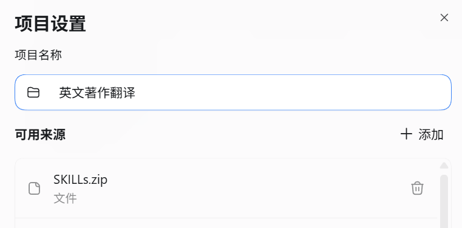
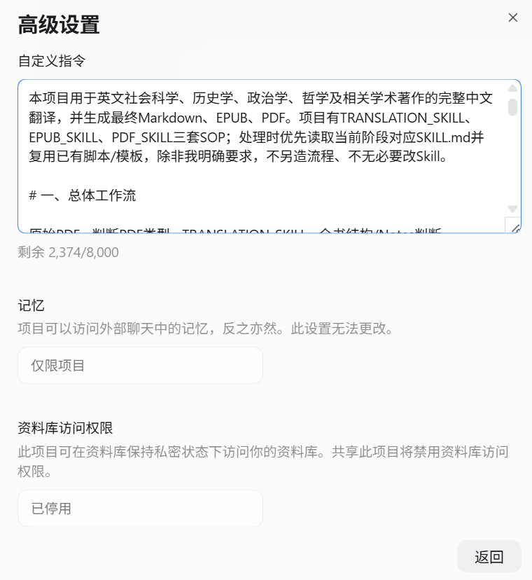
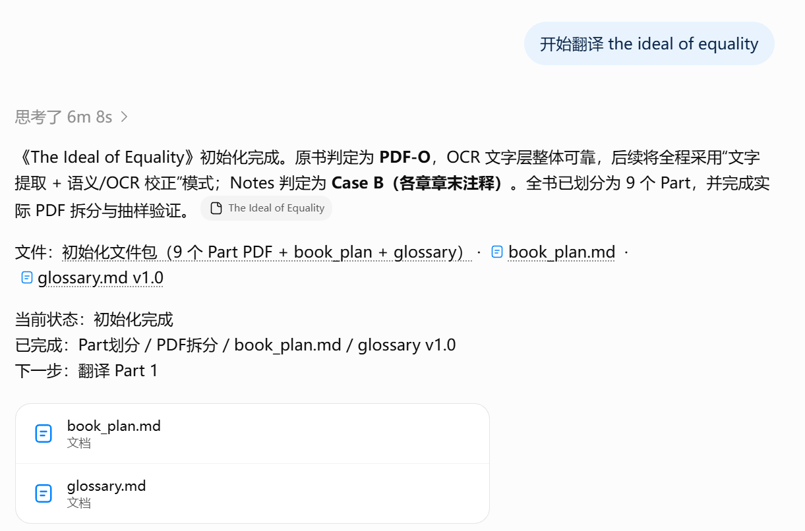
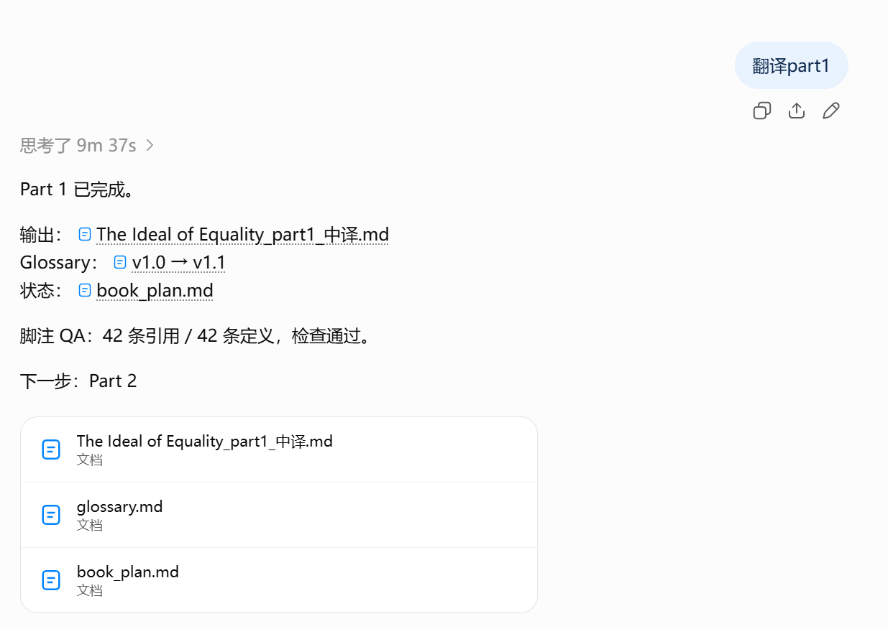
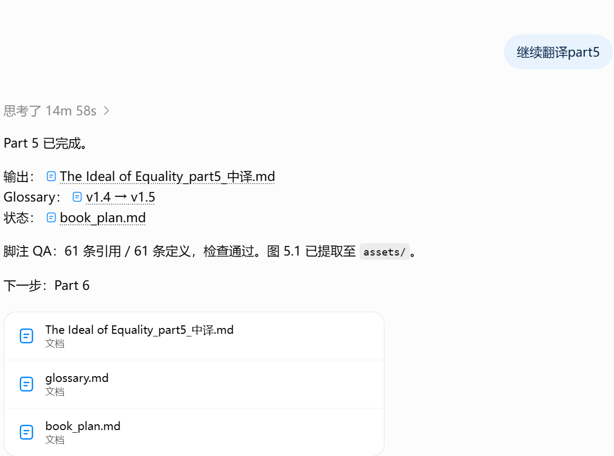
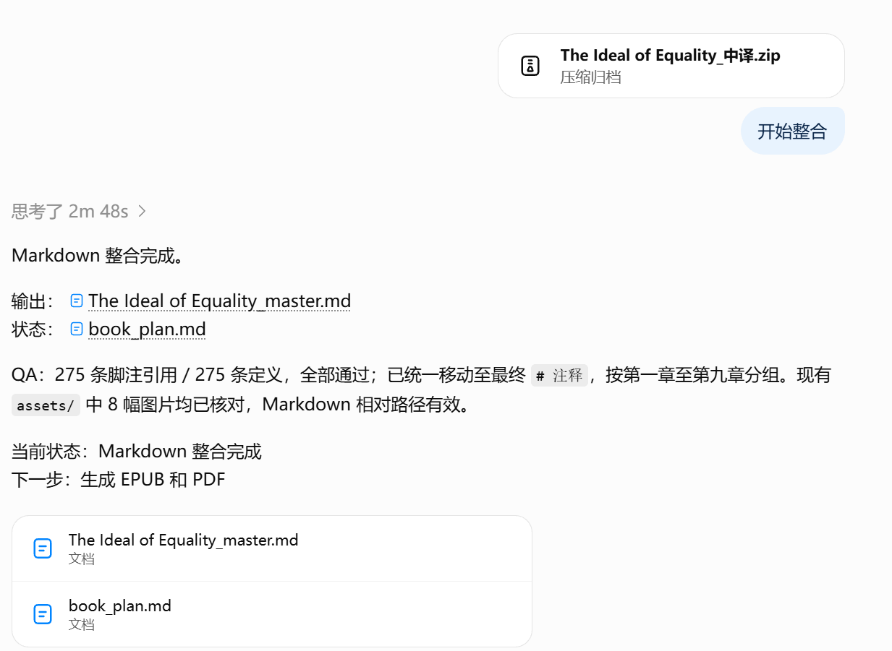
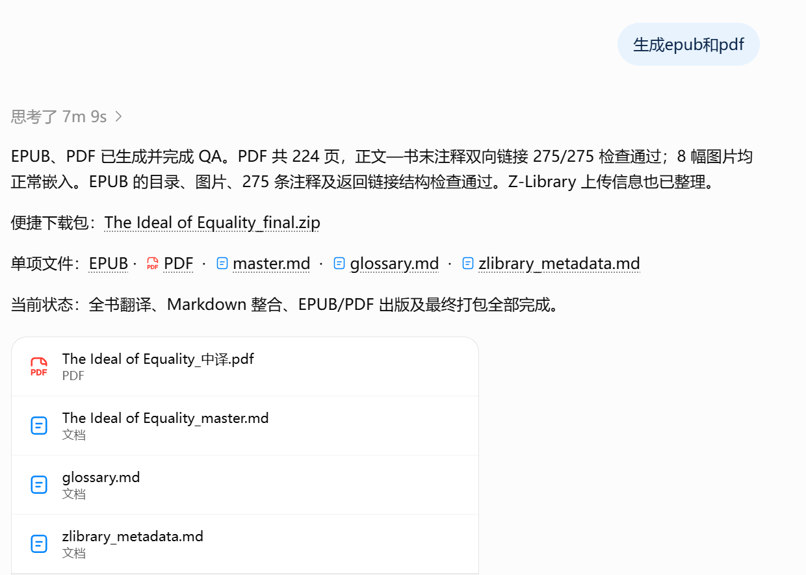

# 使用说明

这套 Skills 主要用于在 ChatGPT 的普通对话 / Project 中完成长篇英文学术著作的中文翻译，并把最终 Markdown 母稿继续生成 EPUB 和 PDF。

下面以 ChatGPT Project 的用法为例。

## 1. 准备项目

先下载本仓库中的：

- `SKILLs.zip`
- `instruction.md`

在 ChatGPT 中新建一个 Project，然后进入项目设置。

### 上传 Skills

把 `SKILLs.zip` 添加到项目的“可用来源 / Project sources”中。仓库中的 ZIP 已包含：

- `TRANSLATION_SKILL`
- `EPUB_SKILL`
- `PDF_SKILL`

也可以自行把这三个 Skill 文件夹压缩成一个 ZIP 后上传。



### 设置项目自定义指令

打开项目的高级设置，把仓库中 `instruction.md` 的正文完整复制到“自定义指令”中并保存。



这样项目会按约定的顺序调用 Translation、EPUB 和 PDF 三套流程，并使用 `book_plan.md` 和 `glossary.md` 保存长篇翻译的工作状态。

## 2. 上传需要翻译的书

把英文原书 PDF 上传到：

- Project sources；或
- 当前对话框。

如果准备跨多个对话持续翻译，放在 Project sources 中通常更方便。

目前默认流程适合：

- 原生文字版 PDF；
- 带有基本可用 OCR 文字层的扫描 PDF。

纯图片、没有可用文字层的 PDF 不属于当前默认流程。

上传后可以直接说：

```text
开始翻译 The Ideal of Equality
```

或者简单说：

```text
开始
```

第一次运行会先分析全书结构、PDF 类型和 Notes / Endnotes，规划逻辑 Part，并生成 `book_plan.md` 和初始 `glossary.md`。这一步不会直接把整本书一次性翻完。



## 3. 按 Part 翻译

初始化完成后，可以说：

```text
翻译 Part 1
```

也可以直接说：

```text
继续
```

`继续` 的含义是按照当前 `book_plan.md` 执行下一个未完成阶段。每个 Part 完成后，ChatGPT 会输出对应的中文 Markdown，并在需要时更新 `glossary.md` 和 `book_plan.md`。



后续继续使用同样的方式即可：

```text
继续
```

不需要每次重新说明页码、术语表、脚注规则或输出格式。



翻译过程中建议定期下载最新的：

- `book_plan.md`
- `glossary.md`
- 已完成的 Part Markdown
- `assets/`（如果书中有图片）

这些文件也可以作为跨对话恢复和本地备份。

## 4. 整合最终 Markdown

全部正文 Part、附录和需要翻译的 Notes 完成后，进入全书整合阶段。

把所有最终 Part Markdown、附录 / Notes Markdown，以及 `assets/`（如有）一起提供给 ChatGPT。文件较多时可以直接打成一个 ZIP 上传，然后说：

```text
开始整合
```

ChatGPT 会按照原书顺序合并内容、统一标题和脚注结构，并生成最终的：

```text
<BOOK_STEM>_master.md
```

这份 `master.md` 是 EPUB 和 PDF 共用的唯一正文母稿。



## 5. 生成 EPUB 和 PDF

Markdown 整合完成后，可以直接说：

```text
生成 EPUB 和 PDF
```

或者继续使用：

```text
继续
```

ChatGPT 会读取 `EPUB_SKILL` 和 `PDF_SKILL`，从同一份 `master.md` 生成并检查 EPUB / PDF。出版阶段原则上不会重新翻译正文，而是复用仓库中的 CSS、Lua、TeX 和构建模板处理排版。

最终通常会得到：

- `<BOOK_STEM>_master.md`
- EPUB
- PDF
- `glossary.md`
- `zlibrary_metadata.md`
- `assets/`（如有）
- 最终 ZIP 包



## 6. 一个最简单的完整操作顺序

```text
1. 新建 ChatGPT Project
2. 上传 SKILLs.zip 到 Project sources
3. 把 instruction.md 复制到项目自定义指令
4. 上传英文原书 PDF
5. 说“开始”
6. 初始化完成后反复说“继续”，逐 Part 翻译
7. 全部 Part 完成后上传最终 Part / Notes / assets，说“开始整合”
8. master.md 完成后说“生成 EPUB 和 PDF”或“继续”
9. 下载最终文件
```

如果中途换了新的 Project chat，只要原始 PDF、最新版 `book_plan.md`、`glossary.md` 和对应 Skills 仍可访问，就可以继续按照状态文件往下执行，而不需要重新介绍整本书。

## 相关文件

- [`README.md`](README.md)：项目简介
- [`instruction.md`](instruction.md)：建议复制到 ChatGPT Project 的自定义指令
- [`SKILLs.zip`](SKILLs.zip)：三套 Skills 的打包文件
- `TRANSLATION_SKILL/`：翻译与 Markdown 整合
- `EPUB_SKILL/`：EPUB 生成与检查
- `PDF_SKILL/`：PDF 生成与检查
- `Instance_The_Ideal_of_Equality/`: 翻译示例，包括原书的文字版PDF, 翻译过程中的md文件和assets/，以及全书译本的md/pdf/epub文件
